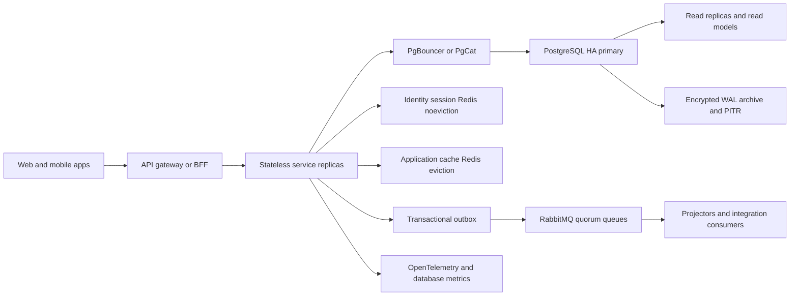
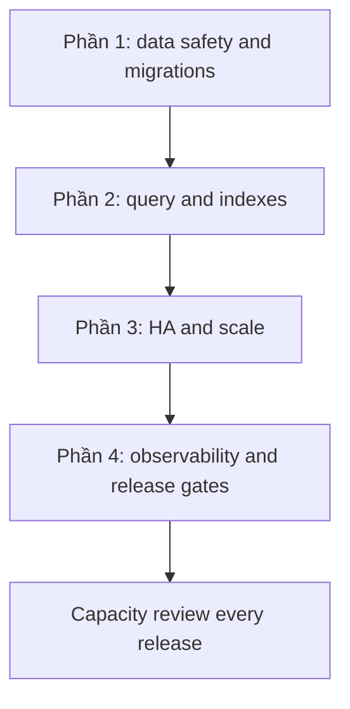

# His.Hope — Lộ trình chuẩn hóa Database, Performance và Scale

## Mục tiêu và nguyên tắc

Tài liệu này chuẩn hóa lộ trình nâng cấp data platform cho Identity, Patient,
Appointment, Clinical, Lab, Billing, Pharmacy và Agent Harness.

Nguyên tắc bắt buộc:

- Mỗi bounded context sở hữu schema và dữ liệu của mình; service khác chỉ truy
  cập qua contract hoặc integration event, không đọc trực tiếp database của
  service khác.
- Mọi thay đổi schema đi qua versioned migration, có dry-run, checksum,
  rollback plan và kiểm tra drift.
- Query read phải có projection, giới hạn page size, timeout và cancellation.
- Dữ liệu bảo mật, session, MFA và OIDC state không dùng chung eviction policy
  với cache nghiệp vụ.
- Không gọi là đạt production scale nếu chưa có load test, failover và restore
  test thực tế.

## Kiến trúc đích



PostgreSQL 16 HA là chuẩn khuyến nghị hiện tại vì code đang dùng EF Core,
Npgsql và PostgreSQL migrations. Không chuyển sang CockroachDB trong cùng đợt
này; đó là một quyết định nền tảng riêng cần benchmark và compatibility gate.

## Phần 1 — Chuẩn hóa an toàn dữ liệu và migration

### Mục tiêu

Đưa mọi database về một schema có một nguồn sự thật, không mất dữ liệu và
không để replica API tự tranh chấp migration.

### Công việc

1. Lập inventory cho từng database: schema, table, view, index, FK, row count,
   size, owner, migration history và dữ liệu nhạy cảm.
2. Chọn quy ước duy nhất cho môi trường production:
   - database riêng theo service;
   - schema mặc định rõ ràng;
   - tên bảng/cột snake_case hoặc PascalCase, không pha trộn;
   - `__EFMigrationsHistory` có naming thống nhất.
3. Xử lý schema drift Billing trước khi xóa bất kỳ bảng nào. Runtime hiện có
   đồng thời `billing.Invoices` và `public.Invoices` cùng các bảng line items,
   payments và outbox. Phải đối soát row count, checksum khóa chính, foreign
   key và dữ liệu mới trước khi hợp nhất.
4. Bỏ `EnsureCreated` ngoài database ephemeral của local development.
5. Tách migration thành deploy job/CI step chạy một lần trước khi rollout API.
   API replica chỉ start khi migration gate đã thành công.
6. Thêm migration lock/advisory lock cho job và kiểm tra migration history trước
   khi chạy.
7. Thêm kiểm tra model-to-schema drift vào CI; migration rỗng hoặc migration
   được tạo sau lỗi design-time DI không được xem là bằng chứng schema đúng.
8. Quy định migration nguy hiểm:
   - expand/contract cho rename hoặc drop column;
   - backfill theo batch có checkpoint;
   - index lớn dùng `CREATE INDEX CONCURRENTLY` khi phù hợp;
   - không drop bảng cũ trong cùng release với code bắt đầu dùng bảng mới.

### Tiêu chí nghiệm thu

- 100% service có database/schema owner được khai báo.
- Không còn bảng trùng ngoài kế hoạch trong từng database.
- Migration dry-run và drift check pass trên database mới và database đã có dữ
  liệu.
- Rollout hai replica đồng thời không chạy migration cạnh tranh.
- Backup restore được database Billing và Patient vào môi trường độc lập.

### Rollback

Không rollback bằng cách xóa bảng. Dùng backup/PITR hoặc migration đảo ngược
đã được kiểm thử; với expand/contract, giữ compatibility cho ít nhất một release.

## Phần 2 — Chuẩn hóa query và performance

### Mục tiêu

Đảm bảo query có kế hoạch ổn định khi dữ liệu tăng, không phụ thuộc vào cache
hoặc dữ liệu local nhỏ.

### Công việc

1. Chuẩn hóa read repository:
   - `AsNoTracking` cho read-only;
   - projection trực tiếp về DTO;
   - `AsSplitQuery` cho nhiều collection Include;
   - cancellation token và command timeout;
   - không trả entity graph không cần thiết.
2. Thay offset pagination ở danh sách lớn bằng keyset/cursor pagination với
   tie-breaker ổn định `id`.
3. Giới hạn `pageSize`, độ sâu page và thời gian query ở API contract.
4. Thêm composite index theo query shape, tối thiểu rà soát:
   - `(facility_id, is_active, id)`;
   - `(facility_id, status, occurred_at DESC, id)`;
   - `(patient_id, encounter_date DESC, id)`;
   - `(patient_id, order_date DESC, id)`;
   - `(facility_id, created_at DESC, id)`.
   Index cuối cùng phải được quyết định từ `EXPLAIN (ANALYZE, BUFFERS)` thay vì
   tạo hàng loạt index phỏng đoán.
5. Với search chứa wildcard đầu chuỗi, bật `pg_trgm` và GIN trigram index; nếu
   search nghiệp vụ phức tạp, chuyển sang read/search model riêng.
6. Tách count khỏi data query khi UI không thực sự cần total chính xác; dùng
   `hasNextPage` hoặc approximate count cho danh sách lớn.
7. Chuẩn hóa concurrency:
   - optimistic concurrency cho aggregate cập nhật;
   - idempotency key cho command retry;
   - không giữ transaction trong lúc gọi service hoặc message broker.
8. Tối ưu outbox:
   - index theo trạng thái và thời gian;
   - claim bằng `FOR UPDATE SKIP LOCKED`;
   - batch size, retry backoff, dead-letter và retention rõ ràng;
   - dashboard backlog, oldest message age và dead-letter count.

### Tiêu chí nghiệm thu

- Top query của mỗi service có execution plan được lưu làm baseline.
- Không còn query read chính dùng tracking hoặc Include gây cartesian explosion
  nếu không có lý do được ghi nhận.
- Các endpoint danh sách lớn có cursor hoặc giới hạn sâu page.
- Không có query vượt command timeout trong load test chuẩn.
- Outbox không tăng backlog vô hạn và retry không tạo duplicate side effect.

### Mục tiêu hiệu năng ban đầu

- Read API p95 dưới 250 ms.
- Write API p95 dưới 500 ms.
- Login/OIDC p95 dưới 300 ms, không tính thời gian IdP bên ngoài.
- Database connection acquisition p95 dưới 20 ms.
- Error rate dưới 0,1% trong tải chuẩn.

Các mục tiêu này chỉ được công nhận sau load test có dữ liệu gần production.

## Phần 3 — Scale, HA và capacity

### Mục tiêu

Loại bỏ single point of failure và giới hạn việc các replica ứng dụng làm cạn
connection/database resources.

### Công việc

1. PostgreSQL:
   - primary + synchronous hoặc asynchronous standby theo RPO;
   - WAL archive, PITR, encrypted backup;
   - failover manager/managed HA;
   - PgBouncer hoặc PgCat;
   - TLS, least-privilege role và tách migration role khỏi runtime role.
2. Connection budget:
   - đặt `Max Pool Size`, `Min Pool Size`, timeout và command timeout;
   - tính tổng pool theo số service replica, không đặt tùy ý từng container;
   - theo dõi pool saturation và wait time;
   - read replica chỉ dùng cho query chấp nhận replication lag.
3. Redis:
   - Redis session/MFA/OIDC state riêng, policy `noeviction` hoặc capacity được
     bảo vệ;
   - Redis application cache riêng, eviction có kiểm soát;
   - Sentinel/Cluster và kiểm thử failover;
   - TTL bắt buộc cho cache, không đặt TTL cho dữ liệu session trước khi có
     policy rõ ràng.
4. RabbitMQ:
   - quorum queues;
   - publisher confirms;
   - consumer retry và dead-letter exchange;
   - kiểm tra duplicate delivery và idempotent consumer.
5. API/services:
   - stateless replicas;
   - health/readiness không đánh đồng với migration;
   - graceful shutdown, drain connection và message consumer;
   - resource requests/limits cho từng container.
6. Dữ liệu lớn:
   - retention cho audit/outbox/log;
   - partition theo thời gian cho bảng đủ lớn;
   - archive cold data;
   - read model riêng cho dashboard/reporting, không chạy report nặng trên
     transactional tables.

### Tiêu chí nghiệm thu

- Mất một PostgreSQL node không làm mất dữ liệu vượt RPO đã cam kết.
- Failover được kiểm thử và ứng dụng reconnect thành công.
- Restore database độc lập thành công theo runbook.
- Scale service từ 1 lên nhiều replica không làm cạn connection pool.
- Redis session, cache và RabbitMQ vẫn hoạt động khi failover.
- Có capacity model cho CPU, RAM, connections, storage, IOPS và message rate.

### Không được làm

- Không bật read replica nhưng cho phép mọi read chuyển sang replica mà không
  phân loại consistency.
- Không dùng Redis eviction chung cho security state và cache.
- Không scale replica ứng dụng trước khi có connection budget.

## Phần 4 — Observability, verification và vận hành

### Mục tiêu

Biết database đang chậm ở đâu, có thể chứng minh chất lượng sau deploy và phục
 hồi được khi xảy ra sự cố.

### Công việc

1. PostgreSQL telemetry:
   - bật `pg_stat_statements`;
   - slow query log;
   - query latency, rows, buffers, temp files;
   - locks, deadlocks, vacuum/analyze, bloat, replication lag;
   - connections và transaction rollback.
2. Service telemetry:
   - trace từ gateway đến database;
   - correlation ID;
   - query duration và pool wait;
   - outbox backlog/dead-letter;
   - cache hit/miss và eviction;
   - migration version trong health metadata.
3. CI/CD gates:
   - build và unit/integration tests;
   - migration dry-run và drift check;
   - security/facility isolation contract;
   - query plan regression;
   - Docker compose smoke test;
   - load test 50/200/500 concurrent users;
   - backup restore và failover test.
4. Production runbooks:
   - migration failure;
   - connection exhaustion;
   - slow query;
   - deadlock;
   - outbox backlog;
   - Redis eviction;
   - primary failover;
   - point-in-time restore.
5. SLO và cảnh báo:
   - DB availability;
   - API latency/error;
   - connection saturation;
   - replication lag;
   - backup age/restore failure;
   - outbox oldest age;
   - disk usage và bloat.

### Tiêu chí nghiệm thu

- Mỗi SLO có metric, dashboard, alert threshold và owner.
- Có evidence cho pass/fail/skipped/environment-blocked; không dùng build xanh
  để thay thế runtime verification.
- Restore test định kỳ có thời gian thực tế và checksum dữ liệu.
- Load test lưu lại throughput, p50/p95/p99, error rate, DB CPU, IOPS,
  connections và lock time.
- Mỗi release có migration version, query-plan diff và rollback decision.

## Thứ tự triển khai chuẩn



Không đảo thứ tự khi chưa xử lý schema drift và migration ownership. Tối ưu
index trước khi biết schema nào là nguồn chính sẽ tạo thêm rủi ro thay vì cải
thiện performance.

## Trạng thái hiện tại và quyết định cần duyệt

Đã xác nhận ở môi trường hiện tại:

- PostgreSQL và Redis đang chạy single-node trong Docker Compose.
- Các database còn nhỏ và số liệu cache-hit hiện chỉ là baseline idle.
- Billing có schema trùng `billing`/`public`.
- Migration đang được gọi trong startup path của service.
- Chưa có bằng chứng load test, failover, PITR restore hoặc production HA.

Các quyết định cần duyệt trước khi dựng production topology:

1. Dùng PostgreSQL managed HA hay tự vận hành Patroni.
2. RPO/RTO chính thức cho clinical, identity và billing.
3. Số replica tối đa theo service và connection budget.
4. Retention/audit policy theo yêu cầu compliance.
5. Có cần read/search platform riêng hay PostgreSQL vẫn đáp ứng workload.

## Definition of Done cấp nền tảng

Chỉ đánh dấu hoàn tất khi cả bốn phần đều đạt và có artifact kiểm chứng:

- migration/schema drift report sạch;
- query-plan và load-test report đạt SLO;
- failover và restore report đạt RPO/RTO;
- dashboard/alert/runbook đã chạy thử;
- Docker local, staging và production config không dùng chung secret hoặc
  topology giả lập;
- backend, frontend và mobile không truy cập trực tiếp database, chỉ dùng
  service contract/BFF đã chuẩn hóa.

## Đã triển khai trong baseline hiện tại

Các thay đổi đã được đưa vào codebase để tạo nền tảng dùng chung:

- `His.Hope.Persistence` có `UseHisHopeNpgsql(...)`: chuẩn hóa
  `ApplicationName`, connection timeout, command timeout, keep-alive, pool
  min/max và retry policy theo `Database:*`.
- Migration runner dùng PostgreSQL advisory lock theo `DbContext`, tránh hai
  replica chạy migration đồng thời. API chỉ chạy migration khi bật rõ
  `Persistence:RunMigrationsOnStartup=true`; production nên dùng migration job
  riêng trước khi rollout.
- Các read repository chính dùng `AsNoTracking`, `AsSplitQuery` ở aggregate có
  collection và sort ổn định bằng khóa chính để pagination không nhảy dòng.
- Composite indexes theo facility/status/date đã được thêm vào model và
  migration của cả sáu domain DB: Patient, Appointment, Clinical, Lab, Billing
  và Pharmacy. Không tự động chạy migration lên database hiện tại.
- Compose bật `pg_stat_statements`, `track_io_timing` và log slow query mặc
  định từ 500ms (`POSTGRES_LOG_MIN_DURATION_MS` có thể override). Init script
  tạo extension cho các database mới; database volume đã tồn tại cần chạy
  operations job idempotent để tạo extension.
- Compose có PostgreSQL/Redis exporters và Prometheus rules cho exporter down,
  connection utilization và Redis memory pressure.
- Kubernetes không còn scale plain PostgreSQL StatefulSet lên 3 database độc
  lập. Baseline giữ một writer và PDB; production HA phải dùng managed
  PostgreSQL hoặc operator có replication/fencing thực.
- Angular Manager có màn hình `Database platform`, đọc health/capacity qua
  Dashboard BFF sau gateway, không truy cập Prometheus/PostgreSQL trực tiếp.
- Có script tạo idempotent migration SQL, backup custom-format kèm SHA-256,
  restore bắt buộc xác nhận, và k6 workload cho 50/200/500 VU bằng biến môi
  trường.
- Admin Manager đã có control-plane cho PITR, backup encryption, retention,
  restore drill và target RPO/RTO. Các thao tác chạy qua
  `DatabaseContinuityService` độc lập với scheduler, Redis job worker và
  distributed lock; Identity Service chỉ xử lý OIDC/permission.

### Cấu hình database dùng chung

```text
Database__ConnectionTimeoutSeconds=15
Database__CommandTimeoutSeconds=30
Database__KeepAliveSeconds=30
Database__MinPoolSize=0
Database__MaxPoolSize=20
Database__RetryCount=5
Database__RetryMaxDelaySeconds=30
Persistence__RunMigrationsOnStartup=false
```

Không tăng `MaxPoolSize` độc lập từng service. Connection budget phải được tính
theo công thức `replicas × pool max` và nhỏ hơn giới hạn PostgreSQL sau khi trừ
connection cho admin, migration, monitoring và failover. `postgres-replica`
trong compose hiện chỉ là profile container độc lập, chưa phải PostgreSQL
streaming replica và không được dùng làm bằng chứng HA.

### Trạng thái kiểm chứng implementation

- PASS: shared Persistence, ServiceDefaults, Identity, Patient, Appointment,
  Clinical, Lab, Billing và Pharmacy infrastructure build (có warnings
  nullable tồn tại trước đó).
- PASS: migration scaffolding và idempotent dry-run script cho cả sáu domain
  DB; contract gate kiểm tra đủ sáu migration có thao tác `CreateIndex`.
- NOT YET VERIFIED: full solution build, runtime migration trên database,
  query-plan/load test, backup restore, failover, multi-replica và production
  secret/topology. Các mục này vẫn là release gates, không đánh dấu đạt chỉ vì
  compile thành công.
