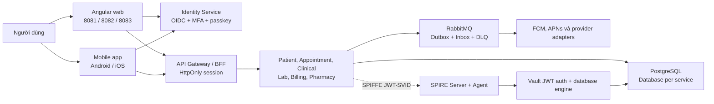
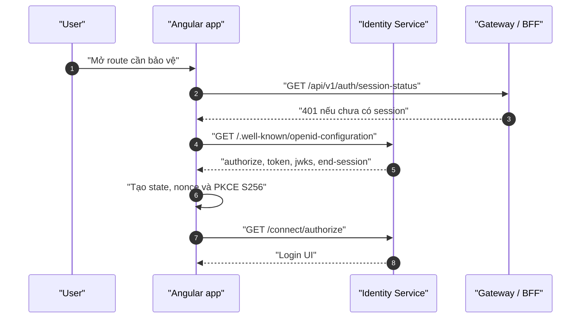
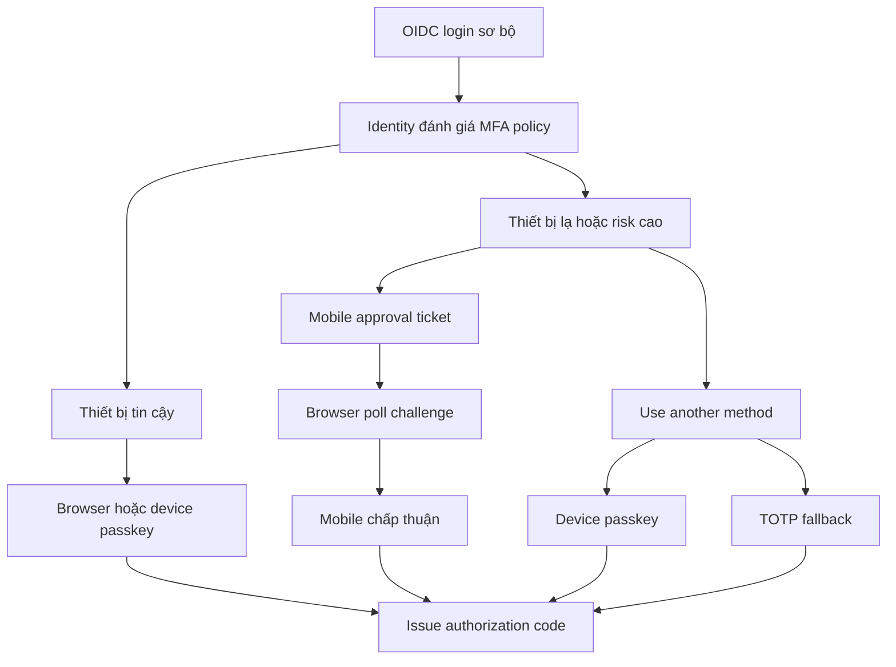
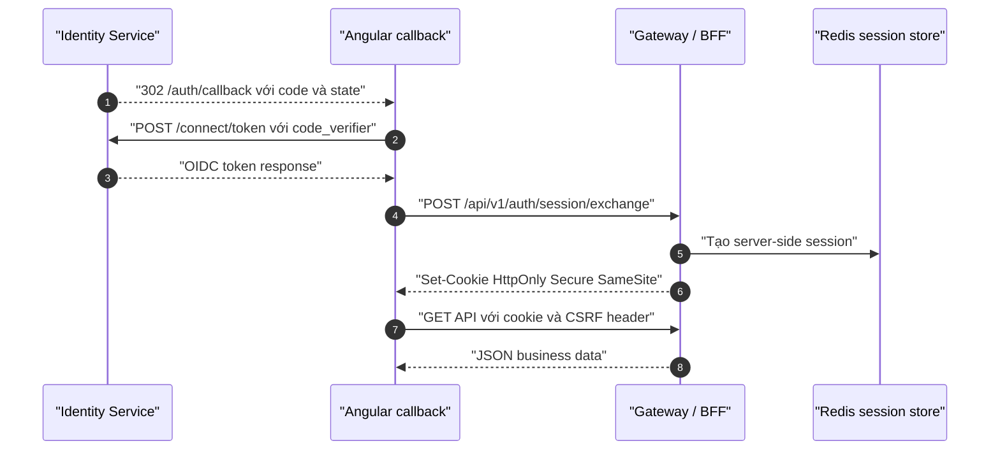
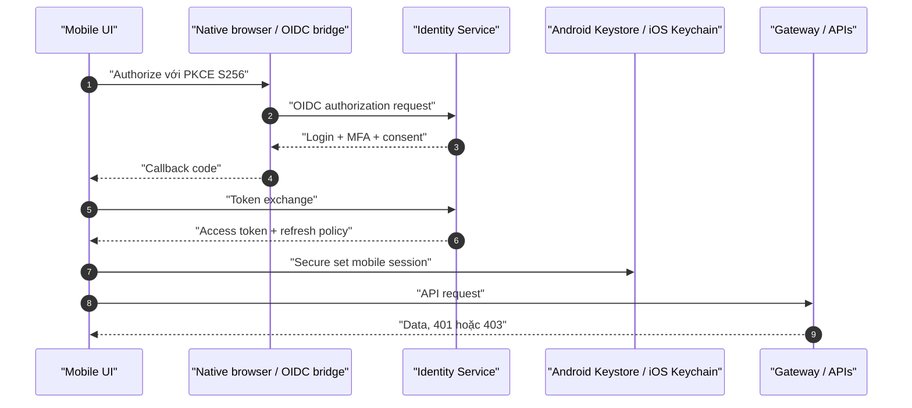
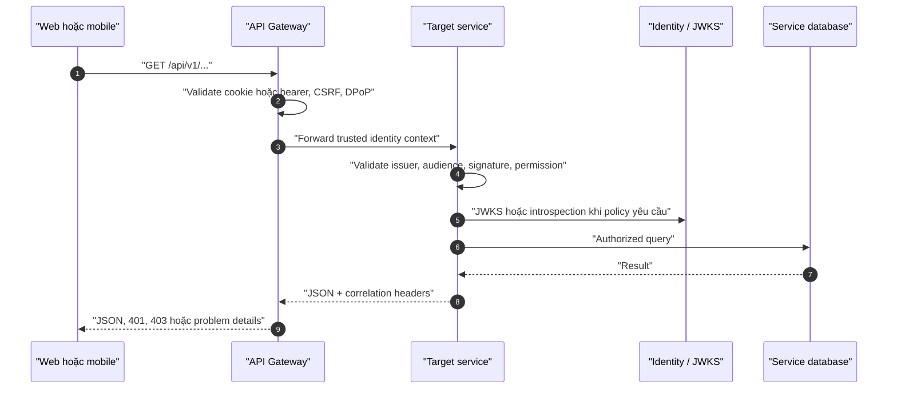
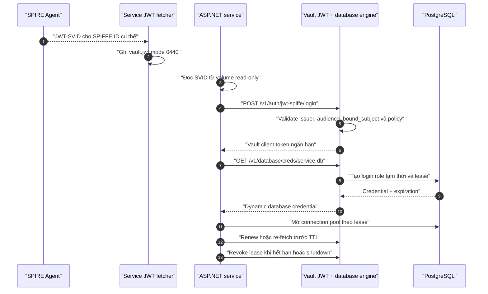
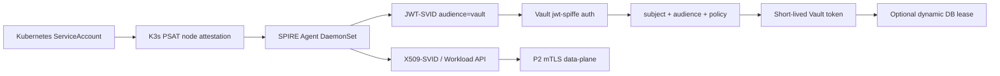
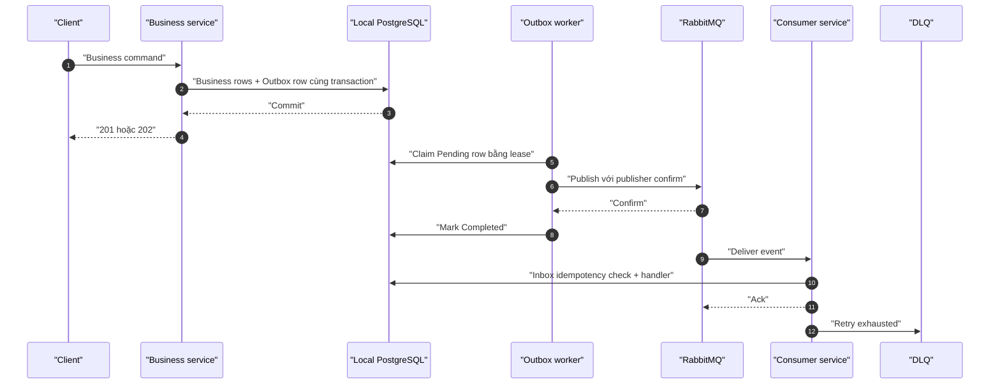

# His.Hope — cơ chế hoạt động end-to-end của luồng runtime mới

**Trạng thái:** Đã triển khai trong Docker Compose local/E2E. Production phải dùng TLS, Vault HA, trust anchor bên ngoài và workload attestation thật.

## 1. Mục tiêu

Luồng mới tách ba loại danh tính:

1. **Danh tính người dùng:** OIDC Authorization Code + PKCE, MFA và passkey.
2. **Danh tính ứng dụng:** SPIFFE workload identity cho từng microservice.
3. **Danh tính database:** credential ngắn hạn do Vault cấp theo từng service/database.

Kết quả là web không cần lưu access token trong `localStorage`, service không dùng PostgreSQL password dài hạn, và service này không thể dùng credential của service khác.

## 2. Tổng quan kiến trúc



### Thành phần dùng chung

| Thành phần | Trách nhiệm |
|---|---|
| `shared/frontend-foundation` | i18n, theme, session interceptor, auth coordinator, permission, loading state |
| `shared/mobile-foundation` | secure storage, native capability seam, push và offline contract |
| Identity Service | OIDC issuer, user, role, permission, MFA, passkey, SAML/LDAP federation |
| Gateway/BFF | edge routing, cookie session, CSRF, DPoP/header policy |
| SPIRE | cấp SVID theo workload selector |
| Vault | xác thực workload, cấp/revoke lease, transit encryption |
| PostgreSQL | dữ liệu domain và audit |
| RabbitMQ | event delivery, retry và DLQ |

## 3. Luồng đăng nhập web



`state`, `nonce` và `code_verifier` gắn với browser transaction. `redirect_uri` phải thuộc allow-list của OIDC client; không nhận redirect tùy ý.

### 3.1 Thứ tự phương thức xác thực

UI ưu tiên theo thứ tự:

1. Passkey/WebAuthn nếu browser hỗ trợ và user đã có credential.
2. Approve in His.Hope mobile app nếu là thiết bị lạ hoặc risk policy yêu cầu.
3. Device passkey như factor thay thế.
4. TOTP fallback.

Password, SAML và LDAP/AD có thể là phương thức khởi đầu, nhưng sau federation Identity vẫn phải phát hành cùng OIDC authorization code. Frontend không tự xử lý SAML assertion hoặc LDAP credential.

### 3.2 MFA adaptive



Ticket MFA có thời hạn ngắn, gắn với user, browser transaction, client và nonce. Client không tự đánh dấu thành công; chỉ Identity Service được chuyển challenge sang `approved`.

### 3.3 Passkey

Đăng ký:

1. `POST /api/v1/auth/passkeys/register/options` tạo challenge.
2. Browser/native OS gọi WebAuthn create.
3. Client gửi attestation tới `POST /api/v1/auth/passkeys/register/complete`.
4. Identity kiểm tra challenge, origin, RP ID và attestation rồi lưu public key.

Xác thực thực hiện tương tự với assertion: kiểm tra signature, counter, challenge, origin và user binding trước khi hoàn tất MFA hoặc cấp authorization code. Private key không rời thiết bị.

Mobile gọi contract qua `shared/mobile-foundation`; UI không tự gọi Android Credential Manager hoặc iOS AuthenticationServices. Physical-device verification là release gate riêng.

### 3.4 Callback và BFF session



Web dùng `withCredentials`, cookie-session interceptor và CSRF interceptor. Session coordinator xử lý `401`, thử recovery một lần, sau đó phát session-expired và điều hướng login; không để UI loading vô hạn.

## 4. Luồng mobile OIDC

Mobile dùng Authorization Code + PKCE và secure storage native:



Mobile phải lấy endpoint từ discovery, dùng `10.0.2.2` chỉ cho Android emulator, không dùng `localhost` cho device thật, đăng ký device token sau login và xóa secure session/device binding khi logout hoặc revoke.

## 5. Luồng request microservice



- `401`: thiếu/expired/invalid authentication; client được phép recovery.
- `403`: đã xác thực nhưng thiếu permission/facility scope; không retry token.
- `404`: route hoặc resource không tồn tại; kiểm tra Gateway mapping.
- `502/504`: downstream/network failure; retry có giới hạn ở server.

Service luôn tự kiểm tra authorization, không tin Gateway là security boundary duy nhất.

## 6. SPIFFE → Vault → PostgreSQL

> **Native K3s migration status (2026-08-04):** P0 SPIRE Server/Agent + PSAT
> attestation đã PASS. P1 JWT-SVID → Vault `jwt-spiffe` đã PASS cho 7 backend,
> gồm rotation sau restart và revoke. Dynamic database lease trên production
> vẫn là gate riêng: phải bật sau khi migration/deployer account được tách khỏi
> runtime và connection pool drain được kiểm thử. P2 X509-SVID → mTLS
> data-plane đã pass local: Linkerd CNI đúng K3s path, validator pass trên 3
> node và backend pod được inject proxy. Production còn phải chạy lại
> multi-replica/failover gate.

### 6.1 Mapping workload

| Service | SPIFFE suffix | Vault role | Database role |
|---|---|---|---|
| Identity | `identity-service` | `identity-service` | `identity-service-db` |
| Patient | `patient-service` | `patient-service` | `patient-service-db` |
| Appointment | `appointment-service` | `appointment-service` | `appointment-service-db` |
| Clinical | `clinical-service` | `clinical-service` | `clinical-service-db` |
| Lab | `lab-service` | `lab-service` | `lab-service-db` |
| Billing | `billing-service` | `billing-service` | `billing-service-db` |
| Pharmacy | `pharmacy-service` | `pharmacy-service` | `pharmacy-service-db` |

### 6.2 Runtime credential flow



Fetcher dùng Workload API qua socket Agent và volume riêng. File token có mode `0440`, owner UID `1654`; service khác không được mount volume đó. Service không nhận PostgreSQL admin password. Vault dùng `vault_manager`; migration/deployer account là identity riêng và không mount vào runtime.

### 6.3 Failure policy

Với `Vault__RequireVault=true` và `Vault__AllowStaticToken=false`:

- thiếu SVID, Vault sealed hoặc role sai: service fail closed;
- JWT sai audience/subject: Vault từ chối login;
- lease hết hạn: connection mới lấy credential mới, pool cũ drain theo lifetime;
- mất một Vault replica: client retry qua HA, không rơi về root/static token.

### 6.4 Native K3s rollout contract



The migration rule is fail-closed: a workload with `Vault__AuthMethod=spiffe-jwt`
must not fall back to `auth/kubernetes`, a static token, or a password when the
SPIRE socket, SVID, Vault role, audience, or signature is invalid. Angular,
dashboard, admin and mobile remain user OIDC clients; they never receive or
mount a SPIRE socket.

## 7. Transaction và event-driven flow



Delivery là at-least-once. `eventId` là idempotency key; consumer phải có Inbox/unique guard. Retry dùng exponential backoff có giới hạn, lỗi cuối cùng đi DLQ và phải được audit/redrive có kiểm soát. Request path không gọi provider bên ngoài.

## 8. Push và in-app notification

1. Producer gọi admin notification endpoint.
2. Identity Service ghi `in_app_notifications` và `push_notification_outbox` trong cùng transaction.
3. Mobile đọc `GET /api/v1/mobile/notifications` và đánh dấu read qua API.
4. `PushNotificationOutboxWorker` claim delivery, gửi FCM/APNs, retry và ghi attempt/audit.
5. Push không khả dụng vẫn không làm mất in-app notification.

FCM/APNs credential lấy từ Vault/secret injection. Android cần Firebase project/device token thật; iOS cần APNs key và bundle identifier đúng.

## 9. Cache, session và UI loading

Session web là HttpOnly cookie; Redis giữ state dùng chung giữa Gateway replicas. Permission cache phải chứa `userId`, `securityVersion`, facility/tenant và permission version. Khi revoke hoặc đổi security version, cache phải invalidate.

UI dùng state:

```text
idle -> loading -> success(data)
                 -> empty
                 -> error(retryable)
                 -> session-expired
```

Không hiển thị `0 items` khi request chưa hoàn thành. Skeleton chỉ tồn tại trong `loading`; mọi success, empty, error hoặc 401 đều phải kết thúc loading.

## 10. Chạy và kiểm tra local

```powershell
docker compose --profile spiffe-e2e `
  -f docker/docker-compose.yml `
  -f docker/docker-compose.spiffe.yml up -d

docker compose --profile spiffe-e2e `
  -f docker/docker-compose.yml `
  -f docker/docker-compose.spiffe.yml run --rm vault-hybrid-e2e-probe

docker compose --profile spiffe-e2e `
  -f docker/docker-compose.yml `
  -f docker/docker-compose.spiffe.yml run --rm postgres-dynamic-credential-probe
```

Kết quả mong đợi:

```text
SPIFFE JWT -> Vault JWT -> one leased PostgreSQL credential: PASS
Vault dynamic credential -> PostgreSQL connection: PASS
```

K3s local dùng SPIRE native, PSAT và Vault TLS/Raft/auto-unseal. Docker Compose
SPIFFE profile chỉ còn là compatibility probe; không được dùng làm production
runtime và không được chia sẻ state với Vault K3s. Production promotion cần
SPIRE Server HA, PostgreSQL HA, stable HTTPS OIDC issuer, workload-specific
Vault roles, dynamic database lease, Linkerd mTLS validation và failover test.

## 11. Release checklist

### Backend

- [ ] Mỗi service có readiness probe kiểm tra dependency quan trọng.
- [ ] Runtime service không có static PostgreSQL password.
- [ ] Mỗi service có SPIFFE ID, Vault policy và database role riêng.
- [ ] Migration/deployer tách khỏi runtime role.
- [ ] JWT issuer/audience/JWKS đồng nhất.
- [ ] 401/403/502 có correlation ID và không log secret.
- [ ] Outbox/Inbox index được tạo bằng migration trước khi scale.

### Angular

- [ ] Build foundation trước các app.
- [ ] Cookie session + CSRF interceptor bật ở frontend, dashboard, admin.
- [ ] Không lưu token trong localStorage.
- [ ] 401 recovery chỉ chạy một lần.
- [ ] Skeleton kết thúc khi observable hoàn thành.
- [ ] Callback giữ state, nonce và PKCE transaction.

### Mobile

- [ ] OIDC authority lấy từ discovery/runtime config.
- [ ] Token/session lưu Keystore hoặc Keychain.
- [ ] FCM/APNs token đăng ký sau login và có delivery audit.
- [ ] Native passkey/MFA test trên emulator và physical device.
- [ ] Offline queue có encryption và conflict policy.
- [ ] Không log PHI hoặc credential.

## 12. Hiện trạng validation và việc còn lại

Đã xác nhận local: dynamic credential probe pass; 7 token file có mode `0440` và UID `1654`; foundation, admin, dashboard, frontend, mobile Angular build pass; Android `assembleDebug` pass.

Còn phải xác nhận trước production: Android emulator/physical device, iOS physical device trên macOS/Xcode, Vault leader failover, expired lease, RabbitMQ outage, duplicate event, DLQ redrive và refresh-session race. Cảnh báo `must be owner of table outbox_messages` cần được xử lý bằng migration/deployer trước khi scale production.
