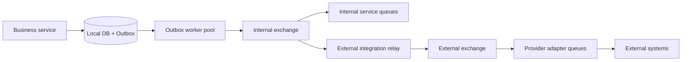

# Event-driven production scale

## Mục tiêu

His.Hope sử dụng at-least-once delivery. Giao dịch nghiệp vụ chỉ ghi dữ liệu và domain event vào cùng database transaction; Outbox worker mới chuyển event sang RabbitMQ. Business service không gọi hệ thống bên ngoài trong request path.



## P0 đã triển khai

- Outbox worker pool cấu hình được qua `Outbox:WorkerCount`, `Outbox:BatchSize`, `Outbox:PollingIntervalMilliseconds`, `Outbox:MaxRetries` và `Outbox:ClaimLeaseSeconds`.
- Multiple replicas claim độc lập bằng trạng thái `Processing`, `ClaimedBy` và lease timeout.
- RabbitMQ publisher channel pool, publisher confirms và timeout cấu hình được qua `EventBus:PublisherChannelPoolSize` và `EventBus:PublisherConfirmTimeoutMilliseconds`.
- Outbox metrics được xuất qua OpenTelemetry meter `His.Hope.Outbox`:
  - `his_hope_outbox_claimed`
  - `his_hope_outbox_completed`
  - `his_hope_outbox_failed`
  - `his_hope_outbox_publish_duration_ms`
- Pending dispatch index được đảm bảo khi worker khởi động; production migration vẫn phải tạo index trước khi scale rộng.
- Consumer duplicate guard dùng Inbox khi `IInboxStore` được bật. Handler phải idempotent theo `eventId`.

## P1 external integration

`external-integration-service` là relay độc lập. Relay subscribe internal exchange và publish sang `ExternalIntegration:ExchangeName` với routing key:

```text
{provider}.{integrationEventType}
```

Mặc định relay bị tắt:

```text
EXTERNAL_INTEGRATION_ENABLED=false
EXTERNAL_INTEGRATION_PROVIDER=default
```

Bật relay chỉ sau khi đã cấu hình provider adapter, timeout, rate limit, circuit breaker và secret trong Vault. Không đặt API key/token trong Compose hoặc source code.

Provider adapter phải:

1. Dùng `eventId` làm idempotency key.
2. Có timeout và bulkhead riêng.
3. Retry exponential backoff có jitter.
4. Đẩy lỗi cuối cùng vào DLQ riêng provider.
5. Ghi audit trạng thái gửi, retry, success và dead-letter.

Relay không cung cấp exactly-once. Exactly-once phải được mô phỏng ở consumer bằng idempotency và Inbox unique key.

## P2 scale và vận hành

- Chạy nhiều replica của business service và external relay; mỗi replica dùng cùng exchange nhưng queue consumer riêng theo bounded context.
- RabbitMQ production dùng cluster/quorum queues; Docker Compose single-node chỉ dành cho development.
- Tách queue theo domain/provider/tenant lớn, không dùng một queue chung cho tất cả event.
- Partition hoặc archive Outbox theo `OccurredOn`; giữ online các row Pending/Processing và archive Completed/Skipped sau retention.
- Có replay/redrive có kiểm soát từ DLQ, không tự động replay vô hạn.
- Cảnh báo theo queue depth, oldest pending age, retry rate, dead-letter rate và publish p95/p99.

## SLO đề nghị

| Chỉ số | Cảnh báo | Hành động |
|---|---:|---|
| Oldest pending event | > 30 giây | tăng worker/kiểm tra DB/Rabbit |
| Queue depth | > 10.000 | scale consumer hoặc rate-limit producer |
| Retry rate | > 5% trong 5 phút | kiểm tra provider/downstream |
| Dead-letter rate | > 0 | mở incident và redrive có kiểm soát |
| Publish p99 | > 500 ms | kiểm tra channel pool/broker/network |

## Kiểm thử bắt buộc trước production

- Tạo event nghiệp vụ và xác minh DB row + Outbox row trong cùng transaction.
- Chạy tối thiểu hai replica worker, xác minh mỗi event chỉ được xử lý một lần ở consumer idempotent.
- Ngắt RabbitMQ, xác minh Outbox retry và khôi phục không mất event.
- Làm chậm provider, xác minh relay không làm chậm request path và DLQ hoạt động.
- Restore database và xác minh Outbox/Inbox retention không làm mất event chưa hoàn tất.
