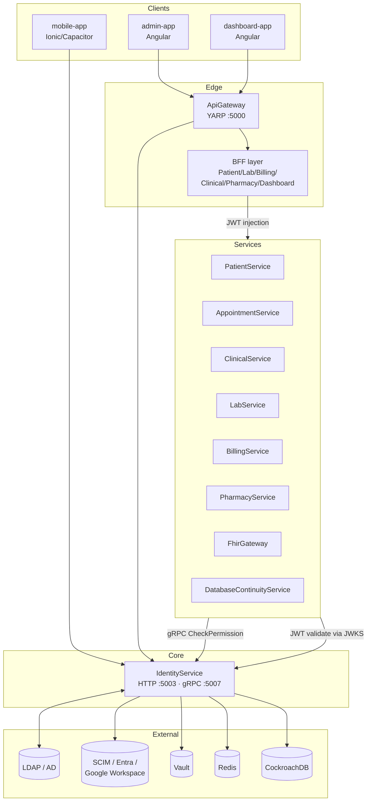

# Identity Service — Tài liệu hệ thống toàn diện

> Phạm vi: `src/Services/IdentityService/` (Domain, Application, Infrastructure, Api) và toàn bộ mối liên hệ của nó với nền tảng His.Hope.
> Đối tượng đọc: kiến trúc sư, dev backend/frontend, kỹ sư vận hành, quản trị viên IAM, kiểm toán viên tuân thủ.

---

## Mục lục

1. [Tổng quan & vai trò](#1-tổng-quan--vai-trò)
2. [Kiến trúc phân lớp](#2-kiến-trúc-phân-lớp)
3. [Mô hình dữ liệu (Domain)](#3-mô-hình-dữ-liệu-domain)
4. [Danh mục quyền & chính sách](#4-danh-mục-quyền--chính-sách)
5. [Các cơ chế xác thực — khi nào dùng cái nào](#5-các-cơ-chế-xác-thực--khi-nào-dùng-cái-nào)
6. [Mô hình phân quyền nhiều tầng](#6-mô-hình-phân-quyền-nhiều-tầng)
7. [Bản đồ API](#7-bản-đồ-api)
8. [Mối liên hệ với hệ thống](#8-mối-liên-hệ-với-hệ-thống)
9. [Quản trị & vận hành](#9-quản-trị--vận-hành)
10. [Hạ tầng phụ thuộc](#10-hạ-tầng-phụ-thuộc)
11. [Triển khai & cấu hình](#11-triển-khai--cấu-hình)
12. [Bảo mật & tuân thủ](#12-bảo-mật--tuân-thủ)
13. [Ma trận quyết định "khi nào dùng gì"](#13-ma-trận-quyết-định-khi-nào-dùng-gì)
14. [Runbook rút gọn](#14-runbook-rút-gọn)
15. [Khả năng mở rộng & giới hạn hiện tại](#15-khả-năng-mở-rộng--giới-hạn-hiện-tại)

---

## 1. Tổng quan & vai trò

Identity Service là **nguồn sự thật duy nhất (single source of truth)** cho danh tính, xác thực và phân quyền của toàn bộ nền tảng His.Hope. Nó đóng đồng thời 5 vai trò:

| Vai trò                    | Mô tả                                                                                                                                                                              | Cổng/giao thức                               |
| -------------------------- | ---------------------------------------------------------------------------------------------------------------------------------------------------------------------------------- | -------------------------------------------- |
| **Authorization Server**   | OAuth 2.0 / OpenID Connect Provider (OpenIddict) — cấp access token, refresh token, id token                                                                                       | HTTP `5003` — `/connect/*`, `/.well-known/*` |
| **IAM Control Plane**      | Catalog scope / service / permission set / workload role / boundary / group theo mô hình giống AWS IAM                                                                             | HTTP `5003` — `/api/v1/admin/iam/*`          |
| **Policy Decision Point**  | Tính quyền khi phát hành token; service nghiệp vụ kiểm tra claim `permissions` cục bộ (fail-closed). gRPC dùng cho các luồng introspection/đánh giá cần dữ liệu Identity trực tiếp | gRPC `5007` + JWT                            |
| **Directory Hub**          | Đồng bộ 2 chiều với LDAP/AD, SCIM 2.0, Microsoft Entra ID, Google Workspace                                                                                                        | Background workers                           |
| **Security & Audit Plane** | Audit log append-only, security event, SSF/CAEP signal, device posture, break-glass                                                                                                | DB + outbox workers                          |

**Nguyên tắc thiết kế cốt lõi:**

- **Fail-closed**: mọi quyết định phân quyền mặc định là từ chối. Quyền không bao giờ được tin từ phía client.
- **Server-side evaluation**: UI chỉ _hiển thị_ quyền; quyết định luôn tính lại ở server.
- **Append-only audit**: `IdentityDbContext` chặn UPDATE/DELETE trên bảng `audit_logs`.
- **Maker–checker**: các thao tác đặc quyền phải qua quy trình yêu cầu–phê duyệt.
- **Outbox pattern**: mọi tác vụ ra ngoài (provisioning, push, security signal) đều qua hàng đợi bền vững có retry.

---

## 2. Kiến trúc phân lớp

Dự án tuân thủ Clean Architecture với 4 project:

```
IdentityService.Domain          → Entity thuần, không phụ thuộc framework
        ↑
IdentityService.Application     → CQRS (MediatR), Interface (port), DTO, Validator,
                                  ABAC evaluator, governance rules, device posture
        ↑
IdentityService.Infrastructure  → EF Core, Redis, Vault, LDAP, SCIM, provisioning targets,
                                  audit sink, facility isolation
        ↑
IdentityService.Api             → Minimal API endpoints, gRPC service, OpenIddict wiring,
                                  middleware pipeline, hosted services
```

### 2.1 Application layer — cấu trúc

| Thư mục              | Nội dung                                                                                                                         |
| -------------------- | -------------------------------------------------------------------------------------------------------------------------------- |
| `UseCases/Users`     | `CreateUser`, `UpdateUser`, `ActivateUser`, `DeactivateUser`, `AssignRoles`, `GetUsers`, `GetUserById`                           |
| `UseCases/Roles`     | `CreateRole`, `UpdateRole`, `DeleteRole`, `GetRoles`, `GetRoleById`, `GetPermissions`                                            |
| `UseCases/Settings`  | `UpdateSetting`, `BulkUpdateSettings`, `GetSettings`, `GetSettingByKey`                                                          |
| `UseCases/AuditLogs` | `GetAuditLogs`, `GetAuditLogById`                                                                                                |
| `Interfaces`         | `IApplicationDbContext`, `IIdentityService`, `IEmailSender`, `IMfaSecretEncryptor`, `IVaultKeyProvider`, `IWorkloadSessionStore` |
| `Authorization`      | `AbacPolicyEvaluator`, `RoleGovernanceRules`, `RoleSeparationOfDuties`                                                           |
| `DevicePosture`      | `DevicePostureContracts`, `DevicePosturePolicyEvaluator`                                                                         |
| `Provisioning`       | `IProvisioningTarget`, `ProvisioningChange`, `ProvisioningResult`                                                                |
| `Services`           | `TotpService` (TOTP 6 số, bước 30s, drift ±1), `RecoveryCodeService` (8 mã, SHA-256)                                             |
| `OpenIddict`         | `CustomHandleClientCredentialsRequest` — cấp token workload, không nhận permission từ request                                    |
| `Validators`         | `LoginRequestValidator`, `RegisterRequestValidator` (FluentValidation qua `ValidationBehavior<,>`)                               |

### 2.2 Infrastructure layer — nhóm dịch vụ

| Nhóm                      | Lớp                                                                                                                                         | Hệ thống ngoài                   |
| ------------------------- | ------------------------------------------------------------------------------------------------------------------------------------------- | -------------------------------- |
| **Identity core**         | `IdentityService`, `IdentityBrokerService`, `JwtTokenGenerator`, `ExternalIdentityProviderRuntime`                                          | DB, Vault                        |
| **Mật mã / MFA**          | `VaultKeyService`, `VaultMfaSecretEncryptor`, `AesMfaSecretEncryptor`, `VaultClientSecretStore`                                             | Vault Transit + KV               |
| **Token & session**       | `RedisRefreshTokenStore`, `RedisWorkloadSessionStore`, `UserSessionTracker`, `RefreshTokenRecord`                                           | Redis                            |
| **DPoP**                  | `DpopProofValidator` (RFC 9449, chống replay)                                                                                               | Redis / MemoryCache              |
| **Directory sync**        | `LdapSyncService`, `LdapBackgroundService`, `LdapConfig`                                                                                    | LDAP / AD                        |
| **Provisioning ra ngoài** | `DirectoryProvisioningDispatcher`, `ScimOutboundProvisioningTarget`, `EntraOutboundProvisioningTarget`, `GoogleWorkspaceProvisioningTarget` | SCIM, MS Graph, Google Admin SDK |
| **Audit**                 | `CompositeAuditService`, `DatabaseAuditService`, `DatabaseAuditBackgroundService`, `IdentityObservabilityAuditSink`                         | Serilog + DB (+ Redis DLQ)       |
| **Security signal**       | `SecuritySignalDispatcher` (SSF/CAEP)                                                                                                       | HTTPS subscriber                 |
| **Khác**                  | `BulkUserImportService`, `NoOpEmailSender`                                                                                                  | DB                               |

### 2.3 Cách ly đa cơ sở (multi-facility)

Thư mục `Infrastructure/Facility/` cài đặt cách ly tenant theo cơ sở y tế:

```
JWT (facility_id, facility_ids)
   → FacilityResolutionMiddleware   (parse claim, dựng FacilityContext scoped)
   → [RequireFacility] attribute    (đánh dấu endpoint)
   → FacilityAuthorizationHandler   (so khớp facility route vs context)
```

- `IsCrossFacility` được bật cho vai trò Admin/SuperAdmin (quyền `facility.cross`).
- `[RequireFacility(Strict = true)]` buộc khớp facility **kể cả admin** — dùng cho endpoint chạm dữ liệu bệnh nhân.

---

## 3. Mô hình dữ liệu (Domain)

### 3.1 Nhóm danh tính lõi

| Entity         | Mục đích                                                                                                                                                                        | Quan hệ chính                                                                                                  |
| -------------- | ------------------------------------------------------------------------------------------------------------------------------------------------------------------------------- | -------------------------------------------------------------------------------------------------------------- |
| `User`         | Tài khoản người dùng (mở rộng `IdentityUser<Guid>`), có `LicenseNumber`, `Specialty`, `PreferredLanguage`, `FailedLoginAttempts`, `LastPasswordChangedAt`, `TrustedDeviceToken` | 1-n `UserRole`, `UserFacility`, `UserMfa`, `PasskeyCredential`, `UserClientCertificate`, `UserPasswordHistory` |
| `Role`         | Vai trò, có `IsSystem`, `Owner`, `RiskTier`, `ReviewCadenceDays`, `LifecycleStatus`, `PublishedAt`                                                                              | n-n `Permission` qua `RolePermission`; 1-n `RoleTemplateVersion`                                               |
| `UserRole`     | Bảng nối kèm `AssignedAt` để truy vết thời điểm cấp                                                                                                                             | → `User`, `Role`                                                                                               |
| `Permission`   | Mã quyền hạt mịn (`Code` là khóa chính), có `Group`, `IsSystem`                                                                                                                 | n-n `Role`                                                                                                     |
| `UserFacility` | Phạm vi cơ sở của người dùng (`IsPrimary`, `IsActive`, `RevokedAt`)                                                                                                             | → `User`                                                                                                       |

### 3.2 Nhóm chứng thực

| Entity                  | Mục đích                                                                       |
| ----------------------- | ------------------------------------------------------------------------------ |
| `UserMfa`               | Đăng ký TOTP, `SecretKey` mã hoá tại rest, mảng `RecoveryCodes` đã băm         |
| `PasskeyCredential`     | WebAuthn/FIDO2: `CredentialId`, `PublicKey`, `SignatureCounter` (chống replay) |
| `UserClientCertificate` | Ràng buộc chứng thư X.509 cho mTLS: `Thumbprint`, `NotAfter`, `RevokedAt`      |
| `UserPasswordHistory`   | Lịch sử hash mật khẩu, phục vụ chính sách không tái sử dụng                    |
| `ClientConsent`         | Đồng ý OAuth2 theo scope, có `RevokedAt`                                       |

### 3.3 Nhóm IAM Control Plane (mô hình giống AWS)

| Entity                            | Ý nghĩa                                                                                                  |
| --------------------------------- | -------------------------------------------------------------------------------------------------------- |
| `IamScope`                        | Phân cấp organization → tenant → environment (`ParentId`)                                                |
| `IamServiceDefinition`            | Catalog dịch vụ + tiền tố namespace quyền (`PermissionPrefix`)                                           |
| `IamPermissionSet`                | Tập quyền tái sử dụng, có version + `LifecycleStatus` (draft/published)                                  |
| `IamPermissionSetAssignment`      | Gán permission set cho principal (`human`/`workload`) trong 1 scope, hỗ trợ `ExpiresAt` (JIT)            |
| `IamWorkloadRole`                 | Vai trò workload (service principal): `Audience`, `TrustPolicyJson`, `MaxSessionSeconds` (mặc định 900s) |
| `IamPermissionBoundary`           | Trần quyền tối đa mà một principal ủy quyền có thể cấp                                                   |
| `IamGroup` / `IamGroupMembership` | Nhóm và thành viên (hỗ trợ lồng nhau)                                                                    |
| `IamResourcePolicy`               | Chính sách gắn theo tài nguyên (ABAC)                                                                    |

### 3.4 Nhóm quản trị truy cập (Access Governance)

| Entity                          | Ý nghĩa                                                                     | Trạng thái                                        |
| ------------------------------- | --------------------------------------------------------------------------- | ------------------------------------------------- |
| `AccessRequest`                 | Yêu cầu cấp vai trò theo maker–checker, có `Reason`, `ExpiresAt`            | `pending`/`approved`/`denied`/`expired`           |
| `AccessReview`                  | Chứng nhận truy cập định kỳ (compliance)                                    | `pending`/`approved`/`denied`                     |
| `BreakGlassRequest`             | Truy cập khẩn cấp có thời hạn, gắn `PermissionCode` + `FacilityId`          | `pending`/`approved`/`denied`/`expired`/`revoked` |
| `RoleTemplateVersion`           | Ảnh chụp bất biến của vai trò để audit & rollback                           | `draft`/`published`/`deprecated`                  |
| `AuthorizationPolicyDefinition` | Chính sách ABAC có version, `RulesJson` chỉ chấp nhận khoá trong allow-list | `draft`/`published`/`deprecated`                  |

**Khoá ABAC hợp lệ** (`AbacPolicyEvaluator`): `requiredFacility`, `allowedPurposeOfUse`, `requireFreshDevicePosture`, `allowBreakGlass`, `requiredAssurance` (`mfa` | `passkey` | `mtls`).

### 3.5 Nhóm bảo mật thiết bị & tín hiệu

| Entity                    | Ý nghĩa                                                                                                                                                        |
| ------------------------- | -------------------------------------------------------------------------------------------------------------------------------------------------------------- |
| `DevicePosturePolicy`     | Chính sách singleton có version. `Mode`: `observe` (mặc định an toàn) / `stepup` / `deny`. TTL bằng chứng mặc định 900s                                        |
| `DevicePostureAssessment` | Bằng chứng đã chuẩn hoá (`EvidenceHash` SHA-256, `SignalsJson`), không lưu proof thô của vendor                                                                |
| `SecurityEvent`           | `login_failed`, `login_success`, `lockout`, `password_changed`, `mfa_enrolled`, `mfa_failed`, `suspicious_ip`, `token_reuse` — mức `info`/`warning`/`critical` |
| `SecuritySignalOutbox`    | Hàng đợi phát tín hiệu SSF/CAEP đã ký                                                                                                                          |
| `AuditLog`                | Nhật ký HIPAA §164.312(b): `Action`, `ResourceType`, `BeforeJson`/`AfterJson`, `CorrelationId`, `Outcome`                                                      |

Provider posture được allow-list: `chrome-enterprise`, `advanced-compliance`, `windows-local-login`.

### 3.6 Nhóm đồng bộ thư mục, mobile, hệ thống

| Entity                                             | Ý nghĩa                                                                               |
| -------------------------------------------------- | ------------------------------------------------------------------------------------- |
| `DirectoryProvisioningOutbox`                      | Hàng đợi thay đổi ra ngoài (`create`/`update`/`delete`), có `Attempts`, `AvailableAt` |
| `DirectoryProvisioningBinding`                     | Ánh xạ `ResourceId` nội bộ ↔ `ExternalId` để retry idempotent                         |
| `MobileDeviceRegistration`                         | Thiết bị nhận push: `TokenHash` (tra cứu) + `TokenCiphertext` (mã hoá)                |
| `PushNotificationOutbox` / `PushDeliveryAttempt`   | Hàng đợi push + nhật ký giao nhận (không lưu payload)                                 |
| `InAppNotification`                                | Hộp thư trong ứng dụng                                                                |
| `MobileTelemetryEvent`                             | Crash / RUM — **cấm chứa PHI**                                                        |
| `SystemSetting`                                    | Cấu hình key-value (`hospital.*`, `system.*`, `clinical.*`, `billing.*`)              |
| `TableView`                                        | View bảng lưu theo người dùng ở admin-app                                             |
| `LocalizationResource` / `LocalizationTranslation` | Catalog i18n (`vi-VN` mặc định, `en-US`)                                              |

---

## 4. Danh mục quyền & chính sách

Nguồn duy nhất: `src/Shared/SharedKernel/Src/His.Hope.SharedKernel/Authorization/HisHopePermissions.cs`.

| Nhóm             | Mã quyền                                                                                                                                                                                                                                                                                                                                                         |
| ---------------- | ---------------------------------------------------------------------------------------------------------------------------------------------------------------------------------------------------------------------------------------------------------------------------------------------------------------------------------------------------------------- |
| **Facilities**   | `facility.cross`                                                                                                                                                                                                                                                                                                                                                 |
| **Patients**     | `patients.view` `.create` `.update` `.delete` `.export` `.manage`                                                                                                                                                                                                                                                                                                |
| **Appointments** | `appointments.view` `.create` `.update` `.cancel` `.check-in` `.manage`                                                                                                                                                                                                                                                                                          |
| **Clinical**     | `clinical.view` `.create` `.update` `.sign` `.delete` `.manage`                                                                                                                                                                                                                                                                                                  |
| **Lab**          | `lab.view` `.create` `.update` `.result` `.approve` `.cancel` `.manage` `lab.alert.acknowledge` `lab.alert.resolve`                                                                                                                                                                                                                                              |
| **Billing**      | `billing.view` `.create` `.update` `.void` `.pay` `.manage`                                                                                                                                                                                                                                                                                                      |
| **Pharmacy**     | `pharmacy.view` `.create` `.update` `.dispense` `.cancel` `.manage`                                                                                                                                                                                                                                                                                              |
| **Admin**        | `admin.users.read/write`, `admin.roles.read/write`, `admin.permissions.read/write`, `admin.settings.read/write`, `admin.audit.read`, `admin.clients.read/write`, `admin.breakglass.read/write`, `admin.policy.simulate`, `admin.sessions.read`, `admin.sessions.revoke`, `admin.credentials.reset`, `admin.provisioning.manage`, `admin.security-signals.manage` |
| **Reports**      | `reports.view` `.export` `.manage`                                                                                                                                                                                                                                                                                                                               |
| **Dashboard**    | `dashboard.view` `.manage`                                                                                                                                                                                                                                                                                                                                       |

Policy ASP.NET được sinh động theo mẫu `Permission:{code}`. Ngoài ra có các policy đặc biệt:

- `HumanAdmin` — chặn workload principal chạm route quản trị người dùng.
- `ScimM2M`, `ScimM2MRead`, `ScimM2MWrite` — chỉ dành cho client credentials của SCIM.

**Vai trò mặc định được seed** (`IdentityDbInitializer`): `Admin`, `Provider`, `Nurse`, `Receptionist`, `LabTechnician`, `Pharmacist`, `BillingClerk`.

**Ràng buộc phân tách nhiệm vụ** (`RoleSeparationOfDuties`): cấm đồng thời `Provider` + `BillingClerk`, và `Pharmacist` + `BillingClerk`.

---

## 5. Các cơ chế xác thực — khi nào dùng cái nào

Identity Service hỗ trợ 8 con đường xác thực. Chọn đúng theo bối cảnh:

| Cơ chế                             | Endpoint / luồng                              | Dùng khi nào                                                                                                  | Không dùng khi                            |
| ---------------------------------- | --------------------------------------------- | ------------------------------------------------------------------------------------------------------------- | ----------------------------------------- |
| **OIDC Authorization Code + PKCE** | `/connect/authorize` → `/connect/token`       | **Mặc định** cho mọi ứng dụng người dùng: admin-app, dashboard-app, mobile-app                                | Máy-với-máy                               |
| **Client Credentials**             | `/connect/token` (grant `client_credentials`) | Service-to-service, job nền, tích hợp SCIM inbound. Quyền lấy từ `IamWorkloadRole`, **không** nhận từ request | Có người dùng thật đứng sau               |
| **Passkey / WebAuthn**             | `/api/v1/auth/passkeys/authenticate/*`        | Đăng nhập không mật khẩu, hoặc bước MFA kháng phishing. Ưu tiên cho thiết bị lâm sàng dùng chung có sinh trắc | Trình duyệt/thiết bị không hỗ trợ FIDO2   |
| **TOTP MFA**                       | `/api/v1/auth/mfa/enroll` `/verify`           | Bước 2 mặc định khi chưa có passkey                                                                           | Thay thế cho passkey nếu passkey khả dụng |
| **mTLS (chứng thư X.509)**         | `/api/v1/auth/mtls/login`                     | Trạm làm việc/kiosk cố định trong bệnh viện, thiết bị y tế nhúng                                              | Người dùng di động                        |
| **RADIUS EAP-TLS**                 | `/api/v1/auth/radius/eap-tls`                 | Xác thực truy cập mạng (Wi-Fi/802.1X) ánh xạ về danh tính His.Hope                                            | Xác thực ứng dụng                         |
| **SAML 2.0**                       | `/api/v1/federation/saml/login` `/acs`        | Liên kết với IdP doanh nghiệp của bệnh viện đối tác chỉ hỗ trợ SAML                                           | Có sẵn OIDC                               |
| **LDAP / AD**                      | `/api/v1/auth/ldap/login` + đồng bộ nền       | Bệnh viện đã có Active Directory tại chỗ; muốn dùng credential AD                                             | Cloud-first                               |
| **Cookie BFF (legacy JSON login)** | `/api/v1/auth/login`                          | Chỉ cho luồng BFF nội bộ / tương thích ngược. **Không dùng cho tích hợp mới**                                 | Tích hợp bên thứ ba                       |

### 5.1 Liên kết tài khoản ngoài

`/api/v1/auth/account/link/{provider}` cho phép người dùng đã đăng nhập liên kết Google / Microsoft / Entra / OIDC tuỳ biến. `IdentityBrokerService` tự tạo hoặc liên kết user từ claim.

### 5.2 DPoP (RFC 9449)

Bật cho client trong `Dpop:RequiredClientIds` (production: `his-hope-mobile`). Token bị ràng buộc vào khoá riêng của thiết bị → chống token exfiltration. `DpopProofValidator` phát hiện replay qua Redis.

### 5.3 Vòng đời refresh token

`RedisRefreshTokenStore` dùng **rotation theo family**: mỗi lần refresh sinh token mới cùng `FamilyId`, tăng `Generation`. Nếu một token cũ được dùng lại → phát hiện reuse → thu hồi toàn bộ family và ghi `SecurityEvent` loại `token_reuse`.

---

## 6. Mô hình phân quyền nhiều tầng

Một request đi qua tối đa 6 tầng kiểm tra, tất cả đều fail-closed:

```
1. Xác thực          → JWT hợp lệ? Chưa nằm trong blacklist?
2. Loại principal    → human hay workload? (policy HumanAdmin)
3. Permission        → có mã quyền RBAC? (Permission:{code})
4. Facility boundary → cùng cơ sở? ([RequireFacility])
5. ABAC policy       → purpose-of-use, device posture, assurance level
6. ReBAC (OpenFGA)   → quan hệ đối tượng cụ thể (nếu bật AUTHZ_OPENFGA_URL)
```

Kết quả cuối cùng còn cộng thêm **quyền break-glass đang hiệu lực** — endpoint `/api/v1/admin/me/permissions` trả về hợp của quyền RBAC và quyền break-glass còn hạn.

### 6.1 Chống leo thang đặc quyền

`RoleGovernanceEvaluator` (API layer) + `RoleGovernanceRules` (Application layer) áp 2 quy tắc bất biến:

1. **Không cấp quyền mình không có** — trừ khi actor có `admin.permissions.write`.
2. **Không gán vai trò xuyên cơ sở** — trừ khi actor có `facility.cross`.

### 6.2 Kiểm tra quyền cho service khác

`PermissionHandler` trong service nghiệp vụ đọc claim `permissions` từ JWT cục bộ, không gọi gRPC/DB trên mỗi request. Đây là đường nóng O(1), nhưng quyền đã cấp trong token có thể cũ cho tới khi token hết hạn hoặc được thu hồi theo cơ chế phiên. gRPC `CheckPermission` vẫn phục vụ introspection và các luồng cần quyết định trực tiếp từ Identity.

---

## 7. Bản đồ API

Base groups chính (xem `Composition/IdentityServiceEndpointExtensions.cs`):

| Prefix                            | Bảo vệ       | Nội dung                                                                                                  |
| --------------------------------- | ------------ | --------------------------------------------------------------------------------------------------------- |
| `/connect/*`, `/.well-known/*`    | Ẩn danh      | OIDC discovery, authorize, token, userinfo, JWKS, revocation                                              |
| `/api/v1/auth/*`                  | Hỗn hợp      | Login, MFA, passkey, recovery, consent, account linking, mTLS                                             |
| `/api/v1/admin/*`                 | `HumanAdmin` | Quản trị người dùng, vai trò, cài đặt, audit, client, bulk, table                                         |
| `/api/v1/admin/iam/*`             | `HumanAdmin` | IAM Workbench (scope, service, permission set, workload role, analyzer)                                   |
| `/scim/v2/*`                      | `ScimM2M*`   | SCIM 2.0 Users & Groups                                                                                   |
| `/api/v1/mobile/*`                | Hỗn hợp      | App policy, push token, notification, crash/RUM, sync                                                     |
| `/api/v1/federation/saml/*`       | Ẩn danh      | SAML SSO                                                                                                  |
| `/api/v1/provisioning/webhook/hr` | HMAC         | Webhook HR (hired/updated/terminated)                                                                     |
| gRPC                              | mTLS nội bộ  | `IntrospectToken`, `GetUser`, `CheckPermission`, `CheckAnyPermission`, `GetUserRoles`, `RevokeUserTokens` |

### 7.1 Nhóm endpoint quản trị đáng chú ý

| Chức năng                    | Endpoint                                                        | Quyền                                     |
| ---------------------------- | --------------------------------------------------------------- | ----------------------------------------- |
| Danh sách/khoá phiên         | `GET/DELETE /api/v1/admin/sessions`, `.../users/{id}/sessions`  | `admin.sessions.read` / `.revoke`         |
| Reset thông tin đăng nhập    | `POST /api/v1/admin/users/{id}/credentials/reset`               | `admin.credentials.reset`                 |
| Mô phỏng chính sách          | `POST /api/v1/admin/iam/analyzer/policy-simulator`              | `admin.policy.simulate`                   |
| Quyền hiệu lực của principal | `GET /api/v1/admin/iam/analyzer/effective-access/{principalId}` | `admin.policy.simulate`                   |
| Quyền không dùng đến         | `GET /api/v1/admin/iam/analyzer/unused-permissions`             | `admin.policy.simulate`                   |
| Xuất bản chính sách ABAC     | `POST /api/v1/admin/policies/{id}/publish`                      | `admin.settings.write` + **MFA bắt buộc** |
| Rollback device posture      | `POST /api/v1/admin/device-posture/policy/rollback`             | `admin.settings.write` + **MFA bắt buộc** |
| Xoay khoá ký                 | `POST /api/v1/admin/security/rotate-signing-key`                | `admin.users.read`                        |
| Đồng bộ LDAP thủ công        | `POST /api/v1/admin/ldap/sync`                                  | `admin.users.read`                        |
| Dashboard tổng quan          | `GET /api/v1/admin/dashboard`                                   | `admin.users.read`                        |

---

## 8. Mối liên hệ với hệ thống

### 8.1 Sơ đồ phụ thuộc



### 8.2 Các microservice tiêu thụ Identity

Tất cả 8 service backend đều phụ thuộc Identity theo **2 kênh song song**:

| Kênh               | Cách hoạt động                                                                                                      | Thư viện                      |
| ------------------ | ------------------------------------------------------------------------------------------------------------------- | ----------------------------- |
| **Xác thực JWT**   | Đọc `Jwt:Authority` / `Jwt:MetadataAddress` → lấy JWKS từ `/.well-known/openid-configuration` → xác thực chữ ký RSA | `AddHisHopeJwtAuthentication` |
| **Kiểm tra quyền** | Policy `Permission:{code}` → handler → gRPC `CheckPermission` (fallback claim)                                      | `AddHisHopeAuthorization`     |

| Service                   | Namespace quyền                         |
| ------------------------- | --------------------------------------- |
| PatientService            | `patients.*`                            |
| AppointmentService        | `appointments.*`                        |
| ClinicalService           | `clinical.*`                            |
| LabService                | `lab.*`                                 |
| BillingService            | `billing.*`                             |
| PharmacyService           | `pharmacy.*`                            |
| FhirGateway               | SMART on FHIR scope → ánh xạ permission |
| DatabaseContinuityService | Chỉ xác thực service-level              |

### 8.3 Thư viện dùng chung

| Package                   | Đường dẫn                                                                 | Cung cấp                                                                                                 |
| ------------------------- | ------------------------------------------------------------------------- | -------------------------------------------------------------------------------------------------------- |
| `His.Hope.AspNetCore`     | `src/Shared/AspNetCore/.../Authentication/JwtAuthenticationExtensions.cs` | `AddHisHopeJwtAuthentication`                                                                            |
| `His.Hope.Authorization`  | `src/Shared/Authorization/.../AuthorizationPoliciesExtensions.cs`         | `AddHisHopeAuthorization`, `PermissionHandler`, `ScopeHandler`, `PrincipalTypeHandler`, tích hợp OpenFGA |
| `His.Hope.SharedKernel`   | `.../Authorization/HisHopePermissions.cs`                                 | Hằng số quyền (nguồn sự thật)                                                                            |
| `His.Hope.Infrastructure` | `.../GrpcIdentityClientExtensions.cs`                                     | `AddHisHopeGrpcIdentityClient` + circuit breaker                                                         |

> **Quy tắc:** quyền lõi phải được khai báo trong `HisHopePermissions.cs`. Quyền mở rộng có thể dùng namespace của `IamServiceDefinition` đang active; `IdentityDbInitializer` không xóa các mã hợp lệ thuộc namespace dịch vụ đã đăng ký.

### 8.4 Gateway & BFF

- **ApiGateway (YARP, :5000)** — route `/api/v1/auth/*` về Identity, các prefix khác về service tương ứng. Không xác thực JWT tại gateway; có CORS allow-list tường minh, rate limit sliding window, transform header DPoP.
- **BFF (`src/Bff/`)** — mỗi module có 1 BFF (Patient :5100, Clinical :5300, Lab :5200, Billing :5400, Pharmacy :5500, SystemDashboard :5600). BFF giữ session cookie HttpOnly, đọc JWT từ session rồi tiêm vào header `Authorization` khi gọi downstream (`JwtTransformProvider`). Trình duyệt **không bao giờ** giữ access token.

### 8.5 Frontend

**admin-app** — IAM Workbench, gồm các feature module:

| Nhóm                | Module                                                                                  |
| ------------------- | --------------------------------------------------------------------------------------- |
| Danh tính           | `users`, `roles`, `groups`, `assignments`, `permission-sets`                            |
| Control plane       | `iam-control-plane`, `iam-scopes`, `iam-services`, `iam-sessions`, `iam-operations`     |
| Workload            | `service-principals`, `workload-roles`, `clients`                                       |
| Quản trị truy cập   | `access-governance`, `access-management`, `policies`, `resource-policies`, `boundaries` |
| Liên kết & đồng ý   | `security-providers`, `consents`                                                        |
| Khả năng & vận hành | `identity-capabilities`, `identity-operations`, `database-platform`                     |

Điều khiển hiển thị bằng `HisHopePermissionService` (snapshot quyền) + `CapabilityPermissionGuard` (route guard). Snapshot lấy từ `/api/v1/admin/me/permissions`.

**dashboard-app** — chỉ dùng Identity để đăng nhập OIDC; các module `logs`, `metrics`, `traces`, `slo`, `resources` gọi SystemDashboard.Bff.

**mobile-app** — OIDC PKCE qua WebView, token lưu ở secure storage (Capacitor Preferences), mở khoá bằng sinh trắc qua Passkey, nhận push qua FCM/APNs do Identity điều phối.

---

## 9. Quản trị & vận hành

### 9.1 Vòng đời người dùng

| Giai đoạn          | Cách làm                                                                                                                                     | Ghi chú                                                                                     |
| ------------------ | -------------------------------------------------------------------------------------------------------------------------------------------- | ------------------------------------------------------------------------------------------- |
| **Tạo**            | `POST /api/v1/admin/users` · hoặc bulk import CSV/XLSX · hoặc SCIM `POST /scim/v2/Users` · hoặc HR webhook `employee.hired` · hoặc LDAP sync | Nên dùng nguồn có thẩm quyền duy nhất (HR hoặc AD), tránh tạo tay song song                 |
| **Xem trước bulk** | `POST /api/v1/auth/users/bulk/preview`                                                                                                       | Luôn preview trước khi import thật                                                          |
| **Gán vai trò**    | `POST /api/v1/admin/users/{id}/role/{roleId}`                                                                                                | Bị chặn nếu vi phạm governance; có thể chuyển sang `AccessRequest` nếu là vai trò đặc quyền |
| **Vô hiệu hoá**    | `PUT /api/v1/admin/users/{id}/deactivate`                                                                                                    | Soft-delete; kết hợp thu hồi phiên                                                          |
| **Kết thúc**       | HR webhook `employee.terminated`                                                                                                             | Kích hoạt outbox provisioning để xoá ở AD/Entra/Google                                      |

### 9.2 Vòng đời vai trò (role governance)

```
Tạo/sửa (draft) → Publish (RoleTemplateVersion mới) → Sử dụng → Review định kỳ → Rollback nếu cần
```

- `POST /api/v1/auth/roles/{id}/publish` — tạo snapshot bất biến.
- `GET /api/v1/auth/roles/{id}/versions` — lịch sử phiên bản.
- `POST /api/v1/auth/roles/{id}/rollback` — khôi phục bản published trước.
- `RiskTier` (`standard`/`elevated`/`critical`) quyết định `ReviewCadenceDays`.
- Vai trò `IsSystem = true` **không thể xoá**.

### 9.3 Quản trị truy cập (Access Governance)

| Quy trình              | Khi nào dùng                                                                     | Endpoint                                                      |
| ---------------------- | -------------------------------------------------------------------------------- | ------------------------------------------------------------- |
| **Access Request**     | Cấp vai trò đặc quyền cần người thứ hai duyệt (maker–checker)                    | `AssignRolesCommand` với `RequestApprovalIfPrivileged = true` |
| **Access Review**      | Chứng nhận định kỳ theo `ReviewCadenceDays` — bắt buộc cho tuân thủ              | `/api/v1/admin/iam/*` (access reviews)                        |
| **Break-glass**        | Truy cập khẩn cấp ngoài giờ / cấp cứu. Có thời hạn, tự hết hạn, ghi audit đầy đủ | Quyền `admin.breakglass.read/write`                           |
| **Policy simulation**  | Trước khi đổi chính sách, mô phỏng ảnh hưởng                                     | `POST /api/v1/admin/iam/analyzer/policy-simulator`            |
| **Access diff**        | So sánh tập quyền giữa 2 principal / 2 phiên bản                                 | `POST /api/v1/admin/iam/analyzer/access-diff`                 |
| **Unused permissions** | Tìm quyền cấp thừa để thu hẹp (least privilege)                                  | `GET /api/v1/admin/iam/analyzer/unused-permissions`           |

> **Break-glass không phải cửa hậu.** Nó không tự cấp quyền — cần phê duyệt server-side, có `ExpiresAt` cưỡng chế, và mọi lần dùng đều xuất hiện trong `/api/v1/admin/me/permissions` như quyền tạm thời.

### 9.4 Quản trị chính sách ABAC

1. Tạo draft: `POST /api/v1/admin/policies`
2. Lint cú pháp: `POST /api/v1/admin/policies/{id}/lint`
3. Compile: `POST /api/v1/admin/policies/{id}/compile`
4. Mô phỏng ảnh hưởng
5. Publish: `POST /api/v1/admin/policies/{id}/publish` — **yêu cầu MFA tại thời điểm publish**
6. Lấy bundle đã ký: `GET /api/v1/admin/policies/bundle`

### 9.5 Quản trị device posture

- Mặc định `Mode = observe` — chỉ ghi nhận, không chặn. **Luôn bắt đầu ở đây.**
- Chuyển `stepup` — yêu cầu xác thực bổ sung khi thiết bị không đạt.
- Chuyển `deny` — chặn hẳn. Chỉ bật sau khi đã quan sát đủ dữ liệu ở `observe`.
- `POST /api/v1/admin/device-posture/preview` để thử chính sách trước.
- `POST /api/v1/admin/device-posture/policy/rollback` (cần MFA) nếu chính sách gây sự cố.

### 9.6 Quản trị provisioning ra ngoài

| Bước                                | Endpoint                                             |
| ----------------------------------- | ---------------------------------------------------- |
| Kiểm tra sẵn sàng SCIM/Entra/Google | `GET /api/v1/admin/provisioning/readiness`           |
| Sức khoẻ outbox                     | `GET /api/v1/admin/provisioning/delivery-health`     |
| Xem job                             | `GET /api/v1/admin/provisioning/jobs` · `/jobs/{id}` |
| Thử lại job lỗi                     | `POST /api/v1/admin/provisioning/jobs/{id}/retry`    |
| Đối soát toàn bộ                    | `POST /api/v1/admin/provisioning/reconcile/{target}` |

`DirectoryProvisioningDispatcher` xử lý 50 job/chu kỳ, retry backoff, có 3 chế độ: `dry-run` → `observe` → `live`. **Luôn chạy `dry-run` trước khi bật `live` cho tenant mới.**

### 9.7 Quản trị phiên & thu hồi

| Tình huống               | Hành động                                                                   |
| ------------------------ | --------------------------------------------------------------------------- |
| Nhân viên nghỉ việc      | `POST /api/v1/admin/users/{id}/sessions/revoke-all`                         |
| Nghi ngờ lộ thiết bị     | `DELETE /api/v1/admin/users/{id}/sessions/{sessionId}`                      |
| Nghi ngờ lộ mật khẩu     | `POST /api/v1/admin/users/{id}/credentials/reset` (reset cả MFA + password) |
| Thu hồi token workload   | `DELETE /api/v1/admin/iam/workload-sessions/{workloadRoleId}/{sessionId}`   |
| Blacklist token thủ công | `POST /api/v1/admin/iam/revocations`                                        |

### 9.8 Quản trị OAuth client

- CRUD: `/api/v1/admin/clients`
- Xoay secret: `POST /api/v1/admin/clients/{id}/rotate-secret`
- Gói onboarding cho đối tác: `GET /api/v1/admin/clients/{id}/onboarding` (trả issuer, endpoint, JWKS URI)
- Dynamic Client Registration: `POST /register` — bảo vệ bằng `OpenIddict:DynamicRegistrationToken`

### 9.9 Cài đặt hệ thống & i18n

- `/api/v1/settings` — CRUD `SystemSetting` theo nhóm `hospital`, `system`, `clinical`, `billing`.
- `/api/v1/localization` — catalog i18n công khai (ẩn danh) cho các client.
- Người dùng đổi ngôn ngữ: `PUT /api/v1/auth/me/preferences` (`vi-VN` | `en-US`).

---

## 10. Hạ tầng phụ thuộc

| Thành phần                   | Vai trò                                                                                                   | Hệ quả khi mất                                                       |
| ---------------------------- | --------------------------------------------------------------------------------------------------------- | -------------------------------------------------------------------- |
| **CockroachDB / PostgreSQL** | Toàn bộ trạng thái bền vững                                                                               | Service không khởi động; toàn hệ thống mất đăng nhập                 |
| **Redis**                    | Refresh token, session, workload session, token blacklist, DPoP replay cache, admin job stream, audit DLQ | Không refresh được token; blacklist không hiệu lực (rủi ro bảo mật)  |
| **Vault**                    | Transit KMS (khoá ký JWT, mã hoá MFA secret), KV (client secret)                                          | Production đặt `Vault:RequireVault=true` → service từ chối khởi động |
| **pgbouncer (sidecar)**      | Pool kết nối DB tại `:6432`                                                                               | Cạn kết nối DB dưới tải                                              |
| **LDAP / AD**                | Nguồn danh tính tại chỗ (tuỳ chọn)                                                                        | Đăng nhập LDAP hỏng; user đã đồng bộ vẫn dùng được                   |
| **SCIM / Entra / Google**    | Đích provisioning ra ngoài                                                                                | Outbox tích luỹ, retry tự động                                       |
| **FCM / APNs**               | Push mobile                                                                                               | Outbox tích luỹ                                                      |
| **OpenFGA**                  | ReBAC hạt mịn (tuỳ chọn, qua `AUTHZ_OPENFGA_URL`)                                                         | Bỏ qua tầng 6, các tầng khác vẫn hoạt động                           |

### 10.1 Ba outbox bền vững

| Outbox                        | Worker                            | Nhịp                                                 |
| ----------------------------- | --------------------------------- | ---------------------------------------------------- |
| `DirectoryProvisioningOutbox` | `DirectoryProvisioningDispatcher` | 50 job/chu kỳ, backoff luỹ tiến                      |
| `SecuritySignalOutbox`        | `SecuritySignalDispatcher`        | Batch + retry, gửi JWT đã ký tới subscriber SSF/CAEP |
| `PushNotificationOutbox`      | `PushNotificationOutboxWorker`    | Lease-based (chống double-send), retry backoff       |

### 10.2 Đường ghi audit kép

```
Sự kiện PHI → CompositeAuditService
                 ├─→ Serilog (nhanh, không chặn)
                 └─→ Channel<T> → DatabaseAuditBackgroundService
                                     → batch 10 → DB (3 lần retry)
                                     → dead-letter Redis nếu cạn retry
```

Bảng `audit_logs` là **append-only** — `IdentityDbContext.SaveChanges` từ chối mọi UPDATE/DELETE.

---

## 11. Triển khai & cấu hình

### 11.1 Kubernetes (`k8s/base/identity-service.yaml`)

| Thuộc tính       | Giá trị                                                                                      |
| ---------------- | -------------------------------------------------------------------------------------------- |
| Replicas         | 3 (HPA: min 3, max 20, theo CPU/memory/RPS)                                                  |
| Image            | `his-hope/identity-service:latest`                                                           |
| Ports            | `http 5003`, `grpc 5007`                                                                     |
| Security context | `runAsNonRoot`, uid `1654`, `readOnlyRootFilesystem: true`, seccomp `his-hope-dotnet-strict` |
| Sidecar          | `pgbouncer:1.22.1-p0` tại `:6432`                                                            |
| Probe            | liveness `/health/live`, readiness `/health/ready`, startup `/health/ready` (tối đa ~200s)   |
| PDB              | có (`identity-service-pdb`)                                                                  |
| Vault auth       | SPIRE JWT (`Vault__AuthMount=spiffe-jwt`)                                                    |

**Thứ tự triển khai:** Identity Service phải sẵn sàng **trước** mọi service khác (các service `depends_on: service_healthy`).

### 11.2 Docker Compose (`docker/docker-compose.yml`)

- Service `identityservice`, container `his-hope-identity`, alias mạng `identity`.
- Map `5001:5003` — authority công khai ở `http://localhost:5000` (qua gateway).
- Phụ thuộc `postgres`, `redis`; Vault tuỳ chọn.

### 11.3 Các khoá cấu hình quan trọng

| Section             | Khoá                                                                                                                                                                              | Ghi chú                                             |
| ------------------- | --------------------------------------------------------------------------------------------------------------------------------------------------------------------------------- | --------------------------------------------------- |
| `ConnectionStrings` | `IdentityDb`                                                                                                                                                                      | PostgreSQL (dev) / CockroachDB (prod)               |
| `Jwt`               | `Issuer`, `Audience`, `ValidIssuers[]`, `RsaPublicKeyPath`, `RsaEncryptionPrivateKeyPath`, `RsaEncryptionKeyId`                                                                   |                                                     |
| `OpenIddict`        | `Issuer`, `AccessTokenLifetime`, `RefreshTokenLifetime`, `AuthorizationCodeLifetime`, `RequirePkce`, `AllowInsecureHttp`, `Signing:*`, `Encryption:*`, `DynamicRegistrationToken` | Prod: `AllowInsecureHttp=false`, `RequirePkce=true` |
| `Vault`             | `Address`, `AuthMethod`, `AuthMount`, `JwtTokenFile`, `AllowStaticToken`, `EnableTransit`, `RequireVault`, `SecretsMount`, `Transit:KeyName`                                      | Prod: `RequireVault=true`, `AllowStaticToken=false` |
| `Dpop`              | `RequiredClientIds[]`                                                                                                                                                             | Prod: `his-hope-mobile`                             |
| `Passkeys`          | `RpId`, `RpName`, `Origins[]`                                                                                                                                                     | `RpId` phải khớp domain thật                        |
| `Saml2`             | `Enabled`, `Issuer`, `IdPMetadata`, `DetectReplayedTokens`, `AudienceRestricted`                                                                                                  |                                                     |
| `Ldap`              | `Enabled`, `Server`, `Port`, `UseSsl`, `BindDn`, `BindPassword`, `SearchBase`, `SearchFilter`, `SyncIntervalMinutes`                                                              | Khoảng sync 1–1440 phút                             |
| `PushProviders`     | `RequireProductionCredentials`, `ApnsEnabled`, `FirebaseCredentialsFile/Json`, `Apns*`                                                                                            |                                                     |
| `Authentication`    | `ExternalSources[]`, `CookieDomain`, `RedirectWhitelist[]`, `OidcClients{}`                                                                                                       | External source bắt buộc HTTPS                      |
| `Persistence`       | `RunMigrationsOnStartup`, `MigrationOnly`                                                                                                                                         | Prod nên dùng job migration riêng                   |

### 11.4 Biến môi trường runtime contract

```
HIS_HOPE_OIDC_AUTHORITY   # authority công khai cho trình duyệt/mobile
SERVICE_IDENTITY_URL      # địa chỉ nội bộ cluster (http://identity-service:5003)
DATABASE_IDENTITY_URL     # chuỗi kết nối
AUTHZ_OPENFGA_URL         # tuỳ chọn, bật tầng ReBAC
```

---

## 12. Bảo mật & tuân thủ

### 12.1 Kiểm soát đã cài đặt

| Kiểm soát       | Cài đặt                                                                                                        |
| --------------- | -------------------------------------------------------------------------------------------------------------- |
| Mật khẩu        | Chính sách độ mạnh (`RegisterRequestValidator`), lịch sử chống tái sử dụng, lockout theo `FailedLoginAttempts` |
| MFA             | TOTP (drift ±1 bước) + passkey kháng phishing + 8 mã khôi phục băm SHA-256                                     |
| Bí mật tại rest | MFA secret qua Vault Transit (prod) / DataProtection (dev); push token mã hoá; client secret ở Vault KV        |
| Khoá ký         | Vault Transit, xoay khoá với cửa sổ chồng lấn 120 phút, JWKS công bố tại `/.well-known/jwks`                   |
| Token           | Rotation theo family, phát hiện reuse, blacklist Redis, DPoP binding                                           |
| Chống replay    | DPoP nonce cache, SAML `DetectReplayedTokens`, passkey `SignatureCounter`, posture `EvidenceHash`              |
| Rate limit      | Nhóm `auth`, `mfa`, `scim`                                                                                     |
| Audit           | Append-only, ghi kép Serilog + DB, DLQ Redis, trường `BeforeJson`/`AfterJson`, `CorrelationId`                 |
| Tách nhiệm vụ   | `RoleSeparationOfDuties` chặn cặp vai trò xung đột                                                             |
| Cách ly tenant  | `FacilityContext` + `[RequireFacility]`                                                                        |
| Bảo vệ PHI      | Telemetry mobile cấm PHI; posture normalizer từ chối key chứa `token`/`private_key`/`client_secret`            |

### 12.2 Đối chiếu HIPAA

| Điều khoản                                   | Cách đáp ứng                                                                  |
| -------------------------------------------- | ----------------------------------------------------------------------------- |
| §164.312(a)(1) Access Control                | RBAC + ABAC + facility boundary + break-glass có thời hạn                     |
| §164.312(b) Audit Controls                   | `AuditLog` append-only, ghi kép, không mất log nhờ DLQ                        |
| §164.312(d) Person Authentication            | MFA/passkey/mTLS, assurance level trong ABAC                                  |
| §164.308(a)(3) Workforce Security            | Access review định kỳ, HR webhook terminate → deprovision tự động             |
| §164.308(a)(4) Information Access Management | Access request maker–checker, permission boundary, unused-permission analyzer |

### 12.3 Cạm bẫy đã biết

- **Không đọc quyền từ claim làm quyết định cuối** ở service nghiệp vụ khi gRPC còn khả dụng — fallback claim chỉ dành cho degradation.
- **Không bật `deny` cho device posture** khi chưa qua giai đoạn `observe` đủ dài.
- **Không tạo user song song** ở nhiều nguồn (tay + LDAP + SCIM) — sẽ sinh trùng lặp và drift.
- **Không đổi `Passkeys:RpId`** sau khi người dùng đã đăng ký — mọi passkey cũ sẽ mất hiệu lực.
- **Không chạy migration lúc khởi động ở production** — dùng job riêng (`Persistence:MigrationOnly`).
- **Redis mất dữ liệu ⇒ blacklist mất hiệu lực** — cần Redis có persistence/HA trong production.

---

## 13. Ma trận quyết định "khi nào dùng gì"

### 13.1 Tôi cần cấp quyền cho một người

| Tình huống                                        | Dùng                                           |
| ------------------------------------------------- | ---------------------------------------------- |
| Quyền chuẩn theo chức danh                        | Gán **Role** có sẵn                            |
| Quyền chuẩn nhưng nhiều người cùng lúc            | **IamGroup** + gán permission set cho group    |
| Quyền theo dự án, có thời hạn                     | **IamPermissionSetAssignment** với `ExpiresAt` |
| Quyền đặc quyền cần duyệt                         | **AccessRequest** (maker–checker)              |
| Khẩn cấp, ngoài giờ                               | **BreakGlassRequest**                          |
| Quyền của một service, không phải người           | **IamWorkloadRole** + client credentials       |
| Giới hạn trần cho admin cấp dưới                  | **IamPermissionBoundary**                      |
| Điều kiện động (cơ sở, mục đích sử dụng, posture) | **AuthorizationPolicyDefinition** (ABAC)       |
| Quan hệ theo từng đối tượng cụ thể                | **OpenFGA / ReBAC**                            |

### 13.2 Tôi cần tích hợp một hệ thống mới

| Loại hệ thống                     | Dùng                                                                       |
| --------------------------------- | -------------------------------------------------------------------------- |
| Web app nội bộ có người dùng      | OIDC Authorization Code + PKCE, đăng ký client qua `/api/v1/admin/clients` |
| Mobile app                        | OIDC PKCE + **DPoP** (thêm client vào `Dpop:RequiredClientIds`)            |
| Job nền / service-to-service      | Client credentials + `IamWorkloadRole`                                     |
| HR system đẩy sự kiện nhân sự     | HR webhook `/api/v1/provisioning/webhook/hr` với HMAC                      |
| Hệ thống HR/IdP cần đọc-ghi user  | SCIM 2.0 inbound `/scim/v2/*`                                              |
| Cần đẩy user sang AD/Entra/Google | Provisioning target outbound (`dry-run` → `live`)                          |
| IdP đối tác chỉ có SAML           | `Saml2` federation                                                         |
| AD tại chỗ                        | LDAP sync + LDAP login                                                     |
| Đối tác cần tự đăng ký client     | Dynamic Client Registration (bảo vệ bằng token)                            |

### 13.3 Tôi cần điều tra một sự cố bảo mật

| Câu hỏi                        | Endpoint / nguồn                                                          |
| ------------------------------ | ------------------------------------------------------------------------- |
| Ai đã truy cập gì?             | `GET /api/v1/audit-logs` (lọc `ResourceType`, `Action`, thời gian)        |
| Sự kiện bảo mật gần đây?       | Bảng `security_events` (`login_failed`, `token_reuse`, `suspicious_ip`)   |
| Người này thực sự có quyền gì? | `GET /api/v1/admin/iam/analyzer/effective-access/{principalId}`           |
| Ai đang đăng nhập ở đâu?       | `GET /api/v1/admin/sessions`                                              |
| Có ai dùng break-glass không?  | Bảng `break_glass_requests` + audit log                                   |
| Thiết bị có đạt chuẩn không?   | `GET /api/v1/admin/device-posture/assessments`                            |
| Cần chặn ngay?                 | `revoke-all` + `credentials/reset` + `POST /api/v1/admin/iam/revocations` |

---

## 14. Runbook rút gọn

### 14.1 Kiểm tra sức khoẻ

```bash
curl -s http://identity-service:5003/health/live
curl -s http://identity-service:5003/health/ready
curl -s http://identity-service:5003/.well-known/openid-configuration | jq .
curl -s http://identity-service:5003/.well-known/jwks | jq '.keys[].kid'
```

### 14.2 Triệu chứng → nguyên nhân thường gặp

| Triệu chứng                          | Nguyên nhân khả dĩ                                | Xử lý                                                                     |
| ------------------------------------ | ------------------------------------------------- | ------------------------------------------------------------------------- |
| Tất cả service trả 401               | JWKS không khớp / khoá vừa xoay                   | Kiểm tra `/.well-known/jwks`, xác nhận cửa sổ chồng lấn 120 phút chưa hết |
| Đăng nhập được nhưng 403 mọi nơi     | Seed permission chưa chạy hoặc gRPC Identity down | Kiểm tra bảng `permissions`, log circuit breaker                          |
| Service không khởi động ở prod       | `Vault:RequireVault=true` mà Vault không tới được | Kiểm tra SPIRE JWT, `Vault__AuthMount`                                    |
| Refresh token luôn thất bại          | Redis mất dữ liệu → family không tồn tại          | Kiểm tra Redis persistence; user phải đăng nhập lại                       |
| Passkey đăng ký xong không dùng được | `Passkeys:RpId` / `Origins` sai domain            | Sửa cấu hình, thông báo người dùng đăng ký lại                            |
| Outbox provisioning tăng liên tục    | Credential đích hết hạn                           | `GET /admin/provisioning/readiness`, xoay secret ở Vault, `retry`         |
| Audit log thiếu                      | DLQ Redis đang giữ                                | Kiểm tra key DLQ, replay thủ công                                         |
| Người dùng bị khoá liên tục          | `FailedLoginAttempts` + brute-force protection    | Kiểm tra `security_events` loại `lockout`, `suspicious_ip`                |

### 14.3 Thao tác định kỳ

| Chu kỳ     | Việc                                                                                |
| ---------- | ----------------------------------------------------------------------------------- |
| Hàng ngày  | Kiểm tra độ sâu 3 outbox, số `security_events` mức `critical`                       |
| Hàng tuần  | Rà `unused-permissions`, xem xét `AccessRequest` tồn đọng                           |
| Hàng tháng | Chạy `AccessReview` cho vai trò `elevated`/`critical`                               |
| Hàng quý   | Xoay khoá ký (`POST /api/v1/admin/security/rotate-signing-key`), xoay client secret |
| Khi cần    | `reconcile/{target}` để đối soát directory                                          |

---

## 15. Khả năng mở rộng & giới hạn hiện tại

### 15.1 Đã sẵn sàng cho nhiều replica

- Các request nghiệp vụ không phụ thuộc một replica Identity cụ thể: access token là JWT ký RSA và `PermissionHandler` kiểm tra claim `permissions` cục bộ.
- Directory provisioning và security signal outbox dùng lease nguyên tử (`LeaseId`, `LeaseUntil`) trước khi xử lý; nhiều replica không cùng nhận một job trong cùng thời điểm.
- LDAP sync dùng khóa phân tán Redis; chỉ một replica thực hiện lần đồng bộ tại một thời điểm.
- Retention worker dùng khóa Redis và xóa theo batch. Các bảng outbox/telemetry/security/posture có mốc thời gian và index phục vụ dọn dẹp định kỳ; `AuditLog` không bị xóa vì append-only.
- Redis Streams admin jobs dùng consumer group, phù hợp với at-least-once delivery. Handler phải idempotent.

### 15.2 Tính nhất quán quyền và thu hồi

`securityVersion` lấy từ `User.SecurityStamp` được phát trong access token OIDC và legacy JWT. `SecurityVersionMiddleware` kiểm tra claim trên mọi request đã xác thực bằng cache Redis ngắn hạn (fallback DB khi cache miss), nên token cũ bị từ chối trên mọi replica sau khi stamp thay đổi. Khi đổi mật khẩu, vô hiệu hóa tài khoản hoặc thu hồi phiên, hệ thống vẫn phải tăng security stamp và xóa/đánh dấu phiên Redis tương ứng.

### 15.3 Permission động

Permission lõi vẫn thuộc catalog đóng băng `HisHopePermissions`. Permission mở rộng được chấp nhận khi mã đúng cú pháp và tiền tố trùng với `IamServiceDefinition.PermissionPrefix` đang active; quy tắc này được dùng thống nhất khi phát token, resolve IAM legacy và tạo break-glass. Initializer chỉ dọn mã không hợp lệ, không dọn permission động hợp lệ. Vì vậy khi đăng ký một service mới, cần tạo service definition trước rồi mới gán permission set.

### 15.4 Giới hạn cần xử lý trước khi mở rộng đa tenant/đa vùng

- `DevicePosturePolicy`, `DevicePostureAssessment`, `SystemSetting`, localization resource/translation đều có `ScopeId`: `global` là cấu hình toàn hệ thống; scope facility được ưu tiên và fallback về global. Migration `AddFacilityScopedIdentityConfiguration` chuẩn hóa row cũ và đổi khóa/index/FK sang composite scope-aware. API nhận facility từ JWT; cross-facility admin có thể chỉ định `facilityId`.
- Các worker cần Redis và database dùng chung; multi-region active-active chưa được cam kết. LDAP sync nên đặt cùng region với nguồn LDAP hoặc có lịch điều phối riêng.
- Audit là append-only. Retention không tự xóa audit tùy tiện; muốn lưu trữ dài hạn cần archive/WORM và chính sách giữ liệu được phê duyệt.
- Permission claim có độ trễ theo vòng đời token. Khi cần thu hồi tức thời, dùng revoke session/token và boundary xác thực, không gọi gRPC trên mọi request.

### 15.5 Checklist vận hành khi tăng replica

1. Dùng Redis HA và database có transaction/lock semantics nhất quán.
2. Kiểm tra index cho các truy vấn lease và retention trước khi tăng tải.
3. Giữ `PROVISIONING_MODE=dry-run` cho tới khi readiness và đối soát đích đạt yêu cầu.
4. Đặt retention theo yêu cầu pháp lý, không dùng giá trị mặc định cho production nếu chưa được phê duyệt.
5. Theo dõi độ sâu outbox, tuổi job cũ nhất, tỷ lệ retry và Redis lock contention.

---

## Phụ lục A — Lịch sử migration

Kho lược sử tiến hoá của schema (thư mục `IdentityService.Infrastructure/Persistence/Migrations/`):

| Giai đoạn        | Migration tiêu biểu                                                                                                                                     | Năng lực bổ sung                                     |
| ---------------- | ------------------------------------------------------------------------------------------------------------------------------------------------------- | ---------------------------------------------------- |
| Nền tảng         | `InitialCreate`, `AddAdminTableViews`                                                                                                                   | Identity lõi, permission, audit, MFA, security event |
| Mobile           | `AddMobilePlatformPersistence`, `AddPushNotificationOutbox`, `AddMobileDeliveryAttempts`, `AddInAppNotifications`                                       | Đăng ký thiết bị, push outbox, telemetry             |
| Passwordless     | `AddPasskeyCredentials`, `EnforceUniquePasskeyCredentialIds`                                                                                            | WebAuthn/FIDO2                                       |
| i18n             | `AddMultilingualLocalization`, `SeedMobileAdminLocalization`                                                                                            | Catalog đa ngôn ngữ                                  |
| Đa cơ sở         | `AddUserFacilityMembership`                                                                                                                             | Cách ly tenant theo cơ sở                            |
| Bảo mật nâng cao | `AddUserPasswordHistory`, `AddStructuredAuditFields`, `AddSecuritySignalOutbox`, `AddMtlsCertificateBindings`                                           | Lịch sử mật khẩu, audit có cấu trúc, SSF/CAEP, mTLS  |
| Directory        | `AddDirectoryProvisioningOutbox`, `AddDirectoryProvisioningBindings`                                                                                    | Provisioning ra ngoài idempotent                     |
| Zero-trust       | `AddDevicePosturePilot`                                                                                                                                 | Đánh giá tình trạng thiết bị                         |
| Governance       | `AddBreakGlassGovernance`, `AddRoleGovernance`, `AddAccessRequests`, `AddAccessReviews`, `AddRoleTemplateVersions`, `AddAuthorizationPolicyDefinitions` | Maker–checker, review, versioning, ABAC              |
| Control plane    | `AddIamControlPlane`, `AddIamWorkloadRoles`, `AddIamBoundariesAndResourcePolicies`, `AddIamGroups`                                                      | Mô hình IAM giống AWS                                |

## Phụ lục B — Tài liệu liên quan

| Tài liệu                                                                 | Nội dung                               |
| ------------------------------------------------------------------------ | -------------------------------------- |
| `docs/architecture.md`                                                   | Kiến trúc tổng thể nền tảng            |
| `docs/api/rest-api-reference.md`                                         | Tham chiếu REST API đầy đủ             |
| `docs/adr/013-openiddict-identity-service.md`                            | Quyết định chọn OpenIddict             |
| `docs/integration/service-authorization-and-demo-data.vi.md`             | Seed permission & gRPC CheckPermission |
| `docs/integration/fine-grained-rbac-flow.vi.md`                          | Thiết kế ABAC / OpenFGA                |
| `docs/integration/identity-control-plane-implementation-status.vi.md`    | Trạng thái triển khai control plane    |
| `docs/integration/identity-oidc-frontend-mobile-security.md`             | Luồng OIDC cho web & mobile            |
| `docs/security/identity-service-audit.md`                                | Kết quả kiểm toán bảo mật              |
| `docs/security/bff-security-review.md`                                   | Rà soát bảo mật lớp BFF                |
| `docs/runbooks/identity-service-oidc.md`                                 | Runbook xử lý sự cố OIDC               |
| `docs/runbooks/identity-live-gates.md`                                   | Cổng kiểm thử tích hợp                 |
| `docs/operations/deployment-guide.md`                                    | Hướng dẫn triển khai theo thứ tự       |
| `docs/research/2026-08-15-aws-like-iam-control-plane-for-his-hope.vi.md` | Lộ trình control plane                 |
