# Identity Service — sơ đồ vận hành và mối liên hệ enterprise

> Tài liệu này mô tả Identity Service trong hệ sinh thái His.Hope: ai gọi ai,
> dữ liệu nào là nguồn sự thật, quyền được quyết định ở đâu và các luồng vận
> hành quan trọng. Mermaid được dùng để có thể xem trực tiếp trên GitHub,
> GitLab hoặc Markdown viewer hỗ trợ Mermaid.

## 1. Phạm vi và cách đọc

Identity Service là authorization server và IAM control plane. Nó không sở hữu
dữ liệu nghiệp vụ của Patient, Appointment, Manufacturing, Commerce hoặc
Content. Các service nghiệp vụ sở hữu database riêng và chỉ nhận quyết định
định danh/ủy quyền từ token, policy và các hợp đồng identity.

Các sơ đồ phân biệt:

- **Hiện trạng trong repo:** các thành phần đã có trong source/config hiện tại.
- **Enterprise target:** cơ chế cần giữ hoặc hoàn thiện để vận hành production.
- **Gate:** bằng chứng phải có trước khi gọi là sẵn sàng enterprise.

Tham chiếu nền: [OIDC upgrade design](../superpowers/specs/2026-07-23-identity-service-oidc-upgrade-design.md),
[identity hardening](../superpowers/specs/2026-07-28-identity-hardening-design.md),
[security audit](../security/identity-service-audit.md) và
[Identity Workbench naming standard](../integration/identity-workbench-naming-standard.vi.md).

## 2. Bản đồ tổng thể của hệ thống

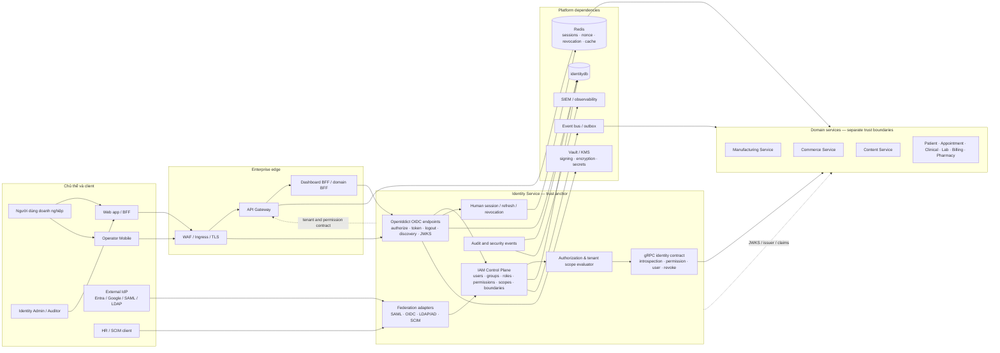

### Nguyên tắc sở hữu

| Thành phần | Nguồn sự thật | Không nên làm |
|---|---|---|
| User, role, permission, client, scope, assignment | Identity DB | Service nghiệp vụ tự copy password hoặc tự phát token |
| Session cookie và refresh state | BFF + Identity/Redis contract | Đưa access token vào browser storage |
| Dữ liệu bệnh nhân/sản xuất/thương mại/nội dung | Database của từng service | Join trực tiếp database giữa các service |
| Quyết định tenant/facility/permission | Identity claim + server-side policy | Chỉ ẩn nút trên UI để thay authorization |
| Audit security/IAM | Identity audit ledger + SIEM sink | Cho audit chạy kiểu mất dữ liệu khi buffer đầy |
| Khóa ký/mã hóa và client secret | Vault/KMS | Commit secret hoặc để private signing key trong service |

## 3. Biên giới trust và luồng request

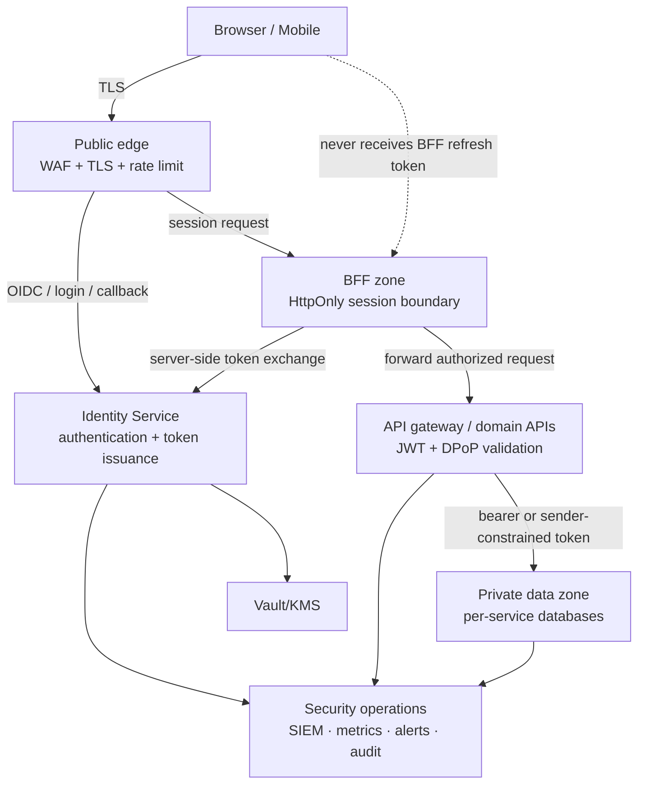

**Bắt buộc:** browser chỉ giữ `HttpOnly` session cookie trong web flow; API
không tin vào tenant/role do client tự gửi; domain service vẫn phải kiểm tra
issuer, audience, expiry, revocation/binding và policy của chính request.

## 4. Use case A — Web SSO với Authorization Code + PKCE

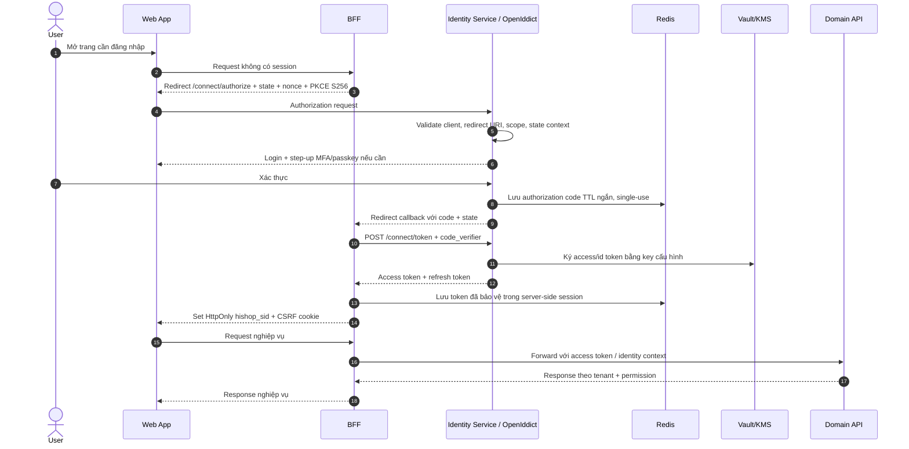

### Điểm kiểm soát

1. `state`, `nonce`, PKCE và redirect URI phải được kiểm tra; code không được
   tái sử dụng.
2. MFA/passkey là điều kiện phát hành session, không phải logic UI.
3. Refresh token chỉ tồn tại ở server-side session; rotation và family reuse
   detection phải làm mất hiệu lực cả family khi phát hiện reuse.
4. Logout phải xóa session, revoke token family phù hợp và phát audit event.

## 5. Use case B — Mobile với DPoP/sender constraint

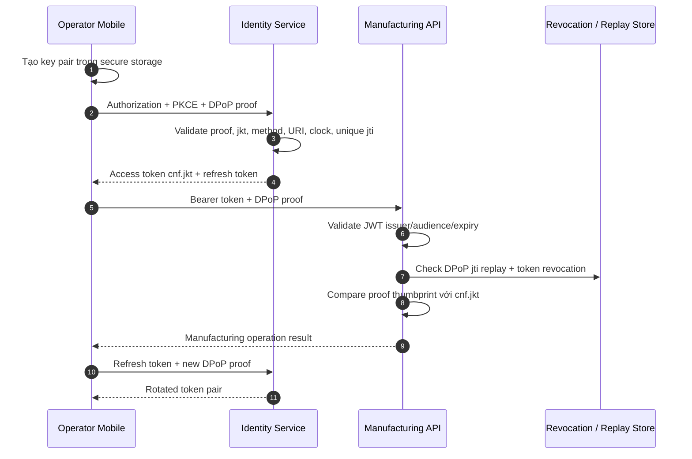

DPoP áp dụng cho mobile; web BFF vẫn giữ HttpOnly cookie boundary. Pinning
transport native, nếu bật, phải bao phủ discovery, authorize, token, refresh,
API, SignalR và push registration; không được fallback sang WebView khi pin
không khớp.

## 6. Use case C — Service-to-service authorization

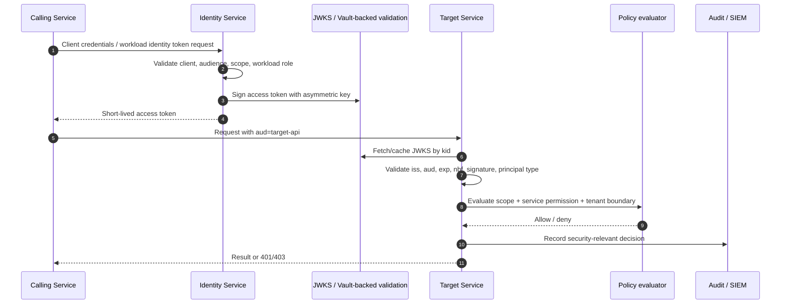

`401` nghĩa là thiếu/không hợp lệ identity; `403` nghĩa là identity hợp lệ
nhưng không đủ quyền hoặc vượt tenant boundary. Khi dependency identity
không sẵn sàng, policy nhạy cảm phải fail closed; cache không được biến thành
quyền vô thời hạn.

## 7. Use case D — Tenant, workspace và facility scope

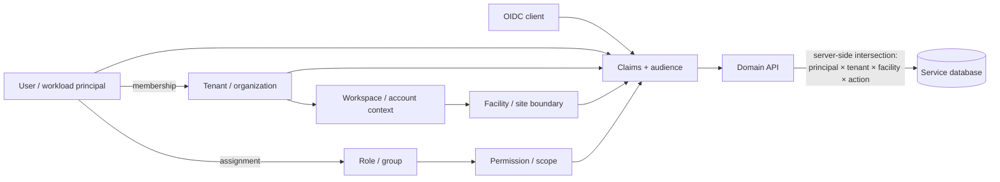

Context chuyển workspace/tenant trong UI chỉ thay đổi context của shell và
request; nó không tự cấp quyền. Backend phải resolve lại context từ session,
claim, assignment và resource ownership. Mỗi service cần có test ngăn việc
đổi `tenant_id` trên request để đọc/ghi dữ liệu tenant khác.

## 8. Use case E — IAM change, propagation và audit

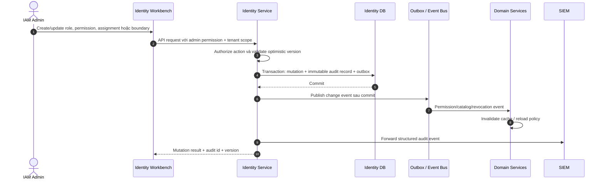

Audit phải trả lời được: ai, hành động gì, trên resource nào, tenant nào,
trước/sau ra sao, lý do/trace id nào, kết quả gì và khi nào. Audit/security
ledger, OpenIddict protocol tables, outbox và history là các loại dữ liệu có
lifecycle khác nhau; không áp dụng soft delete máy móc cho tất cả bảng.

## 9. Use case F — Federation và lifecycle nhân sự

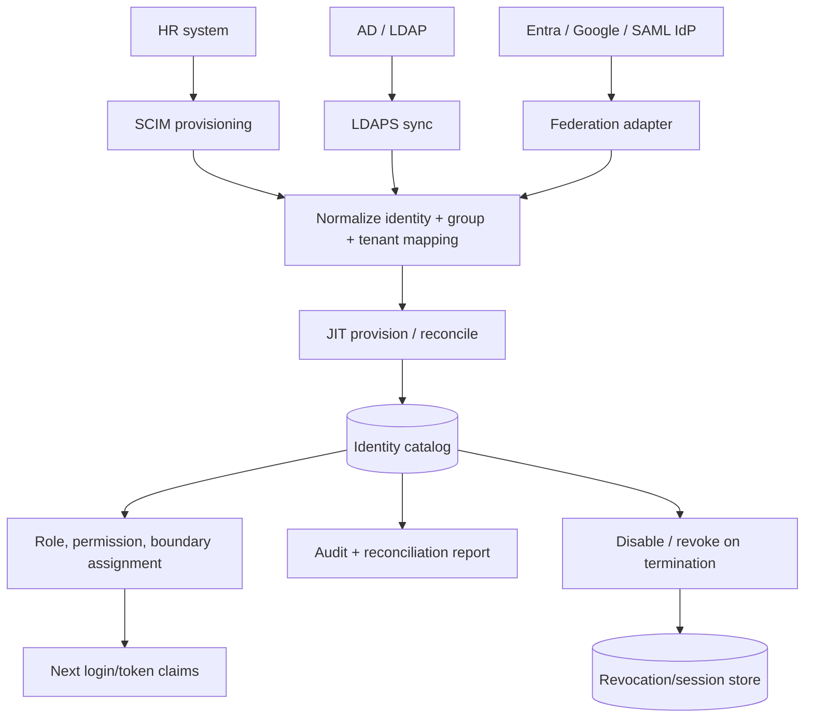

Federation chỉ là nguồn xác thực hoặc lifecycle bên ngoài; quyền nội bộ vẫn
phải map qua group/role/permission/boundary đã kiểm soát. Không lưu mật khẩu
directory trong application database. Các lỗi issuer, audience, signature,
certificate rollover, replay, clock skew và LDAP injection phải có test riêng.

## 10. Use case G — Token theft, revoke và incident response

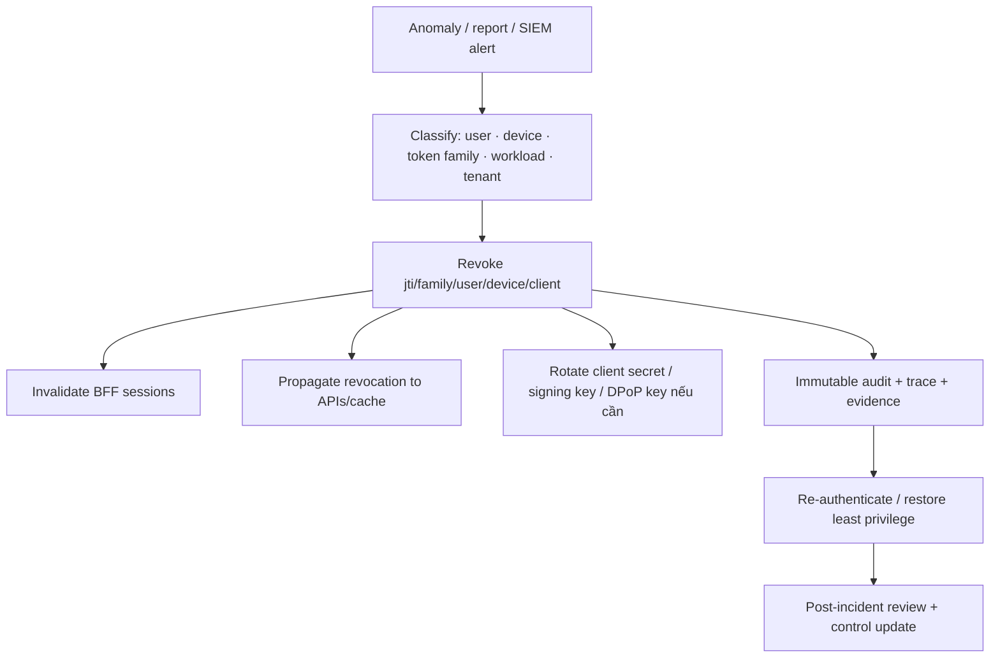

Luồng khẩn cấp phải có quyền break-glass riêng, lý do bắt buộc, thời hạn,
approval và audit. Không xóa log để “dọn incident”; retention/archival phải
theo policy và giữ khả năng điều tra.

## 11. Mô hình triển khai enterprise

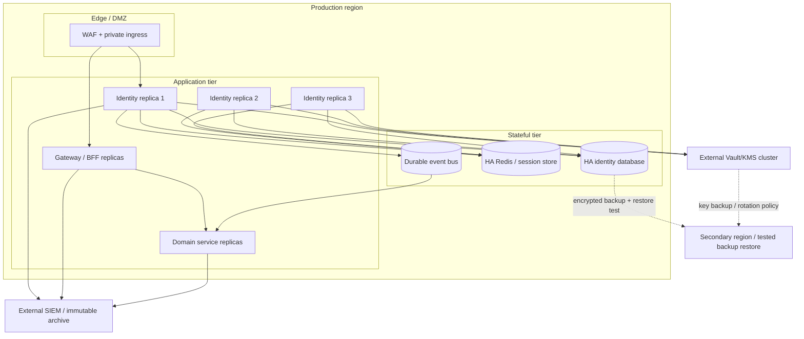

### Production acceptance gates

| Gate | Bằng chứng cần có |
|---|---|
| Availability | Multi-replica readiness, database/Redis HA, restart và failover test |
| Cryptography | Vault/KMS signing/encryption, key rotation overlap, không có fallback key |
| OIDC | Discovery/JWKS, PKCE, redirect validation, refresh rotation, conformance artifact |
| Authorization | Unit + integration + authenticated E2E cho tenant, scope, audience, revocation |
| Audit | Durable append-only path, SIEM delivery/retry, retention và query evidence |
| Federation | SAML/OIDC/LDAP/SCIM negative tests, rollover, deprovisioning evidence |
| Resilience | Identity dependency outage: fail-closed policy, bounded cache, recovery runbook |
| DR/compliance | Encrypted backup, restore drill, RPO/RTO result, signed external pentest nếu bắt buộc |

## 12. Bảng use case và thành phần chịu trách nhiệm

| Use case | Client/actor | Identity Service | Gateway/BFF | Domain service |
|---|---|---|---|---|
| Web sign-in | Browser/user | Authenticate, MFA, issue code/token | Hold server session | Validate context on API call |
| Mobile operation | Operator mobile | PKCE, DPoP binding, rotation | Optional edge routing | Validate DPoP + operation permission |
| M2M integration | Workload | Client/workload token | Route/audience | Validate audience and service permission |
| Workspace switch | User | Resolve membership/boundary | Carry context | Enforce resource tenant boundary |
| IAM mutation | IAM admin | Authorize, mutate, audit, publish | Forward admin request | Invalidate local policy cache |
| Employee join/move/leave | HR/IdP | Provision, map, reconcile, revoke | N/A | Consume permission/revocation event |
| Incident response | Security operator | Revoke and audit | Invalidate sessions | Fail closed and reject revoked tokens |

## 13. Checklist khi triển khai hoặc mở rộng service mới

- Đăng ký OIDC client/audience/scope trong Identity Workbench; không hard-code
  client secret trong service.
- Xác định rõ human, workload hoặc mobile principal; không dùng cùng một policy
  cho cả ba loại.
- Kiểm tra `iss`, `aud`, signature, lifetime, revocation/binding và tenant
  boundary ở server.
- Không đọc trực tiếp `identitydb`; dùng token, gRPC contract hoặc event contract.
- Có audit cho mutation và security decision quan trọng, kèm correlation/trace id.
- Có migration/lifecycle riêng cho bảng nghiệp vụ; tuân naming `snake_case`,
  không rename vật lý bảng hiện hữu nếu chưa có compatibility release.
- Có unit, integration, negative authorization test và authenticated E2E; build
  hoặc container healthy đơn lẻ không đủ để chứng minh luồng hoàn chỉnh.

## 14. Ranh giới giữa sơ đồ và bằng chứng runtime

Sơ đồ này là operating model thống nhất từ source/config và các design/security
documents hiện có. Nó không tự chứng minh rằng mọi gate enterprise đã đạt.
Trước release cần chạy matrix kiểm chứng thực tế: discovery/token flows,
authenticated SSO E2E, cross-tenant denial, revocation propagation, federation
negative tests, outage/failover, backup restore và external conformance/pentest
nếu thuộc phạm vi compliance.

## 15. Admin-app — bản đồ tổng thể các tính năng

`admin-app` là control plane dành cho quản trị viên. Menu chỉ là lớp điều
hướng và defense-in-depth ở client; quyền cuối cùng vẫn do Identity Service
kiểm tra trên API. Các route `/clients`, `/users`, `/roles` và `/consents` là
compatibility route; route canonical mới nằm dưới `/iam/...`.

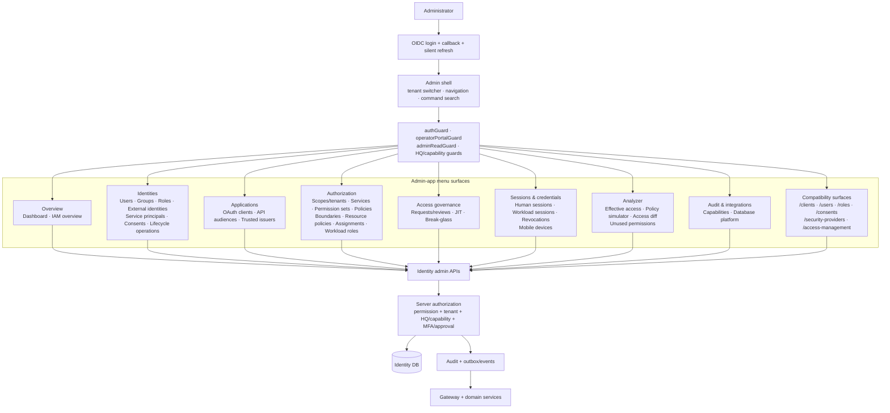

### 15.1 Ma trận tính năng theo menu, mục đích và tác động

| Nhóm | Tính năng trong admin-app | Loại thao tác | Tác động chính |
|---|---|---|---|
| Overview | Dashboard, IAM overview | Read/health | Hiện trạng tenant, quyền, dịch vụ và cảnh báo |
| Identities | Users, groups, roles, external identities | CRUD/reconcile | Identity catalog, group mapping, role membership |
| Identities | Service principals, consents, lifecycle operations | CRUD/revoke | M2M trust, user consent, disable/recover/incident |
| Applications | OAuth clients, API audiences, trusted issuers | Configure/rotate | OIDC clients, token audience và federation trust |
| Authorization | Scopes/tenants, services, permission sets | Configure/publish | Resource model và permission catalog |
| Authorization | Policies, boundaries, resource policies | Configure/simulate | Tenant/facility/resource enforcement |
| Authorization | Assignments, workload roles | Assign/revoke | Human/workload effective access |
| Governance | Requests/reviews, JIT, break-glass | Request/approve/expire | Maker-checker, temporary elevation, emergency access |
| Sessions | Human/workload sessions, revocations, mobile devices | Inspect/revoke | Token/session/device containment |
| Analyzer | Effective access, simulator, access diff, unused permissions | Analyze/export | SoD review, least privilege và change impact |
| Audit & integrations | Capabilities, database platform | Operate/observe | Feature posture, audit integration, platform health |
| Compatibility | Legacy bookmark routes | Read/write compatibility | Không tạo thêm resource model song song |

## 16. Admin-app — luồng khởi động và kiểm soát truy cập

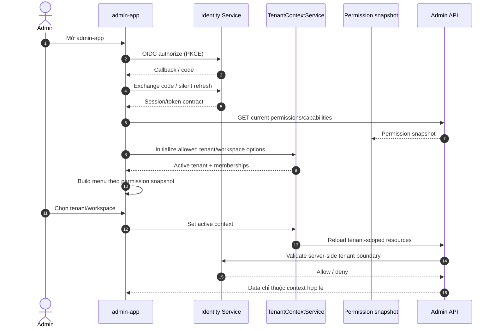

### Điều kiện hiển thị và điều kiện thực thi

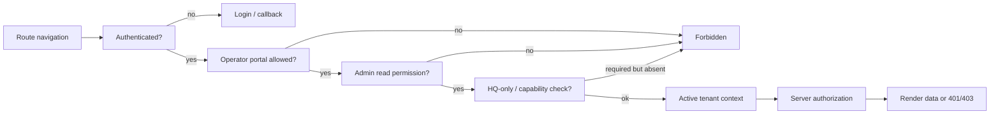

Client-side menu filtering improves UX but is not a security boundary. A
hidden menu item, route guard or disabled button never replaces the server
permission check.

## 17. Use case 1 — Cấu hình tenant/workspace và phạm vi dữ liệu

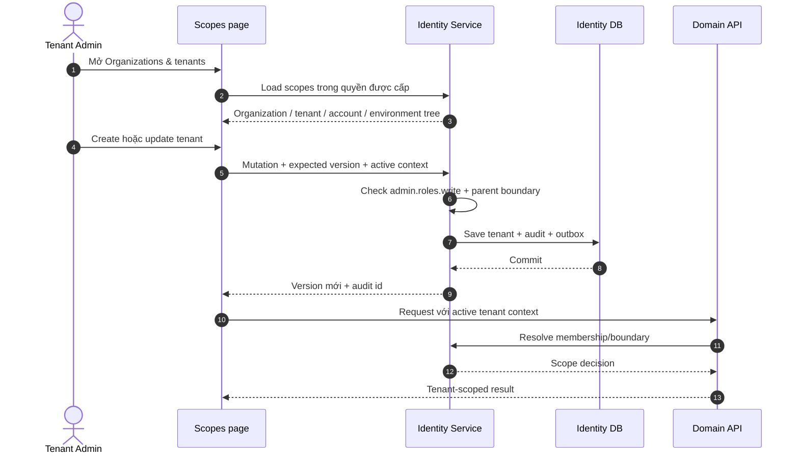

Use case này áp dụng cho switch workspace trong shell: đổi lựa chọn không
đồng nghĩa cấp thêm quyền. Mọi query/mutation của service nghiệp vụ phải
giao với tenant boundary ở server.

## 18. Use case 2 — Onboard nhân sự và cấp quyền theo role

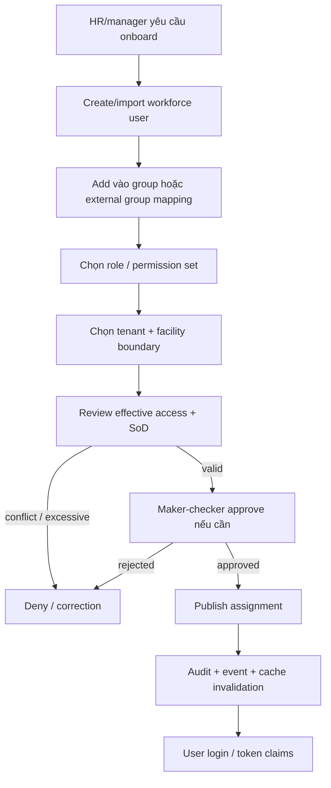

Chi tiết UI tương ứng: `Users`, `Groups`, `Roles`, `Permission sets`,
`Assignments`, `Boundaries`, rồi kiểm tra ở `Effective access` hoặc `Access
diff`. Không nên cấp permission trực tiếp nếu role/permission set đã mô hình
hóa được nhu cầu.

## 19. Use case 3 — Đăng ký service, OAuth client và API audience

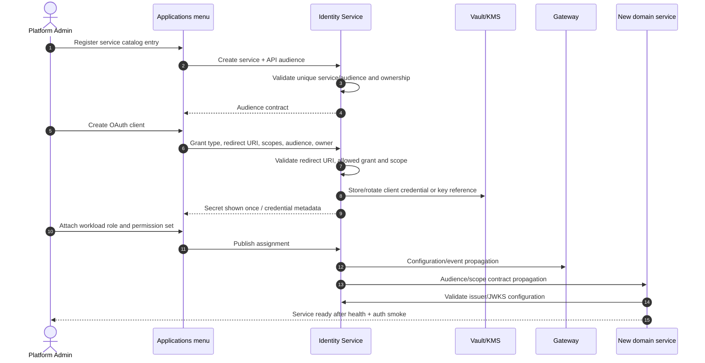

Acceptance tối thiểu: audience tách theo API, scope tối thiểu, workload
principal riêng, credential rotation có overlap, secret không xuất hiện trong
log, và authenticated smoke test trả đúng `401/403/2xx`.

## 20. Use case 4 — Thiết kế policy và kiểm tra trước khi publish

```mermaid
flowchart LR
    Define[Define policy / boundary]
    Resource[Select service + resource + action]
    Subject[Select user/group/workload]
    Sim[Policy simulator]
    Diff[New-access diff]
    SoD[Check separation of duties]
    Approve[Review / approve]
    Publish[Publish version]
    Event[Invalidate cache + audit event]
    Runtime[Runtime API decision]
    Rollback[Rollback / deactivate]

    Define --> Resource --> Subject --> Sim --> Diff --> SoD
    SoD -->|fail| Define
    SoD -->|pass| Approve
    Approve -->|reject| Define
    Approve -->|approve| Publish --> Event --> Runtime
    Runtime -->|unexpected impact| Rollback
```

`Policies`, `Boundaries` và `Resource policies` là nơi định nghĩa; `Policy
simulator`, `Effective access` và `New-access diff` là nơi kiểm chứng; chỉ
`Publish` mới tạo hiệu lực runtime. Draft và published version phải phân biệt
rõ trong UI và API.

## 21. Use case 5 — Request access, JIT và break-glass

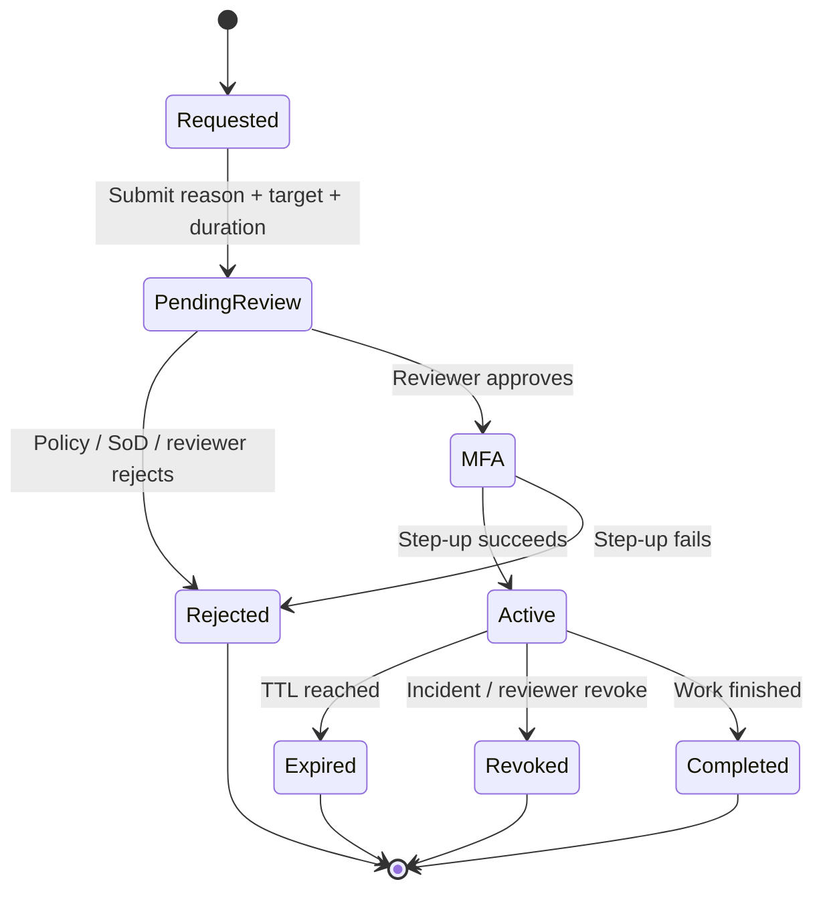

JIT và break-glass không phải role permanent. Request phải có người yêu cầu,
lý do, resource, thời hạn, approver, MFA/step-up, trạng thái và audit trail.
Break-glass chỉ dành cho emergency, có approval và tự hết hạn.

## 22. Use case 6 — Session, workload session và mobile device operations

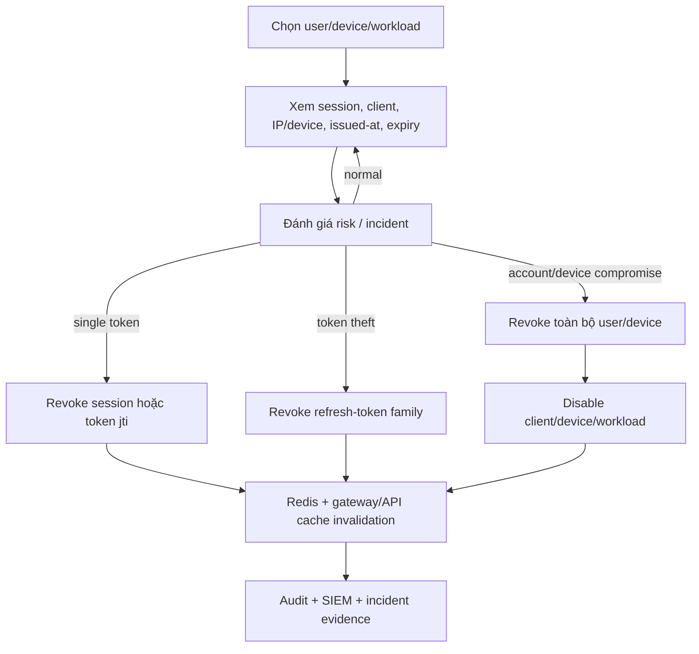

`Mobile devices` cần hiển thị trạng thái đăng ký, platform/provider, thời điểm
hoạt động, revoked state và khả năng revoke idempotent. `Workload sessions`
phải tách khỏi human sessions để tránh thao tác nhầm principal type.

## 23. Use case 7 — Analyzer và audit trước/sau thay đổi

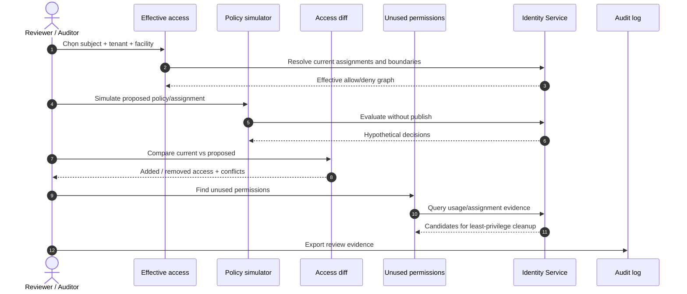

Analyzer là read/simulate surface; nó không tự bypass approval hoặc publish
policy. Export audit cần giữ tenant, subject, policy version, thời gian,
correlation id và người thực hiện.

## 24. Use case 8 — Federation, capability và platform operations

```mermaid
flowchart LR
    subgraph Admin[Admin-app]
        Ext[External identities]
        Cap[Identity capabilities]
        DB[Database platform]
        Sec[Security providers / passkeys]
    end
    Id[Identity Service]
    Fed[Entra / Google / SAML / LDAP / SCIM]
    Vault[Vault/KMS]
    Platform[Postgres · Redis · event bus]
    Audit[Audit/SIEM]

    Ext --> Id
    Sec --> Id
    Cap --> Id
    DB --> Id
    Id <--> Fed
    Id <--> Vault
    Id <--> Platform
    Id --> Audit
```

Các màn hình vận hành cấp platform và integration nên giới hạn cho HQ/operator
đúng capability. Chúng hiển thị posture, trạng thái và thao tác được audit;
không đưa credential thô hoặc dữ liệu tenant ngoài phạm vi vào UI.

## 25. Chuỗi cấu hình chuẩn trong admin-app

```mermaid
flowchart TD
    A[1. Organization / tenant / facility]
    B[2. Service catalog + API audience]
    C[3. Permission catalog + permission set]
    D[4. Role / group / workload role]
    E[5. Policy + boundary + resource policy]
    F[6. User / service principal / external identity]
    G[7. Assignment + scope]
    H[8. Simulator + effective access + SoD]
    I[9. Request/review/approval nếu cần]
    J[10. Publish + event propagation]
    K[11. Token/session issuance]
    L[12. Runtime API enforcement + audit]
    M[13. Review, revoke, rotate, deprovision]

    A --> B --> C --> D --> E --> F --> G --> H
    H --> I --> J --> K --> L --> M
    M --> H
```

Đây là thứ tự vận hành khuyến nghị, không phải ràng buộc mọi màn hình phải
đi qua cùng một wizard. Admin có thể sửa từng resource, nhưng dependency và
approval state phải được server kiểm tra ở mỗi mutation.

## 26. Bảng phân quyền thao tác trong admin-app

| Thao tác | Read | Write | Step-up/approval thường cần | Kết quả bắt buộc |
|---|---|---|---|---|
| Xem dashboard/IAM overview | `admin.roles.read` | — | Không | Data theo tenant scope |
| Quản lý users/groups/roles | `admin.users.read` / `admin.roles.read` | `admin.users.write` / `admin.roles.write` | Có thể cần maker-checker | Audit mutation |
| Quản lý OAuth client/audience | `admin.clients.read` | `admin.clients.write` | Credential rotation | Secret handling + audit |
| Sửa policy/boundary/assignment | `admin.roles.read` | `admin.roles.write` | Review/SoD | Version + propagation |
| Simulate/effective access/diff | `admin.policy.simulate` | — | Không | Không làm thay đổi runtime |
| JIT/break-glass | `admin.roles.read` | Governance write | MFA + approver + expiry | Temporary grant + audit |
| Revoke session/device/token | `admin.users.read` | Security/lifecycle write | Step-up theo risk | Immediate propagation |
| Capabilities/database platform | `admin.settings.read` | Platform-specific write | HQ/capability guard | No cross-tenant leakage |

Tên permission cụ thể có thể thay đổi theo seed/contract; khi triển khai phải
đối chiếu permission map server-side, không suy ra quyền từ tên menu.

## 27. Acceptance checklist cho toàn bộ admin-app

- Mỗi route có auth, portal, read permission và HQ/capability guard phù hợp.
- Mỗi mutation có explicit write permission, optimistic version/concurrency
  control, audit id và trạng thái publish/approval nếu thuộc governance.
- Tenant/workspace switch làm reload dữ liệu và luôn gửi context được server
  kiểm tra; test cross-tenant phải bị từ chối.
- OAuth client, audience, trusted issuer và workload role có ownership,
  audience/scope rõ ràng, rotation và revoke.
- Analyzer không tạo side effect; simulator phải chạy trên policy draft và
  cho biết version/context dùng để tính toán.
- JIT/break-glass có MFA, maker-checker, TTL, revoke và audit không thể phủ
  nhận.
- User/group/external identity deprovisioning phải làm mất assignment/session
  theo policy và có reconciliation report.
- Session, workload session và mobile device có thao tác revoke riêng, tránh
  nhầm human/workload principal.
- Các route compatibility không được tạo API/resource model song song; mọi
  route mới dùng canonical Identity Workbench contract.
- Xác minh theo matrix: build/lint, unit, API contract, authenticated E2E,
  negative authorization, audit evidence và runtime health.

## 28. Phân tích enterprise production cho admin-app

Trong môi trường production, admin-app không chỉ là CRUD UI. Đây là console
điều khiển trust của toàn hệ thống, vì một thay đổi nhỏ ở client, assignment,
policy, key hoặc tenant placement có thể ảnh hưởng đồng thời nhiều service.

```mermaid
flowchart TB
    Change[Admin change request]
    Context[Identity + tenant + facility context]
    Permission[Admin permission + capability]
    Risk[Risk classification]
    Approval[Maker-checker / step-up]
    Preview[Preview / simulator / diff]
    Execute[Execute server-side mutation]
    Verify[Health + authorization + propagation verification]
    Evidence[Audit evidence + change record]
    Rollback[Rollback / revoke / rotate back]

    Change --> Context --> Permission --> Risk
    Risk -->|low| Preview
    Risk -->|medium/high| Approval --> Preview
    Preview --> Execute --> Verify --> Evidence
    Verify -->|failed| Rollback --> Evidence
```

### 28.1 Những rủi ro cần quản trị

| Rủi ro production | Ví dụ trong admin-app | Control bắt buộc |
|---|---|---|
| Privilege escalation | Gán role quản trị chéo tenant | Server-side permission, boundary, SoD, audit |
| Blast radius | Publish policy hoặc audience sai | Draft/version, simulator, approval, canary |
| Credential compromise | Lộ OAuth secret hoặc signing key | Vault/KMS, show-once, rotation, revoke |
| Stale authorization | UI giữ permission snapshot cũ | TTL/version, reload sau mutation, deny khi stale |
| Tenant data leakage | Switch tenant nhưng bảng không reload | Context binding, query scope, cross-tenant tests |
| Irreversible operation | Xóa client, revoke toàn user | Soft disable/revoke, confirmation, recovery window |
| Silent operational failure | Outbox/SCIM/provisioning không giao | Job state, retry, DLQ, alert, reconciliation |
| Console outage | Identity/admin unavailable | Readiness, HA, break-glass có kiểm soát, runbook |

## 29. Use case production 1 — Change request, approval và promotion

```mermaid
sequenceDiagram
    autonumber
    actor Maker as Maker
    actor Checker as Checker
    participant UI as admin-app
    participant Id as Identity Service
    participant Sim as Simulator/Diff
    participant Audit as Audit ledger
    participant Bus as Event bus

    Maker->>UI: Tạo thay đổi policy/role/client/assignment
    UI->>Id: Save draft + reason + ticket/change id
    Id->>Sim: Tính effective access và blast radius
    Sim-->>UI: Diff: added/removed access, conflicts, affected services
    UI-->>Checker: Gửi review
    Checker->>UI: Approve hoặc reject
    UI->>Id: Submit approval + step-up nếu rủi ro cao
    Id->>Id: Kiểm tra maker khác checker, version và tenant boundary
    Id->>Audit: Ghi before/after, actor, approver, reason, trace id
    Id->>Bus: Publish change sau transaction commit
    Bus-->>Id: Propagation acknowledgement/timeout
    Id-->>UI: Published version hoặc pending remediation
```

Admin-app nên hiển thị rõ `draft`, `pending_review`, `approved`, `published`,
`failed` và `rolled_back`. Không cho phép một admin tự tạo và tự approve thay
đổi high-risk nếu policy yêu cầu dual control.

## 30. Use case production 2 — Rotation signing key, encryption key và client secret

```mermaid
flowchart LR
    Plan[Plan rotation window]
    Add[Add new key / secret version]
    Validate[Validate Vault/KMS access + consumers]
    Dual[Overlap: old verify + new sign]
    Promote[Promote new active version]
    Observe[Observe token validation/error rate]
    Retire[Retire old version after max token TTL]
    Rollback[Rollback active version]
    Audit[Audit + rotation evidence]

    Plan --> Add --> Validate --> Dual --> Promote --> Observe --> Retire --> Audit
    Observe -->|validation failure| Rollback --> Audit
```

Luồng trong UI chỉ quản lý metadata, approval và trạng thái rotation; private
key/secret không được tải xuống hoặc ghi vào audit/log. Signing-key rotation
có thể làm toàn hệ thống yêu cầu re-login nếu revoke sai thời điểm, nên phải
có overlap và kiểm tra tất cả issuer/JWKS consumers.

## 31. Use case production 3 — SCIM/LDAP/Entra reconciliation thất bại

```mermaid
stateDiagram-v2
    [*] --> Queued
    Queued --> DryRun: Validate target + mapping
    DryRun --> Ready: No blocking conflict
    DryRun --> NeedsReview: Collision / invalid group mapping
    NeedsReview --> Queued: Correct mapping
    Ready --> Applying: Approved reconciliation
    Applying --> Succeeded: All pages committed
    Applying --> Partial: Retryable downstream error
    Applying --> Failed: Non-retryable error
    Partial --> Applying: Backoff + retry
    Failed --> NeedsReview: Operator diagnosis
    Succeeded --> ReconcileReport
    ReconcileReport --> [*]
```

Admin-app cần cho biết target, last successful cursor, job id, số create/update/
disable, lỗi theo record và retry state. Deprovisioning phải ưu tiên revoke
session/assignment theo policy, nhưng không xóa audit evidence. Chế độ dry-run
giúp phát hiện collision trước khi áp dụng hàng loạt.

## 32. Use case production 4 — Quarterly access review và chứng nhận SoD

```mermaid
sequenceDiagram
    autonumber
    actor Owner as Resource/Tenant Owner
    participant UI as Access reviews
    participant Id as Identity Service
    participant Analyzer as Effective access analyzer
    participant Audit as Audit evidence

    Id->>UI: Mở kỳ review với snapshot/version deadline
    UI->>Analyzer: Load user, group, role, policy, boundary và last-used data
    Analyzer-->>UI: Effective grants + toxic combinations + unused permissions
    Owner->>UI: Certify, revoke hoặc request remediation
    UI->>Id: Submit decision + reason
    Id->>Id: Require scope, reviewer independence và deadline
    Id->>Audit: Record certification/revocation/remediation
    Id-->>UI: Review completion status
    UI-->>Owner: Exception list và overdue escalation
```

Review phải là snapshot có thời điểm, không chỉ là danh sách động hiện tại.
Các exception cần owner, expiry, compensating control và ticket. Permission
không được dùng trong thời gian dài là ứng viên để cleanup, không tự động xóa
nếu chưa qua policy.

## 33. Use case production 5 — Tenant dedicated tier và data residency

```mermaid
flowchart TD
    Request[Enterprise contract/compliance request]
    Assess[Assess residency, RPO/RTO, volume, noisy neighbor]
    Approve[Architecture + security + customer approval]
    Manifest[Validate tenant placement manifest]
    Provision[Provision DB + apply schema migrations]
    Register[Register secure connection/runtime config]
    Smoke[Smoke tenant routing + auth boundary]
    Cutover[Freeze writes + export/import + cutover]
    Backup[Backup + restore drill]
    Operate[Monitor dedicated tenant]
    Offboard[Final backup + retention/legal approval]

    Request --> Assess --> Approve --> Manifest --> Provision --> Register
    Register --> Smoke -->|new tenant| Backup --> Operate
    Smoke -->|existing shared tenant| Cutover --> Backup
    Operate --> Offboard
```

Admin-app có thể là nơi theo dõi request/status/evidence, nhưng không nên chứa
connection string thô. Identity invariant vẫn giữ nguyên: `tenant_id`, client
binding, `portal_class` và default-deny cross-tenant không đổi khi chuyển tier.

## 34. Use case production 6 — Backup, restore và disaster recovery drill

```mermaid
sequenceDiagram
    autonumber
    actor SRE as SRE / Platform operator
    participant UI as Database platform
    participant Backup as Backup system
    participant Restore as Isolated restore target
    participant Id as Identity Service
    participant Audit as Audit/SIEM

    SRE->>UI: Chọn backup set + restore drill window
    UI->>Backup: Validate checksum, age, encryption and retention
    Backup-->>UI: Backup eligible
    UI->>Restore: Restore vào isolated target
    Restore->>Id: Apply migrations and seed validation
    Id-->>Restore: Readiness + discovery/JWKS + authorization smoke
    Restore-->>UI: RPO/RTO, row counts, checksums, test results
    UI->>Audit: Store signed drill evidence
    UI-->>SRE: Pass / fail / remediation actions
```

Không coi backup tồn tại là bằng chứng restore được. Drill phải kiểm tra
discovery, key reference, session/revocation behavior, tenant boundary và khả
năng phục hồi event/audit cần thiết trong RPO/RTO đã cam kết.

## 35. Use case production 7 — Identity outage, degraded mode và failover

```mermaid
flowchart TD
    Alert[Identity SLO alert / readiness failure]
    Triage[Check replicas, DB, Redis, Vault, network, dependency]
    Failover[Fail over healthy replica/region]
    Read[Allow safe read-only cached view nếu policy cho phép]
    Deny[Deny new privileged mutations and unknown tokens]
    BreakGlass[Controlled break-glass with MFA + expiry]
    Recover[Restore dependency / rollback bad release]
    Validate[Discovery, token, revoke, admin mutation smoke]
    Close[Postmortem + evidence]

    Alert --> Triage
    Triage -->|healthy replica| Failover --> Validate
    Triage -->|identity unavailable| Read
    Triage --> Deny
    Deny --> BreakGlass
    Triage --> Recover --> Validate
    Validate --> Close
```

Cached permission data không được biến thành quyền vô hạn. Trong outage, admin
console nên hiển thị banner degraded mode, khóa mutation high-risk và cung cấp
link runbook; domain API phải fail-closed với token/decision không thể xác minh.

## 36. Use case production 8 — Service onboarding, plugin và kill switch

```mermaid
sequenceDiagram
    autonumber
    actor Platform as Platform Admin
    participant UI as Service catalog
    participant Id as Identity Service
    participant G as Gateway
    participant S as New service
    participant Obs as Observability

    Platform->>UI: Register service plugin metadata
    UI->>Id: Create service, audience, scopes, workload role
    Id-->>UI: Contract validation result
    Platform->>G: Enable route in staged environment
    G->>S: Health and auth smoke
    S-->>Obs: Metrics, traces, structured logs
    Platform->>UI: Promote plugin to tenant/environment
    UI->>Id: Publish feature/service binding
    Id->>G: Propagate enabled route/config
    G-->>UI: Runtime readiness
    Platform->>UI: Disable plugin on incident
    UI->>Id: Revoke binding / disable route / preserve audit
    Id->>G: Propagate kill switch
```

Plugin/service enablement cần tách ít nhất ba trạng thái: registered,
enabled-for-environment và enabled-for-tenant. Kill switch phải là thao tác
server-side có audit, không phụ thuộc việc người dùng đã tải lại admin-app hay
chưa.

## 37. Use case production 9 — Security incident từ admin-app

```mermaid
flowchart LR
    Signal[Admin 403 spike / CSP / DPoP replay / anomaly]
    Evidence[Collect trace, audit, session, IP, device, client]
    Scope[Scope affected user/client/tenant]
    Contain[Revoke session/token/device/client]
    Block[Block IP/route/client if required]
    Rotate[Rotate affected credential/key]
    Verify[Check no further access + 401/403 behavior]
    Report[Evidence package + postmortem]

    Signal --> Evidence --> Scope --> Contain --> Verify --> Report
    Scope --> Block --> Verify
    Scope --> Rotate --> Verify
```

Các màn hình `Identity operations`, `Sessions`, `Revocations`, `Mobile devices`
và `Audit integrations` nên liên kết cùng incident/correlation id. Mọi thao
tác containment phải hiển thị phạm vi, thời điểm hết hiệu lực và trạng thái
propagation, tránh tạo cảm giác đã revoke khi event vẫn còn pending.

## 38. Use case production 10 — Release canary và rollback admin policy

```mermaid
flowchart TD
    Build[Build signed image + migration artifact]
    Contract[Run contract, auth and negative tests]
    Stage[Deploy staging / synthetic tenant]
    Canary[Enable for internal canary tenant]
    Observe[Observe 401/403, latency, audit, SLO, propagation]
    Promote[Promote by environment/tenant cohort]
    Rollback[Rollback image/config/policy version]
    Freeze[Freeze high-risk mutations]
    Review[Release evidence + approval]

    Build --> Contract --> Stage --> Canary --> Observe
    Observe -->|healthy| Promote --> Review
    Observe -->|regression| Freeze --> Rollback --> Review
```

Migration database và policy/config promotion phải tách bạch nhưng có cùng
change record. Rollback ứng dụng không tự rollback dữ liệu hoặc assignment;
admin-app cần hiển thị version hiện tại và phương án đảo ngược riêng cho từng
loại tài nguyên.

## 39. Production readiness matrix cho admin-app

| Capability | Hiện trạng source/config | Production evidence cần bổ sung |
|---|---|---|
| Route/menu permission | Có route guards, permission snapshot và HQ/capability guards | Limited-role authenticated E2E cho mọi nhóm route |
| IAM mutation | Có các page/API cho user, role, scope, policy, assignment | Matrix write permission, maker-checker và negative API tests |
| Tenant isolation | Có tenant context/interceptor contract | Cross-tenant read/write denial trên từng resource |
| Analyzer | Có effective access, simulator, diff, unused permissions | Snapshot/version correctness và SoD test evidence |
| Sessions/revocation | Có human/workload/mobile operation surfaces | Propagation latency và old-token rejection test |
| Federation/provisioning | Có external identities, capabilities, dry-run provisioning | Failure, retry, partial commit, deprovisioning drills |
| Key/credential operations | Có protected operation surfaces | Vault/KMS rotation overlap, no-secret-log evidence |
| Audit/integrations | Có audit/capability UI và structured contracts | Durable delivery, retention, immutable export, SIEM evidence |
| Database platform/DR | Có database platform surface | Backup checksum, isolated restore và RPO/RTO result |
| Service/plugin operations | Có service catalog/audience concepts | Staged enablement, kill switch, gateway propagation |
| Incident response | Có identity operations, revocation, break-glass | Tabletop drill, runbook timing, signed postmortem |
| Release safety | Có build/test/lint gates trong repo | Signed image, canary, rollback and migration evidence |

### Kết luận production

Admin-app chỉ nên được xem là enterprise-ready khi các mutation có lifecycle
đầy đủ `preview → approve → publish → propagate → verify → rollback`, và mỗi
thao tác có thể truy nguyên từ người thực hiện đến audit evidence. Build xanh,
container healthy hoặc route tồn tại không đủ chứng minh control plane an toàn;
cần authenticated E2E, negative authorization, outage/failover, restore và
security evidence theo matrix ở trên.

## 40. Phân tích khoảng cách “Big-tech security”

### 40.1 Kết luận ngắn

Identity Service hiện có nền tảng tốt cho enterprise: OIDC/OpenIddict với PKCE,
refresh rotation/reuse detection, MFA/passkey, DPoP cho mobile, federation,
JWT/JWE, tenant/facility boundary, workload roles, audit, Redis revocation và
admin governance surfaces. Đây là **strong foundation**, chưa phải bằng chứng
đạt chuẩn big-tech.

Big-tech không chỉ có nhiều tính năng hơn; khác biệt chính là mọi quyền nhạy
cảm đều có lifecycle, owner, policy-as-code, continuous verification, blast
radius giới hạn, recovery đã diễn tập và bằng chứng độc lập. Mục tiêu nên là
“zero trust + least privilege + observable + recoverable”, không phải một con
số tính năng.

```mermaid
flowchart TB
    Request[Every sensitive request]
    Identity[Authenticate principal]
    Context[Resolve tenant/facility/resource context]
    Policy[Evaluate permission + risk + device + workload posture]
    Approval[Step-up / dual control for high risk]
    Decision[Short-lived allow/deny decision]
    Observe[Audit, trace, metric, anomaly detection]
    Revoke[Continuous revoke / session kill / policy update]
    Recover[Rollback, restore, post-incident evidence]

    Request --> Identity --> Context --> Policy
    Policy -->|high risk| Approval --> Decision
    Policy -->|normal| Decision
    Decision --> Observe --> Revoke
    Observe --> Recover
    Revoke --> Policy
```

### 40.2 Maturity hiện tại và mục tiêu

| Domain | Đánh giá hiện tại từ repo | Big-tech target | Ưu tiên |
|---|---|---|---|
| Human authentication | OIDC/PKCE, MFA/passkey, BFF cookie | Phishing-resistant mặc định cho admin, risk-based step-up | P0 |
| Authorization | RBAC + permission + tenant/facility policy | ABAC/PBAC, continuous evaluation, deny-by-default thống nhất | P0 |
| Privileged access | JIT/break-glass và governance UI | PAM, dual control, session recording, just-enough admin | P0 |
| Workload identity | JWT audience, workload roles, DPoP/mobile | SPIFFE/SPIRE hoặc mTLS workload identity, keyless short-lived credentials | P0 |
| Audit | DB + background delivery + SIEM/WORM adapters | Tamper-evident immutable ledger, lossless delivery, independent verifier | P0 |
| Secrets/keys | Vault/KMS integration, rotation surfaces | Automated rotation, HSM/KMS policy, emergency revoke và evidence | P0 |
| Tenant isolation | Tenant context, boundaries, dedicated placement | RLS/database policy, cryptographic tenant separation cho tier cần thiết | P0 |
| Detection | Metrics, traces, security events | UEBA, anomaly correlation, automated containment với approval guard | P1 |
| Resilience | Health/readiness, Redis revocation, runbooks | Multi-region, tested failover, graceful degradation, RPO/RTO evidence | P1 |
| Supply chain | SBOM, vulnerability/signature gates | SLSA provenance, hermetic build, admission verification, dependency SLA | P1 |
| Privacy/compliance | HIPAA docs và audit endpoints | Data inventory, retention/legal hold, DSAR, purpose limitation, signed reviews | P1 |
| Independent assurance | Automated tests/design docs | OIDC conformance, external pentest, tabletop/restore drills, red team | P1 |

## 41. Nâng cấp P0 — bắt buộc trước production nhạy cảm

### 41.1 Admin identity phải là privileged identity

Admin-app quản trị chính hệ thống nên tách khỏi user thông thường:

- Admin account riêng, không dùng chung với account công việc hằng ngày.
- Passkey/WebAuthn bắt buộc cho role nhạy cảm; TOTP chỉ là fallback có kiểm
  soát và audit.
- Step-up cho đổi role, policy, OAuth client, trusted issuer, key, tenant
  placement, revoke hàng loạt và break-glass.
- Dual control: người tạo khác người phê duyệt; emergency exception có TTL,
  reason, approver và post-review.
- Session admin ngắn hơn, re-authentication khi đổi tenant hoặc thao tác có
  blast radius lớn; không dựa riêng vào access token còn hạn.

```mermaid
sequenceDiagram
    autonumber
    actor A as Admin
    participant UI as admin-app
    participant Id as Identity Service
    participant Risk as Risk/PAM policy
    participant C as Second approver
    participant Audit as Immutable audit

    A->>UI: Request high-risk mutation
    UI->>Id: Submit intent + ticket + target scope
    Id->>Risk: Evaluate role, device, tenant, history, risk
    Risk-->>Id: Require step-up + second approver
    Id-->>UI: Start passkey/MFA step-up
    A->>Id: Complete step-up
    Id->>C: Create approval task with expiry
    C->>Id: Approve/reject with independent identity
    Id->>Id: Re-check policy, version and target state
    Id->>Audit: Record intent, approvals, before/after, decision
    Id-->>UI: Execute or reject
```

### 41.2 Authorization phải chuyển từ “role check” sang continuous authorization

RBAC là lớp nền, nhưng không đủ cho các nghiệp vụ có tenant, facility,
resource ownership, data sensitivity, device posture và time-bound access.
Mỗi API nhạy cảm cần quyết định trên tối thiểu:

`principal × principal_type × action × resource × tenant × facility × device × time × policy_version`.

Nâng cấp cần làm:

- Chuẩn hóa một policy decision contract dùng chung giữa Identity, Gateway và
  domain services.
- Bắt buộc resource-level authorization sau route-level permission.
- Phân biệt human, service principal, mobile device và break-glass principal.
- Cache decision có TTL ngắn, policy version và revoke invalidation; khi không
  xác minh được dependency thì fail closed cho thao tác nhạy cảm.
- Mọi cross-tenant read/write phải có negative test và telemetry riêng.

### 41.3 Audit phải “lossless, immutable, independently verifiable”

Repo đã có audit DB, background worker và metric loss; chính sự tồn tại của
loss metric cho thấy production cần một cơ chế xử lý khi queue/DB/SIEM lỗi.
Không được xem `queued` là `durably recorded`.

```mermaid
flowchart LR
    Action[Security/IAM action]
    Tx[Same transaction:<br/>mutation + audit outbox]
    Ledger[Append-only ledger<br/>hash chain / WORM retention]
    Delivery[Durable delivery + retry + DLQ]
    SIEM[SIEM / alerting]
    Verify[Independent verifier<br/>sequence, hash, gap, timestamp]
    Alert[Alert on loss/gap/tamper]

    Action --> Tx --> Ledger --> Delivery --> SIEM
    Ledger --> Verify
    Delivery --> Verify
    Verify -->|gap/tamper/loss| Alert
```

Cần bổ sung: hash chain hoặc equivalent tamper evidence, sequence/gap
verification, WORM retention, legal hold, retry/DLQ không mất sự kiện, alert
khi audit backlog tăng, và quyền đọc audit tách khỏi quyền mutate IAM.

### 41.4 Workload identity và mTLS phải là first-class

JWT audience validation là cần thiết nhưng chưa thay thế danh tính workload
cryptographic. Với các service xử lý PHI hoặc mutation quan trọng:

- Dùng SPIFFE/SPIRE hoặc mTLS workload identity cho service-to-service.
- Cấp credential ngắn hạn, tự rotate, không dùng shared client secret dài hạn.
- Bind service identity với namespace/service account/deployment identity.
- Network policy default-deny và egress allow-list theo dependency.
- Gateway không phải nơi duy nhất kiểm tra; target service phải tự validate.

### 41.5 Tenant isolation phải có defense in depth

`tenant_id` trong token không đủ nếu query/resource authorization không chặn
được lỗi lập trình. Cần phối hợp:

- Tenant boundary ở application policy và resource ownership.
- Query scope bắt buộc ở repository/query pipeline.
- RLS/database policy cho dữ liệu có độ nhạy cao nếu CockroachDB topology hỗ trợ.
- Separate database/schema/crypto key cho dedicated tier hoặc customer yêu cầu.
- Canary cross-tenant tests, synthetic tenants và automated data leakage scan.

## 42. Nâng cấp P1 — vận hành ở quy mô lớn

### 42.1 Continuous detection và automated containment

Admin-app nên kết hợp admin audit, gateway logs, Identity security events,
device posture, DPoP replay, CSP violation và service traces thành một incident
timeline. Automation chỉ được revoke/disable theo playbook đã duyệt, có guard
chống false positive và lưu evidence.

### 42.2 Multi-region, failure isolation và recovery

Identity phải có failure domain riêng: một lỗi của Content/Manufacturing không
được làm sập login hoặc admin control plane. Cần có:

- Multi-replica và database/Redis HA đã test failover, không chỉ health check.
- Tách read path khỏi mutation path; khóa high-risk mutation khi degraded.
- RPO/RTO được đo bằng restore drill, bao gồm key reference, revocation và audit.
- Region failover hoặc documented single-region exception có owner/expiry.
- Chaos test cho DB, Redis, Vault, event bus, JWKS, gateway và federation IdP.

### 42.3 Key, credential và certificate lifecycle tự động

Admin-app chỉ nên điều khiển request/approval/status; Vault/KMS/operator thực
hiện material rotation. Cần có expiry dashboard, owner, last-used, next-rotation,
overlap window, emergency revoke và test consumer compatibility. Không để
credential hết hạn được phát hiện lần đầu khi production request thất bại.

### 42.4 Supply-chain và runtime admission

Mỗi Identity/Gateway/BFF/domain image cần provenance, SBOM, vulnerability
exception có expiry, signature/digest verification và runtime admission. Build
pass không đồng nghĩa artifact được phép chạy. Admin-app nên hiển thị release
version, image digest, migration version, config version và security gate status
nhưng không có quyền bypass admission.

## 43. Nâng cấp P2 — governance và compliance liên tục

```mermaid
flowchart TD
    Inventory[Data + identity + service inventory]
    Classify[Classify sensitivity, owner, purpose, retention]
    Control[Map control to policy/code/test]
    Evidence[Collect signed evidence continuously]
    Review[Quarterly access/key/vendor review]
    Exception[Exception with owner, expiry, compensating control]
    Remediate[Remediate or revoke]
    Report[Compliance report / auditor export]

    Inventory --> Classify --> Control --> Evidence --> Review
    Review -->|pass| Report
    Review -->|fail| Exception --> Remediate --> Evidence
```

Cần quản lý như sản phẩm liên tục:

- Data inventory và classification cho PII/PHI/credential/audit data.
- Retention, purge, legal hold và restore behavior được kiểm thử.
- Quarterly certification cho user, role, group, OAuth client, workload role,
  trusted issuer và break-glass account.
- Dependency vulnerability SLA và exception register.
- OIDC conformance, external pentest, threat model refresh và tabletop incident
  drill theo lịch, không chỉ trước lần release đầu tiên.

## 44. Lộ trình nâng cấp đề xuất

| Giai đoạn | Phạm vi | Điều kiện hoàn thành |
|---|---|---|
| P0.1 | Admin passkey/step-up, dual control, sensitive mutation matrix | High-risk mutation không thể tự approve và có authenticated negative tests |
| P0.2 | Unified policy decision, resource auth, cross-tenant defense | Tất cả domain APIs có deny tests và policy version/tenant context |
| P0.3 | Lossless immutable audit, DLQ/replay, independent verifier | Zero unexplained gap trong drill, WORM/retention evidence |
| P0.4 | Workload mTLS/SPIFFE, Vault rotation automation | Short-lived identity, rotation overlap, outage/recovery test |
| P0.5 | Tenant RLS/defense-in-depth và dedicated isolation | Leakage test, restore test và customer placement evidence |
| P1.1 | HA/multi-region/failover/chaos | RPO/RTO đạt cam kết, no cascading auth outage |
| P1.2 | Detection/containment/SIEM correlation | Incident tabletop chứng minh alert → contain → verify |
| P1.3 | Supply-chain admission và release attestations | Chỉ signed/provenanced digest được deploy |
| P2.1 | Compliance continuous control monitoring | Access/key/vendor review có signed evidence và expiry |
| P2.2 | Independent assurance | OIDC conformance, pentest, restore và red-team findings được đóng |

## 45. Tiêu chí để tuyên bố “big-tech security”

Chỉ nên dùng tuyên bố này khi tất cả điều kiện sau có bằng chứng theo phiên bản
release cụ thể:

1. Không có high-risk admin mutation nào thiếu step-up, dual control hoặc
   documented emergency exception.
2. Mọi API nhạy cảm đều enforce resource/tenant/facility authorization ở server
   và có negative test độc lập.
3. Audit security/IAM là append-only, lossless theo SLA, tamper-evident và có
   verifier phát hiện gap.
4. User, mobile và workload đều có credential lifecycle ngắn hạn, rotation,
   revoke và replay protection phù hợp.
5. Vault/KMS, database, Redis, event bus, gateway và federation outage đã có
   fail-closed/failover behavior được diễn tập.
6. Backup restore, key recovery, RPO/RTO và incident response đã chạy thật,
   không chỉ có runbook.
7. Artifact production có SBOM, provenance, signature/digest và admission
   verification.
8. Có access review, exception expiry, external conformance/pentest hoặc ghi rõ
   control còn thiếu với owner và ngày đóng.

Theo bằng chứng repository hiện tại, His.Hope đang ở mức **enterprise security
foundation / production hardening in progress**. Các control hiện có là nền
tảng tốt; chưa đủ để kết luận đạt mức big-tech cho đến khi các P0 và bằng chứng
runtime/độc lập ở trên được hoàn tất.

## 46. Privileged Identity operating model (2026-08-29)

Runbook triển khai và validation cho database, Redis, object storage, backup,
PITR và DR: [Database và Storage Security Hardening Runbook](../operations/database-storage-security-hardening-runbook.vi.md).

Super-admin là identity đặc quyền dùng cho Identity Service và xử lý sự cố,
không phải tài khoản operator hằng ngày. Production bắt buộc tách hai loại:

| Identity | Mục đích | Ranh giới |
|---|---|---|
| Daily operator | Vận hành buyer/manufacturing và workflow được giao | Chỉ permission, tenant, facility và workspace được cấp; không có Identity super-admin control plane |
| Super-admin | Quản trị Identity, policy, client, key và incident | Không dùng cho nghiệp vụ thường; portal class `privileged_operator`; backend chỉ cấp control-plane permission khi production restriction bật |

### 46.1 Quy tắc privileged access

1. Danh sách super-admin lấy từ `Identity:SuperAdmin:UserIds`; production không
   dùng bootstrap ID mặc định.
2. `HumanSuperAdmin` yêu cầu human principal, role phù hợp và claim
   `super_admin=true`. Role không được dùng như bypass cho mọi policy.
3. Khi `Identity:SuperAdmin:RestrictToControlPlane=true`, token, session và
   effective-permission projection đều loại bỏ quyền clinical, manufacturing,
   commerce và content. Frontend menu chỉ là projection; PEP/PDP backend mới
   là ranh giới bắt buộc.
4. High-risk actions phải có step-up MFA ngắn hạn: thay đổi admin/role/
   permission, OIDC client/redirect URI, reset credential/MFA, đọc secret,
   cross-tenant, break-glass và revoke toàn bộ session/token.

### 46.2 MFA, security key và recovery

- Passkey/FIDO2/security key là ưu tiên; TOTP là fallback. Password đơn thuần
  không đủ cho privileged access.
- Mỗi super-admin production phải có ít nhất hai passkey/security key hoặc TOTP
  đã enrollment theo production policy; passkey challenge hỗ trợ toàn bộ key đã
  đăng ký để luôn có key dự phòng.
- Recovery code không phải phương thức đăng nhập thường xuyên. Recovery/reset
  phải yêu cầu session đã completed MFA, consume code, audit và revoke token.
- Bootstrap password chỉ dùng một lần từ Vault/KMS/secret manager, không truyền
  qua command line, không ghi log và phải rotate/delete sau provision.

### 46.3 Dual control, JIT và session

Requester không được tự approve request của mình. Support elevation, access
request, break-glass và permission change phải có lý do, ticket/approval, expiry,
audit và revoke. Quyền JIT chỉ tồn tại 15–60 phút; hết hạn phải revoke
refresh-token/session liên quan.

Privileged BFF session dùng idle timeout 15 phút và absolute lifetime 4 giờ;
session operator dùng 30 phút và 8 giờ. Idle expiry được gia hạn theo hoạt
động nhưng không vượt absolute lifetime. Logout, disable account, permission
change hoặc incident response phải revoke session/token phù hợp.

### 46.4 Device, network, token và monitoring

- Production privileged access phải đi qua registered device/device posture và
  admin network/VPN/IP policy; login bất thường, MFA failure, key change và
  elevation phải tạo security signal.
- Admin OIDC client `his-hope-admin` dùng DPoP/sender-constrained token.
  Refresh token dùng rotation, reuse detection và revoke family.
- Audit không chứa password, raw token, recovery code hay secret. Durable audit
  và Security Signal Outbox/dispatcher là pipeline nội bộ; external SIEM, WORM
  retention và receiver signature cần production evidence riêng.
- Role/policy/client change phải có version, approval, before/after audit,
  rollback và drift review. Startup validator fail closed nếu super-admin không
  active, chưa confirm email, thiếu MFA/passkey hoặc thiếu Vault/KMS.

### 46.5 Release gates

Evidence hiện tại: Identity API build 0 lỗi; Application `278/278`,
Infrastructure `252/252`, Shared Authorization `42/42`, BFF session `18/18`,
MFA coverage `12/12`, MFA endpoint `9/9`; Docker Identity container healthy,
`/health=200`, admin API anonymous `401` và `git diff --check` PASS.

Các gate chưa được suy diễn từ local pass gồm FIDO2 hardware production, device
posture/IP/VPN, Vault Transit bootstrap, external SIEM delivery, live JIT/rollback
drill và signed independent OIDC/pentest evidence. Mỗi gate phải có owner,
ticket, expiry và artifact độc lập trước khi promotion production.
