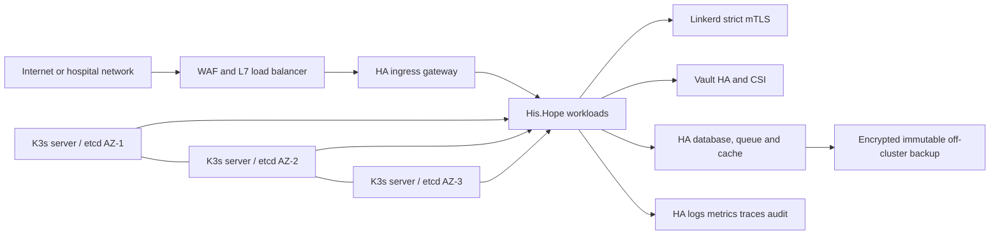

# Lộ trình nâng cấp K3s lên production enterprise

> Mã: ARCH-K3S-ENT-001  
> Trạng thái: kế hoạch nâng cấp dựa trên đánh giá runtime ngày 2026-08-06  
> Đối tượng: Platform Engineering, SRE, Security, Compliance, Application owners

## 1. Quyết định kiến trúc

Không đưa cluster `k3d-his-hope` hiện tại lên production. Đây là môi trường rehearsal chạy trong Docker Desktop/WSL2, phù hợp để kiểm thử deployment, smoke test và diễn tập sự cố. Production phải là một cluster K3s riêng trên hạ tầng Linux độc lập, có tối thiểu ba control-plane server và các failure domain tách biệt.

K3s vẫn phù hợp production enterprise khi được triển khai theo topology HA, có hardening host/Kubernetes, storage phân tán và vận hành có bằng chứng. K3s yêu cầu ba hoặc nhiều server node để embedded etcd đạt quorum và control plane HA. [K3s HA embedded etcd](https://docs.k3s.io/datastore/ha-embedded)

## 2. Baseline đã xác minh

Các dữ kiện dưới đây là snapshot runtime của context `k3d-his-hope`, không được suy diễn là trạng thái của cluster production tương lai.

| Hạng mục | Kết quả | Tác động |
|---|---|---|
| Control plane | 1 K3s server, 2 agent; datastore `state.db` SQLite | Không HA; mất host hoặc server làm mất control plane. |
| Host boundary | Tất cả node là container trong cùng Docker Desktop/WSL2 host | Không có fault isolation, host hardening hay operational boundary của production. |
| Secret encryption | `k3s secrets-encrypt status`: Disabled | Kubernetes Secret có nguy cơ nằm plaintext trong datastore. |
| Kubernetes audit | Không có audit log directory/policy | Không có bằng chứng điều tra thao tác API cluster. |
| Pod Security | `his-hope` enforce `privileged`; không có `psa.yaml` | Workload application không bị chặn bởi restricted policy. |
| Edge TLS | Production-local ingress dùng entrypoint `web`, không TLS | Không đủ cho dữ liệu bệnh viện hay OIDC production. |
| Storage | Default `local-path`, reclaim `Delete` | Mất node có thể mất dữ liệu; không có storage HA. |
| Runtime | Nhiều core service unavailable/CrashLoop; Identity ImagePullBackOff do Harbor 502 | Không đạt availability hoặc release readiness. |
| Autoscaling | HPA không có custom metrics API và nhiều metric resource không đọc được | Autoscaling không đáng tin cậy. |
| Tenant network | `his-hope` có ingress/egress default-deny và allow-list cụ thể | Nền tảng tốt, nhưng phải mở rộng và kiểm chứng ở toàn cluster. |

Các chỉ số `Running`, Helm release hoặc `kubectl apply` không phải điều kiện sign-off. Mọi gate trong tài liệu này cần có artifact: output kiểm thử, dashboard/snapshot, log truy vết, hoặc biên bản diễn tập.

## 3. Mục tiêu bắt buộc trước go-live

1. Không còn pod production `Pending`, `CrashLoopBackOff`, `ImagePullBackOff`, deployment unavailable hay cảnh báo lặp lại chưa được chấp thuận.
2. Mất một server node, một worker node, một AZ/rack theo phạm vi thiết kế không làm mất API, dữ liệu hoặc dịch vụ vượt RTO/RPO đã phê duyệt.
3. Mọi traffic client là TLS hiện đại; traffic service-to-service nhạy cảm có mTLS được kiểm chứng thực tế.
4. Kubernetes API audit, application audit và security events được giữ tập trung, bất biến và truy vấn được.
5. Image chỉ được deploy bằng digest đã ký và policy admission fail-closed.
6. Backup, restore và rollback được diễn tập trên môi trường cô lập, có bằng chứng thời gian và integrity.

## 4. P0 — các blocker phải xử lý trước migration

### 4.1 Đưa runtime về trạng thái ổn định

Khắc phục theo thứ tự: Harbor 502/image pull, Identity discovery/health, các service domain crash loop, rồi database-continuity. Không tăng retry, nới probe hoặc mở NetworkPolicy đại trà để che lỗi.

Gate:

- `kubectl get deploy -n his-hope` không có unavailable replica.
- `kubectl get pods -A` không có trạng thái lỗi trong production scope trong ít nhất 24 giờ dưới synthetic load.
- OIDC discovery, login, refresh, logout, 401/403, luồng BFF và các API PHI chạy qua smoke test có trace ID.
- Harbor pull by digest hoạt động từ node, không chỉ từ workstation Docker.

### 4.2 Cô lập hạ tầng production

Tạo cluster Linux production riêng, không dùng K3d, Docker Desktop, WSL2, `.local` hostname hay registry local. Dùng ba K3s server trên các host/AZ/rack khác nhau, embedded etcd, load balancer/VIP cho API và ingress. Worker pool tách app, data, observability và platform bằng labels, taints/tolerations và capacity reservation.

Gate:

- Một K3s server bị cordon/drain hoặc ngừng hoạt động: API và workload chịu lỗi tiếp tục phục vụ.
- Etcd snapshot tự động, encrypted và restore được vào cluster cô lập.
- DNS, NTP, disk latency/capacity, OS patching và node replacement có runbook được diễn tập.

### 4.3 Mã hóa Secret và audit API

K3s production phải bật `secrets-encryption`, `protect-kernel-defaults`, `NodeRestriction`, `EventRateLimit`, audit policy/log rotation và PSA admission configuration. K3s nêu rõ audit logging và nhiều CIS control không bật mặc định. [K3s CIS hardening guide](https://docs.k3s.io/security/hardening-guide)

Khóa encryption phải nằm ngoài cluster datastore, ưu tiên KMS/HSM hoặc Vault-transit theo chính sách quản trị khóa. Bật encryption trước khi seed secret production; xác minh dữ liệu cũ đã được re-encrypt sau migration/rotation.

Gate:

- `k3s secrets-encrypt status` báo Enabled và quá trình re-encrypt hoàn thành.
- Audit trail chứa create/update/delete/exec/port-forward/secret access theo policy đã phê duyệt, không ghi giá trị secret hoặc PHI không cần thiết.
- Audit logs được forward đến storage tách biệt, retention và quyền đọc theo compliance policy.

### 4.4 TLS và network exposure

Đặt API server private sau bastion/VPN/zero-trust access; không công bố cổng 6443 ra Internet. Edge phải có WAF, DDoS/rate limit, TLS 1.2+ hoặc chính sách TLS doanh nghiệp, certificate lifecycle bằng cert-manager/CA tin cậy, HSTS và redirect HTTP sang HTTPS. Grafana, Prometheus, Jaeger và Harbor không được public anonymous.

Gate:

- Tất cả hostname production có certificate hợp lệ, SAN đúng, renewal alert và HTTPS-only test pass.
- Network scan chỉ thấy cổng được phê duyệt; API server không truy cập được từ mạng không quản trị.
- Ingress có authentication/authorization phù hợp trước các UI vận hành.

## 5. P1 — security controls enterprise

### 5.1 Pod Security và admission policy

Đặt PSA mặc định `restricted`; namespace hệ thống có exception tối thiểu, ghi rõ owner, lý do, capability và ngày hết hạn. Không đặt `his-hope` là `privileged`. Mỗi workload application phải đặt:

- `runAsNonRoot: true` với UID/GID cố định không phải root;
- `allowPrivilegeEscalation: false`;
- `capabilities.drop: [ALL]` và chỉ add capability có phê duyệt;
- `seccompProfile: RuntimeDefault` hoặc profile đã duyệt;
- `readOnlyRootFilesystem: true` nếu ứng dụng không thực sự cần ghi;
- `automountServiceAccountToken: false` trừ workload cần Kubernetes API;
- requests/limits CPU, memory, ephemeral storage.

Áp dụng Kyverno hoặc Gatekeeper/ValidatingAdmissionPolicy để chặn privileged pod, host namespaces, hostPath, mutable tag, thiếu resource limits, thiếu digest/signature và thiếu security context. Pod Security Standards xác định restricted là profile chặt nhất cho workload application. [Kubernetes Pod Security Standards](https://kubernetes.io/docs/concepts/security/pod-security-standards/)

Gate: render toàn bộ `k8s/overlays/prod`, chạy policy test offline, rồi apply vào staging với policy ở enforce mode không có exception không sở hữu.

### 5.2 Identity, RBAC và privileged access

Tích hợp Kubernetes API với OIDC/SSO doanh nghiệp, MFA và nhóm ngắn hạn. Xóa kubeconfig admin dùng thường nhật; chỉ break-glass được vault hóa, time-bound và audit. Định kỳ xuất RBAC matrix, review ClusterRoleBinding và ServiceAccount có quyền cluster-wide.

Mỗi workload có ServiceAccount riêng, token bound/audience/TTL phù hợp. Vault, SPIRE, cert-manager, CNPG và observability controller được review RBAC riêng, không dùng `cluster-admin` cho application.

Gate: quarterly access review; thử nghiệm tài khoản read-only không thể exec, read Secret, create privileged pod, sửa admission policy hay escalation qua RBAC.

### 5.3 Network và service identity

Duy trì default-deny ingress/egress tại mọi namespace, không chỉ `his-hope`. Mỗi allow rule phải có owner, workload selector, port/protocol, destination và lý do. Linkerd phải ở strict mTLS cho application path; dùng AuthorizationPolicy/server policy để giới hạn identity-to-identity traffic. DNS, metrics, admission webhook, node/system traffic được allow explicit.

Gate: test từ pod không được ủy quyền đến Postgres, RabbitMQ, Redis, Vault, Kubernetes API và BFF endpoint đều bị deny; luồng được phép có mTLS identity đúng SPIFFE ID.

### 5.4 Software supply chain

Harbor production cần HA database/storage hoặc registry managed; không phụ thuộc một PVC local-path. CI tạo SBOM, scan dependency/image, ký Cosign với keyless/KMS-managed key, attach provenance và deploy image digest bất biến. Admission controller verify signature, allow-list registry và deny critical CVE theo SLA/exemption có thời hạn.

Gate: cố ý deploy tag mutable, image unsigned và image từ registry không tin cậy phải bị reject; digest đã ký được pull/deploy khi một Harbor replica hoặc một worker mất.

## 6. P1 — data resilience và observability

### 6.1 Storage, database và backup

Thay `local-path` bằng CSI storage production có replication qua failure domain, encryption at rest, snapshot, volume expansion và hỗ trợ topology. Không dùng reclaim `Delete` cho dữ liệu có retention/compliance nếu chưa có quy trình xóa được phê duyệt.

PostgreSQL/CNPG, Vault Raft, RabbitMQ, Redis, MinIO và Harbor phải được đánh giá riêng theo quorum, anti-affinity, storage semantics và backup. Backup phải đi đến object storage tách cluster/account, encryption, retention, immutability/WORM nếu compliance yêu cầu. Recovery test phải restore vào namespace/cluster cô lập; không restore đè live.

Gate:

- Xác định RPO/RTO cho từng datastore bởi data owner.
- Hoàn thành restore drill theo RPO/RTO, kiểm tra application consistency và audit trail.
- Mất một node không làm volume critical thành unrecoverable.

### 6.2 Observability và incident response

Production observability không scale trực tiếp profile local-path. Dùng Prometheus HA/remote write, Alertmanager HA, Grafana HA với database ngoài, Loki/Tempo/Jaeger/OpenSearch architecture phù hợp cùng object storage. Bảo vệ endpoint observability bằng SSO/RBAC và tách tenant data.

Thiết lập SLO cho API gateway, Identity, service domain, Harbor, Vault, datastore, ingress và K3s API; alert dựa trên error budget và các tình huống: unavailable replica, CrashLoop, certificate expiration, failed backup, audit pipeline failure, policy denial spike, unsafe RBAC change và unexpected egress.

Gate: synthetic transaction sinh alert đến receiver thật, liên kết dashboard/log/trace/runbook và có biên bản acknowledgement/escalation drill.

## 7. P2 — availability, capacity và vận hành

1. Thêm ResourceQuota/LimitRange từng namespace; requests/limits bắt buộc cho application.
2. Sửa metrics adapter hoặc bỏ custom HPA metric chưa vận hành được; xác minh scale-up và scale-down dưới load có kiểm soát.
3. Dùng topology spread, anti-affinity, PDB và PriorityClass theo dependency; PDB không thay thế replica HA.
4. Thiết lập lifecycle: patch OS/K3s, upgrade canary, CVE SLA, certificate/key rotation, backup verification và dependency update cadence.
5. Dùng GitOps có protected branch, review bắt buộc, signed commit/artifact và drift detection; production write access chỉ qua pipeline được audit.

## 8. Kế hoạch migration theo pha

| Pha | Mục tiêu | Điều kiện vào | Điều kiện ra | Rollback |
|---|---|---|---|---|
| 0. Stabilize | Sửa runtime hiện tại, tạo evidence baseline | Không deploy production mới | 24h không error trạng thái core; Harbor pull pass | Rollback digest đã ký, không xóa data |
| 1. Foundation | Provision Linux/HA K3s, private network, CSI, KMS | Security architecture phê duyệt | HA node/etcd/failover/backup platform pass | Hủy cluster mới, chưa cut over data |
| 2. Security | Encryption, audit, PSA, admission, RBAC/OIDC, TLS | Foundation pass | CIS/internal security gate pass | Disable policy theo exception có phê duyệt, không tắt audit/encryption |
| 3. Data | Migrate/seed data, HA registry, backup/restore | Security pass | Isolated restore và integrity checks pass | Giữ source read-only; restore verified snapshot |
| 4. Workloads | Deploy signed digest, mesh/network policies, HPA | Data pass | Functional, load, resilience và DR gates pass | Rollout undo đến digest đã ký |
| 5. Cutover | Canary, DNS/traffic shift, hypercare | P0/P1 gates pass | SLO ổn định trong cửa sổ hypercare | DNS/traffic revert, preserve evidence |

Không chuyển data hoặc DNS nếu phase trước không có artifact pass. Mọi rollback phải bảo toàn Vault Raft, database và audit evidence; không xóa PVC/volume trong incident nếu chưa có quyết định khôi phục được phê duyệt.

## 9. Ma trận go-live

| Domain | Gate bắt buộc | Bằng chứng | Owner |
|---|---|---|---|
| Availability | 3 server HA, node/AZ failover, no unavailable pods | failover drill record | Platform/SRE |
| Security | encryption, audit, PSA restricted, admission enforcement, RBAC review | config review + policy tests | Security |
| Edge | HTTPS, private API, WAF, certificate renewal | external scan + TLS test | Network/SRE |
| Data | replicated CSI, backup, isolated restore, RPO/RTO met | restore report | DBA/Data owner |
| Supply chain | SBOM, CVE policy, signed digest verification | CI artifacts + denied-image test | DevSecOps |
| Network | default deny, mTLS, authorization policy | connectivity matrix | Platform/Security |
| Observability | SLO, alert routing, audit retention, incident drill | dashboard + alert drill | SRE |
| Application | OIDC, MFA, authorization, PHI logging/redaction | end-to-end evidence | Service owners |
| Operations | upgrade, rotation, incident, DR runbooks approved | tabletop + execution record | SRE/Compliance |

Go-live chỉ được phê duyệt khi tất cả dòng P0/P1 pass; “skipped”, “unavailable” và “environment-blocked” là không pass. Chấp nhận rủi ro phải có owner nghiệp vụ, phạm vi, thời hạn hết hiệu lực và control bù đắp.

## 10. Các việc cần xác minh lại trên cluster production thật

Các mục sau chưa thể kết luận từ cluster k3d hiện tại: firewall thực tế, OS benchmark/hardening, KMS/HSM, HA storage vendor behavior, public DNS/certificate issuance, external IdP, WAF/DDoS, backup immutability, SIEM retention, physical failure domains, load/capacity và yêu cầu pháp lý địa phương. Chúng phải được đưa vào design review trước Pha 1 và thành gate có evidence trước cutover.

## 11. Tài liệu liên quan

- `docs/operations/k3s-production-deployment-runbook.vi.md`: thứ tự bootstrap và vận hành deployment.
- `docs/architecture/production-gates.md`: integrity image, Vault CSI và CNPG backup gates.
- `k8s/security/gatekeeper-constraints.yaml`: điểm bắt đầu cho admission constraints.
- [K3s CIS Hardening Guide](https://docs.k3s.io/security/hardening-guide)
- [K3s Secrets Encryption](https://docs.k3s.io/security/secrets-encryption)
- [Kubernetes Pod Security Standards](https://kubernetes.io/docs/concepts/security/pod-security-standards/)
