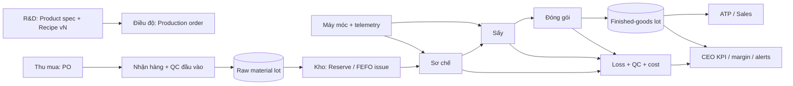
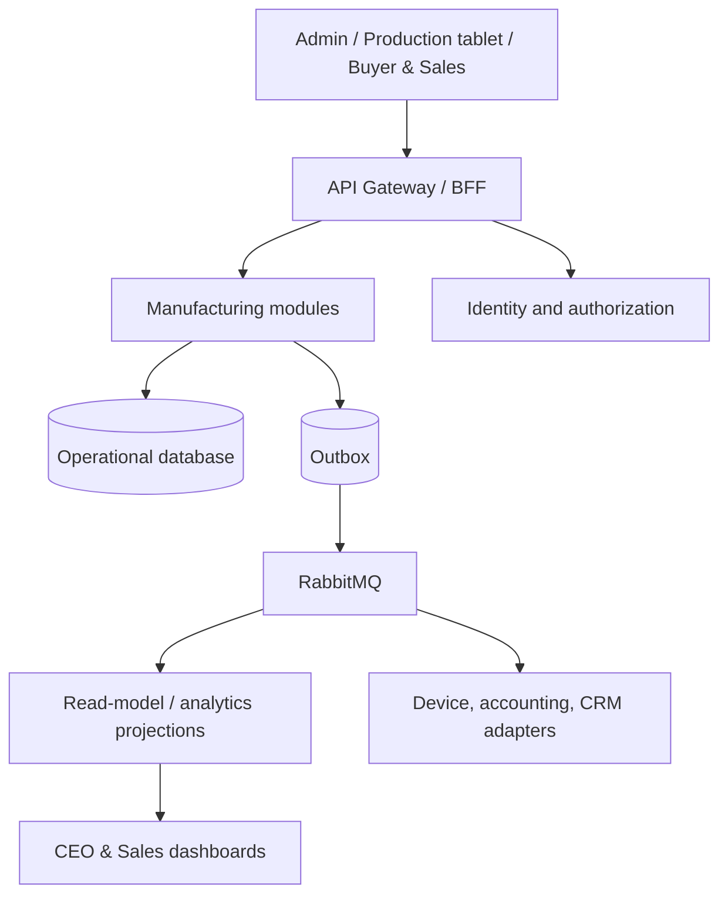

# Nacoms Manufacturing Operating Model — kiến trúc và lộ trình triển khai

> Trạng thái: đề xuất kiến trúc. Phạm vi: vận hành nhà máy Nacoms từ R&D đến thành phẩm, đồng thời mở đường cho Sales và CEO.

## 1. Mục tiêu và nguyên tắc

Hệ thống phải trả lời được tại mọi thời điểm: **lô nguyên liệu nào đã đi vào lô thành phẩm nào, theo công thức và máy nào, hao hụt ở đâu, giá thành thực tế là bao nhiêu, và có thể bán/đáp ứng đơn hàng nào**.

Nguyên tắc thiết kế:

- `Lot` (lô) và `ProductionBatch` (mẻ/lệnh thực thi) là hai định danh không thay đổi, dùng xuyên suốt truy xuất, chất lượng, tồn kho và giá thành.
- Công thức là dữ liệu có phiên bản, có hiệu lực và phê duyệt; không sửa trực tiếp công thức đã được dùng bởi mẻ đã đóng.
- Tồn kho được ghi bằng sổ giao dịch bất biến; số tồn là projection, không phải con số người dùng sửa tay.
- Sản xuất ghi số lượng kế hoạch và thực tế theo từng công đoạn; hao hụt là sai lệch đo được, không là một ô nhập chung cuối mẻ.
- Automation chạy bất đồng bộ qua Outbox/Inbox; tác vụ nghiệp vụ phải idempotent và có audit trail.
- Sales và CEO chỉ đọc projection phù hợp quyền; không đọc/can thiệp transaction vận hành xưởng.

## 2. Context map cho bảy nghiệp vụ

| Bounded context | Trách nhiệm | Chủ sở hữu nghiệp vụ | Dữ liệu chủ đạo | Không sở hữu |
|---|---|---|---|---|
| R&D và Công thức | Product spec, công thức, định mức, version/phê duyệt | R&D, QA | `ProductSpecification`, `RecipeVersion`, `RecipeLine` | Tồn kho thực tế, giá xuất kho |
| Thu mua và nguyên liệu | Nhà cung cấp, RFQ, PO, nhận hàng, QC đầu vào | Procurement, QA | `Supplier`, `PurchaseOrder`, `InboundReceipt`, `RawMaterialLot` | Quyết định dùng nguyên liệu trong một mẻ |
| Kho và truy xuất | Ledger tồn kho, reservation, vị trí kho, FEFO, genealogy | Warehouse | `InventoryTransaction`, `StockBalance`, `LotLink`, `StorageLocation` | Phê duyệt QC/công thức |
| Điều độ và sản xuất | Lệnh sản xuất, routing, mẻ, tiêu hao/thành phẩm | Production planner, Supervisor | `ProductionOrder`, `ProductionBatch`, `OperationExecution` | Master recipe |
| Máy móc và bảo trì | Asset, trạng thái máy, meter, work order, downtime | Maintenance | `Equipment`, `MeterReading`, `MaintenanceWorkOrder`, `DowntimeEvent` | Yield/quality disposition |
| Chất lượng, hao hụt và giá thành | QC checkpoints, disposition, yield, variance, cost roll-up | QA, Finance/Controller | `QualityInspection`, `LossRecord`, `BatchCost` | Thay đổi lịch sản xuất |
| Sales, CEO và phân tích | ATP, forecast, margin, KPI, cảnh báo/executive views | Sales, CEO | Read models/projections | Transaction vận hành xưởng |

## 2.1 Ma trận liên kết và tự động hóa giữa 7 nghiệp vụ

| Nghiệp vụ khởi phát | Dữ liệu tạo ra | Nghiệp vụ nhận | Tự động hóa an toàn nên có |
|---|---|---|---|
| Nghiên cứu/công thức | `RecipeVersion`, định mức, checkpoint chất lượng, target yield | Planning, QA, Costing | Chỉ khi `RecipeVersionApproved` mới cho phép planner dùng; snapshot recipe vào order/batch tự động. |
| Thu mua/nguyên liệu | PO, receipt, raw-material lot, QC disposition, landed cost | Warehouse, Production, Costing | Lot `Released` mới được reserve/issue; cập nhật available supply và cost component qua event. |
| Kho và truy xuất | stock ledger, reservation, move, genealogy edges | Production, Sales, Recall/QA | FEFO suggestion, low-stock alert, recall index và ATP projection tự động; không auto-adjust tồn kho. |
| Sản xuất sơ chế - sấy - đóng gói | operation measurement, WIP lot, FG lot, actual consumption | Quality, Costing, CEO | Tạo QC task, WIP/FG ledger, variance và yield projection ngay sau `OperationCompleted`. |
| Máy móc và bảo trì | machine state, downtime, meter, work order | Production, OEE, CEO | Alert downtime, PM suggestion, OEE projection; không tự đóng work order nếu chưa có xác nhận con người. |
| Hao hụt/giá thành/chất lượng | loss records, deviation, batch cost, release/hold | Sales, CEO, Finance | Threshold alert, hold/release propagation, margin projection và batch-close checklist tự động. |
| Sales/CEO | forecast, allocation, demand signal | Planning, Procurement, Production | Forecast change tạo MRP suggestion và re-plan suggestion; không tự sinh PO hay auto-release batch. |

### Ubiquitous language bắt buộc

- **Lot**: đơn vị truy xuất vật lý của một nguyên liệu/bán thành phẩm/thành phẩm; có nguồn gốc, trạng thái chất lượng, hạn dùng.
- **Production order**: yêu cầu sản xuất được phê duyệt theo kế hoạch; có target quantity và recipe version đã khóa.
- **Production batch**: lần thực thi thực tế của production order; một order có thể có nhiều batch.
- **Operation**: công đoạn có thể đo đầu vào/đầu ra: sơ chế, sấy, đóng gói.
- **Yield**: tỷ lệ đầu ra đạt chuẩn trên đầu vào được phép tính của công đoạn/batch.
- **Loss**: lượng hao hụt được phân loại (tự nhiên, lỗi QC, máy, thao tác, tái chế); không bao gồm tồn kho chưa được đếm.
- **Disposition**: trạng thái chất lượng của lot: `Quarantine`, `Released`, `Hold`, `Rejected`, `Rework`.

## 3. Chuỗi giá trị và liên kết dữ liệu



### Chuỗi genealogy tối thiểu

`Supplier lot → Inbound receipt → Raw material lot → Issue transaction → Operation input → Operation output/intermediate lot → Finished-goods lot → Sales allocation/shipment`.

Mỗi liên kết nguồn-đích phải lưu `quantity`, `UoM`, `occurredAt`, `actor/source`, `quality disposition` và `productionBatchId`. Đây là điều kiện để recall ngược từ thành phẩm về nguyên liệu, hoặc xuôi từ một nguyên liệu lỗi đến tất cả thành phẩm chịu ảnh hưởng.

### Nguyên tắc liên kết dữ liệu

1. `RecipeVersion` liên kết với `ProductionOrder`; `ProductionOrder` snapshot vào `ProductionBatch`; `ProductionBatch` sinh `OperationExecution`.
2. `OperationExecution` không ghi tồn kho trực tiếp; nó phát ra các transaction input/output/loss để stock ledger và cost projection tiêu thụ.
3. `Equipment` không sở hữu batch nhưng phải gắn vào `OperationExecution` và `DowntimeEvent` để có OEE và root-cause theo máy.
4. `QualityInspection` và `Disposition` luôn bám vào `Lot` hoặc `ProductionBatch`, không bám vào màn hình nhập liệu.
5. Sales/CEO chỉ đọc projection từ event đã xác nhận; không join trực tiếp bảng giao dịch xưởng để tránh KPI không nhất quán.

## 4. Luồng nghiệp vụ end-to-end

### 4.1 Nghiên cứu và công thức

1. R&D tạo product specification và recipe draft theo yield mục tiêu, moisture target, routing và packaging.
2. QA/R&D phê duyệt `RecipeVersion`; hệ thống gán effective date và khóa version trước khi Planning dùng.
3. Planning tạo production order, snapshot recipe version/BOM/routing vào order.
4. Mọi thay đổi sau release tạo version mới hoặc deviation được phê duyệt; không sửa bản snapshot.

### 4.2 Thu mua, nhận hàng và QC

1. MRP/Planner đưa demand từ forecast, sales order, tồn kho, safety stock và production order.
2. Procurement tạo RFQ/PO theo nhà cung cấp được phê duyệt.
3. Inbound receipt tạo raw-material lot ở `Quarantine`.
4. QC sampling quyết định `Released`, `Hold`, `Rejected` hoặc `Rework`; chỉ lot `Released` được reserve/issue.
5. Giá nhận hàng và landed cost phát event để cost projection cập nhật.

### 4.3 Sản xuất: sơ chế → sấy → đóng gói

1. Supervisor release batch với thiết bị, operator, recipe version và planned input.
2. Warehouse issue lot theo reservation/FEFO; ledger tạo consumption transaction.
3. Mỗi operation ghi input measured, output good, output rework, loss và downtime; tạo intermediate lot khi cần lưu giữa công đoạn.
4. Sau công đoạn sấy, QA kiểm tra độ ẩm/tiêu chí chất lượng; lot chỉ được đi tiếp khi pass.
5. Đóng gói sinh finished-goods lot và cost roll-up; QA release để bán.

### 4.4 Máy móc và bảo trì

- Machine state: `Available`, `Running`, `PlannedMaintenance`, `UnplannedDown`, `Cleaning`, `Changeover`, `Blocked`.
- Meter reading/downtime event liên kết equipment + production batch + operation.
- Rule engine tạo preventive-maintenance work order theo runtime, cycle count hoặc condition threshold; không tự động mark work complete.
- Unplanned downtime vượt ngưỡng gửi alert đến supervisor, maintenance và CEO projection.

### 4.5 Hao hụt và giá thành

Đo tại từng operation, theo khối lượng chuẩn hoá cùng UoM:

```text
Operation loss quantity = measured input - good output - rework output - approved by-product output
Operation loss %        = operation loss quantity / measured input × 100
Batch yield %           = released finished-good quantity / approved raw-material input × 100
Recipe variance %       = (actual consumption - planned consumption) / planned consumption × 100
```

Loss record bắt buộc `reasonCode`, `operationId`, `quantity`, `UoM`, `measuredAt`, `recordedBy`; vượt threshold phải có supervisor approval. Giá thành batch gồm nguyên liệu issue thực tế, labour/machine time, packaging, QC/rework và phân bổ overhead theo policy version.

## 5. Automation và event contract

### 5.1 Sự kiện nghiệp vụ đầu tiên

| Event | Producer | Consumer tự động | Hành động |
|---|---|---|---|
| `RecipeVersionApproved` | R&D | Planning | Cho phép planner chọn version mới |
| `RawMaterialLotReleased` | QA | Warehouse, Planning | Mở khả năng reserve/issue; cập nhật available supply |
| `InventoryBelowReorderPoint` | Warehouse projection | Procurement | Tạo purchase suggestion, không tự gửi PO |
| `ProductionBatchStarted` | Production | Equipment, CEO projection | Liên kết machine run; cập nhật WIP |
| `OperationCompleted` | Production | Quality, Costing, Inventory | Tạo QC task nếu checkpoint; cập nhật lot genealogy/cost WIP |
| `LossThresholdExceeded` | Yield service | Supervisor, CEO | Cảnh báo, yêu cầu reason/approval |
| `EquipmentDowntimeRecorded` | Maintenance | Planning, OEE projection | Re-plan suggestion, cập nhật OEE |
| `FinishedGoodsLotReleased` | QA | ATP, Sales | Tăng supply có thể hứa bán |
| `FinishedGoodsLotHeld` | QA | Sales, CEO | Gỡ ATP/reservation, kiểm tra đơn ảnh hưởng |
| `SalesForecastChanged` | Sales | Planning, Procurement | Chạy lại MRP suggestion |

### 5.3 Nguyên tắc tự động hóa theo cấp độ

| Cấp độ | Ví dụ | Cho phép tự động | Không cho phép tự động ở phase đầu |
|---|---|---|---|
| Thông báo | low stock, downtime, loss threshold | Alert, task, notification, dashboard refresh | Không có |
| Đề xuất | FEFO issue, purchase suggestion, re-plan suggestion | Tạo suggestion có owner, due date và audit | Không tự phát hành PO/lệnh sản xuất |
| Thực thi có guardrail | cập nhật ATP, WIP projection, cost projection, OEE read model | Có, nếu idempotent, replay-safe và có thể rebuild từ event log | Không sửa transaction nguồn |
| Quyết định nghiệp vụ | recipe approval, lot release/hold, stock adjustment, break-glass sales override | Chỉ với maker-checker hoặc policy được duyệt rõ | Không auto-release hay auto-write-off |

### 5.2 Contract rules

- Event envelope: `eventId`, `eventType`, `schemaVersion`, `occurredAt`, `aggregateId`, `correlationId`, `causationId`, `tenant/facilityId`, payload.
- Producer ghi aggregate state và Outbox trong một DB transaction; consumer dùng Inbox/idempotency key theo `eventId`.
- Không phát raw PII/secret; schema phải backward compatible trong cùng major version.
- Integration với cân điện tử, PLC, barcode/QR, accounting hoặc CRM qua adapter riêng; message broker không gọi trực tiếp thiết bị từ request HTTP.
- Automation tạo **suggestion/task/alert** trước; chỉ automation đã có owner, approval policy, audit và rollback mới được phép thực thi thay người dùng.

## 6. Kiến trúc triển khai đề xuất

### Giai đoạn đầu: modular monolith có ranh giới rõ

Đưa bảy context vào một Manufacturing service/module set cùng database có schema/module boundary, CQRS handlers và Outbox. Đây là lựa chọn thực tế khi Nacoms còn đang chuẩn hóa quy trình/xưởng; tránh distributed transaction và nhiều service vận hành quá sớm.

Tách thành service độc lập khi có một trong các tín hiệu: workload telemetry/PLC tăng cao, maintenance cần release cadence riêng, costing/BI tải lớn, hoặc có team ownership độc lập. Khi tách, giữ event contracts và ownership DB, không dùng shared database.



### API contracts ban đầu

- Command: `CreateRecipeVersion`, `ApproveRecipeVersion`, `CreateProductionOrder`, `ReleaseProductionBatch`, `RecordOperationMeasurement`, `RecordLoss`, `RecordQualityDisposition`, `RecordDowntime`, `CompleteMaintenanceWorkOrder`.
- Query: lot genealogy, batch dashboard, equipment status/OEE, inventory availability/ATP, recipe variance, loss Pareto, executive KPI.
- Bắt buộc optimistic concurrency (`version`/ETag) cho recipe, production order, quality disposition và maintenance work order.

## 7. Quyền, kiểm soát và audit

| Role | Quyền chính |
|---|---|
| R&D | Draft/submit recipe; không tự approve recipe của mình |
| QA | Approve recipe, release/hold/reject lot, manage quality deviation |
| Procurement | Supplier/PO/receipt; không release QC lot |
| Warehouse | Receive, move, count, reserve, issue theo released lot |
| Production supervisor | Release/execute batch, record/approve loss trong threshold policy |
| Operator | Nhập measurement/checklist của batch được giao |
| Maintenance | Record downtime, execute work order |
| Sales | Forecast, customer allocation, ATP/read-only stock availability |
| CEO | Read-only KPI, exception approval theo delegation |

Audit record phải lưu before/after, action, actor, reason, timestamp, correlation ID và batch/lot liên quan. Quality release, recipe approval, inventory adjustment, loss override và cost closing là các action bắt buộc audit.

## 8. Dashboard và KPI

### Operations

- Kế hoạch so với thực tế: scheduled/released/completed batch, throughput, on-time completion.
- Yield theo recipe/product/operation/supplier/machine/shift.
- Loss Pareto theo reason code, moisture range, operator, machine, raw-material lot.
- OEE theo machine và shift: Availability × Performance × Quality; dữ liệu đầu vào phải hiển thị rõ để tránh KPI “đẹp giả”.
- WIP age và bottleneck theo operation.

### Sales và CEO

- Available-to-promise theo finished-good lot và hạn dùng.
- Forecast accuracy, stock cover, fill rate và rủi ro thiếu nguyên liệu.
- Contribution margin theo product/customer/channel sau giá thành batch thực tế.
- Alert: lot hold ảnh hưởng đơn hàng, yield dưới chuẩn, downtime kéo dài, expiry risk, purchase lead-time risk.

## 9. Lộ trình triển khai

| Phase | Mục tiêu | Deliverables | Gate nghiệm thu |
|---|---|---|---|
| 0 — Discover (4–6 tuần) | Chuẩn hóa quy trình và master data | process map, UoM/conversion, reason codes, facility/warehouse map, recipe template, KPI baseline | 3 product families được walkthrough từ receipt đến FG |
| 1 — Traceability core (8–12 tuần) | Không mất genealogy | supplier/lot, receipt/QC, inventory ledger, barcode, recipe version, production order/batch | Recall drill từ 1 FG lot về tất cả raw lots trong dưới 15 phút |
| 2 — Yield & execution (8–12 tuần) | Đo hao hụt đáng tin | operation execution, measurements, loss approval, WIP, cost actual-vs-plan | 95% batch có input/output/loss phân loại; variance dashboard được QA/Finance đối soát |
| 3 — Equipment & quality automation (6–10 tuần) | Nâng hiệu suất và kiểm soát | equipment state, downtime, PM work orders, QC checkpoint rules, alerts | downtime/OEE được đối chiếu với log xưởng; alert không tạo duplicate task |
| 4 — Sales/CEO planning (8–12 tuần) | Biến vận hành thành quyết định | ATP, forecast, MRP suggestions, margin/executive dashboards | Sales hứa hàng bằng ATP; CEO dashboard truy ngược đến batch/lot |
| 5 — Scale integrations | Không khóa vào công cụ hiện tại | device adapters, accounting/CRM, data warehouse, forecasting | replay event an toàn; adapter lỗi không làm ngưng production command |

## 9.1 Trình tự module nên làm trước

1. `Lot + Inventory ledger + QC disposition`
Lý do: đây là xương sống truy xuất, recall và ATP; nếu thiếu phần này thì công thức, hao hụt và sales projection đều không đáng tin.

2. `Recipe version + Production order/batch snapshot`
Lý do: khóa định mức/routing tại thời điểm sản xuất để còn so actual-vs-plan và audit deviation.

3. `Operation measurement + Loss + WIP/FG genealogy`
Lý do: đây là lớp biến quy trình sơ chế - sấy - đóng gói thành dữ liệu đo được, đủ để tính yield và khoanh vùng lỗi.

4. `Equipment state + Downtime + OEE`
Lý do: chỉ nên làm sau khi batch/operation đã chuẩn, nếu không OEE sẽ đẹp nhưng không phản ánh thực tế.

5. `ATP + Forecast + Margin + Executive dashboards`
Lý do: đây là projection cuối chuỗi; làm sớm khi dữ liệu nền chưa chuẩn sẽ làm sai quyết định Sales/CEO.

## 10. Backlog triển khai đầu tiên

1. Workshop process với R&D, QA, Procurement, Warehouse, Production, Maintenance, Sales và Finance; chốt unit, weight/moisture measurement và loss reasons.
2. Thiết kế master data: material/product/UoM/conversion/supplier/facility/storage location/equipment/recipe.
3. Implement lot + inventory ledger + QC disposition + barcode scan trước UI dashboard.
4. Implement immutable recipe version và batch snapshot trước MRP/costing.
5. Implement operation measurement/loss with approval policy và reconciliation report.
6. Xây event catalog/versioning, Outbox/Inbox observability, DLQ/replay runbook.
7. Chạy pilot một line sản phẩm xoài sấy trước; không rollout toàn bộ nhà máy cùng lúc.

## 11. Rủi ro và quyết định cần chốt với Nacoms

- **UoM/conversion**: kg tươi, kg sau sơ chế, kg sau sấy, pack/carton; phải có quy tắc rounding và moisture basis.
- **Hao hụt tự nhiên so với lỗi**: cần reason taxonomy và threshold theo recipe/season, không đặt một ngưỡng chung.
- **Rework/by-product**: có thể quay về công đoạn nào, có cần quality release lại, và có được tính vào yield không.
- **Lot granularity**: một xe/nhà cung cấp/ngày hay từng pallet; quá thô không recall được, quá nhỏ làm xưởng không dùng nổi.
- **Cân/PLC offline**: phải có capture offline, time synchronization và review queue; không tin tuyệt đối vào integration.
- **Cost closing**: quy tắc period close và correction sau close phải thuộc Finance policy, không do Production tự sửa.

## 12. Liên hệ với platform hiện tại

Kiến trúc này tái sử dụng event-driven Outbox/Inbox và external-integration relay đã được mô tả trong [event-driven production scale](event-driven-production-scale.md). Các module mới cần đưa correlation ID xuyên từ purchase/lot/batch đến sales projection, metrics/trace để điều tra hao hụt và integration failure.

Nghiên cứu tiêu chuẩn và hệ quả triển khai được ghi tại `docs/research/2026-08-25-food-manufacturing-traceability-automation-research.vi.md`.
