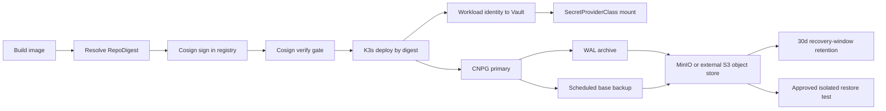

# Production gates: image integrity, Vault CSI, and CNPG backups

## Current implementation

- Harbor 2.15.2 is deployed in the K3s `harbor` namespace behind the Traefik
  HTTPS ingress `harbor.his-hope.local:9443` for the local k3d profile. Its
  registry, job logs, internal PostgreSQL, Redis, and Trivy data use persistent
  `local-path` PVCs. The runtime admin password, TLS key, Harbor secret key,
  robot token, and Cosign private key are outside Git under `D:\secure`.
- A private `his-hope` Harbor project and pull-only K3s robot are configured.
  The canary identity-service image was pushed by digest, signed with Cosign,
  and verified with the external public key. `harbor-pull-k3s` is attached to
  the default ServiceAccount in `his-hope`, `his-hope-dev`, and `spire`.
- The local Windows Docker client can push and pull Harbor over
  `harbor.his-hope.local:9443`. K3s uses the internal alias
  `harbor-k3s.his-hope.local` over the node HTTPS route, with a separate
  `harbor-pull-k3s` secret. The digest-pinned containerd pull smoke passed.
  The production overlay now references Harbor manifest digests for every
  rendered production image.
- The migration records the post-push Harbor manifest digest (important for
  single-platform images pushed from a multi-platform local tag) and verifies
  it with `cosign verify` before rewriting Kustomize.
- `scripts/validate-production-image-signatures.ps1` is fail-closed when run
  with `-RequireSigned`. Without that switch it reports the local immutable
  state as `PARTIAL`, never as signed.
- Linkerd control-plane HA was validated with three topology-spread replicas
  per component, PDBs, non-empty endpoints, and sequential single-pod
  failover. Traefik injection is enabled again only after those gates passed.
- Secrets Store CSI Driver and Vault CSI provider are installed in K3s. The
  production `SecretProviderClass` objects are in
  `k8s/vault/vault-csi-provider.yaml`; secret values remain runtime-only.
  The production Vault HA StatefulSet in `k8s/production-ha/vault/vault-production.yaml`
  uses Azure Key Vault auto-unseal, TLS SANs for K3s service names, and raft
  storage. Workloads still use SPIRE JWT-SVID direct authentication to Vault.
  CSI is a Kubernetes/JWT bridge for file mounts and synchronised secrets, not
  a static token replacement.
- CNPG Barman Cloud plugin 0.13.0 and cert-manager are installed. The
  production-ha overlay adds a four-node MinIO S3-compatible object store,
  versioned bucket bootstrap, `ObjectStore`, WAL archiving, a six-hour
  `ScheduledBackup`, gzip compression, and a 30-day recovery-window retention
  policy.
- `scripts/bootstrap-cnpg-object-store.ps1` generates credentials at runtime,
  creates the MinIO and CNPG secrets, and applies the object-store resources.
- `scripts/validate-cnpg-backup-platform.ps1 -RunBackup` creates a real plugin
  backup and waits for `completed`. A successful local run produced
  `spire-postgres-smoke-20260804064117` and CNPG reported continuous archiving
  as working.

## Release gates that remain explicit

1. The Harbor canary and full production image signing gates pass. The
   rendered production overlay contains 25 image references, all Harbor
   digest-pinned and Cosign-verified; the component records 30 mirrored source
   images including infrastructure images not rendered by this overlay. A
   local Docker RepoDigest is not a signature.
2. Vault endpoint and Azure auto-unseal are now live and validated after a pod
   restart. A workload-level CSI secret-mount smoke test remains a separate
   gate because no production application pod has been migrated to a CSI volume
   in this change.
3. Restore testing must use a separately approved restore namespace/cluster so
   it cannot overwrite the live CNPG cluster. The validator intentionally
   refuses to perform a destructive in-place restore.

## Operational flow

