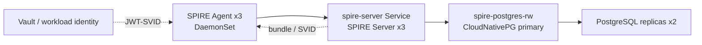

# Production HA: SPIRE và PostgreSQL trên K3s

## Phạm vi đã triển khai

K3s hiện có một control plane và hai worker. SPIRE dùng PostgreSQL riêng trong namespace `spire`; không dùng datastore SQLite và không dùng PostgreSQL của `his-hope-dev`.



- CloudNativePG operator: `1.30.0`.
- PostgreSQL: three instances, `local-path` PVC, anti-affinity across the three K3s nodes, PDB managed by CNPG.
- SPIRE Server: three replicas, anti-affinity, PDB `minAvailable: 2`.
- SPIRE datastore endpoint: `spire-postgres-rw.spire.svc.cluster.local`.
- Migration source: `his-hope-dev/postgres-0` database `spiredb`.
- Runtime database credential: Kubernetes Secret `spire-postgres-app`, generated at bootstrap and not committed to Git. For real production, replace this bootstrap with Vault/External Secrets injection.

## Artifact

- `k8s/production-ha/spire-postgres-cluster.yaml`: CNPG cluster.
- `k8s/production-ha/spire-postgres-network-policy.yaml`: SPIRE, CNPG replication, and operator status access.
- `k8s/production-ha/spire-server-ha-patch.yaml`: SPIRE Server replicas/resources/anti-affinity.
- `k8s/production-ha/spire-server-production-datastore-patch.yaml`: production datastore host and secret.
- `k8s/production-ha/spire-server-pdb.yaml`: disruption budget.
- `k8s/overlays/prod-spire/kustomization.yaml`: deployable SPIRE HA overlay.
- `scripts/migrate-spire-datastore.ps1`: dump/restore and table/registration count verification.
- `scripts/validate-production-ha-spire-k3s.ps1`: HA and failover gate.

## Thứ tự triển khai

```powershell
kubectl apply --server-side -f https://raw.githubusercontent.com/cloudnative-pg/cloudnative-pg/release-1.30/releases/cnpg-1.30.0.yaml
kubectl rollout status deployment/cnpg-controller-manager -n cnpg-system --timeout=180s

# Secret phải được tạo từ Vault/approved secret manager; không đưa password vào YAML.
kubectl create secret generic spire-postgres-app -n spire `
  --from-literal=username=spire_server `
  --from-literal=password=<runtime-secret> `
  --dry-run=client -o yaml | kubectl apply -f -

kubectl kustomize k8s/overlays/prod-spire --load-restrictor LoadRestrictionsNone |
  kubectl apply --server-side --force-conflicts -f -
pwsh -NoProfile -File scripts/migrate-spire-datastore.ps1
pwsh -NoProfile -File scripts/validate-production-ha-spire-k3s.ps1
```

Migration phải hoàn tất trước khi rollout SPIRE Server production. Không xóa `his-hope-dev/postgres-0` cho đến khi có backup và restore test độc lập.

## Failover test

1. Ghi lại `status.currentPrimary` của CNPG.
2. Xóa đúng pod primary bằng `kubectl delete pod <primary> -n spire --wait=false`.
3. Chờ pod biến mất và `Cluster in healthy state`.
4. Xác nhận `currentPrimary` đổi sang replica, `spire-postgres-rw` chỉ trỏ vào primary mới.
5. Xác nhận SPIRE Server/Agent đều ready và không còn lỗi datastore/bundle trong log.

Kết quả local acceptance hiện tại: CNPG 3/3, SPIRE Server 3/3, Agent 3/3, PDB và failover đã PASS.

## Gate chưa sign-off

Namespace `his-hope` chưa được rollout toàn bộ workload production vì còn một
gate ngoài cluster:

- image đã được pin bằng RepoDigest thật và không còn `sha256:000...`, nhưng
- CSI driver/provider và SecretProviderClass production đã có; Vault HA dùng
  Azure Key Vault auto-unseal, TLS và `vault-active` đã có 3 endpoint ready.
- CNPG Barman Cloud plugin, MinIO object store, WAL archiving, ScheduledBackup
  và retention đã được cấu hình; smoke backup thật đã completed.

Do đó kết quả trên là **SPIRE/PostgreSQL HA, Vault HA/auto-unseal và backup
acceptance trên K3s local**. Chưa thể sign-off image supply-chain cho tới khi
release registry và Cosign signing identity được cung cấp.
