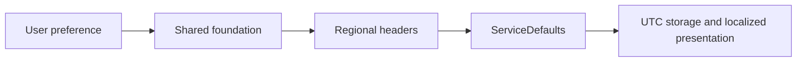

# His.Hope regionalization standard

This is the shared contract for every backend service, Angular application and Capacitor mobile application.

| Concern | Standard | Default |
|---|---|---|
| Language | BCP-47 | `vi-VN` |
| English language | BCP-47 | `en-US` |
| Time zone | IANA identifier | `Asia/Ho_Chi_Minh` |
| API timestamps | ISO-8601/RFC3339 UTC (`DateTimeOffset`) | UTC |
| Currency | ISO 4217 alphabetic code | `VND` |
| Money | decimal arithmetic, never binary floating point | `decimal` |

## HTTP contract

Clients send these headers on API requests:

```http
Accept-Language: vi-VN
X-Timezone: Asia/Ho_Chi_Minh
X-Currency: VND
```

The backend `His.Hope.ServiceDefaults` module applies the supported culture list, response `Content-Language`, and validated timezone/currency metadata to every service using the standard pipeline. Invalid hints fall back to configured defaults.

## Implementation rules

- Persist and exchange instants in UTC. Use `DateTimeOffset` for contracts and `DateTime.UtcNow` only where an existing persistence model requires `DateTime`.
- Convert to a user's IANA timezone at the presentation seam only.
- Use `Intl.DateTimeFormat` and `Intl.NumberFormat` through the shared foundations; do not call `toLocaleDateString()` inside feature pages.
- Currency values use `decimal` on the backend and numeric values with an explicit ISO currency code in transport models. Never use `double` for money.
- Translation keys and labels are presentation data; role and permission identifiers remain stable machine values.
- New locales require a backend supported-culture entry and dictionaries in the frontend foundation before being enabled.

## Mobile and browser parity

The Angular interceptor exported by the frontend foundation adds the three headers automatically. Mobile native HTTP adapters must preserve the same headers across the Capacitor bridge and use the mobile foundation formatters.



## Verification checklist

- `vi-VN` and `en-US` requests return the expected `Content-Language`.
- Invalid timezone/currency values fall back to configured defaults.
- API timestamps remain UTC/RFC3339 regardless of device locale.
- The same amount renders according to the selected ISO currency in Angular and native mobile.

## Database localization catalog

The identity database now owns the shared catalog tables:

- `asp_net_users.preferred_language` stores the user's BCP-47 preference.
- `localization_resources` stores stable keys such as `common.approved`.
- `localization_translations` stores one value per resource and locale with a composite key `(resource_key, locale)`.

Dynamic translations can be read through:

```http
GET /api/v1/localization?key=common.approved&key=common.pending
Accept-Language: en-US
```

The endpoint returns the requested locale first and falls back to `vi-VN`. Domain text entered by a patient or clinician is not automatically translated and remains in its original language. Each business service that owns translatable reference data should add the same catalog pattern to its own database rather than creating cross-service foreign keys.

The IdentityService migration `SeedMobileAdminLocalization` seeds the baseline mobile-admin catalog for `vi-VN` and `en-US`, including navigation, common actions, MFA/passkey states, and LDAP/SAML provider labels. Clients should use the stable keys (for example `mobile.nav.home` and `mobile.mfa.createPasskey`) rather than embedding translated text in feature code.

## UI text boundary

New UI text in `mobile-app` and `admin-app` must be added to the dictionaries exported by `@his-hope/frontend-foundation` and rendered through `HisHopeTranslatePipe` or `HisHopeI18nService`. The repository gate is `npm run validate:i18n`; it rejects newly added hardcoded labels, messages, titles, placeholders, and visible template text in those apps. Technical identifiers, routes, API values, permission codes, and domain data are not translated.
