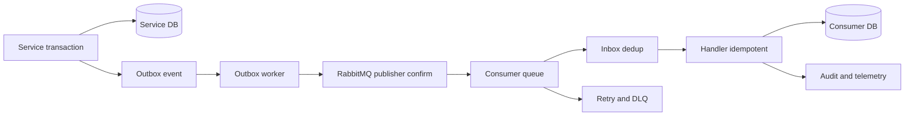

# His.Hope Reliable Platform — P0 đến P2

Tài liệu này là hợp đồng triển khai reliability dùng chung cho các microservice. Mục tiêu là đạt các building block tương đương về hành vi với Dapr nhưng không buộc Identity/OIDC hoặc clinical write path phải chạy qua sidecar.

## Luồng chuẩn

## P0 — bắt buộc trước production

- Mọi event qua `EventEnvelope` phải có `Id`, `EventType`, payload không rỗng, `OccurredAt`, `SchemaVersion` hợp lệ.
- Outbox SQL/in-memory validate envelope trước khi ghi. Publisher RabbitMQ bật persistent message và publisher confirms.
- RabbitMQ truyền `hishop-schema-version`, correlation, causation và custom headers; payload quá lớn bị reject trước khi publish.
- Consumer dedup qua `IInboxStore` trước side effect; lỗi handler release inbox để retry, duplicate completed delivery bị bỏ qua.
- Retry có giới hạn và DLQ; không retry vô hạn. Không ghi payload/PHI vào log.

## P1 — độ bền và vận hành đa replica

- Durable jobs dùng Redis Streams consumer group, visibility timeout, retry/dead-letter và redrive.
- Saga persistence dùng CockroachDB; recovery có distributed lock.
- Fencing token của lock được cấp bằng Redis `INCR` dùng chung giữa các replica, không dùng counter trong process.
- Vault/secret provider phải cấp credential qua workload identity/token ngắn hạn; secret rotation không được hard-code trong service. `VaultTransitClient` đọc qua `IOptionsMonitor`, vì vậy token/address có thể reload theo provider cấu hình mà không cần restart service.
- Khi chạy nhiều replica, queue consumer và outbox worker phải được quan sát bằng backlog, retry, DLQ, oldest age và publish latency.

## P2 — compatibility, scale và thay đổi an toàn

- `EventSchemaRegistry` là seam để bounded context đăng ký version tối đa; consumer reject schema mới trước side effect.
- Partition key dùng header `hishop-partition-key`; event cần ordering phải giữ cùng key trong cùng stream/queue policy.
- Fencing token phải được downstream kiểm tra khi ghi tài nguyên có nguy cơ stale-writer.
- Mỗi service mới dùng `AddHisHopeServicePlatform`, outbox/inbox, correlation middleware, OpenTelemetry và security contract; không tự tạo transport client riêng.

## Validation gate

| Gate | Kết quả yêu cầu |
|---|---|
| Contract/unit | Event envelope/schema, inbox duplicate/release, durable job retry/dead-letter, fencing semantics pass |
| Build | Shared messaging, EventBus, Infrastructure và service APIs build không lỗi |
| Security | API security contract pass; không secret/PHI trong log/event telemetry |
| Runtime | RabbitMQ confirm, retry/DLQ, Redis multi-replica fencing, DB outbox/inbox và chaos/failover test |
| Operations | Alert backlog/oldest age/DLQ, dashboard delivery, redrive có audit |

Unit/contract gate không thay thế runtime gate. Runtime gate phải chạy với Docker Compose/Testcontainers và được ghi nhận riêng trong release evidence.
