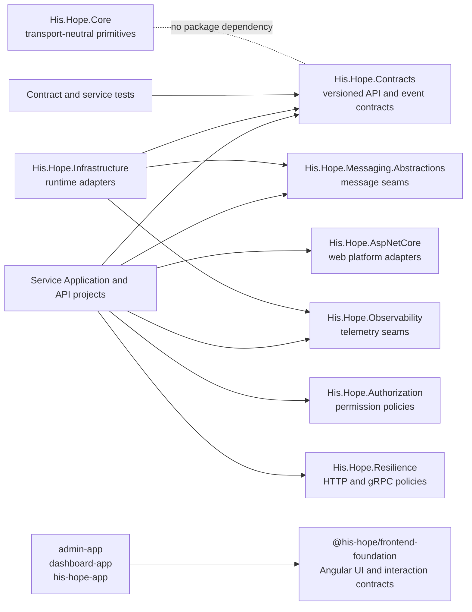

# Shared Platform Package Boundaries

This document describes the dependency boundary for the backend platform packages and the relationship to the shared Angular foundation. It reflects the current checkout and is intended to stay close to the project files that define the graph.

## Package Roles

| Package | Location | Owns | Must not own |
| --- | --- | --- | --- |
| `His.Hope.Core` | `src/Shared/Core/His.Hope.Core` | Stable, transport-neutral domain primitives and abstractions | REST DTOs, gRPC messages, pagination, query parsing, problem details, bulk-job contracts, event envelopes, framework or infrastructure code |
| `His.Hope.Contracts` | `src/Shared/Contracts/His.Hope.Contracts` | Versioned REST, gRPC, pagination, query, error, concurrency, bulk-job, and integration-event contracts | Domain implementation, persistence, web hosting, infrastructure, or a dependency on `His.Hope.Core` |
| `His.Hope.AspNetCore` | `src/Shared/AspNetCore/His.Hope.AspNetCore` | Auth, correlation, ProblemDetails, health and OpenAPI registration seams | Domain rules, persistence, messaging transports or service-specific endpoints |
| `His.Hope.Validation` | `src/Shared/Validation/His.Hope.Validation` | FluentValidation registration, MediatR behavior and HTTP validation error contract | Service-owned validators or domain rules |
| `His.Hope.Authorization` | `src/Shared/Authorization/His.Hope.Authorization` | Permission policies, role fallback mapping and authorization attributes | Persistence, token issuance or service-specific policy data |
| `His.Hope.Resilience` | `src/Shared/Resilience/His.Hope.Resilience` | Shared Polly HTTP/gRPC retry, breaker, timeout and concurrency policy shape | Endpoint-specific client registration or business fallbacks |
| `His.Hope.ServiceDefaults` | `src/Shared/ServiceDefaults/His.Hope.ServiceDefaults` | Golden-path host composition, validation errors, OpenAPI and live/ready health endpoints | Domain authorization, database/broker checks or service endpoints |
| `His.Hope.Messaging.Abstractions` | `src/Shared/Messaging/His.Hope.Messaging.Abstractions` | Event envelope, outbox/inbox, idempotency and durable-job interfaces | RabbitMQ/Redis/EF Core implementation details |
| `His.Hope.Messaging` | `src/Shared/Messaging/His.Hope.Messaging` | Reference in-memory adapters for tests and local development | Production durability guarantees; use infrastructure adapters in production |
| `His.Hope.Observability` | `src/Shared/Observability/His.Hope.Observability` | Tracing, metrics, structured logging and audit sink seams | Vendor-specific exporters or PHI persistence policy |
| `His.Hope.Observability.OpenTelemetry` | `src/Shared/Observability/His.Hope.Observability.OpenTelemetry` | Standard instrumentation and configuration-driven OTLP/Prometheus exporters | Vendor credentials and deployment endpoint ownership |
| `His.Hope.Persistence` | `src/Shared/Persistence/His.Hope.Persistence` | Explicit EF Core migration runner contract | Automatic web-startup migrations by default |
| `His.Hope.Messaging.RabbitMq` | `src/Shared/Messaging/His.Hope.Messaging.RabbitMq` | Durable RabbitMQ `IMessagePublisher` adapter | Outbox scheduling, domain event decisions or in-memory production fallback |
| `His.Hope.Messaging.Redis` | `src/Shared/Messaging/His.Hope.Messaging.Redis` | Durable Redis idempotency and job stores | Redis connection ownership or application-specific job payloads |
| `His.Hope.Messaging.Sql` | `src/Shared/Messaging/His.Hope.Messaging.Sql` | EF Core SQL outbox, inbox and idempotency stores | Database provider selection and migration scheduling |
| `His.Hope.Infrastructure` | `src/Shared/Infrastructure/His.Hope.Infrastructure` | Runtime adapters, persistence, messaging, observability, and middleware | New transport or domain contracts that belong in Core or Contracts |
| `@his-hope/frontend-foundation` | `shared/frontend-foundation` | Angular UI primitives, tokens, styles, i18n, and frontend interaction contracts | Backend DTOs, API client implementations, or domain rules |

## Dependency Graph

The graph below shows the platform boundary and the important direct consumers. An arrow means "may depend on". The two backend contract packages are leaves; their consumers point inward toward them.



Current direct `Contracts` consumers include the service application projects, selected service APIs, FHIR application code, shared infrastructure, and contract tests. `Core` currently has no direct consumers and no source files beyond its project README and project file. The frontend foundation is a separate TypeScript package graph and does not reference either .NET package.

## Enforced Rules

These rules are checked by `scripts/validate-shared-platform-boundaries.ps1`:

1. `His.Hope.Core` is a leaf package. Its project file must contain no `ProjectReference` or `PackageReference`.
2. `His.Hope.Contracts` is a leaf package. Its project file must contain no `ProjectReference` or `PackageReference`.
3. Core source must not import `His.Hope.Contracts`; Contracts source must not import `His.Hope.Core`. This prevents source-level coupling even if a project reference is hidden or later removed.
4. Both packages target `net8.0`, matching the current shared backend target framework.
5. Contract consumers may depend on `His.Hope.Contracts`, but transport adapters and infrastructure remain at the edge. New shared implementation dependencies belong in a separate package rather than being added to either leaf.

The validator intentionally does not require every existing consumer to migrate from a local `ProjectReference` to a NuGet `PackageReference`; the checkout currently builds the shared packages from source. It enforces the package-owned side of the boundary without changing production projects.

## Migration Status

The current checkout has migrated the HTTP host bootstrap to the shared platform
packages:

| Host group | Migrated packages | Integration point |
| --- | --- | --- |
| Appointment, Billing, Clinical, FHIR Gateway, Identity, Lab, Patient, Pharmacy APIs | `His.Hope.ServiceDefaults` plus `His.Hope.Messaging.Abstractions` | `AddHisHopeServiceDefaults`, `UseHisHopeServiceDefaults`, `MapHisHopeHealthEndpoints` |
| Regular BFFs | Same packages through `His.Hope.Bff.Core` | `AddBffCore`, `UseBffCoreMiddleware` |
| System Dashboard BFF | `His.Hope.AspNetCore`, `His.Hope.Contracts`, `His.Hope.Messaging.Abstractions`, `His.Hope.Observability` | Shared host bootstrap and JWT registration |
| API Gateway | `His.Hope.AspNetCore`, `His.Hope.Contracts`, `His.Hope.Messaging.Abstractions`, `His.Hope.Observability` | Shared host bootstrap |

The services still use project references during the migration. The packages are
versioned at `1.0.0` and can be packed, but a production rollout should consume
them from an internal NuGet feed with an explicit promotion policy.

## Production Readiness Boundary

This package split is structurally ready for the next migration phase, but it is
not by itself a production certification. Before production approval, the
following gates remain mandatory:

- Bind `His.Hope.Messaging.Abstractions` to the durable RabbitMQ/Redis/SQL
  adapters. `His.Hope.Messaging.RabbitMq`, `His.Hope.Messaging.Redis` and
  `His.Hope.Messaging.Sql` are now package-owned implementations and are
  registered by `AddHisHopeEnterpriseInfrastructure`. SQL is opt-in through
  `Messaging:Sql:Enabled` and uses the explicit persistence migration runner.
  The in-memory package is excluded from production release.
- Identity now uses a durable database-backed audit sink and production startup
  fails closed when no `IDurableAuditSink` is registered. Other services still
  need an explicit durable sink if they emit audit records.
- JWT validation is consumed from `His.Hope.AspNetCore`; permission policy
  registration is now consumed from `His.Hope.Authorization`. Token issuance
  and revocation storage remain service/infrastructure concerns.
- HTTP/gRPC resilience policy shape is consumed from `His.Hope.Resilience` by
  service APIs and the System Dashboard BFF. The old Infrastructure resilience
  implementation remains only for downstream compatibility and is no longer a
  host registration path.
- Migration execution is explicit through `His.Hope.Persistence`; deployment
  jobs own when and where migrations run.
- OpenTelemetry exporter registration is available through
  `His.Hope.Observability.OpenTelemetry`; hosts own endpoint configuration.
- Add package-feed release automation, API compatibility checks, SBOM/signing,
  and a changelog for each versioned package.
- Add database migration/resiliency conventions and production Testcontainers
  coverage for outbox, inbox, Redis, and key-management paths.

The boundary validator and solution build are required checks for every package
migration. They verify dependency shape and compilation, not the production
adapter gates above.

The API host convention gate is `scripts/validate-api-platform-conventions.ps1`.
It currently enforces shared validation registration and middleware, shared host
bootstrap, observability registration, and prevents local MediatR validation
behavior drift across all eight service APIs.

## Change Procedure

When a new shared type is proposed, classify it first:

- Put transport-neutral domain primitives in `His.Hope.Core`.
- Put wire-facing DTOs, pagination/query/error/concurrency/bulk/event shapes in `His.Hope.Contracts`.
- Put serialization, HTTP, gRPC, persistence, messaging, and hosting behavior in an adapter or infrastructure package.
- Put cross-application Angular UI, styles, i18n, and interaction behavior in `@his-hope/frontend-foundation`.

Run the boundary check from the repository root:

```powershell
pwsh -NoProfile -File scripts/validate-shared-platform-boundaries.ps1
```
