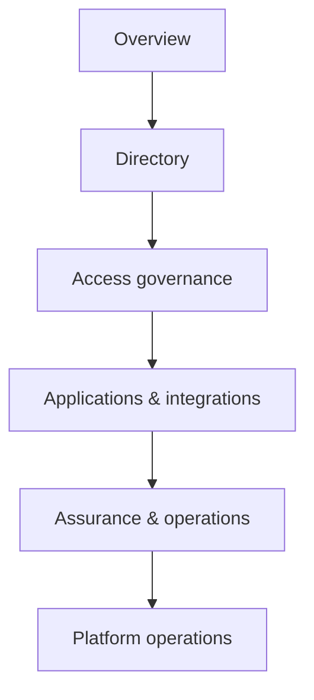

# Information architecture Identity Service cho Admin-app

Cập nhật: 2026-08-14

## Mục tiêu

Admin-app được tổ chức theo trách nhiệm vận hành của Identity Control Plane,
không theo tên bảng hoặc tên adapter. Menu chỉ là UX projection; Identity
Service và domain service vẫn là PEP/PDP và source-of-truth.

## Mô hình menu chuẩn hóa

| Nhóm menu | Routes hiện tại | Chức năng hệ thống | Persona chính | Permission hint |
|---|---|---|---|---|
| Overview | `/dashboard` | health, adoption và quick links; không chỉnh entitlement | mọi operator | authenticated |
| Directory | `/users`, `/roles`, `/consents` | identity lifecycle, role/template và delegated consent | identity/access administrator | `admin.users.read`, `admin.roles.read` |
| Access governance | `/access-management` | effective access, ABAC policy, request/approval, SoD, review, break-glass, audit | access/security administrator | `admin.policy.simulate` |
| Applications & integrations | `/clients`, `/security-providers` | OAuth/OIDC client, federation, SCIM/Google/Entra adapter posture | application/integration operator | `admin.clients.read`, `admin.settings.read` |
| Assurance & operations | `/identity-capabilities`, `/identity-operations`, `/mobile-operations` | mTLS/device posture, provisioning/SSF outbox, sessions, MFA, import và incident response | security/identity operator | `admin.settings.read`, `admin.users.read` |
| Platform operations | `/database-platform` | database continuity/capacity; không trộn với entitlement administration | platform operator | `admin.settings.read` |

## Phân hóa theo BigTech

- Google Cloud: Directory tương ứng workforce identity; Access governance tách
  role/action khỏi boundary; Assurance hiển thị device/context evidence.
- Microsoft Entra: Directory + Access governance phản ánh Administrative Units,
  entitlement packages, access reviews và PIM/JIT; không coi `Admin` là quyền
  toàn tenant.
- Okta: Applications & integrations giữ client/audience/scope và provider
  lifecycle; consent là delegated grant, không phải role assignment.
- AWS IAM Identity Center: Roles là permission-set template versioned; Access
  governance hiển thị assignment scope, session/expiry và evidence.
- Auth0/FGA: Access governance là RBAC/ABAC workbench; ReBAC/OpenFGA chỉ xuất
  hiện dưới simulation/shadow, không đưa relationship graph vào JWT hoặc menu
  vận hành thường ngày.

## Quy tắc UX và authorization

1. Section/item dùng `hhTranslate`, theme tokens và shared foundation; không có
   hard-coded màu hoặc label chỉ tiếng Việt.
2. Khi permission snapshot chưa tải, menu vẫn discoverable; route guard/API
   policy vẫn fail-closed. Khi snapshot đã usable, item không thuộc scope bị
   ẩn để tránh điều hướng tới 403 không cần thiết.
3. Menu không hiển thị secret, token, private key, raw attestation, raw SET hay
   provider assertion.
4. Các thao tác rủi ro cao vẫn hiển thị trong trang đúng scope nhưng yêu cầu
   MFA, maker-checker, expiry và audit ở server.
5. Command palette dùng cùng route IDs với menu để không tạo đường tắt vượt
   permission boundary.

## Evidence triển khai

- Menu model: `admin-app/src/app/app.component.ts`.
- Grouped navigation: `admin-app/src/app/app.component.html`.
- Theme-aware section label: `admin-app/src/app/app.component.scss`.
- EN/vi-VN labels: `shared/frontend-foundation/src/i18n/dictionaries/en.ts` và
  `vi-vn.ts`.
- Build Admin-app: pass.
- Admin-app tests: `13/13` pass.
- Shared foundation tests: `54/54` pass.
