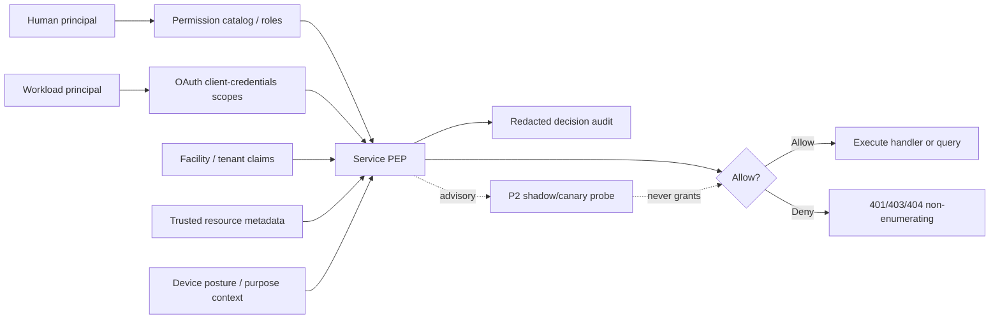
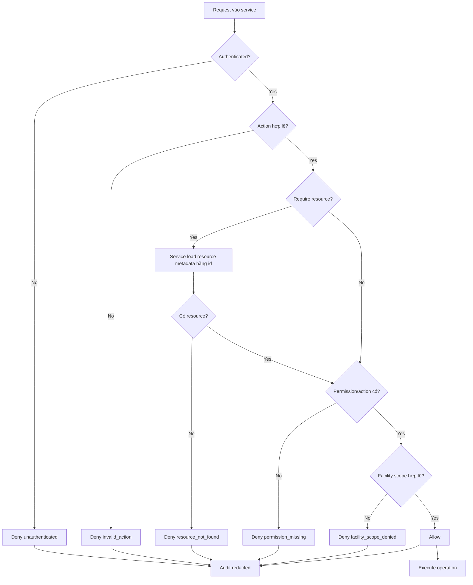
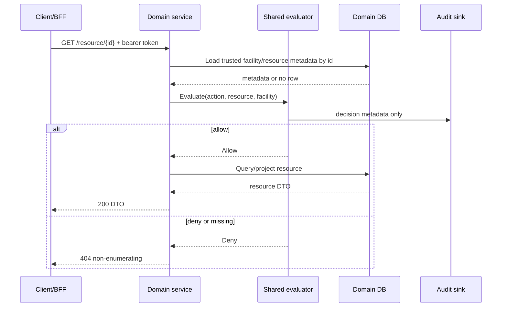
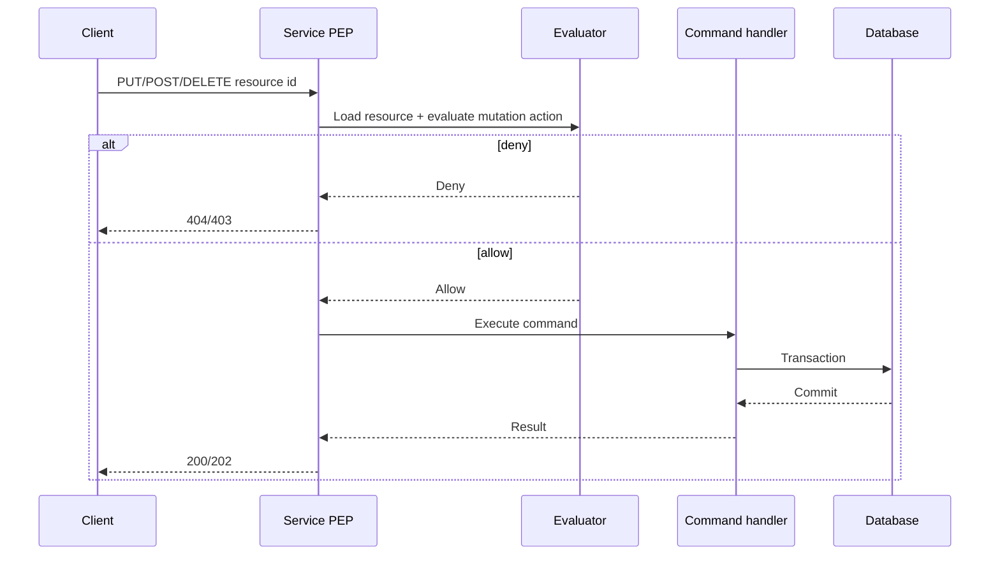
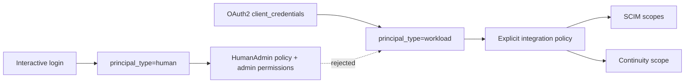
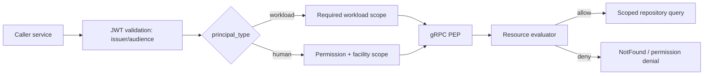
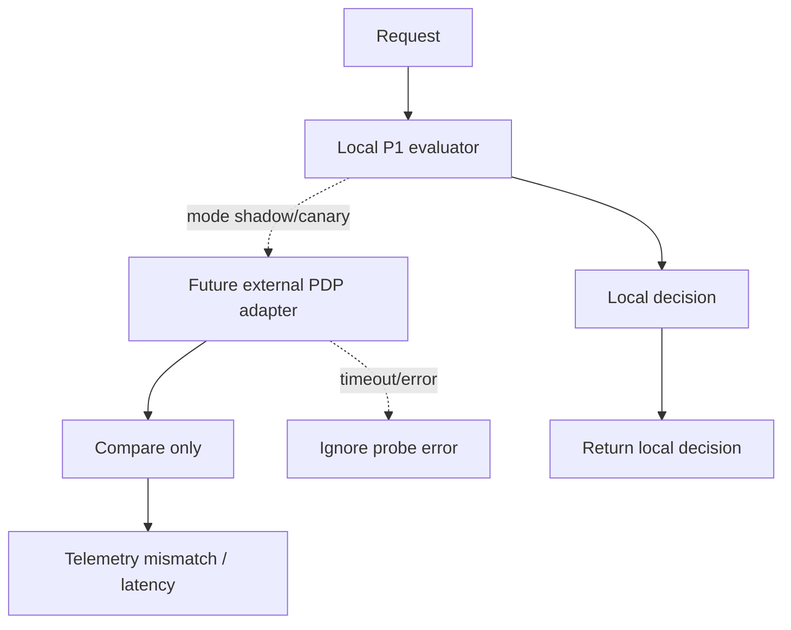
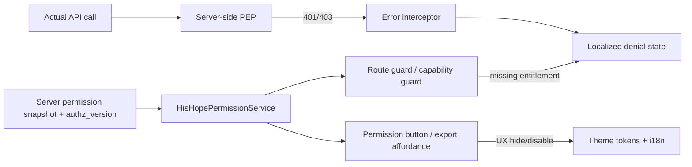

# Fine-grained RBAC — kiến trúc, flow và vận hành

## 1. Mục tiêu và nguyên tắc

Fine-grained RBAC của His.Hope dùng RBAC làm entitlement nền, sau đó thêm
resource-aware checks và facility/tenant scope ở chính service sở hữu dữ liệu.
Frontend chỉ điều khiển affordance; quyết định server-side là security boundary.

Các nguyên tắc bắt buộc:

- deny-by-default và fail-closed;
- không tin `facilityId`, tenant hoặc resource metadata từ request body;
- service sở hữu resource phải load metadata trước khi mutation/read nhạy cảm;
- cross-facility denial dùng response không tiết lộ resource (`404` ở domain API);
- mọi decision có audit metadata đã redaction, không ghi PHI, token hay canonical id;
- human và workload principal tách biệt; workload không kế thừa quyền admin tương tác;
- P2 shadow/canary chỉ quan sát, không bao giờ tự grant.

## 2. Mô hình quyền

### Authorization context

`AuthorizationContext` gồm principal, action, trusted `AuthorizationResource`,
purpose/device/emergency context và các cờ `RequireResource`/
`ResourceLookupFailed`. Resource gồm type, canonical id, tenant, facility,
sensitivity và lifecycle state.

`AuthorizationEvaluator` xử lý theo thứ tự:

1. principal đã authenticated chưa;
2. action có hợp lệ không;
3. resource bắt buộc có tồn tại không;
4. resource lookup có thất bại không;
5. principal có permission/action không;
6. principal có facility scope không;
7. nếu tất cả pass thì allow.

## 3. Request flow theo loại operation

### Read-by-id

### Mutation

Mutation phải evaluate trước khi mediator/handler thay đổi dữ liệu. `facilityId`
từ body không được dùng để cấp quyền.

### List/search

List/search không load từng row để quyết định. Service tạo `FacilityAccessScope`
từ principal, truyền scope vào repository và partition cache key theo scope.
Scope rỗng với principal không có cross-facility access phải trả empty result.

## 4. Human và workload principal

`HumanAdmin` áp dụng cho Identity admin surface. Workload token có admin
permission nhưng thiếu principal type human vẫn bị từ chối.

## 5. gRPC và service-to-service

gRPC methods áp dụng cùng evaluator trước repository/mediator access. Metadata
scope phải được truyền xuyên từ request context đến repository; không coi nội
bộ network là trusted boundary.

## 6. P2 shadow/canary

P2 hiện là seam an toàn, chưa phải external PDP runtime. `AUTHZ_PDP_MODE`:

| Mode | Hành vi |
|---|---|
| `disabled` | Chỉ local P1 evaluator |
| `shadow` | Ghi coarse telemetry để so sánh PDP sau này; local decision authoritative |
| `canary` | Hiện vẫn non-granting, fail-closed như shadow |

Không bật `stepup/deny` cho clinical production chỉ từ posture shadow. Promotion
P2 cần model tests `Check`/`ListObjects`, negative tenant/hierarchy cases,
timeout chaos, tuple reconciliation và rollback về P1.

## 7. Frontend foundation flow

Frontend không được dùng để suy luận resource authorization. Guard/button chỉ
tối ưu UX; server vẫn kiểm tra permission, scope, resource và facility.

Các ứng dụng admin/dashboard dùng trực tiếp interceptor chung của foundation.
Clinical app còn giữ interceptor legacy vì có audit/snackbar/session behavior
riêng, nhưng interceptor này đã bridge 401/403 vào `HisHopePermissionService`
với cùng failure state; do đó không tạo thêm một permission model thứ hai.

## 8. Audit và observability

Decision audit nên chứa: `decisionId`, status, action, reason code, resource
type, subject hash/identifier theo chính sách, tenant/facility scope và
correlation id. Không ghi canonical resource id, PHI, raw claims, bearer token
hoặc policy internals.

Các metric nên theo dõi:

- allow/deny theo action/resource type/reason code;
- cross-facility denial và resource lookup failure;
- shadow mismatch rate, latency, timeout;
- stale permission snapshot và authz version mismatch;
- workload token scope/audience rejection.

## 9. Verification matrix

| Gate | Evidence hiện có |
|---|---|
| Shared evaluator | Authorization tests **26/26** |
| Domain application | **267/267** |
| HTTP read resource/facility | **12/12** |
| gRPC read resource/facility | **12/12** |
| Mutation cross-facility | **6/6** |
| FHIR direct boundary | **7/7** |
| SCIM workload boundary | **9/9** |
| Frontend foundation | Karma **54/54** |
| Dashboard | Karma **34/34** |
| Main frontend | Jest **73 suites / 480 tests** |
| Docker runtime | Compose smoke + live UI endpoints pass |
| K8s runtime | dev/staging/prod Kustomize validation pass |

Các gate chưa thể claim trong môi trường hiện tại: live client-credentials với
Vault/secret thật, external PDP/OpenFGA, chaos PDP/PIP, Google/Entra/SSF/mTLS/
RADIUS/Chrome/Windows vendor labs.

## 10. Rollout và rollback

1. Deploy với local P1 evaluator và `AUTHZ_PDP_MODE=disabled`.
2. Enable `shadow` ở staging, quan sát mismatch và không grant theo PDP.
3. Chỉ pilot bounded domain, có owner và rollback switch.
4. Nếu PDP lỗi hoặc mismatch tăng: chuyển `disabled`; quyền local P1 không đổi.
5. Chỉ production canary sau khi live gates, security review và clinical safety
   sign-off hoàn tất.
