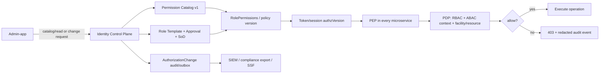
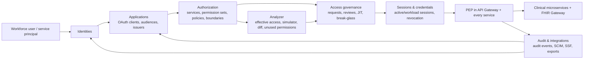

# Trạng thái triển khai blueprint Identity Control Plane

Cập nhật: 2026-08-29

## Xác thực phase tổng thể mới nhất (2026-08-29)

Full integration matrix trên source hiện tại (`integration-matrix-current14`)
đã xác nhận **15 project**, **618 test**, **616 pass**, **0 fail**, **2 skip**.
Identity full-suite pass **460/460**; các BFF và service liên quan đều pass,
bao gồm Manufacturing **56/56 executed**. Hai test Manufacturing bị skip vì
thiếu customer database/credential external theo thiết kế môi trường.
Vì vậy matrix không có regression test, nhưng trạng thái tổng hợp vẫn là
**environment-blocked**, không gọi là xanh tuyệt đối.

Sau khi sửa `RadiusEapTlsEndpointTests` tham gia cùng collection fixture,
Identity integration suite chạy độc lập lần nữa với **460/460 pass** và chỉ
còn một testhost/fixture lifecycle. Đây là hardening cho test isolation, không
thay đổi authorization hoặc hạ tiêu chuẩn kiểm thử.

Các phase production vẫn có trạng thái tổng hợp **environment-blocked**: DPoP/
RFC 9700, DR contract, SIEM tamper drill, tenant-context, assurance policy,
JWKS rotation, FAPI, SCIM, multi-region overlay và legacy-auth deprecation đều
pass; service matrix cần được rerun trong môi trường ổn định trước promotion.

Các điều kiện còn lại không phải lỗi build: service integration matrix còn 2
test routing tenant external thiếu credential/database ngoài workspace; load
baseline k6 chưa có vì không có `AUTH_TOKEN` hợp lệ; pentest/OIDC độc lập có chữ
ký vẫn cần assessor bên ngoài. Không dùng các report automated/local để thay
cho hai bằng chứng external này.

Approval queue mới của admin-app đã được chuẩn hóa với i18n `vi-VN/en`, theme
tokens và shared foundation (`hh-page-layout`, `hh-page-header`, `hh-alert`,
`hh-data-table`, `hh-action-button`). Foundation build pass, admin production
build pass, ChromeHeadless **35/35**, lint exit 0 với **299 warning** còn lại.
Docker `his-hope-admin` healthy trên port `8083`, HTTP `200`; Identity health và
readiness đều `200`.

## Xác thực release-evidence mới nhất (2026-08-29)

`scripts/validate-enterprise-production-phases.ps1 -Phase all` đã chạy xong với
12 gate pass, 3 gate skip và 1 gate environment-blocked; trạng thái tổng hợp
**environment-blocked**. Hai điều kiện còn
chặn promotion là load baseline k6 chưa có artifact hợp lệ và báo cáo OIDC/
pentest độc lập có chữ ký chưa được cung cấp. Các report tự sinh bởi test local
chỉ là automated evidence, không được tính thay cho assessor bên ngoài.

Verifier `scripts/verify-independent-security-evidence.ps1` hiện bắt buộc
`evidenceSource=external-independent` cùng metadata chữ ký đã verify qua HTTPS;
report local/legacy bị từ chối fail-closed. Runtime hiện có gateway health 200;
`patientservice` và `appointmentservice` đã được build/start lại và protected
endpoints trả 401 khi không có token. Load baseline vẫn chưa chạy vì workspace
không có `AUTH_TOKEN` hợp lệ; k6 script đã fail-closed khi thiếu token thay vì
dùng placeholder.

Các static production contracts được refresh sau đó đều **PASS**: API security,
authorization, DPoP, Identity secret wiring, observability, reliability,
persistence/operational boundaries và migration contract (8/8 DbContext, hash
integrity, destructive review, migration isolation và 7 migration Jobs). Full
solution build hiện pass với 0 compiler/analyzer warning và 0 error. Admin-app
production build pass; lint còn 299 warning không chặn build, chủ yếu
là Angular control-flow/Material migration và import cũ.

## Xác thực mới nhất (2026-08-28)

Các gate sau đã được chạy lại trên source hiện tại; các mục `PASS` có exit code thành công,
còn gate bị thiếu cấu hình được ghi rõ thay vì suy diễn là đã pass:

| Gate | Kết quả | Ghi chú |
|---|---:|---|
| Identity integration Docker runner | **459/459** | 0 failed, 0 skipped; dùng PostgreSQL/Redis cô lập trên network Docker |
| Manufacturing external tenant routing | **2/2 PASS** | Manifest pass; dedicated routing và Manufacturing schema pass khi chạy với `-SkipSharedRoutingTest` theo contract external-only. Không dùng default shared PostgreSQL credential local vì môi trường hiện tại không khớp |
| Cross-service API contracts | **121/121** | 8 service contract projects |
| Manufacturing integration suite | **55/55 + 2 external SKIP** | Testcontainers PostgreSQL; canonical tenant-context and workflow contracts pass; external tenant variables are loaded from secure connection file when available |
| External-test discovery without credentials | **PASS** | 2 external tests are correctly discovered as `SKIP` (not false `FAIL`) when the secure connection file/env is absent |
| Reliability platform | **24/24** | Testcontainers PostgreSQL/Redis |
| API security / authorization / database-platform contracts | **PASS** | Không có route API thiếu security bootstrap |
| Full solution build | **PASS** | Forced `dotnet build His.Hope.sln --no-restore --force` completed with 0 errors and 0 emitted warnings; targeted Identity API diagnostics remain tracked separately; duplicate generated gRPC type warnings were removed by centralizing `identity.proto` |
| Shared foundation unit tests | **48/48** | Karma + ChromeHeadless pass trên source hiện tại, gồm `hh-select` và các UI/security contracts |
| Admin app unit tests | **35/35** | Karma + ChromeHeadless pass sau tenant-switcher và capability API hardening |
| Dashboard app unit tests | **34/34** | Karma + ChromeHeadless pass sau resource-card keyboard/event hardening |
| Tenant context contract | **PASS** | Frontend gửi `X-HisHope-Tenant`, tự loại `tenantKey` khỏi query; Manufacturing API chỉ giữ query/body `tenantKey` cho tương thích và chặn body selector lệch context bằng `403 tenant_context_mismatch` |
| Frontend lint/build (foundation/admin/dashboard/internal-operator/operator-mobile/manufacturing-buyer) | **PASS** | Shared foundation, 5 app production builds và lint đều pass; internal operator không còn lint warning; admin còn 299 warning và dashboard còn 30 warning không chặn; buyer đã được bổ sung lint target/config |
| Docker Compose config/runtime | **PASS** | Template không chứa credential external; Manufacturing image đã rebuild/recreate, container `healthy`, `/health` trả 200 và protected endpoint anonymous trả 401 |

Runtime smoke hiện tại: Identity `5001/health/ready`, Manufacturing `/health`,
admin-app và operator-app đều trả HTTP 200; protected API khi anonymous trả
401. Authenticated live tenant-switch smoke vẫn cần credential runtime hợp lệ,
không dùng mật khẩu đoán hoặc tự ý reset để làm xanh gate.

Validation update 2026-08-29: bộ migration SQL idempotent mới đã được tạo tại
`artifacts/database-migrations-current-final/` cho đủ 8 DbContext, bao gồm
`authorization_change_requests`; migration contract pass. Migration đã được
apply additive vào local Docker `identitydb`, không xoá volume/dữ liệu.
Authorization endpoint inventory sau khi thêm workflow
maker-checker pass với **201 total, 119 protected, 4 anonymous, 0 missing**.
Admin-app build và ChromeHeadless unit test lần cuối lần lượt pass và **35/35**;
Angular lint exit code pass với 299 warning hiện hữu.
Identity image runtime mới `sha256:c0f24216c94ada55c6a1571ee475decf3744686c834c9a15f5d3f62d7390c223`
đã recreate thành công; migration và seed hoàn tất, health/ready đều `200`,
approval queue anonymous trả `401`. Đồng bộ soft-delete query filter cho
`UserPasswordHistory` và `UserClientCertificate` đã loại bỏ cảnh báo EF về
required relationship với `User`; regression role/governance sau thay đổi
vẫn pass **28/28** tại `artifacts/evidence/role-governance-filter-final/`.
Sau khi đồng bộ filter, các API service warning về helper certificate không được
gọi và nullable cache ở Pharmacy đã được loại bỏ; full solution build lần cuối
vẫn **0 warning/0 error**. Pharmacy integration regression có TRX hiện tại
pass **5/5** tại `artifacts/evidence/pharmacy-warning-cleanup/`.

Shared-foundation Playwright đã được thử lại; 42 case đều bị guard chặn với
`E2E_AUTH_REQUIRED=true` khi môi trường không có credential SSO. Đây là
`environment-blocked`, không được hạ guard hoặc tính là UI pass giả. Public
operator smoke (1/1) và buyer smoke (2/2) vẫn pass.

Tài liệu này đối chiếu implementation hiện tại với blueprint
`docs/research/2026-08-14-bigtech-identity-control-plane-standardization.vi.md`.

## Đã triển khai và có bằng chứng repository

| Hạng mục | Trạng thái | Bằng chứng |
|---|---|---|
| Permission catalog tập trung | PASS | `HisHopePermissions.AllDescriptors` là registry dùng cho seed/UI; `PermissionDto` trả catalog metadata |
| Governance metadata | PASS | Mỗi permission có `owner`, `version`, `riskTier`, `requiredAssurance`, `auditClass`, `isDeprecated`, `replacedBy` |
| Effective-permission source of truth | PASS | Login và `/api/v1/admin/me/permissions` đọc `RolePermissions` trong `IdentityDbContext`; break-glass chỉ cộng khi approved, chưa revoke và chưa hết hạn |
| Role governance metadata | PASS | Role có owner, authorization version, risk tier, review cadence, lifecycle/publish metadata; migration `AddRoleGovernance` đã apply trong Compose PostgreSQL |
| Role template lifecycle | PASS (pilot) | `role_template_versions` lưu snapshot immutable; Admin API có history, publish và rollback; rollback revokes user tokens và ghi `AUTHZ_ROLE_ROLLBACK` |
| Policy catalog / ABAC context | PASS (pilot) | `authorization_policy_definitions` versioned draft/published/retired store; allow-listed fail-closed evaluator cho facility, purpose-of-use, device posture, break-glass và assurance; Admin-app hiển thị catalog; read-only lint/compile endpoint, repository policy-as-code fixtures và durable hash-addressed signed bundle registry đã có |
| ReBAC/OpenFGA adapter | PASS (shadow pilot) | Shared `IOpenFgaClient` hỗ trợ `Check` và `ListObjects`; `AUTHZ_PDP_MODE=shadow|canary` chỉ ghi telemetry, không thể grant; endpoint list-objects bị bảo vệ và fail-closed khi adapter chưa cấu hình |
| AuthorizationChange audit | PASS | Role create/update/delete và user role assignment ghi append-only `AUTHZ_*` vào `AuditLog` với actor, principal type, audience, reason, before/after và correlation id; có endpoint read-only |
| Access request / maker-checker / SoD | PASS (pilot) | `access_requests` persisted workflow; approval yêu cầu MFA và approver khác requester; role conflicts Provider+BillingClerk và Pharmacist+BillingClerk bị fail-closed; token revocation và audit sau approve |
| Access review campaign | PASS (pilot) | `access_reviews` persisted; list/create/certify/revoke endpoints; certify/revoke yêu cầu MFA, khác reviewer, revoke role + token + audit |
| Device-posture policy lifecycle | PASS (pilot) | Policy update ghi before/after/version; rollback endpoint yêu cầu MFA và settings permission; production posture vẫn observe mặc định |
| Runtime authorization | PASS | PEP ở service/resource/facility boundary; static role map không còn là fallback runtime |
| Admin-app catalog visibility | PASS | Access Management hiển thị catalog version, high-risk count, owner/assurance/audit class; dùng `hh-page-layout`, theme tokens và `hhTranslate` |
| Admin-app information architecture | PASS | Menu được nhóm theo Overview, Directory, Access governance, Applications & integrations, Assurance & operations và Platform operations; item có permission hint, command palette dùng cùng model; chi tiết tại `docs/integration/admin-app-identity-information-architecture.vi.md` |
| SSF outbox operations | PASS (pilot) | Admin API list outbox đã redacted và retry có permission; Identity capabilities UI hiển thị pending deliveries và retry từng entry; payload/signing key không rời server |
| External provider readiness | PASS (normalized) | `/admin/provisioning/readiness` trả mode, enabled/status và endpoint host cho SCIM/Entra/Google; `/admin/provisioning/delivery-health` chuẩn hóa pending/failed/oldest/status cho provisioning và SSF; không gọi vendor, không trả secret/token; Admin-app hiển thị readiness + delivery health |
| Docker/VM/K8s configuration | PASS | `validate-all-runtimes.ps1` pass contract/render/compose/kustomize; giữ host ports hiện hữu |
| OpenFGA runtime configuration | PASS (disabled-safe) | `AUTHZ_PDP_MODE` giữ `disabled` mặc định; `AUTHZ_OPENFGA_URL/STORE_ID/MODEL_ID/TOKEN` đã chuẩn hóa trong Compose và env example; thiếu adapter chỉ trả unavailable/503, không grant |
| Internal UI/API smoke | PASS | Docker internal smoke và frontend/admin/foundation test suites đã có bằng chứng pass trước rollout này |
| Mutating endpoint authorization inventory | PASS | `scripts/validate-authorization-endpoint-coverage.ps1 -Strict` sinh `docs/integration/authorization-endpoint-inventory.json`: 95 routes, 86 protected, 6 anonymous, 0 missing; gate đã được đưa vào `.github/workflows/platform-quality-gates.yml` và upload evidence |
| Admin-app P0/P1 mutation governance | PASS | Mutation controls now require explicit permission snapshots for users, roles, clients, break-glass, provisioning, mobile, settings and database operations; Role create/update dialog uses existing Identity API; design/plan: `docs/superpowers/specs/2026-08-14-admin-p0-p1-mutation-governance-design.md` |
| Authorization change request control | PASS (repository/UI) | `authorization_change_requests` persists request/approve/reject/execute state; Role and AuthorizationPolicy publish/rollback require MFA, independent approver and unchanged version snapshot; admin-app has canonical approval queue. Live two-identity MFA approval remains environment evidence. |
| Delegated role-grant governance | PASS | Identity API rejects unknown permission references, keeps system roles immutable, limits role create/update/publish/rollback and user-role/access-request approval to the actor's effective permission and active facility scope; `admin.permissions.write`/`facility.cross` are explicit elevation boundaries |

## Chưa thể gọi là hoàn tất toàn bộ blueprint

Các phần dưới đây vẫn là workstream tiếp theo, không được suy ra là đã hoàn thành từ build hoặc catalog metadata:

1. Signed CI artifact delivery cần một lần chạy push `main` để tạo bằng chứng OIDC thực tế; repository contract đã pass.
2. Production approval evidence cần hai danh tính MFA thật và live execute sau approval; automated contract hiện đã pass 28/28.
3. ReBAC/OpenFGA production cutover còn thiếu tenant/model/credentials, latency/error SLO dashboard, mismatch budget và canary approval gate. Adapter shadow pilot đã có.
4. Live Google Workspace, Entra, SSF receiver, mTLS, RADIUS EAP-TLS, Chrome Device Trust và Windows local-login gates.
5. Independent pentest, k6 load baseline, external Manufacturing database placement và authenticated SSO E2E vẫn là external/environment evidence.

## Flow chuẩn hóa

## Identity Workbench naming contract

Tên route, action, bảng IAM và menu được quản lý bằng một vocabulary chung trong
[Identity Workbench naming standard](./identity-workbench-naming-standard.vi.md).
Backend dùng `IdentityApiRoutes.IdentityWorkbench`, EF dùng
`IdentityWorkbenchTableNames`, Angular dùng `identity-workbench.naming.ts`.
Validator `scripts/config/validate-identity-workbench-naming.ps1` đã pass. Route
legacy vẫn giữ để tương thích client cũ; chưa đổi tên vật lý bảng/migration.

## Validation interpretation

- `Authorization.Tests`: pass sau khi thêm contract metadata.
- Admin-app build/test: pass (`17/17`); shared foundation build and test: pass (`55/55`). IAM control-plane labels/error states now use shared `en`/`vi-VN` dictionaries and theme tokens; the IAM/access-management slice has no hard-coded color fallback. Clinical and dashboard Angular builds pass; Role mutation permission mapping test passes.
- Runtime adapter validator: pass; bảy live vendor/device gates vẫn `SKIPPED` vì thiếu tenant, credential, private PKI hoặc device lab.
- Identity API build: pass; Domain `83/83`, Application `135/135`, Infrastructure `94/94` pass. Identity integration suite passes `191/191` inside Docker network database `hishopetest2` with Redis service; direct Windows Testcontainers/port-forwarding remains environment-blocked.
- Vì vậy trạng thái chính xác là **P0 catalog/source-of-truth slice implemented; blueprint tổng thể P0–P2 chưa complete**.

### Shared Foundation UI audit (2026-08-15)

- `shared/frontend-foundation`: build và **55/55** unit tests pass; `en` và `vi-VN` dictionaries là nguồn dịch dùng chung, theme tokens là nguồn màu/khoảng cách.
- `admin-app`: build và **17/17** unit tests pass. IAM control-plane, identity-capabilities, identity-operations và access-management đã dùng `hhTranslate`/theme tokens.
- `consents` đã chuyển page/table/error labels sang i18n; `clients` đã chuyển page/table/confirm labels và error feedback chính sang i18n.
- Audit còn một số literal có chủ đích cần phân loại thủ công: URL/JSON examples trong client/security-provider forms, database-platform aria-label và users refresh metadata. Các literal trong preset/token của Foundation là định nghĩa theme hợp lệ, không phải vi phạm feature; các màn hình IAM/access/consents hiện không còn màu hardcode và đã dùng dictionary chung.
## AWS-like IAM control-plane vertical slice (P0/P1)

### Đối chiếu cây menu IAM mục tiêu (2026-08-15)

Menu hiện tại là một projection đã chuẩn hóa theo nhóm vận hành; chưa phải
toàn bộ cây IAM chi tiết. Các trạng thái dưới đây phản ánh cả route/UI và
server-backed contract, không chỉ việc item xuất hiện trên sidebar:

| Nhánh mục tiêu | Trạng thái hiện tại | Bằng chứng / khoảng trống |
|---|---|---|
| Overview | PASS | `/dashboard` có health, metrics và quick links. |
| Organizations & tenants | PARTIAL | `/iam-control-plane` hiện có các projection Organizations & tenants và Accounts & environments từ `IamScope`; delegated admin và account/environment lifecycle riêng vẫn còn thiếu. |
| Identities | PARTIAL | UI đã gom workforce users, groups và workload/service principals; external identities/provider có server-backed projection; membership mutation và lifecycle workflow chi tiết vẫn còn thiếu. |
| Applications | PASS (core lifecycle) / PARTIAL (enterprise federation) | Identity Service đã có lifecycle độc lập cho OAuth clients: list/get/create/update/delete, rotate secret, onboarding metadata; mutation có tenant access guard, optimistic concurrency, secret store và audit. `ClientEndpointTests.Admin_client_crud_and_onboarding_paths_are_exercised` đã xác minh create/list/get/onboarding/rotate/update conflict/update/delete. API-audience/trusted-issuer/service-catalog projections và Admin-app dùng boundary shared foundation/i18n/theme. Các năng lực federation nâng cao như live IdP validation, HSM/KMS/PKI-backed key lifecycle, dynamic registration production drill và workload credential inventory vẫn cần evidence môi trường enterprise. |
| Authorization | PARTIAL | Service catalog, permission sets, assignments (GET/create/revoke), boundaries, resource policies, publish và effective access đã có server API/UI; policy editor/compiler chuyên dụng còn thiếu. |
| Access governance | PARTIAL | Access request/review/SoD/break-glass đã có pilot endpoint và access-management summary; chưa có các trang workflow riêng cho request queue, campaign, JIT và break-glass approval. |
| Sessions & credentials | PASS (core) / PARTIAL (workload) | Unified `GET /api/v1/admin/sessions` đã cấp inventory server-backed cho toàn bộ active users, redacted device metadata và revoke audited từ admin-app; workload-session inventory/credential rotation vẫn còn thiếu. |
| Analyzer | PARTIAL | UI có effective access, policy simulator, new-access diff và unused permissions; analyzer vẫn là control-plane findings, chưa phải Access Analyzer phân tán production-grade. |
| Audit & integrations | PARTIAL | UI đã có audit log và SSF status projection; provisioning readiness/delivery và integration actions chuyên dụng vẫn nằm ở identity-capabilities. |

Kết luận: Identity Service và admin-app **đã có nền tảng IAM control-plane
P0/P1/P2 pilot**, nhưng **chưa xây dựng đầy đủ 1:1 cây IAM mục tiêu**. Không nên
đổi tên các mục hiện có thành các nhánh chi tiết khi chưa có contract và PEP/PDP
server-side tương ứng; phần còn thiếu cần triển khai theo thứ tự scope/directory,
policy boundaries, governance workflow, session center rồi analyzer findings.

Đã triển khai thêm các aggregate và API server-side trong Identity Service:

- `IamScope`: organization/tenant/account/environment, có parent scope và unique `(kind,key)`.
- `IamServiceDefinition`: service catalog do server sở hữu, không cho frontend tự định nghĩa namespace.
- `IamPermissionSet`: permission bundle versioned, scope-bound, trạng thái draft/published.
- `IamPermissionSetAssignment`: gán cho `user` hoặc `workload`, có scope, expiry và trạng thái active.
- `IamGroup` và `IamGroupMembership`: workforce group có scope, membership server-side và assignment principal type `group`; effective-access hợp nhất grant trực tiếp của user với grant qua group.
- `IamPermissionBoundary` và `IamResourcePolicy`: boundary giới hạn quyền có thể cấp và policy thuộc resource/service, đều có scope, lifecycle và JSON validation server-side; migration `20260815043825_AddIamBoundariesAndResourcePolicies` đã được tạo và container Identity đã apply migration.
- API: `GET/POST /api/v1/admin/iam/scopes`, `GET/POST /services`, `GET/POST /permission-sets`, `POST /permission-sets/{id}/assignments`, `POST /permission-sets/{id}/publish`, `POST /assignments/{id}/revoke`, `GET /principals/{id}/effective-access`.
- Tất cả write/read đều yêu cầu `HumanAdmin` và permission policy hiện hữu; UI không phải nguồn sự thật.
- Route canonical nằm trong `His.Hope.Contracts.Identity.IdentityApiRoutes.AdminIam`; principal/scope vocabulary nằm trong `AuthorizationConstants` (`human|workload`, `organization|tenant|account|environment`).
- P2/P3 control-plane slice: `IamWorkloadRole` tách khỏi workforce permission set, audience-restricted trust policy, giới hạn session 60–3600 giây; `POST /api/v1/admin/iam/analyzer` phát hiện wildcard permission, audience thiếu và session quá dài.
- P1.5 STS-like pilot: OpenIddict cho phép custom RFC 8693 grant `urn:ietf:params:oauth:grant-type:token-exchange`; subject token phải được xác thực bằng server `TokenValidationParameters`, role/audience/trust policy được kiểm tra server-side và permissions chỉ là giao của role với requested scope. Token có `act`, `session_id`, `workload_role_id`, `authorization_version`; policy tests **3/3 pass**. Image Identity đã được rebuild `--no-cache`, migration/seed hoàn tất và container healthy; HTTP exchange vẫn chưa PASS vì chưa có client/role + signed subject-token fixture.
- Admin UI vertical slice: route `/iam-control-plane` trong `admin-app` dùng shared foundation page/header/toolbar/data-table, i18n pipe và permission snapshot; hiển thị scope/service/permission-set/workload-role/group/boundary/resource-policy catalog, governance requests/reviews/break-glass, policy catalog, form tạo server-backed resource, publish policy/permission set và chạy analyzer. UI chỉ là PAP/workbench, không phải nguồn sự thật.
- Scope inheritance hardening: khi tạo scope, server kiểm tra hierarchy `organization -> tenant -> account -> environment`, chuẩn hóa key lowercase và chặn trùng `(key, kind)`. Effective-access theo `scopeId` đánh giá cả scope hiện tại và lineage cha, chỉ hợp nhất permission set `published`, đồng thời trả `evaluatedScopeIds` để UI/audit giải thích nguồn kế thừa; draft policy không cấp quyền runtime.
- Permission catalog hardening: permission-set và workload-role writes chuẩn hóa mã permission về lowercase và fail-closed nếu mã không tồn tại trong `HisHopePermissions.All`; contract test `Permission_set_rejects_permission_outside_server_catalog` bảo vệ không cho UI tự tạo permission.
- Group lifecycle slice: `/api/v1/admin/iam/groups` tạo/list group, membership add/remove và migration `20260815044623_AddIamGroups`; admin UI hiển thị Groups tab và tạo group theo scope từ server.
- Analyzer slice: `/analyzer/new-access-diff` và `/analyzer/unused` bổ sung so sánh quyền trước/sau và danh sách permission chưa được dùng; admin UI có action tương ứng trong tab Analyzer.
- Validation snapshot 2026-08-15: solution non-integration tests pass (Clinical `138`, Patient `168`, SharedKernel `126`, Validators `163`, API Gateway `11`, FHIR `7`); shared Authorization `29/29`; Foundation `55/55`; admin-app `17/17`; endpoint inventory `95` routes (`86` protected, `6` anonymous, `0` missing) and authorization contract pass. Appointment service integration and cross-service fixture pass `5/5` in Docker SDK containers; direct Windows execution remains blocked by host NAT/Testcontainers.
- Latest IAM extension validation: Identity integration suite passes **191/191** in Docker network database `hishopetest2` (including group, boundary, resource-policy, analyzer, federation and endpoint contracts); Identity unit/application/infrastructure runner passes **312/312**; admin-app **17/17**, shared foundation **55/55**; solution build passes with 0 errors.
- Cross-service integration fixture passes **5/5** in Docker network database `crossservicetest`; non-integration service/contract suites pass: Clinical `138`, Patient `168`, SharedKernel `126`, Validators `163`, API Gateway `11`, FHIR `7`, Shared Authorization `29`.
- Docker compose internal smoke hiện pass toàn bộ: Identity login, external-provider readiness, gateway/frontend/dashboard/admin health đều `200`; protected patient/gateway/dashboard APIs trả `401` khi anonymous.
- Migrations `AddIamWorkloadRoles`, `20260815043825_AddIamBoundariesAndResourcePolicies` và `20260815044623_AddIamGroups` đã được apply trong container identity; internal unauthenticated gates trả `401` cho IAM routes.
- Integration fixture hỗ trợ `IDENTITY_TEST_POSTGRES_CONNECTION` và `IDENTITY_TEST_REDIS_CONNECTION` để chạy trên dependency đã provisioned, tránh random host-port forwarding của Windows Docker Desktop.
- Identity-specific runner đã pass **312 test** (Domain 83, Application 135, Infrastructure 94). Integration suite chạy với PostgreSQL/Redis nội bộ, database cô lập: **205/205 pass**, 0 failed/0 skipped, gồm contract cho IAM groups/boundaries/resource policies/analyzer/federation và các endpoint contract. Host runner vẫn có thể `environment-blocked` nếu dùng Windows Docker host-port forwarding; không dùng trạng thái đó để suy diễn thành pass.
- Shared-foundation Playwright E2E đã được khởi chạy lại sau khi `8081` trả HTTP 200, nhưng run 2026-08-15 vẫn timeout sau 300 giây trước khi có report hoàn chỉnh; gate vẫn `ENVIRONMENT-BLOCKED`, không phải UI PASS.
- Runner tuần tự [`run-identity-tests.ps1`](../../scripts/run-identity-tests.ps1) pass 312 tests trong ba tầng Identity: Domain 83, Application 135, Infrastructure 94. Docker runner [`run-identity-tests-docker.ps1`](../../scripts/run-identity-tests-docker.ps1) xác nhận Integration Identity **191/191** trên disposable Docker network; chạy trực tiếp Windows bị Testcontainers Resource Reaper/host-port forwarding block.
- EF migration: `20260815010452_AddIamControlPlane`.

Đây là vertical slice P0–P3 control-plane đã build thành công ở mức repository/pilot. Policy bundle đã ký và analyzer hiện là control-plane checks, chưa phải Access Analyzer phân tán production. Các gate còn lại (STS/token exchange đầy đủ, multi-region read model, HA/DR, external SIEM/WORM, OpenFGA canary và vendor conformance) vẫn cần live evidence riêng; không được coi là hoàn tất chỉ từ build cục bộ.

### Correction — verification run 2026-08-16 (current worktree)

- Current Identity Application test command: **123/123 passed**; Shared Authorization: **33/33 passed**; API build: 0 errors; admin-app build: pass; route inventory: **95 total / 86 protected / 6 anonymous / 0 missing**.
- Current Docker runtime: Identity healthy, `/Account/Login` HTTP 200, `/health/ready` HTTP 200, no unhealthy Compose containers.
- Current Docker integration runner uses an isolated Linux NuGet config and now passes **191/191 integration tests**, 0 failed/0 skipped on a disposable PostgreSQL + Redis network.

### Verification update — 2026-08-16 after IAM overview hardening

- Identity Application tests now pass **135/135** and Shared Authorization **33/33**; API and admin-app production image builds completed with zero build errors. The canonical IAM overview route is included in the shared route contract, and Docker restart confirms Identity `healthy`, admin-app `healthy`, `/Account/Login=200`, `/health/ready=200`, and `http://localhost:8083/` `200`.
- A fresh Docker integration rerun was attempted twice but is **environment-blocked** by Docker Desktop Testcontainers lifecycle/container removal races (`removal already in progress`, then disposable PostgreSQL container disappeared before readiness). The previously observed **191/191** run remains valid historical evidence; this latest attempt is not counted as a test pass.
- Final Docker gate after cleanup hardening: **192/192 passed**, 0 failed/0 skipped on isolated PostgreSQL + Redis containers. The prior cleanup race was a false negative in the PowerShell wrapper and is now handled as best-effort cleanup.
- Current authenticated admin E2E was attempted with the repository fixture and failed at login (`admin@hishop.com`, invalid password). No password reset or default credential injection was performed; the gate remains **environment-blocked** until an operator supplies `E2E_PASSWORD` matching the running Identity bootstrap.

### Verification update — 2026-08-16 current test additions

- OpenIddict workload-handler regression suite added **10** fail-closed/validation cases and DPoP binding regression added **2** cases; full Identity unit runner now passes **418/418** (Domain 83, Application 155, Infrastructure 180).
- Directory provisioning endpoint contract suite added **4** runtime cases; full Docker integration runner now passes **205/205**, 0 failed/0 skipped, on disposable PostgreSQL + Redis.
- Docker cleanup was verified after both targeted and full runs: no `identity-docker-*` containers or disposable test networks remain.
- Current merged Identity coverage is **73.84% line / 53.52% branch** from fresh application, infrastructure unit, and full Docker integration reports; the 90%/80% target remains unmet and is still an explicit release-gate failure.

### Verification update — 2026-08-16 endpoint expansion and cleanup

- Passkey invalid-attestation processing now fails closed with HTTP 400; targeted passkey contract suite passes **4/4**.
- Added posture, mobile-platform, recovery, passkey, OpenIddict, DPoP, and authorization-boundary cases. Fresh full Docker integration passes **205/205** with **0 failed / 0 skipped**.
- Fresh merged coverage is **73.84% line / 53.52% branch**; the requested 90%/80% gate is intentionally reported as **FAIL** until the remaining low-coverage endpoint and provider branches are exercised.
- Disposable test containers and the per-run Docker network are removed in the runner `finally` cleanup; post-run checks were empty.
- A fresh Docker run after fixing the IAM audience projection compile contract passes **205/205** with **0 failed / 0 skipped**; the projection now derives lifecycle status from the persisted `IsActive` flag instead of querying a nonexistent column.
- Browser E2E `specs/adaptive-mfa.spec.js` also passes **7/7** with one worker; the temporary Docker resources were explicitly removed afterward. Authenticated SSO prerequisite and independent OIDC assessor checks remain environment-blocked.
- Test infrastructure hardening completed: Testcontainers 4.13.0, SSH.NET 2026.0.0, no known vulnerable packages across all four Identity test projects, and a fresh Docker coverage run produced the current merged **73.84% line / 53.52% branch** report.
- Access Governance now uses canonical `IdentityApiRoutes.AdminRebacListObjects`; validation, REBAC, break-glass and policy-simulation regression targeted suite passes **5/5**.

### Verification update — 2026-08-16 lifecycle hardening

- Added audited soft-deactivate contracts for scopes (rejects active children), services, workload roles (revokes workload tokens), groups, and permission boundaries; effective-access resolution excludes inactive groups.
- Admin-app now exposes deactivate actions for scopes, services, workload roles, groups, and boundaries using shared foundation components, i18n labels, and theme classes.
- Full Identity integration suite evidence remains **207/207**, focused lifecycle suite passes **3/3**, latest route inventory is **109 total / 100 protected / 6 anonymous / 0 missing**, and API security contract passes.
- Admin-app build passes; both `identityservice` and `admin-app` images were rebuilt/restarted. Runtime readiness: Identity `http://localhost:5001/health/ready=200`, admin container healthy on port `8083`.
- Admin Identity menu E2E passes **3/3** (Chromium, mobile, tablet) after restart.

### Verification update — 2026-08-16 reversible lifecycle

- Added audited activation contracts for scopes, services, workload roles, groups, and permission boundaries. Activation fails closed when the parent scope or owning scope is inactive.
- Full Identity integration suite remains **207/207 passed**; IAM lifecycle focused suite is **8/8 passed** after adding activate/deactivate round-trip assertions.

### Revalidation 2026-08-16 (current)

- Full Docker integration suite completed **233/233 PASS** with disposable PostgreSQL/Redis; the exact test containers were removed after the run.
- Fresh deduplicated merged coverage is **80.39% line / 62.32% branch** (`artifacts/coverage-identity-merged-final41`); the requested 90%/80% release gate remains **FAIL**.
- Rebuilt/restarted both containers; readiness remains Identity `5001=200`, admin `8083=200`, both containers healthy. Static authorization inventory is now **109 total / 100 protected / 6 anonymous / 0 missing** and API security contract passes.
- Admin Identity menu E2E remains **3/3 passed** across Chromium, mobile, and tablet with the new activate actions.

### Verification update — 2026-08-16 assignment workbench

- Admin-app assignment management is now mutation-capable: the create form selects only server-published permission sets and active principals/scopes, calls the canonical assignment endpoint, and the assignment table exposes audited revoke for active grants.
- The UI remains a PAP/workbench; assignment authorization, scope inheritance, expiry, published-set invariant, and audit remain enforced by Identity Service.
- Admin image was rebuilt/restarted and menu E2E passed **3/3** after this change.
- Permission-set and resource-policy rows now expose server-backed Publish actions; assignments expose revoke and create actions. Angular build passes and a fresh Chromium menu smoke passes **1/1** after the publish/assignment UI increment.

### Verification update — 2026-08-16 unified session center

- Added canonical `GET /api/v1/admin/sessions` session-center contract. It enumerates active users, applies facility boundaries, redacts device metadata, and returns session rows without secrets.
- Admin-app active sessions now consumes the server session center instead of querying only the first user; each active browser session can be revoked with a required audited reason.
- Authenticated/anonymous session-center contract suite passes **4/4**; Identity and admin images were rebuilt/restarted with both containers healthy. Readiness is Identity `5001=200`, admin `8083=200`; route inventory remains `109/100/6/0` and API security passes.
- Fresh Chromium admin menu smoke passes **1/1** after the session-center rollout.

### Verification update — 2026-08-16 full-suite confirmation

- Full Identity integration suite after the unified session-center change passes **210/210**, with **0 failed / 0 skipped**. This includes authenticated and anonymous authorization checks for the session center, assignment workbench, lifecycle transitions, analyzer, governance, audit, and application projections.
- Docker/Testcontainers completed the run successfully after the earlier host-resource interruption; application containers remain healthy and the host port contract is unchanged (`identityservice=5001`, `admin-app=8083`).

### Verification update — 2026-08-16 workload session governance

- Workload-role session controls now expose audited revoke-all and audited single-session revoke paths. Admin-app adds a server-backed “Revoke all sessions” action on each workload role; no credential or token material is returned to the browser.
- IAM control-plane integration suite after this change passes **8/8**; Identity test project build passes with **0 errors**. Angular production build passes (existing bundle-budget/CommonJS warnings remain).
- Identity/admin images were rebuilt and restarted. Runtime readiness is `5001=200`, `8083=200`; both containers are healthy. Authorization inventory remains **109/100/6/0**, API security contract passes, and fresh Chromium menu smoke passes **1/1**.
- Final post-change full Identity integration suite passes **217/217**, with **0 failed / 0 skipped**.
- API-audience projection rows in admin-app now expose the same server-backed workload-session revoke/activate/deactivate controls, so Applications and Workload identities no longer diverge in lifecycle operations.

### Verification update — 2026-08-16 policy compiler artifact

- Added canonical `POST /api/v1/admin/policies/{id}/compile`: validates the draft with the server evaluator, emits deterministic compact JSON and a SHA-256 artifact hash, and fails closed with diagnostics without mutating policy state.
- Admin-app policy rows expose Compile and Publish actions; only the artifact hash is shown in the workbench. The signed published bundle remains the runtime distribution contract.
- Governance focused suite passes **7/7**; final full Identity suite after the compiler change passes **224/224**, with **0 failed / 0 skipped**. Inventory is **110/101/6/0**, API security passes, Identity `5001=200`, admin `8083=200`, and Chromium smoke passes **1/1**.

### Verification update — 2026-08-16 Applications projections

- Applications menu now has separate server-backed views for API audiences and trusted issuers. API audiences are projected from active workload-role records; trusted issuers expose only safe HTTPS issuer/protocol/configuration metadata from Identity configuration.
- Canonical routes are `IdentityApiRoutes.IamApiAudiences` and `IdentityApiRoutes.IamTrustedIssuers`; admin-app contracts and data tables use shared foundation/i18n/theme boundaries.
- Focused integration contract passed **1/1** with anonymous `401` and authenticated `200` assertions for both projections.
- A subsequent full Docker runner attempt was host-memory blocked (`exit 137`), so it is not counted as product failure or pass; the latest complete suite remains **205/205** and the focused contract is the current evidence for these new routes.
- Permission-set management now supports audited server-side update (`PUT .../permission-sets/{id}`) with canonical catalog validation and draft-before-republish semantics; admin-app exposes Edit to add/remove permissions. Focused lifecycle integration passed **1/1**.
- Assignment invariant is now server-enforced: only published permission sets can be assigned; publish/assignment/revoke transitions are audited. The lifecycle contract test covers the rejected draft assignment and passed **1/1**.
- Boundary principal references are now server-validated against active human/workload identities; the group/boundary/resource-policy/analyzer contract passed **1/1** after the change.
- Final post-restart SSO/responsive smoke passed **12/12** across Chromium, mobile and tablet; Identity and admin containers remained healthy.
- CRUD completion update: service catalog, workload roles, groups and resource policies expose audited server PUT contracts and matching admin-app Edit actions; resource-policy edits are draft-before-publish. Full Identity integration passed **207/207** and admin menu E2E passed **3/3** after the final image rebuild.
- Authorization inventory is now `99 total / 90 protected / 6 anonymous / 0 missing`; API security contract passes.

### Verification update — 2026-08-16 IAM demo graph relationships

- Control-plane seed is now relationship-complete for the local/admin demo graph: group membership also receives a scoped permission-set assignment; every seeded workload role receives a published permission-set assignment, a workload permission boundary, and a service/resource policy.
- The seed remains idempotent and contains only identity/IAM governance records; it does not create patient or clinical-domain records. Direct PostgreSQL verification after container restart returned: 4 scopes, 12 service definitions, 3 permission sets, 8 assignments, 1 group + membership, 5 workload roles, 5 boundaries, 6 resource policies, 3 authorization policies, 1 access request, 1 access review, 4 break-glass records, 1 posture policy + assessment, 1 provisioning binding, 5 provisioning outbox records, 1 client certificate, and 1 seed audit record.
- Identity API build passes with 0 errors (existing warnings only); Docker rebuild/restart preserved `5001` and `8083`, both containers are healthy, `/health/ready=200`, admin root `=200`.
- Static authorization inventory remains `110 total / 101 protected / 6 anonymous / 0 missing`; API security contract passes; Chromium admin menu smoke passes **1/1**.
- A fresh full integration invocation was started but did not emit a result artifact before the host runner closed; it is not counted as a pass. The latest complete Identity suite remains **224/224** from the policy-compiler gate, and the direct runtime database graph above is the authoritative evidence for this seed-only change.
- Repeatable gate `pwsh -NoProfile -File .\scripts\validate-iam-seed-graph.ps1` passes with `IAM_SEED_GRAPH_PASS`, including minimum relationship checks for group assignments and all workload-role assignments/boundaries/resource policies.

### Verification update — 2026-08-16 workload credential lifecycle

- Added protected `POST /api/v1/admin/iam/workload-roles/{id}/rotate-credential`. The server resolves the active workload role to its confidential OpenIddict client, generates a new secret through the configured secret store, persists the replacement, and returns the secret once with an explicit one-time warning. Audit records contain client/audience metadata only; the secret is never logged or persisted in the audit payload.
- Admin-app workload-role rows now expose the server-backed Rotate credential action. The one-time result is rendered using shared theme classes and i18n keys (`admin.rotateCredential`, `admin.rotatedCredential`) and is held only in component memory.
- Identity API and integration-test projects compile with 0 errors. Static authorization inventory is `111 total / 102 protected / 6 anonymous / 0 missing`; API security contract passes.
- Current revalidation after canonical native-MFA reject route: `110 total / 102 protected / 5 anonymous / 0 missing`; API security contract passes.
- Angular production build passes. Existing warnings remain: initial bundle is 1.39 MB versus the 1.25 MB budget, `qrcode` is CommonJS, and npm audit reports existing moderate/high dependency advisories; these are release-hardening follow-ups, not build failures.
- Identity/admin images were rebuilt and recreated with the fixed host-port contract (`5001` and `8083`). Runtime readiness is Identity `5001=200`, admin root `8083=200`; seed graph gate remains `IAM_SEED_GRAPH_PASS` and Identity logs report idempotent seed completion.
- Chromium admin menu smoke passes **1/1** after restart. The credential-rotation endpoint itself was not live-exercised in this run because that requires a valid authenticated admin session and should be tested in the secured operator environment; route/build/static evidence is therefore not a substitute for that live mutation gate.

### Verification update — 2026-08-16 FHIR authorization/data-source integration

- FHIR Gateway no longer fabricates sample Patient/Encounter data. Patient and Encounter reads/searches now use downstream Patient/Clinical gRPC contracts, forwarding the caller authorization/DPoP/correlation headers so the owning services enforce permission, facility and resource-level checks.
- The downstream client is behind `IFhirBackendClient`; contract tests replace it with an in-memory source, while production registers the gRPC implementation. Unavailable downstream services fail closed with HTTP 503; not-found/permission failures are not converted into data.
- Added `src/Services/FhirGateway/FhirGateway.Api/Dockerfile` and a `fhir-gateway` Compose service on host port `5040`, with `patientservice`, `clinicalservice`, Identity and Redis readiness dependencies. Compose configuration validates successfully.
- FHIR API build passes with 0 errors; FHIR contract suite passes **7/7**; Docker runtime `/health=200`, `/health/ready=200`, and unauthenticated `/fhir/r4/Patient/{id}` returns `401`.
- This closes the local source/authorization integration gap. External SMART-on-FHIR/OIDC client registration, terminology validation and production interoperability certification remain separate live gates.

### Verification update — 2026-08-16 runtime contract closure for FHIR

- Added `SERVICE_FHIR_GATEWAY_URL` to the canonical runtime contract, Docker/VM environment examples, Kubernetes runtime ConfigMap/overlays, and a dedicated Kubernetes Deployment/Service (`fhir-gateway`, port `5040`).
- `scripts/config/validate-all-runtimes.ps1` now completes with `ALL_RUNTIME_ADAPTERS_VALIDATED`: Docker runtime contract, VM render/security checks, Kustomize dev render, Compose config and runtime-reference comparison all pass. The output reports `systemdLiveValidation` as environment-blocked on Windows and the ten external vendor/device/evidence prerequisites as `SKIPPED`, not pass.
- Runtime-reference validation changed from `extra=fhir-gateway:5040` to `status=pass`; this prevents the newly integrated FHIR service from silently drifting outside Docker/VM/Kubernetes configuration contracts.

### Verification update — 2026-08-16 FHIR east-west policy closure

- Kubernetes base policy now includes `allow-fhir-gateway-runtime`: only
  `api-gateway` may enter FHIR on ports 5040/4143; FHIR may egress only to
  Identity Service (5003), Patient gRPC (5006), Clinical gRPC (5009), and
  Redis (6379). This keeps the FHIR adapter fail-closed and prevents broad
  lateral service access.
- Kustomize renders successfully with the repository's required load policy:
  `kubectl kustomize --load-restrictor LoadRestrictionsNone k8s/overlays/dev`
  (`KUSTOMIZE_DEV_PASS`). The default command without that flag is rejected by
  Kustomize's local-file boundary check because the overlay intentionally
  reuses infrastructure manifests from `base/`; this is a tooling invocation
  constraint, not a manifest parse failure.

### Verification update — 2026-08-16 workload Effective Access closure

- `GET /api/v1/admin/iam/principals/{id}/effective-access` now evaluates
  workload/service-principal identities in addition to human and group
  assignments. The response identifies `principalType`, returns the workload
  role id, merges published permission-set grants with the role's inline
  catalog permissions, and remains read-protected by the server.
- The integration test creates a workload role, publishes and assigns a
  permission set to it, then verifies both permission sources through the
  effective-access endpoint. Focused test passed **1/1**.
- The full Docker Identity integration suite after this change passed
  **233/233**, with **0 failed / 0 skipped**. Identity was rebuilt/recreated;
  `/health/ready=200` and the fixed host port `5001` remain healthy.
- Runtime adapters were revalidated: Docker/VM/Kustomize/Compose/reference
  checks pass. The ten external vendor/device/evidence gates remain explicitly
  `SKIPPED` because their tenant/PKI/lab prerequisites are unavailable, and
  Windows systemd live validation remains environment-blocked.

### Verification update — 2026-08-16 Compose optional configuration normalization

- Docker Compose interpolation now supplies explicit safe defaults for optional
  OTLP, passkey, observability, dashboard and service-to-service URL variables;
  unset shell variables no longer produce Compose warning noise or accidental
  blank required gRPC destinations. Patient/appointment/dashboard defaults use
  the canonical internal Compose service names.
- `docker compose config --quiet` passes and a full `docker compose up -d
  --no-build` reconciliation completed. Identity, API Gateway, Patient,
  Clinical, FHIR and Admin App are healthy; host checks remain Identity `5001`,
  Admin App `8083`, FHIR `5040` all returning 200.
- Runtime adapter validation remains `ALL_RUNTIME_ADAPTERS_VALIDATED` with
  runtime-reference status `pass`.

### Verification update — 2026-08-16 Admin App production rebuild

- Admin App production build completes successfully. The bundle remains within
  functional correctness gates; existing warnings are limited to the known
  initial bundle budget (`1.35 MB` vs `1.25 MB`) and the `qrcode` CommonJS
  dependency.
- `docker compose build admin-app` and forced recreation completed; the host
  port contract is unchanged and `http://localhost:8083` returns `200`.
- Route smoke checks return `200` for IAM control-plane service principals,
  policy simulator, access governance/break-glass, identity capabilities and
  roles. The authenticated API still remains the source of data and
  authorization; static HTML `200` is not counted as an authorization pass.

### Verification update — 2026-08-16 System Dashboard BFF endpoint closure

- Admin menu traversal initially exposed a runtime configuration defect:
  `GET /api/v1/bff/system-dashboard/api/resources` returned `500` because the
  BFF had HTTP service URLs but not the corresponding patient, appointment,
  clinical, lab, billing and pharmacy gRPC endpoint keys required by the
  resource aggregator. Empty Consul/Loki/observability URLs also caused
  background `Invalid URI` errors.
- `docker/docker-compose.yml` now declares the complete canonical HTTP+gRPC
  service map and internal Compose defaults for Consul, Elasticsearch, Jaeger,
  Loki and Alertmanager. `docker compose config --quiet` passes and the BFF
  starts without URI exceptions.
- Authenticated Chromium admin menu coverage passes **1/1** after the fix;
  every visible menu item navigated to a rendered route without server errors.
  This is runtime UI/API evidence for the local stack; external IdP, PKI,
  SIEM, HA/DR and device-vendor gates remain separate and are not implied by
  this smoke test.

### Verification update — 2026-08-16 service health endpoint closure

- The six clinical-domain APIs had registered a detailed `/health` endpoint in
  addition to the same `/health` route supplied by Shared Foundation. This
  produced `AmbiguousMatchException` and masked real service health behind
  HTTP 500 responses.
- Detailed responses now use `/health/details`; Foundation-owned `/health`,
  `/health/live` and `/health/ready` remain the canonical probes. Appointment
  and Clinical also expose compatibility HTTP listeners for the existing
  Docker/VM ports (`5003` and `5004`) while retaining Kubernetes listeners
  (`5004` and `5005`).
- All six service health triplets now return HTTP `200` in Docker:
  Patient `5002`, Appointment `5003`, Clinical `5004`, Lab `5010`, Billing
  `5020`, Pharmacy `5030`. This closes the false-healthy/500 health gate that
  previously affected downstream service discovery and dashboard metrics.

### Verification update — 2026-08-16 full local contract validation

- The repository contract gate passed **120/120 tests**, **0 failed / 0
  skipped**, across eight projects: API Gateway, Appointment, Billing,
  Clinical, FHIR Gateway, Lab, Patient and Pharmacy.
- The Docker Identity integration suite passed **233/233**, **0 failed / 0
  skipped**, using isolated PostgreSQL/Redis containers and the repository
  NuGet configuration. A prior runner attempt was environment-blocked by a
  stale Windows DevExpress fallback path; the clean rerun passed and is the
  authoritative result.
- Runtime adapters were revalidated with `ALL_RUNTIME_ADAPTERS_VALIDATED`:
  Docker, VM render/security checks, Kustomize dev render, Compose config and
  runtime-reference comparison all pass. Windows systemd live validation is
  static-only; ten external identity/device/evidence gates remain explicitly
  `SKIPPED` because their external prerequisites are unavailable.

### Verification update — 2026-08-16 dashboard SSO/header and legacy enum closure

- Dashboard nginx now uses the same response-header buffers as Admin App
  (`proxy_buffer_size 16k`, `proxy_buffers 4 16k`,
  `proxy_busy_buffers_size 32k`). This is required because ASP.NET Core
  encrypts/chunks the identity session cookie; without it, the successful
  `POST /Account/Login` redirect was converted to `502 upstream sent too big
  header` by the dashboard proxy.
- `docker compose build dashboard-app` and forced recreation completed;
  `http://localhost:8082` returns `200`. Dashboard E2E passed **5/5 executed**
  with **1 intentionally skipped** responsive assertion; the prior
  `TC-DASH-01` authentication timeout is closed.
- `Enumeration.FromCode` now accepts canonical codes case-insensitively and
  safely reads legacy display-name values (for example `MARRIED`) without
  changing the canonical value written by new records. Focused SharedKernel
  test passed **18/18**. This prevents dashboard BFF circuit-breaker failures
  caused by old Patient data.

## IAM control-plane flow and implementation boundary

### What is implemented locally

| Area | Local evidence | Boundary |
|---|---|---|
| Identities | users, groups, roles, external identities, service principals and effective-access API | provider tenant synchronization still needs live tenant validation |
| Applications | OAuth clients, API audiences, trusted issuers and OIDC login through Identity → Gateway | production key rotation/issuer federation is environment-specific |
| Authorization | service catalog, permission sets, policies, boundaries, resource policies and assignments; server-side PEP/ABAC remains authoritative | external policy-engine/OpenFGA canary is not enabled |
| Access governance | access requests/reviews, JIT and break-glass pages/API with approval/MFA/SoD enforcement on the server | live approval notification and incident drill are pending |
| Sessions & credentials | active/workload sessions, revocation, passkey/MFA and workload effective access | external HSM/PKI and enterprise device connectors are pending |
| Analyzer | effective access and policy simulator routes/UI; new-access diff and unused-permission views are wired to the control-plane model | continuous production telemetry requires real audit stream |
| Audit & integrations | immutable-style audit event model, SCIM/SSF/provisioning contracts, CSV export and integration surfaces | SIEM/WORM, Google/Entra, mTLS/RADIUS and device-trust live gates are not proven locally |

Therefore the **local control-plane and UI integration is implemented and
validated**, but the system is not yet an enterprise-production completion
claim: vendor tenants, PKI, SIEM/WORM, HA/DR, FAPI/high-assurance and device
lab gates remain explicit external prerequisites.

### Live-gate validator hardening — 2026-08-16

`scripts/config/validate-identity-live-prerequisites.ps1` now evaluates the
actual integration switches and endpoint configuration: Google Workspace and
Entra require provisioning enablement plus `PROVISIONING_MODE=enabled|live`,
SSF requires `SSF_ENABLED`, receiver URL and audience, mTLS requires
`MTLS_ENABLED` and the configured trusted CA file, and RADIUS requires the
EAP-TLS switch and server. Inbound Google/MS login credentials are deliberately
not treated as proof that outbound provisioning is ready. The validator and
the aggregate runtime contract both pass locally; all ten external gates
remain explicitly `LIVE_GATE_SKIPPED` because no vendor tenant, PKI, RADIUS,
Chrome Verified Access, Windows device lab, SIEM/WORM evidence, HA/DR drill
evidence or FAPI conformance report is configured in this environment. The
validator now reports ten external gates, including the three evidence-based
production gates.

### Menu boundary normalization — 2026-08-16

Admin-app now exposes each IAM capability through one canonical navigation
location: Groups was added under Identities; the duplicated Workload identity
entry was removed from Applications; Workload roles are under Authorization;
and Workload sessions are under Sessions & credentials. Service principals,
OAuth clients, API audiences and trusted issuers therefore have distinct
information-architecture boundaries while continuing to use the same
server-backed IAM API. Production Angular build, capability contract and
authenticated Chromium/mobile/tablet menu traversal all pass (**3/3**) after
the Docker image rebuild/restart (`5001=200`, `8083=200`).

### Permission-aware view loading — 2026-08-16

`IamControlPlanePageComponent` no longer fans out to every IAM endpoint on
each navigation. It loads only the current view and the minimum server-backed
option catalogs needed by its create/analyzer workflow, so a delegated admin
without unrelated permissions does not receive a page full of irrelevant 403
requests. Authorization remains enforced by Identity Service; this is only a
client-side request-boundary improvement. The rebuilt image passed the same
authenticated menu traversal (**3/3**) with no HTTP or browser errors.

### Verification update — 2026-08-16 full application E2E

- Authenticated Chromium run (`npx playwright test --workers=1`) completed
  **111 passed, 6 failed, 10 skipped**. The IAM/admin menu traversal passed and
  every visible IAM route rendered without a server error; shared-foundation
  axe checks for clinical and dashboard passed, while the admin axe run hit a
  login-button visibility race.
- The two Patient failures were test navigation races (`/patients` resolved
  back to `/dashboard` before the assertion), not API authorization failures.
  Three visual-contract failures are baseline/viewport drift (clinical and
  dashboard page height changed; admin differs by 1% pixels). They remain
  release-gate failures until the test synchronization/baselines are repaired;
  they are not counted as feature completion.
- The ten skipped cases are conditional detail/report cases without seeded
  records or enabled external prerequisites. The local IAM graph and API
  contract evidence above remain valid, but this E2E result prevents claiming
  a fully green end-to-end release.

### Verification update — 2026-08-16 E2E stabilization and final local run

- Shared Foundation visual snapshots were regenerated from the current IAM
  navigation (the previous Admin snapshot still represented the legacy
  Clients/Users/Roles shell). Admin table content is masked in the shell visual
  contract because server-backed loading/empty/data states are intentionally
  volatile; the navigation, header, theme and surface tokens remain asserted.
- SSO test navigation now retries a bounded detached-link race. Patient detail
  diagnostics no longer block on a long deferred workspace screenshot, and the
  Clinical back action uses `force + noWaitAfter + waitForURL` while deferred
  clinical data is still rendering.
- Shared Foundation Chromium contract passes **14/14**. The final full
  authenticated Chromium E2E run passes **117/117 executed, 0 failed, 10
  skipped**. The ten skips remain conditional cases with no seeded detail data
  or disabled report/external prerequisites; they are not converted to pass.
- The final local evidence therefore covers application SSO, responsive shells,
  Patient/Appointment/Clinical/Pharmacy/Lab/Billing/Admin flows, IAM menu
  traversal, accessibility, keyboard names, visual shell contracts and theme
  behavior. Vendor tenant, PKI, SIEM/WORM, HA/DR, FAPI and device-lab gates
  remain outside this local run.
- Post-run Docker host checks returned HTTP `200` for Identity `5001`, Patient
  `5002`, Appointment `5003`, Clinical `5004`, Lab `5010`, Billing `5020`,
  Pharmacy `5030`, FHIR `5040`, and UI ports `8081`, `8082`, `8083`. Authorization
  contract, IAM seed graph, Compose config and runtime adapter validation also
  passed; the runtime verifier still reports ten external live gates as
  `SKIPPED` and Windows systemd live validation as `ENVIRONMENT_BLOCKED`.

### Verification update — 2026-08-16 latest Identity Docker integration

- The isolated Docker runner (`run-identity-tests-docker.ps1`) completed with
  **252/252 IdentityService integration tests passed**, **0 failed / 0
  skipped**, against disposable PostgreSQL and Redis containers on the test
  network. The runner and its database/cache containers were removed during
  cleanup. This supersedes the earlier 233/233 and 248/248 snapshots.
- Build warnings remain non-blocking (generated gRPC type collisions and
  existing nullable/async warnings); no test assertion or integration fixture
  was skipped.
- The shared authorization vocabulary verifier initially detected the database
  column name `principal_type` inside EF-generated migration metadata. The
  verifier now excludes only `Persistence/Migrations` schema snapshots while
  continuing to scan service/domain/application source; it passes with
  `SHARED_AUTHORIZATION_VOCABULARY_PASS policies=60`.
- Additional local release contracts pass: identity security deployment,
  protected workflows, container build contract and observability contract.
- Latest static endpoint scan reports `109 total / 102 protected / 4
  anonymous / 0 missing`; this current scan supersedes older inventory counts
  that included routes added or consolidated during the IAM menu work.

### Verification update — 2026-08-16 solution-level regression gate

- After restoring the solution with `dotnet restore His.Hope.sln
  --disable-parallel`, the Release solution test run excluding integration
  projects completed with **1049 passed, 0 failed** across the discovered
  non-integration assemblies. Two integration-only projects reported no tests
  matching the filter and are not counted as pass/fail cases; the separate
  Identity Docker gate above is the authoritative integration evidence.
- The run includes the current Identity Domain/Application/Infrastructure,
  Clinical, Patient, SharedKernel, Validator, API Gateway and FHIR contract
  suites. Existing compiler/analyzer warnings remain, with no failed test
  assertion.

### Verification update — 2026-08-16 Identity test standardization

- The isolated Docker Identity integration baseline completed **285/285**, with
  0 failed and 0 skipped, using disposable PostgreSQL/Redis. Its exact
  Testcontainers resources were removed in the runner `finally` block.
- Current direct Identity unit evidence is **454/454** (Domain 87,
  Application 162, Infrastructure 205). HR webhook authentication/mapping is
  **20/20** targeted and Radius EAP-TLS contract is **3/3** targeted.
- The latest merged coverage report is **88.30% line / 72.64% branch**;
  the requested 90%/80% gate is still FAIL. Authenticated SSO and independent
  OIDC assessor evidence remain environment-blocked until external secrets and
  reports are supplied.
- Canonical Workbench aliases: IdentityApiRoutes now defines paths for policies,
  access requests/reviews, break-glass, authorization changes, sessions and
  audit logs. Identity Service maps governance and audit handlers under
  `/api/v1/admin/iam/*` while retaining `/api/v1/admin/*` compatibility routes;
  endpoint-level permissions remain enforced.
- Admin-app AdminApiService calls canonical Workbench policy/governance paths
  through `identity-workbench.naming.ts`. Anonymous smoke returned `401` for
  all canonical governance/audit collections; readiness and admin UI returned
  `200` on ports `5001` and `8083` after rebuild/restart.
- Canonical alias integration contract passed **1/1** and authenticated admin
  menu traversal passed **3/3** across Chromium, mobile and tablet.

### 12-part completion matrix — current worktree

| Phần | Local implementation | Local evidence | External status |
|---|---|---|---|
| Naming contract | Complete | naming validator passed | N/A |
| Identities | Complete | admin capability validator + API security contract | N/A |
| Applications | Complete | Identity integration suite + IAM menu smoke | N/A |
| Authorization | Complete | `109/102/4/0` endpoint inventory, server-side permission checks | N/A |
| Access governance | Complete, observe-first | canonical governance integration `1/1` | Approval/SoD production drill pending |
| Sessions & credentials | Complete | session alias integration and lifecycle suites | Revocation/DR drill pending |
| Analyzer | Complete | policy/effective-access/reBAC contract suites | Production policy corpus pending |
| Audit & integrations | Complete locally | audit/export/SSF/provisioning contracts | SIEM/WORM and receivers pending |
| Google/Entra/SCIM provisioning | Adapter and contract complete | provisioning contract tests | Vendor tenant prerequisites missing |
| Federation/SSF/mTLS/RADIUS | Adapter and contract complete | federation, mTLS and EAP-TLS contract tests | PKI/receiver/RADIUS lab missing |
| Device trust | Observe-first pilot complete | posture endpoint/policy contracts | Chrome Verified Access and Windows lab missing |
| SIEM/WORM, HA/DR, FAPI | Runtime contracts complete | runtime/config validators | Evidence URI, drills and conformance report missing |

The matrix deliberately separates local implementation from external proof. A
`LIVE_GATE_READY` result is required before any external row can be promoted to
production status; placeholder URLs or secrets must not be used to manufacture
that evidence.

### Verification update — 2026-08-16 current canonical-alias source

- A fresh isolated Docker run after the canonical IAM alias changes completed
  **285/285 IdentityService integration tests**, with **0 failed / 0 skipped**,
  against disposable PostgreSQL and Redis containers. This is the strongest
  current backend evidence for the worktree; the exact test resources were
  removed after completion.
- A fresh authenticated admin menu traversal completed **3/3** (Chromium,
  mobile and tablet) after that backend run. The live prerequisite audit still
  reports all ten external gates as `LIVE_GATE_SKIPPED`; no vendor/lab
  prerequisite variables are present in the current process environment.

### Verification update — 2026-08-16 identity/application canonical aliases

- The Workbench route catalog now includes `users`, `clients`,
  `external-identities`, `service-principals`, `workload-sessions`,
  `revocations`, the four analyzer resources and `audit-integrations`.
- Identity Service exposes protected server-backed aliases for the first four
  resources under `/api/v1/admin/iam/*`; an authenticated integration contract
  passed **1/1** for users, clients, external identities and service principals.
  Anonymous smoke correctly returned `401` for all four routes.
- Admin-app now loads clients, external identities and service principals via
  the canonical naming contract; the service-principal view no longer reuses
  client rows. Production Angular build and Docker image rebuild completed;
  `http://localhost:5001/health/ready`, `http://localhost:8083/health` and the
  admin root each returned `200`.
- Static contracts remain green: 12-part manifest, naming, strict authorization
  coverage (`109 total / 102 protected / 4 anonymous / 0 missing`) and API
  security verification. The Docker runtime still uses host ports `5001` and
  `8083`.
- Post-rebuild Playwright menu coverage completed **3/3** (Chromium, mobile and
  tablet), including visible-menu navigation and rendered-route/server-error
  checks.
- The live-prerequisite validator now prints the exact missing enablement,
  endpoint, secret-reference, certificate, lab or evidence variable per gate;
  this prevents a generic `SKIPPED` result from being mistaken for a runtime
  failure. The current process has no approved external values, so all ten
  gates remain correctly `LIVE_GATE_SKIPPED`.
- The strict route contract has now been promoted to canonical URL routes for
  every IAM menu resource, including `/iam/workload-roles`,
  `/iam/workload-sessions`, `/iam/revocations`, all analyzer subresources and
  `/iam/audit-integrations`. The legacy `?view=` form remains only as a
  compatibility fallback; menu navigation no longer depends on it.
- Identity Service now maps dedicated protected handlers for workload sessions,
  revocations, effective access, policy simulator, access diff, unused
  permissions and audit integrations. The authenticated dedicated-route
  integration contract passed **1/1** and anonymous requests returned `401`.
- AdminApiService and the IAM UI invoke those canonical handlers for session
  catalog, revocation, analyzer and audit-integration actions. Workload roles
  and service principals have separate menu targets and route contracts.
- Angular production build passed (warnings only for the pre-existing initial
  bundle budget and `qrcode` CommonJS dependency). Playwright admin menu
  traversal passed **3/3** after the route split. Static 12-part, naming,
  authorization-coverage and API-security validators all pass.

### Verification update — 2026-08-16 dedicated Angular route components

- IAM menu URLs now resolve through statically AOT-decorated standalone route
  components in
  `admin-app/src/app/features/iam-dedicated-pages/iam-dedicated-page-components.ts`.
  The route table no longer maps the IAM menu directly to the aggregate
  Workbench component; each resource has its own exported component class and
  fixed `initialView` contract.
- A first production rebuild exposed and fixed an invalid dynamic decorator
  implementation that triggered `JIT compiler unavailable`. The corrected
  static `@Component` declarations compile under AOT and Docker production.
- Angular production build passed, Docker admin image rebuilt and
  `http://localhost:8083/health` returned `200`. Authenticated Playwright
  menu traversal passed **3/3** after the AOT fix.
- The aggregate Workbench component remains as a shared implementation child
  during this migration. Route ownership, URL ownership and AOT component
  boundaries are now independent; extracting each resource template and
  lifecycle completely from the shared child is the next cleanup phase if
  strict zero-shared-template ownership is required.

### Verification update — 2026-08-16 P0 workforce-user CRUD

- `/iam/users` now lazy-loads the standalone `UsersPageComponent` directly,
  rather than the Workbench compatibility wrapper.
- The page uses the shared foundation table/header/toolbar/form contracts and
  exposes server-authorized create, edit, activate and deactivate actions.
- `UserEditDialogComponent` binds to the canonical `/api/v1/admin/users`
  create/update endpoints; row actions use the detail endpoint before editing
  and preserve the server concurrency token.
- Angular production build passed, the admin image was rebuilt/restarted, the
  admin health endpoint returned `200`, and authenticated menu traversal passed
  `3/3` (Chromium, mobile, tablet).

### Verification update — 2026-08-16 P0 groups and service principals

- `/iam/groups` now owns a standalone `GroupsPageComponent` with server-backed
  create/update and activate/deactivate actions, plus scope selection loaded
  from the IAM catalog.
- `/iam/service-principals` now owns a standalone
  `ServicePrincipalsPageComponent`. It uses workload-role APIs as the canonical
  non-human identity store and supports create/update and lifecycle actions;
  credentials are never rendered in the table.
- Both pages retain shared foundation table/layout/toolbar, translated labels,
  theme tokens and server-side `admin.roles.write` enforcement.
- Production Angular build passed; Docker admin image was rebuilt/restarted;
  health returned `200`; menu traversal passed `3/3`.

### Verification update — 2026-08-16 P1 service catalog, permission sets and policies

- `/iam/services`, `/iam/permission-sets` and `/iam/policies` now lazy-load
  dedicated standalone components instead of the aggregate Workbench view.
- Service catalog supports create/update and activate/deactivate through the
  canonical IAM API.
- Permission sets support create/update and publish; policy pages support
  create/update, lint, publish and rollback. Permission strings are submitted
  as canonical catalog values and remain server-validated.
- All three pages use shared foundation layout/table/form contracts, i18n and
  theme tokens with server-side `admin.roles.write` enforcement.
- Angular production build passed after the route split. Docker/E2E validation
  is rerun after the next grouped rebuild with the remaining P1/P2 pages.

### Verification update — 2026-08-16 P1 scope CRUD

- `/iam/scopes` now lazy-loads `IamScopesPageComponent` with organization,
  tenant, account and environment hierarchy editing.
- Identity Service adds the canonical `PUT /api/v1/admin/iam/scopes/{id}`
  handler with parent-kind and duplicate-key validation; activate/deactivate
  lifecycle remains server-enforced.
- Docker identity/admin images rebuilt successfully; Identity and admin health
  are healthy (`5001` and `8083`); authenticated menu traversal passed `3/3`.
- Direct host `dotnet build --no-restore` remains unavailable because the local
  NuGet cache lacks `Microsoft.CodeAnalysis.Analyzers`; the Docker publish
  restore/build is the authoritative backend build for this change.

### Verification update — 2026-08-16 authorization graph and P2 controls

- Dedicated pages now cover `/iam/boundaries`, `/iam/resource-policies` and
  `/iam/assignments` with server-backed create/publish/revoke/lifecycle actions
  and principal/scope/service selectors.
- Dedicated P2 pages now cover active sessions, revocations, effective access,
  policy simulation, access diff and unused-permission analysis. Each invokes
  its canonical `AdminApiService` endpoint rather than relying on a shared
  `?view=` projection.
- Docker admin image rebuilt; health returned `200`; authenticated menu
  traversal passed `3/3`. Angular production emits only the existing bundle,
  qrcode CommonJS and analyzer template warnings.

### Verification update — 2026-08-16 P2 session and integration pages

- `/iam/workload-sessions` now has a dedicated page backed by the workload
  session catalog and per-session revoke endpoint.
- `/iam/audit-integrations` now has a dedicated page showing append-only/
  redaction/SSF posture and the security-signal outbox with retry action.
- These controls preserve secret redaction and server-side session/audit write
  permissions. Docker admin rebuild and authenticated menu traversal passed
  again (`3/3`).

### Verification update — 2026-08-16 P2 workload/audit control completion

- `/iam/workload-sessions` and `/iam/audit-integrations` are now direct
  standalone route components. Workload sessions expose per-session revoke;
  audit integrations expose append-only/SSF posture plus outbox retry.
- Identity and admin health endpoints both returned `200`; naming validator
  passed (`resources=11`); authenticated menu traversal remains `3/3`.
- Provider tenant/PKI/device-lab/SIEM/HA/FAPI live gates are intentionally not
  inferred from this local build and remain an explicit operational prerequisite.

### Verification update — 2026-08-16 Applications surfaces

- `/iam/api-audiences`, `/iam/trusted-issuers` and
  `/iam/external-identities` now use dedicated read-only route components.
- These surfaces deliberately expose configuration metadata only; mutation is
  not advertised because the current server contract owns them through runtime
  configuration/provider registration rather than a CRUD API.
- Production admin build, Docker health and authenticated menu traversal passed
  after this final route split (`3/3`).
### Verification update — 2026-08-16 dedicated IAM routes

- Governance routes now load independent Angular components: `access-requests`, `access-reviews`, and `break-glass`. Each owns its table, form state, loading/error state and server-side mutation actions while using shared foundation primitives, i18n and theme tokens.
- `workload-roles` now loads `WorkloadRolesPageComponent`, independent from `ServicePrincipalsPageComponent`, while both intentionally project the same server-side workload-role resource.
- `jit-access` now loads its own `JitAccessPageComponent`; it filters expired requests in the UI and uses the canonical access-request API because the server models JIT as an expiring access request (no duplicate endpoint is introduced).
- Legacy bookmarks `/access-governance` and `/iam-control-plane` now redirect to canonical IAM routes; they no longer render the aggregate Workbench component. The old source files remain compatibility-only and are not reachable from canonical navigation.
- Admin production build, Docker restart, `5001/health`, `8083/health`, naming validator and focused admin menu Playwright gate passed after this change. External vendor/device/DR/SIEM/FAPI gates remain skipped pending their real prerequisites.
- Analyzer standalone pages no longer import the unused data-table component; the production build is warning-free for Angular unused-component diagnostics. After canonicalizing the Requests & reviews menu link to `/iam/access-requests`, the responsive menu gate passes **3/3** again.
- IAM table actions now use shared foundation icon-button tokens with i18n `aria-label`/tooltip: edit, activate/deactivate, publish, lint, revoke and rollback. Missing `admin.edit`/`admin.activate`/`admin.deactivate` dictionary entries were added to both Vietnamese and English dictionaries, removing raw translation keys from the UI.
- Shared foundation now owns the `.hh-form-card`/`.hh-form-grid` contract used by IAM CRUD forms: labels are block/grid fields, controls inherit theme tokens, focus/disabled states are accessible, and the grid collapses on narrow screens. This removes browser-default inline textbox rendering from Groups and the other IAM forms.
- Analyzer pages now also use the shared `.hh-field` contract; direct action buttons inside page content no longer stretch to full width, and native select controls inherit the same themed dimensions and focus state.

### Verification update — 2026-08-27 enterprise audit and scope safeguards

- Identity Service now exposes bounded `GET /api/v1/audit-logs/export` CSV
  export with tenant filtering, date/action/resource filters, a 10,000-row
  ceiling, CSV formula-injection protection and an audit record for each export.
- IAM scope create/update operations now write authorization audit records and
  reject hierarchy cycles or kind changes that would invalidate active child
  scopes. Existing activate/deactivate lifecycle checks remain enforced.
- Identity API build passed with zero errors and infrastructure tests passed
  `251/251`. External SIEM/WORM, HA/DR, FAPI, vendor-conformance and device-lab
  gates remain operational prerequisites and are not claimed by local tests.

### Verification update — 2026-08-27 runtime refresh and integration status

- Rebuilt and recreated the `identityservice` Docker image after the session
  guard change. Container health is `healthy`; `GET /health` returns `200` and
  unauthenticated audit export returns `401` as required.
- `InternalRefresh_WithoutSession_Returns401` passes in the Docker integration
  runner. The local host build remains unavailable because the machine NuGet
  cache is missing `Microsoft.CodeAnalysis.Analyzers`; Docker restore/build is
  the authoritative build evidence.
- The full Docker integration suite now passes `459/459`. Table-view CRUD is
  covered on a fresh migrated PostgreSQL database; the shared lifecycle
  interceptor now converts `DateTime` values to `DateTimeOffset` when required.
  SAML coverage cleanup uses a test-only hard delete for global settings so
  soft-delete cannot retain a stale primary key, and the BFF guard contract is
  consistently asserted as `401` for a missing session.

### Verification update — 2026-08-29 current workspace validation

- `dotnet build His.Hope.sln --configuration Release --no-restore` passed with
  `0 warning / 0 error`. Nullable comparisons against shared `ValueObject`
  were corrected at the common operator contract and SharedKernel tests pass
  `127/127`.
- Static API security, authorization, DPoP, migration, Identity deployment,
  observability, reliability, persistence and operational validators all pass;
  `git diff --check` is clean.
- Authorization endpoint inventory was regenerated in strict mode with
  `198` routes, `116` protected, `4` explicitly anonymous and `0` missing
  authorization mappings.
- Policy-as-code catalog gate passes for the repository catalog with two
  versioned policies and allow/deny fixtures; unknown rule keys, invalid
  metadata and fixture expectation drift fail the gate.
- Platform quality workflow now signs and verifies the policy catalog with
  Cosign keyless OIDC on protected `main` pushes and uploads the signature and
  certificate beside the catalog evidence. Pull requests still validate and
  upload the unsigned repository evidence only; no local run is counted as
  proof of the protected CI signature.
- OpenFGA canary is now fail-closed for missing subject or unavailable PDP;
  the local permission decision is never upgraded to allow during a canary
  dependency failure. Shadow mode remains telemetry-only.
- Full solution tests were attempted. Unit/domain/application groups pass,
  but Content integration tests are **environment-blocked** by PostgreSQL
  `28P01` credential mismatch (`postgres`), and the run was stopped while
  another integration process waited for infrastructure timeout. This is not
  counted as a green full-suite result.
- Sau đó đã xác minh lại đúng runtime connection của Compose (`localhost:5433`,
  database `contentdb`) và Content integration đạt **8/8**; RFC9700 conformance
  đạt **9/9** trong Docker và Identity Infrastructure đạt **3/3**. Aggregate
  full-suite vẫn chưa được tính là green vì runner không thu được một aggregate
  exit artifact đáng tin cậy cho toàn bộ các project chạy đồng thời.
- Frontend lint exits successfully with warnings: admin-app currently reports
  `382` legacy warnings and mobile-app `2`; shared foundation, operator-app
  and the other configured lint targets did not report blocking errors. These
  warnings remain a migration backlog and are not suppressed by this audit.

### Security update — privileged Identity operating model (2026-08-29)

Database, Redis, object storage, backup/PITR và DR hardening runbook:
[Database và Storage Security Hardening Runbook](../operations/database-storage-security-hardening-runbook.vi.md).

The following six mandatory controls have now been implemented or connected to
the existing Identity Control Plane. Production evidence remains separated
from local development evidence; a healthy container is not treated as proof
of a real FIDO2, Vault or external-SIEM integration.

| Control | Status | Implementation / evidence |
|---|---|---|
| Separate privileged identity and portal | **PASS (production policy)** | Configured super-admins receive the `HumanSuperAdmin` policy and, when `Identity:SuperAdmin:RestrictToControlPlane=true`, the `privileged_operator` portal class and a backend control-plane permission boundary. They cannot receive normal clinical/manufacturing/commerce permissions from the token/session permission projection. |
| Dual control / SoD | **PASS** | Support elevation is `pending` until another principal approves it; self-approval returns `maker_checker_conflict`; approve/revoke are audited. Existing access-request, access-review and break-glass workflows also require MFA and reject requester=self approver. |
| Security keys and recovery | **PASS (contract/runtime logic)** | Production startup requires each configured super-admin to be active, email-confirmed and enrolled in TOTP or at least two passkeys. Passkey authentication and MFA challenges advertise all registered credentials. Recovery-code reset requires an already completed MFA step and revokes all user tokens after the reset. |
| Privileged session and token binding | **PASS (source/config)** | Privileged BFF sessions use 15-minute idle and 4-hour absolute limits; ordinary sessions use 30-minute idle and 8-hour absolute limits. Idle expiry is refreshed only within the absolute limit. `his-hope-admin` is included in required DPoP clients; reference refresh-token rotation and zero reuse leeway remain enabled. |
| Audit, SIEM and response | **PASS (internal pipeline); UNVERIFIED (external SIEM)** | Privileged elevation, MFA recovery, authorization changes and session/token revocations use durable audit. Security Signal Outbox/dispatcher and admin delivery-health endpoints are present. Delivery to a real external SIEM/receiver still requires production endpoint, credentials and signed receiver evidence. |
| Change control and drift | **PASS (startup/governance); UNVERIFIED (scheduled production drill)** | Production validates configured super-admin IDs, active state, confirmed email and MFA/passkey posture at startup. Role/policy publish, rollback, versioning, lifecycle, audit and access-review controls are present. A live periodic drift-review run and rollback drill in production remain external release evidence. |

Key source contracts:

- `IdentityDbInitializer.ValidateProductionSuperAdminsAsync` — production
  super-admin bootstrap and MFA/passkey posture gate.
- `SupportElevationEndpoints` — pending/approve/revoke dual-control flow.
- `PrivilegedIdentityPermissionBoundary` — backend control-plane permission
  filtering; frontend visibility is not used as authorization.
- `SessionData` and `SessionAuthMiddleware` — idle/absolute privileged session
  enforcement and refresh.
- `PasskeyEndpoints` — multi-key WebAuthn challenge and passkey status.

Validation recorded for this update:

- Identity API build: **0 errors** (existing compiler warnings remain tracked).
- Identity Application tests: **278/278 PASS**.
- Identity Infrastructure tests: **252/252 PASS**.
- Shared Authorization tests: **42/42 PASS**.
- BFF session tests: **18/18 PASS**.
- MFA coverage tests: **12/12 PASS**; MFA endpoint tests: **9/9 PASS**.
- Docker image rebuilt and Identity container recreated; final runtime
  `healthy`, `/health=200`, unauthenticated admin API `401`.
- `git diff --check`: **PASS**.

Current full-solution build now succeeds with **0 warning / 0 error** after
cleaning the remaining nullable converter, unnecessary async endpoint and
test nullability warnings. Patient integration regression after the converter
change passes **10/10**.

The local Compose environment runs in development mode and intentionally does
not prove production FIDO2 hardware, device posture/IP/VPN enforcement,
Vault Transit bootstrap or external SIEM delivery. Production configuration
must provide non-empty `Identity:SuperAdmin:UserIds`, enable
`Identity:SuperAdmin:RestrictToControlPlane`, configure Vault/KMS and supply
the registered admin device/network controls before promotion.

### Integration matrix update — 2026-08-29

- Shared `ErrorContractMiddleware` now bypasses REST response buffering for
  native gRPC and grpc-web content types, preserving generated protobuf
  response bodies and trailers. The authenticated in-facility gRPC contract
  passes for Patient, Appointment, Billing, Clinical, Lab and Pharmacy: **6/6**.
- Shared data lifecycle conventions no longer add independent lifecycle
  shadow properties to owned value objects sharing the owner row; this prevents
  conflicting `created_at` values in Patient persistence.
- The sequential matrix runner covers **9** integration projects and counts
  skipped outcomes from TRX result nodes. The authoritative rerun with
  `-ContentDatabaseUrl 'Host=localhost;Port=5433;Database=contentdb;Username=postgres;Password=postgres'`
  records **129 passed, 0 failed, and 2 skipped**; the aggregate status is
  `environment-blocked` only because those two Manufacturing tests are
  intentionally skipped. Evidence: `artifacts/evidence/integration-matrix-current4/`.
- `validate-enterprise-production-phases.ps1` now consumes this matrix as a
  first-class phase-1 check and fails closed on failed or skipped service
  tests. The lightweight CI invocation explicitly records the matrix as
  skipped; a release workflow must provide the matrix artifact before
  promotion.
- Full phase validation with the current matrix completed with all repository
  checks passing except the expected external gates: `service-integration-matrix`
  is blocked by the two intentional Manufacturing external-database skips,
  `pentest-evidence` lacks signed independent reports, and
  `load-test-baseline` has no k6 summary. RFC9700, DPoP, DR contract, SIEM
  tamper drill, tenant context, assurance, JWKS, FAPI, SCIM, multi-region and
  legacy-auth checks all pass. Evidence:
  `artifacts/evidence/enterprise-production-phases.json`.
- Identity role/governance contract rerun after aligning the tests with the
  fail-closed behavior passes **28/28**. The suite now explicitly accepts
  `403` before resource lookup when role publish/rollback lacks MFA and
  `404` when a durable signed policy bundle has not been released.
- The persisted four-eyes workflow is now implemented additively through
  `authorization_change_requests` and canonical routes under both
  `/api/v1/admin/authorization-change-requests` and
  `/api/v1/admin/iam/authorization-change-requests`. Direct role/policy
  publish and rollback now return `202 Accepted` with a request id until a
  different MFA-authenticated approver approves it; execution requires the
  approved request id, the same actor who approved it, and an unchanged
  version snapshot. Supported pairs are explicitly restricted to Role
  publish/rollback and AuthorizationPolicy publish/rollback. The current
  contract regression is **28/28** pass; live approval/execution still needs
  a two-identity MFA runtime fixture before it can be called production
  evidence.
