# His.Hope Identity Service: OIDC and Frontend/Mobile Security Guide

**Audience:** Angular web apps, BFFs, Capacitor mobile app, partner integrations, and platform engineers  
**Protocol:** OAuth 2.0 Authorization Code + PKCE, OpenID Connect  
**Issuer:** environment-specific Identity Service origin  
**Last reviewed:** 2026-08-01

This is the integration contract for His.Hope clients. The discovery document
and deployed server configuration are authoritative at runtime; examples below
use local development values only.

For the final passkey-first adaptive MFA contract, replay handling, deployment
checklist, and honest verification gates, see
[`docs/security/adaptive-passkey-first-mfa.md`](../security/adaptive-passkey-first-mfa.md).

## 0. Cơ chế runtime hiện tại (web BFF-only, mobile native OIDC)

Đây là luồng chuẩn đang được triển khai. Angular web không giữ access token
hoặc refresh token trong JavaScript, `localStorage` hay `sessionStorage`.
Browser chỉ giữ `hishop_sid` (HttpOnly) và `hishop_csrf` (non-HttpOnly để
gửi synchronizer token). Gateway dùng `hishop_sid` để đọc session trong Redis,
giải bảo vệ token JWE ở server-side rồi gắn `Authorization: Bearer` cho API
nội bộ.

Passkey được ưu tiên trong màn hình xác thực. Nếu tài khoản hoặc thiết bị
không dùng được passkey, người dùng có thể chọn phê duyệt trên His.Hope mobile
app; TOTP là fallback cuối. Cả ba phương thức đều phải hoàn tất tại Identity
Service trước khi OIDC cấp code và trước khi BFF tạo session.

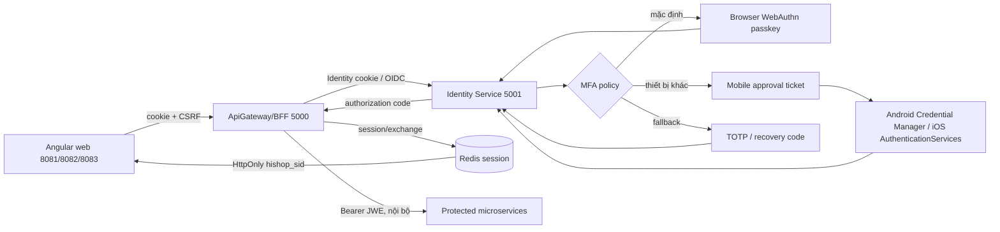

### 0.1 Luồng login và MFA

```mermaid
sequenceDiagram
    autonumber
    actor U as User
    participant App as Angular app
    participant G as Gateway/BFF
    participant I as Identity Service
    participant R as Redis
    participant M as His.Hope mobile

    U->>App: Mở route cần bảo vệ
    App->>G: GET /api/v1/auth/session-status (cookie)
    G-->>App: Chưa authenticated
    App->>G: Mở /Account/Login?returnUrl=...
    G->>I: /connect/authorize + state + nonce + PKCE S256
    I-->>U: Password / passkey / SAML / LDAP UI
    U->>I: Xác thực primary factor
    I-->>U: MFA page nếu tài khoản yêu cầu MFA
    alt Passkey mặc định
        U->>I: POST passkeys/mfa/options
        I-->>U: WebAuthn challenge
        U->>I: POST passkeys/mfa/complete
    else Mobile approval
        U->>I: Start native MFA ticket
        I-->>M: Opaque ticket qua hishope://auth/mfa
        M->>I: options -> native assertion -> complete
        I-->>U: Browser poll nhận approved ticket
    else TOTP fallback
        U->>I: POST /Account/Mfa với mã TOTP
    end
    I->>R: Lưu/tiêu thụ challenge, ticket, authorization code một lần
    I-->>G: Redirect callback với code + state
    G->>I: POST /connect/token (code + verifier)
    I-->>G: OIDC result; token không trả cho browser JS
    G->>I: POST /api/v1/auth/session/exchange
    I->>R: Tạo session mới, lưu protected JWE
    I-->>App: Set-Cookie hishop_sid + hishop_csrf
    App-->>U: Điều hướng dashboard
```

### 0.2 Luồng gọi API, refresh và logout

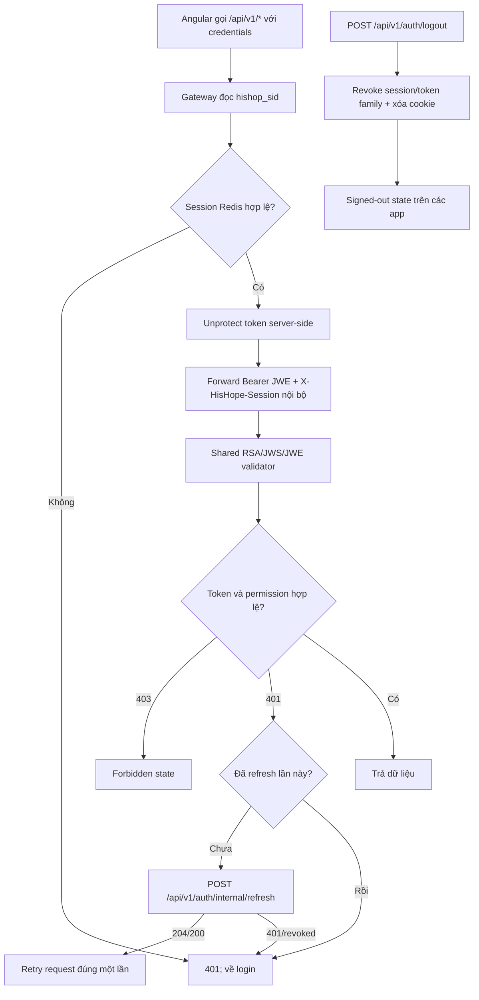

Trong local Docker, `Jwt__AllowHttp=true` chỉ phục vụ issuer localhost. Môi
trường staging/production bắt buộc dùng HTTPS và không được dùng cờ này để
che giấu cấu hình TLS sai. `Jwt__RsaPublicKeyPath` dùng để xác thực chữ ký;
`Jwt__RsaEncryptionPrivateKeyPath` dùng để giải mã lớp JWE. Token runtime hiện
tại là nested token: JWS `RS256` bên trong JWE `RSA-OAEP` +
`A256CBC-HS512`, có `kid` để phục vụ rotation.

### 0.3 Endpoint contract của cơ chế mới

| Endpoint | Vai trò | Ghi chú |
|---|---|---|
| `GET /api/v1/auth/session-status` | Kiểm tra Identity cookie | Không cấp token |
| `POST /api/v1/auth/session/exchange` | Tạo/rotate BFF session sau OIDC callback | Trả `204`, set cookies |
| `POST /api/v1/auth/internal/refresh` | Refresh session server-side | Không nhận refresh token từ browser |
| `POST /api/v1/auth/logout` | Revoke và xóa session/cookies | Dùng cho cross-port logout |
| `GET /.well-known/openid-configuration` | OIDC discovery | Issuer và endpoint runtime là authoritative |
| `POST /connect/token` | Code/refresh exchange | Mobile native gọi qua native boundary; web không expose token |

Các app Angular phải dùng URL auth tương đối qua Gateway (ví dụ
`/api/v1/auth/session-status`), không gọi trực tiếp `identityservice:5001`.
Mobile dùng issuer/API origin theo runtime config của môi trường và chỉ lưu
token trong Android Keystore/iOS Keychain.

## 1. Security boundaries

```text
Angular browser
  |  HTTPS + HttpOnly session cookie + CSRF header
  v
BFF / API gateway
  |  Redis session -> short-lived access token
  v
Identity Service  <---->  Vault/KMS, Redis, durable audit store
  |
  +--> downstream APIs through authenticated REST/gRPC

Capacitor WebView
  |  native browser for OIDC + custom deep link callback
  |  native HTTP bridge for API/token calls when pinning is required
  v
Identity Service
```

The browser or WebView is not a trust boundary for authorization. It may hide
or disable UI actions, but every API and mutation must enforce authorization on
the server.

### Shared foundation ownership

The reusable client boundary is split between two workspace packages:

| Package | Reusable responsibility | Application-specific responsibility |
|---|---|---|
| `@his-hope/frontend-foundation` | Angular auth/security contracts, browser passkey adapter, bearer/error/correlation interceptors, shared states and theme primitives | Client registration, issuer/runtime configuration, route policy and domain UI |
| `@his-hope/mobile-foundation` | Native capability contracts, secure-storage seam, deep-link parsing, DPoP key/proof helper and native passkey seam | Capacitor plugin registration, platform credentials, native callback wiring and app navigation |

The Identity Service remains the only authority for OIDC sessions, token
issuance, MFA, federation mapping, roles and permissions. A foundation package
must never contain a client secret, provider-specific SAML assertion handling,
LDAP credentials, signing keys, or a domain permission decision.

### 1.1 End-to-end component map

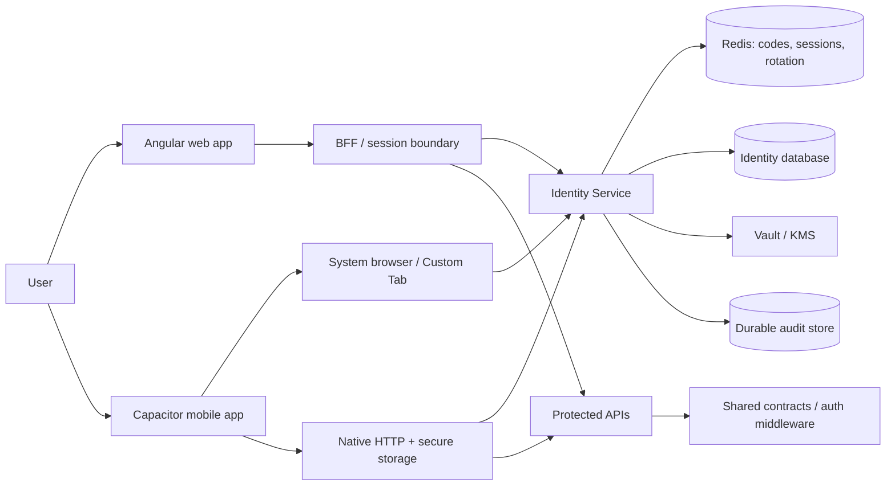

Trust boundaries are explicit: the Angular runtime, Capacitor WebView, and
deep-link payload are untrusted inputs. Redis, databases, Vault/KMS, and the
server-side session boundary are infrastructure boundaries and must be
protected by network policy and service credentials.

### Security status vocabulary

- **Enforced:** present in the current Identity/HTTP/native implementation and
  covered by the applicable tests or runtime checks.
- **Deployment-controlled:** code supports it, but the environment must provide
  the correct issuer, HTTPS certificate, Vault/KMS material, CORS origins,
  Firebase/APNs configuration, or runtime values.
- **Not implemented:** do not design a client dependency on it until a later
  release explicitly adds the contract.

## 2. Discovery and endpoint contract

Never hard-code endpoint paths when discovery provides them.

```http
GET {issuer}/.well-known/openid-configuration
```

The client reads at least:

| Metadata | Use |
|---|---|
| `issuer` | Verify the issuer matches the configured environment |
| `authorization_endpoint` | Start interactive login |
| `token_endpoint` | Exchange code or rotate refresh token |
| `jwks_uri` | Public signing-key metadata for compatible resource servers |
| `introspection_endpoint` | Server-side token introspection |
| `end_session_endpoint` | OIDC logout when published |

The deployed service exposes these protocol endpoints:

| Method | Endpoint | Client use |
|---|---|---|
| GET | `/.well-known/openid-configuration` | Discovery |
| GET | `/.well-known/jwks` | Public keys |
| GET/POST | `/connect/authorize` | Authorization and consent |
| POST | `/connect/token` | Code and refresh exchange |
| POST | `/connect/logout` | End session/revocation |
| POST | `/connect/introspect` | Trusted server-side validation |
| POST | `/connect/register` | Dynamic registration, only when enabled |

The current local emulator origin is `http://10.0.2.2:5000`; it is not a
production value. Production must use an HTTPS issuer and matching redirect
URIs, signing keys, and API audiences.

## 3. Authorization Code + PKCE flow

This is the only interactive flow for SPA and mobile public clients.

### 3.1 Client preparation

Generate cryptographically random values for every login attempt:

```text
code_verifier = random high-entropy string
code_challenge = BASE64URL(SHA256(code_verifier))
state = random high-entropy string
nonce = random high-entropy string
```

Store the transaction state only for the duration of the login attempt. Bind
the callback to the exact client, redirect URI, state, nonce, and PKCE
verifier. Do not accept a callback with a missing or mismatched state.

### 3.2 Browser/BFF sequence

The browser flow is BFF-only. The Angular callback page performs the shared
OIDC coordinator hand-off, but it never receives or stores a bearer token. The
Identity application cookie is used for the OIDC/account flow; after callback,
`/api/v1/auth/session/exchange` rotates the Redis-backed `hishop_sid` session.

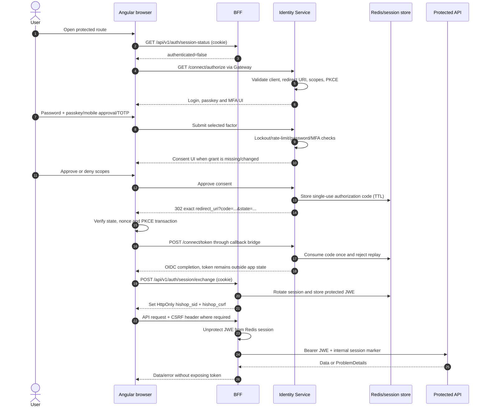

### 0.4 Kiến trúc cache trong OIDC và BFF

Cache không thay thế nguồn dữ liệu hoặc quyết định authorization. OIDC state,
challenge, refresh-token family và BFF session dùng Redis dùng chung giữa các
replica; dữ liệu đọc an toàn mới được cache theo phạm vi tenant/facility và
quyền truy cập.

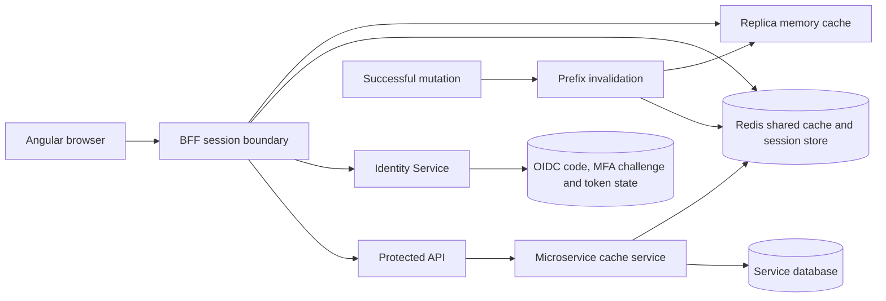

| Vùng dữ liệu | Nơi lưu | Quy tắc |
|---|---|---|
| Authorization code, PKCE transaction, MFA/passkey challenge | Redis | Single-use, TTL ngắn, không lưu trong browser storage |
| BFF session | Redis, payload được bảo vệ bằng JWE | Cookie chỉ giữ session id/CSRF; rotate khi exchange/refresh |
| Refresh-token family của mobile | Identity store/Redis theo cấu hình runtime | Rotation, replay detection, revoke cả family khi reuse |
| Discovery/JWKS metadata | Client/server HTTP cache theo header runtime | Luôn tôn trọng `issuer`, `jwks_uri` và `kid`; không hard-code endpoint |
| API read model | L1 memory + L2 Redis | Key phải gồm resource, query, facility/tenant và permission version |

Angular không lưu access token hoặc refresh token. Mobile native lưu token
trong Android Keystore/iOS Keychain và không đưa token vào cache UI. Khi ghi,
đổi quyền, đổi facility hoặc logout, phải invalidate key liên quan; không dùng
cache hit để bỏ qua authorization hoặc kiểm tra session.

#### Browser failure branches

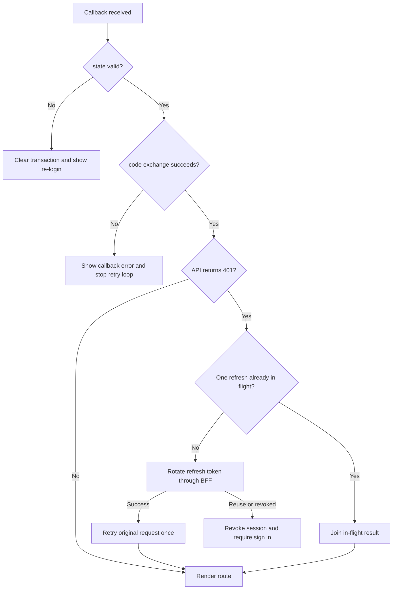

```text
1. User opens a protected Angular route.
2. Angular checks `session-status`; no valid `hishop_sid` starts authorization.
3. Angular opens authorization_endpoint with:
   response_type=code
   client_id=<registered-client>
   redirect_uri=<exact-registered-uri>
   scope=openid profile email roles hishop:permissions offline_access
   code_challenge=<S256 challenge>
   code_challenge_method=S256
   state=<random state>
   nonce=<random nonce>
4. Identity validates client, redirect URI, response type, scopes, PKCE,
   session and account status.
5. User completes password authentication and MFA when required.
6. Identity displays consent if the client/scope grant is missing or changed.
7. Identity returns one-time code + state to the exact redirect URI.
8. Shared frontend coordinator validates state and completes the callback.
9. Identity validates code, client, redirect URI and PKCE; code is consumed.
10. Angular calls `/api/v1/auth/session/exchange` once; Identity creates a new
    Redis session containing protected JWE and returns no token to JavaScript.
11. BFF sets HttpOnly, environment-scoped `hishop_sid` and CSRF cookie.
12. Angular calls BFF APIs with credentials; Gateway resolves the session and
    injects the bearer token only on the server-to-service hop.
```

The authorization code is short-lived and single-use. Never put the code,
access token, refresh token, password, or client secret in logs, URLs beyond
the protocol callback, analytics, or error telemetry.

### 3.3 Angular client requirements

- Use the shared OIDC/auth coordinator and configured interceptor.
- Use `withCredentials` only for the BFF origin where cookie auth is required.
- Send `X-CSRF-Token` from the non-HttpOnly CSRF cookie on state-changing calls.
- Treat `401` as an authentication state transition, not as an infinite retry.
- Treat `403` as forbidden and render the shared permission/forbidden state.
- Use a single in-flight discovery, refresh, and callback exchange per tab.
- On callback failure, clear the transaction state and show a retry/re-login
  action without looping back to authorization indefinitely.

## 4. Capacitor mobile flow

Mobile uses the same OIDC authorization server but a different transport and
callback boundary.

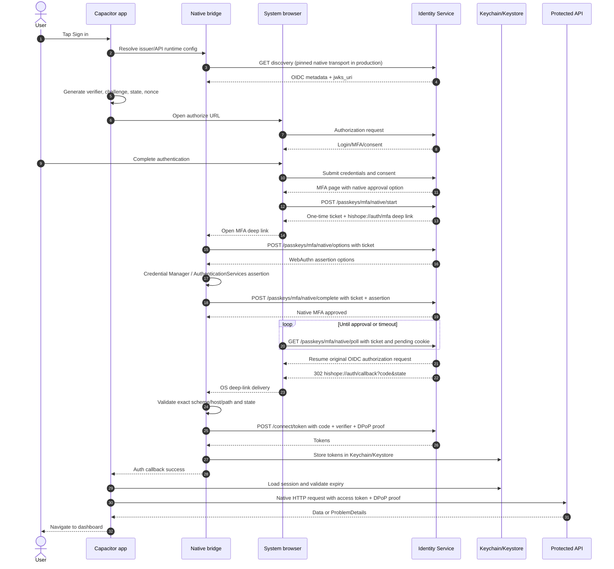

The WebView must never treat a manually typed `hishope://` URL as proof of a
successful login. Only the pending transaction, exact callback allow-list,
matching `state`, and server-side native approval may complete the login. The
MFA ticket is opaque, short-lived, single-use, and carries no OIDC token.

### 4.1 Native MFA approval contract

| Endpoint | Caller | Purpose |
|---|---|---|
| `POST /api/v1/auth/passkeys/mfa/native/start` | MFA browser with pending cookie | Create a short-lived native ticket |
| `POST /api/v1/auth/passkeys/mfa/native/options` | Mobile app with ticket | Load the server-generated WebAuthn challenge |
| `POST /api/v1/auth/passkeys/mfa/native/complete` | Mobile app with ticket | Verify native assertion and mark ticket approved |
| `GET /api/v1/auth/passkeys/mfa/native/poll` | MFA browser with ticket + pending cookie | Consume approval and resume OIDC |

The browser owns the pending OIDC cookie throughout this flow. The mobile app
does not receive that cookie and cannot complete OIDC by itself; it can only
approve the server challenge. This keeps the authorization-code exchange and
PKCE verifier in the original browser/app transaction.

### 4.1 Mobile failure and recovery flow

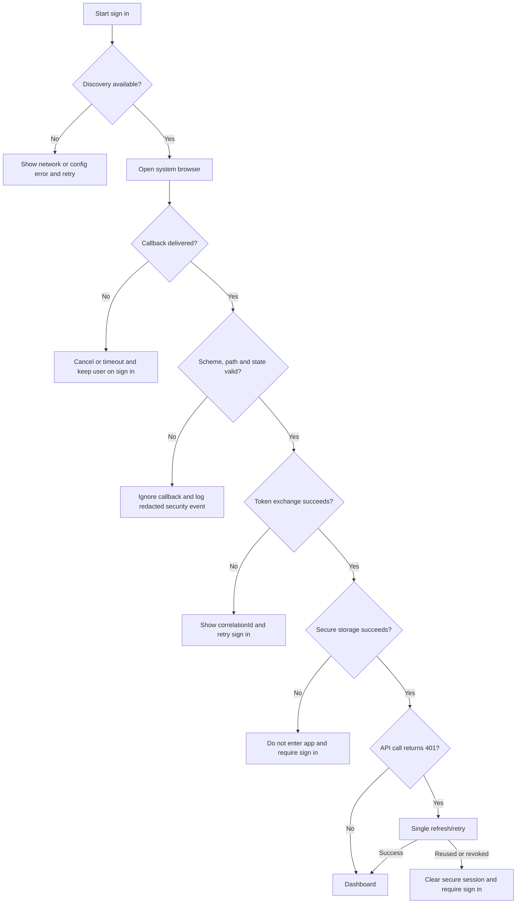

```text
1. Mobile resolves runtime API origin.
2. Native HTTP requests discovery through the security plugin when enabled.
3. Native iOS opens a pinned WKWebView for /connect/authorize; Android may use
   its platform browser flow with the same allow-listed callback contract.
4. Identity authenticates the user and shows consent when required.
5. Identity redirects to hishope://auth/callback.
6. Android intent or iOS universal/custom link reaches Capacitor App listener.
7. Native layer validates the allow-listed scheme/host/path.
8. Angular consumes the callback once and exchanges the code with PKCE. The
   native client creates one P-256 DPoP key in secure storage and signs the
   token request with an ES256 proof.
9. Token exchange/API traffic uses the native HTTP boundary with a fresh DPoP
   proof for the exact method and URI. Resource proofs include `ath`, the
   SHA-256 hash of the presented access token; the access token is bound to that key
   and is presented with `Authorization: DPoP <access-token>` on native API
   calls. Resource services reject a bound token presented as `Bearer`.
   iOS authorization navigation uses the same SPKI pin evaluator and cannot
   fall back to an unpinned browser transport.
10. OIDC storage uses native Keychain/Keystore-backed secure storage.
11. App navigates to the dashboard only after checkAuth succeeds.
```

### 4.2 Mobile redirect contract

Development:

```text
hishope://auth/callback
hishope://auth/logout-callback
```

Production must use the exact URI registered for the mobile client. The
native listener accepts only the allow-listed scheme, host, and callback path.
Arbitrary deep links must be ignored.

### 4.3 Mobile transport and pinning

- API origin is deployment-owned runtime configuration.
- Android emulator reaches the host through `http://10.0.2.2:<port>` only for
  local development.
- iOS simulator/device uses the configured environment origin; do not assume
  Android's emulator address works on iOS.
- Native HTTP is required for pinned production calls. Do not silently fall
  back from a pinning failure to WebView `HttpClient`.
- Native token and API requests carry a fresh ES256 DPoP proof. The private
  P-256 JWK is stored through Keychain/Keystore-backed secure storage; a
  missing or unavailable key fails the request closed.
- iOS OIDC authorization navigation uses the native pinned WKWebView. Do not
  replace it with `Capacitor Browser` or an unpinned `SFSafariViewController`.
- iOS OIDC logout/end-session navigation uses the same pinned native path and
  accepts only the registered `hishope://auth/logout-callback` callback.
- Production SPKI pins must be real and rotated with an overlap plan. The
  `REPLACE_IN_RELEASE` placeholder blocks release validation.
- Never log request headers, cookies, authorization values, token bodies, or
  patient data from the native bridge.

### 4.4 Mobile local security controls

These protect a local session and do not replace server authentication:

- Native biometric/device credential unlock for the idle/background lock.
- App PIN stored and verified through the native secure-storage boundary.
- Android `FLAG_SECURE` and iOS background redaction for sensitive screens.
- Root/jailbreak detection through native capability, not JavaScript heuristics.
- Push registration only when Firebase/APNs is provisioned for that artifact.
- Push notifications are queued in the Identity database outbox and drained
  by a retrying worker; provider outages do not discard queued work.
- Crash/RUM redaction before GlitchTip/OTLP reporting.
- Native iOS crash/RUM reporting uses the pinned His.Hope API boundary; the
  direct Sentry browser transport is enabled only for web preview builds.

If biometric is unavailable or not enrolled, the OS device credential fallback
may be offered. If the device has no secure credential, the user must sign in
again; the app must not invent a JavaScript-only unlock.

## 5. Token and claim model

Access tokens are signed with asymmetric RS256 material. Private signing keys
are deployment-controlled and must remain in Vault/KMS or an approved signing
boundary.

Typical claims include:

```json
{
  "iss": "https://identity.example",
  "sub": "user-id",
  "aud": "his-hope-services",
  "client_id": "his-hope-mobile",
  "scope": "openid profile email roles hishop:permissions offline_access",
  "permission": ["patients.view"],
  "role": ["Admin"],
  "jti": "unique-token-id",
  "iat": 1780000000,
  "exp": 1780003600,
  "amr": ["pwd", "mfa"]
}
```

Resource servers validate:

1. issuer;
2. audience;
3. signature and active `kid`;
4. `nbf`/`iat`/`exp` with bounded clock skew;
5. client and scopes;
6. revocation/introspection status where required;
7. permission policy at the endpoint.

The service-to-service default is server-side introspection or the shared
identity authorization package. If introspection is unavailable, the circuit
breaker fails closed for protected operations.

Do not use a role string as a substitute for a permission check. Use the
shared permission codes and keep backend authorization authoritative.

## 6. Refresh, revocation, and logout

Web BFF và mobile có hai cơ chế khác nhau nhưng cùng một chính sách replay:

- Angular web không gọi refresh token từ JavaScript. Shared foundation xử lý
  một request `internal/refresh`/session exchange duy nhất, chờ các request
  đồng thời, retry request gốc tối đa một lần; thất bại thì logout.
- Mobile native dùng refresh-token rotation tại `/connect/token`, lưu token
  trong Keystore/Keychain và ký DPoP theo cấu hình native. Refresh token bị
  reuse hoặc revoked phải xóa toàn bộ secure session.

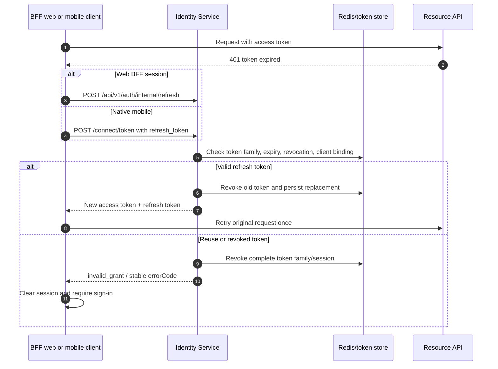

### Refresh token rotation

```text
refresh_token(n) -> validate family and client -> issue access(n+1) and
refresh(n+1) -> consume refresh(n)
```

Reuse of a consumed refresh token is treated as token theft: revoke the entire
token family, invalidate relevant sessions, audit the event, and require a new
interactive login. Clients must discard the old refresh token immediately and
must not retry it in a loop.

### Logout

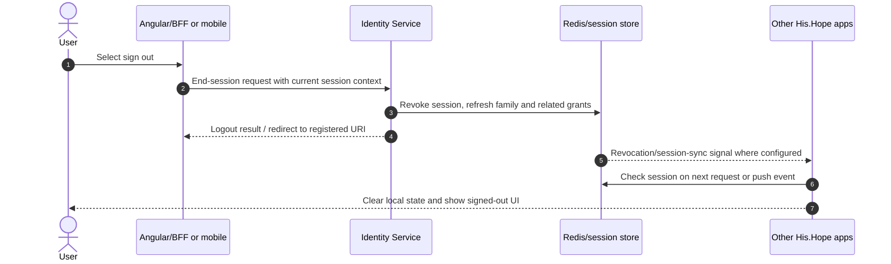

1. Client calls the shared logout endpoint/BFF logout path.
2. Identity revokes the current grant/session/token family as configured.
3. BFF deletes `hishop_sid` and CSRF cookies.
4. Browser apps broadcast local logout to other same-origin app contexts where
   supported and re-check session state on resume.
5. Mobile clears native OIDC/session storage and closes the auth browser.

Cross-port logout requires the shared server-side session/revocation mechanism;
`BroadcastChannel` alone cannot cross different origins or devices.

## 7. Login and MFA security

The Identity Service protects authentication with:

- password policy and server-side validation;
- failed-login lockout (current policy: five attempts, fifteen-minute lockout);
- rate limiting on login, token, MFA, registration, and abuse-sensitive paths;
- native passkey MFA as the preferred second factor, with TOTP (RFC 6238)
  and one-time recovery codes as fallback;
- recovery codes, which are one-time and must be shown only during setup;
- account active/disabled checks;
- audit events for success, failure, lockout, MFA enrollment/change, recovery,
  logout, revoke, and suspicious reuse;
- constant-time comparisons for secrets and verification material.

Frontend/mobile must not decide whether MFA is required. They render the
server's next action and handle cancellation, timeout, invalid code, lockout,
and recovery paths without revealing whether another account exists.

FIDO2/WebAuthn/passkeys, SAML, and LDAP/AD federation are implemented behind
Identity Service endpoints. They establish the server-side Identity cookie;
OIDC authorization then continues through the standard authorization-code
flow, so Angular and mobile clients do not receive a federation-specific token
contract.

For passkeys, the browser foundation receives server-generated WebAuthn options
and returns the browser credential response. Mobile MFA enrollment uses the
same server contract (`/api/v1/auth/passkeys/register/options` and
`/register/complete`) through the reusable mobile foundation adapter. Native
Android uses AndroidX Credential Manager and native iOS uses
AuthenticationServices through the mobile plugin seam. During an OIDC MFA
challenge, the Identity Service exposes `/passkeys/mfa/options` and
`/mfa/complete`, bound to the protected pending OIDC session. Both results
must be posted to the Identity Service before the client enters the OIDC
session/token flow; a local successful biometric prompt is not an authenticated
His.Hope session. TOTP remains available when the device has no supported
passkey or the native prompt is cancelled.

Native Android passkeys require deployment configuration in addition to the
plugin implementation. The WebAuthn `rp.id` must be a real HTTPS RP domain,
not `localhost`, and the domain must publish `/.well-known/assetlinks.json`
for `com.hishope.mobile` and the exact release signing certificate. The
Android origin sent in `clientDataJSON` is
`android:apk-key-hash:<base64url-sha256-signing-key>` and must be included in
`Passkeys:Origins`. If the emulator log contains `RpId validation failed` or
`incoming request cannot be validated`, check the RP domain and Digital Asset
Links before changing MFA enrollment or passkey persistence code. TOTP remains
the fallback during local development until this association is deployed.

For a mobile OIDC login, the MFA page can start a one-time native approval
ticket. The browser retains the pending OIDC cookie and polls the ticket; the
mobile app receives only the opaque ticket through `hishope://auth/mfa`, calls
`/passkeys/mfa/native/options`, performs the native assertion, and posts it to
`/passkeys/mfa/native/complete`. The browser then calls
`/passkeys/mfa/native/poll` and resumes the original authorization request.
No OIDC cookie, access token, or patient data is passed through the deep link.

## 8. Consent and client security

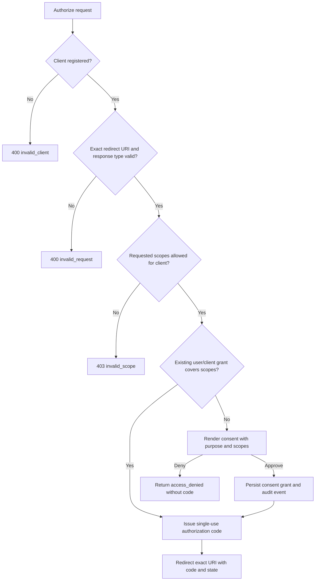

Consent must identify the client, requested scopes, data categories, and
whether offline access is requested. A client never receives claims merely
because a UI hides a scope; the token claims must be derived from the approved
grant and server-side policy.

Consent is a user-to-client-to-scope grant. It must be requested again when
scopes expand or the grant is revoked.

### Client types

| Type | Secret | Required flow |
|---|---|---|
| Public SPA/mobile | None | Authorization Code + PKCE `S256` |
| Confidential BFF/backend | Secret or `private_key_jwt` | Code, refresh, or client credentials as registered |
| M2M service | Secret/certificate | Client credentials, least-privilege scopes |

Rules:

- Redirect and post-logout URIs are exact matches; no wildcards.
- Public clients never receive a client secret.
- Confidential secrets are shown once and stored in a secret manager.
- For `private_key_jwt`, Identity stores only public JWKS; the partner private
  key stays in its HSM/KMS.
- Dynamic registration is disabled unless a protected bootstrap token is
  configured. The token is never placed in browser/mobile code.
- Client create/update/delete, secret rotation, certificate rotation, consent
  grant/revoke, and dynamic registration are audited.
- Request the minimum scopes. Business/API permissions remain separate from
  basic OIDC identity scopes.

Admin client APIs:

```http
GET    /api/v1/admin/clients
POST   /api/v1/admin/clients
PATCH  /api/v1/admin/clients/{clientId}
DELETE /api/v1/admin/clients/{clientId}
POST   /api/v1/admin/clients/{clientId}/rotate-secret
```

Use the shared `PagedResult<T>`, query/sort/filter contract, ProblemDetails,
permission checks, concurrency token, and audit response contract.

## 9. Cookie, CSRF, CORS, and browser security

For BFF/browser sessions:

- session cookie: `HttpOnly`, `Secure` in HTTPS environments, narrow domain,
  explicit path, and environment-appropriate `SameSite`;
- CSRF cookie: readable by the client only to mirror into `X-CSRF-Token`, never
  treated as authentication;
- CORS: explicit allow-list of known frontend origins, credentials only where
  required, no permissive `*` fallback;
- security headers: HSTS in HTTPS production, CSP, X-Content-Type-Options,
  frame protection, referrer policy, and safe permissions policy;
- no access or refresh token in localStorage, URL fragments, analytics, or
  exception messages;
- no open redirect: return URLs are validated against registered routes and
  origins.

Mobile does not rely on browser CORS for native HTTP. It still requires strict
server origin validation and must use the native callback allow-list.

## 10. API authorization and error contract

Every protected endpoint returns the shared ProblemDetails shape with stable
`errorCode` and `correlationId`.

| Status | Meaning | Client behavior |
|---:|---|---|
| 400 | Invalid request/validation | Show field or form errors; no retry loop |
| 401 | Missing/expired/invalid auth | Refresh once or re-authenticate |
| 403 | Authenticated but forbidden | Show forbidden state; do not retry |
| 404 | Resource absent or intentionally hidden | Show not-found state |
| 409 | Concurrency/conflict | Show merge/keep-server/keep-mine flow |
| 429 | Rate limit/abuse protection | Respect `Retry-After`; bounded retry |
| 5xx | Server/dependency failure | Preserve data, show retry/offline state |

Each request should send or receive a correlation ID. Frontend/mobile telemetry
must retain the correlation ID without retaining secrets or PHI.

## 11. Observability and audit

### Audit events

Durable audit records are required for:

- login success/failure, lockout, MFA setup/verify/recovery;
- authorization, consent grant/revoke, token issue/refresh/revoke/introspection;
- refresh-token reuse detection and session revocation;
- client registration/update/delete, secret/certificate rotation;
- permission/role changes and sensitive admin mutations;
- mobile device registration, push token change, and security events.

Audit payloads contain actor, subject, action, resource, result, timestamp,
environment, and correlation ID. Never include passwords, raw tokens, client
secrets, private keys, cookies, or unnecessary PHI.

### Tracing and crash/RUM

- Backend exports traces/metrics/logs through the shared OpenTelemetry/OTLP
  boundary.
- Mobile reports redacted crash/RUM to GlitchTip/Sentry-compatible ingestion
  and can send traces through the existing OTLP Collector.
- Use a non-PHI controlled test event when validating ingestion.
- Observability failure must not block login or expose a token to the client.

## 12. Key management and deployment controls

Production preflight must confirm:

1. issuer matches the external HTTPS hostname;
2. signing keys are persistent and managed by Vault/KMS;
3. key rotation exposes overlapping public `kid` values long enough for token
   verification;
4. startup/readiness fails when required signing infrastructure is unavailable;
5. Redis/database/audit stores are durable and access-controlled;
6. CORS and cookie domains are environment-specific;
7. all mobile release pins are real SPKI hashes;
8. Firebase/APNs is present before enabling push;
9. image signatures, SBOM, SCA, container scan, and dependency gates pass;
10. no development signing key, placeholder secret, or `:latest` artifact is
    promoted.

## 13. Client implementation checklists

### Angular web/BFF

- [x] Discovery fetched from configured issuer.
- [x] Authorization Code + PKCE with `S256`, state, and nonce.
- [ ] Exact registered redirect URI.
- [ ] BFF owns token exchange and server-side token storage.
- [ ] HttpOnly session cookie and CSRF interceptor enabled.
- [ ] No token in JavaScript storage or logs.
- [ ] One bounded refresh attempt; refresh reuse forces re-login.
- [ ] `401/403/409/429` handled using shared states.
- [ ] Shared permission service/button used for sensitive actions.
- [ ] i18n, theme, keyboard, focus, responsive, axe, and visual checks pass.

### Capacitor mobile

- [ ] Runtime API origin is set for the target environment.
- [ ] Native/browser OIDC callback is allow-listed.
- [x] Every iOS HTTPS `HttpClient` request uses the native pinned HTTP boundary;
      hosts without a configured pin are rejected.
- [x] iOS authorization navigation uses the pinned native WKWebView path.
- [ ] OIDC/session data uses Keychain/Keystore secure storage.
- [ ] No localStorage token fallback in release.
- [ ] Biometric/device credential and app PIN states are tested.
- [x] Native MFA bridge uses a short-lived opaque ticket and does not put OIDC
      cookies or tokens in the deep link.
- [ ] Native MFA assertion is verified with a registered passkey on a physical
      Android/iOS device; TOTP fallback is tested after cancellation/timeout.
- [ ] Android RP domain is HTTPS, Digital Asset Links returns HTTP 200 JSON,
      and release signing fingerprints are allow-listed.
- [x] Push is disabled when Firebase/APNs is absent and enabled only when
      provisioned.
- [ ] Crash/RUM redaction is verified with a non-PHI event.
- [ ] Offline, retry, expired session, logout, and force-upgrade flows pass.
- [ ] Android emulator/device gate passes; iOS native gate is run on macOS.

Repository evidence currently available: Android `assembleDebug` passes, the
APK installs on the configured emulator, the `hishope://auth/mfa` deep link
opens `MainActivity`, and the `HisHopeSecurity` plugin is registered. This is
not proof of a successful assertion until a real registered passkey and a
pending OIDC MFA transaction are exercised on an emulator/device.

## 14. Smoke and security verification

```powershell
curl.exe -fsS http://localhost:5000/.well-known/openid-configuration
curl.exe -fsS http://localhost:5000/.well-known/jwks
```

Required negative tests:

- authorize without `code_challenge` for a public client;
- mismatched redirect URI;
- mismatched state, nonce, or PKCE verifier;
- reuse an authorization code;
- reuse a rotated refresh token;
- wrong client secret or private-key JWT;
- scope escalation and missing permission;
- expired/revoked token;
- CSRF mutation without the expected header;
- CORS origin outside the allow-list;
- login/MFA/token rate-limit exhaustion;
- malicious or unregistered deep link on mobile;
- native HTTP pin mismatch;
- missing Firebase configuration while push is enabled.

Record status, `errorCode`, `correlationId`, and audit evidence for each test;
never record the secret/token values used.

## 15. Current limitations and release evidence

The implementation includes the reusable DPoP, FIDO2/WebAuthn/passkey,
SAML/LDAP federation contracts and the OIDC client integration seams. Identity
Service owns RSA-backed JWE, federation, session/token exchange and durable
passkey/device state; frontend/mobile foundation packages do not duplicate
those server responsibilities.

The following remain release-evidence items rather than code-only features:

- production SAML metadata, LDAP/AD bind configuration, Firebase service
  account, APNs key, and real iOS SPKI pins must be injected by operations;
- the Android/iOS native archive, passkey prompt/callback, and pin-mismatch
  behavior require device testing on their native build platforms;
- independent OIDC conformance certification and an external penetration-test
  report must be attached under `artifacts/security/` before release.

The repository gate `scripts/verify-independent-security-evidence.ps1` fails
closed when either external report is absent or not marked passed.

## Related references

- [OIDC external partner integration](oidc-external-partner.md)
- [Identity OIDC runbook](../runbooks/identity-service-oidc.md)
- [Identity security audit](../security/identity-service-audit.md)
- [Mobile deployment](../operations/mobile-deployment.md)
- [Identity security production secrets](../operations/identity-security-secrets.md)
- [GlitchTip and OTLP mobile operations](../operations/glitchtip-otlp-mobile.md)
- [BFF security review](../security/bff-security-review.md)
- [His.Hope shared platform packages](../architecture/shared-platform-packages.md)
