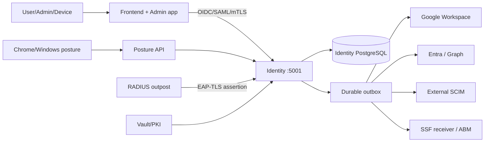

# Tài liệu tích hợp Identity Service P0–P2

Flow Fine-grained RBAC chi tiết: [fine-grained-rbac-flow.vi.md](fine-grained-rbac-flow.vi.md), gồm request lifecycle, resource/facility decision, workload principal, gRPC, P2 shadow/canary và frontend foundation.

**Phạm vi:** Identity Service ASP.NET Core/OpenIddict, admin-app, shared frontend-foundation, Docker Compose, VM/systemd, Kubernetes và hệ thống ngoài.

**Quy ước trạng thái:** `implemented` là code/config và contract test đã có; `pilot` là observe/preview, chưa làm control bắt buộc; `live-gate` chỉ đạt khi có tenant, credential, PKI hoặc lab thật.

## 1. Kiến trúc và ranh giới

Identity Service là hệ thống quyết định cuối cùng cho user, role, facility, session và permission. Google/Entra/SCIM outbound chỉ là provisioning target; không được coi là inbound authentication. Device posture, SSF và RADIUS là dependency bất đồng bộ hoặc edge assertion, không bypass authorization server-side.



## 2. Ma trận phạm vi

| Nhóm | Khả năng | Trạng thái | Vận hành |
|---|---|---|---|
| P0 | Password history | implemented | Bật mặc định; không backfill hash cũ |
| P0 | Immutable/redacted audit + CSV | implemented | Append-only, facility-scoped |
| P0 | External OAuth/OIDC/SAML + linking | code/contract-tested | Cần live IdP; fail closed |
| P0 | SCIM M2M OAuth | code/contract-tested | Client/scope/audience riêng |
| P1 | Google/Entra/outbound SCIM | adapter/outbox + mock contract-tested | Mặc định `dry-run` |
| P1 | SSF/CAEP | outbox/signed SET + contract-tested | Tắt mặc định |
| P1 | mTLS | binding/revoke + contract-tested | Private CA, EKU, expiry, revocation |
| P1 | RADIUS EAP-TLS | assertion bridge + contract-tested | Chỉ khi có network use case |
| P1 | CSV export | async server job + contract-tested | Permission kép, TTL download |
| P2 | Device compliance/Chrome trust | pilot | `observe`, không block clinical |
| P2 | Windows local login | thiết kế/pilot | Cần Windows/AD/offline lab |

## 3. Luồng nội bộ

### Identity Service và endpoint chính

- Provider discovery: `GET /api/v1/auth/external-providers`.
- Device posture: `/api/v1/admin/device-posture/policy`, `PUT /policy`, `/assessments`, `/preview`; decision `/api/v1/device-posture/decision/{userId}/{deviceId}`.
- Provisioning: `/api/v1/admin/provisioning/jobs`, `/jobs/{id}/retry`, `/bindings`, `/status`.
- mTLS: `/api/v1/auth/mtls/login`, `/api/v1/admin/mtls/bindings` và revoke.
- RADIUS: `/api/v1/auth/radius/eap-tls`, `/api/v1/admin/radius/eap-tls/status`.
- SSF: `/api/v1/admin/security-signals/status`, `/outbox/{id}/retry`.
- Audit/CSV: admin table/audit routes hiện hữu, permission-gated và facility-scoped.

Mọi route mutation/list mới đều kiểm tra permission và `FacilityContext`. UI chỉ là affordance; không dùng UI để thay authorization.

### Outbox/worker

1. Mutation tạo domain record và outbox trong cùng transaction boundary.
2. Worker đọc theo `AvailableAt`, tăng `Attempts`, ghi lỗi và retry backoff.
3. `PROVISIONING_MODE` chỉ gọi target với `enabled`/`live`; `disabled`, `off`, `dry-run`, `observe` và giá trị lạ đều fail closed.
4. SSF dispatcher không tạo scope/gửi mạng khi disabled; enabled chỉ gửi HTTPS subscription allow-list.
5. External ID binding phải idempotent và không ghi chéo tenant/facility.

### Admin-app/foundation

Admin workspace `/identity-capabilities` (alias `/security/identity`) dùng typed facade và `@his-hope/frontend-foundation`.

- Theme: Sass tokens + `HisHopeThemeService`; không hard-code màu shell/login.
- i18n: `HisHopeI18nService` + `HisHopeTranslatePipe`, dictionary `vi-VN`/`en`.
- Permission: `admin.settings.read/write`, `admin.users.read/write`, `admin.audit.read`, `admin.clients.read/write`.
- Không render secret, private key, raw evidence, full evidence hash hoặc SCIM token sau lưu.
- Mutation cần confirmation; P2 `stepup/deny` phải cảnh báo pilot và có kill-switch về `observe`.

Frontend login nhận provider từ Identity Service; browser chỉ nhận metadata provider, không nhận client secret.

## 4. Runtime configuration

Nguồn chuẩn: environment contract → render adapter:

- Docker: `docker/config/compose.runtime.env.ps1` → `compose.runtime.env`.
- VM: `deploy/vm/runtime.env.example` và systemd `EnvironmentFile`.
- Kubernetes: `k8s/base/runtime-contract-configmap.yaml` + Secret/Vault reference.

```dotenv
PASSWORD_HISTORY_ENABLED=true
PASSWORD_HISTORY_COUNT=5
AUDIT_APPEND_ONLY=true
AUDIT_REDACTION_ENABLED=true
EXTERNAL_FEDERATION_ENABLED=false
SCIM_M2M_ENABLED=true
PROVISIONING_MODE=dry-run
PROVISIONING_TARGETS=scim,entra,google-workspace
SSF_ENABLED=false
MTLS_ENABLED=false
RADIUS_EAP_TLS_ENABLED=false
CSV_EXPORT_ENABLED=true
DEVICE_POSTURE_MODE=observe
DEVICE_POSTURE_TTL_SECONDS=900
DEVICE_POSTURE_ENFORCE_CLINICAL=false
```

Development connection string phải có password nội bộ, ví dụ `Host=postgres;Database=identitydb;Username=postgres;Password=postgres`. Production lấy secret từ Vault; không dùng giá trị ví dụ.

Public port giữ nguyên `5001:5003`; service-to-service dùng `http://identityservice:5003`.

## 5. Tích hợp hệ thống ngoài

### 5.1 OAuth/OIDC và SAML inbound

1. Đăng ký issuer, discovery/JWKS, client và redirect URI.
2. Server tạo state, nonce, PKCE và chỉ nhận local return path.
3. Callback kiểm tra issuer, audience, signature, clock, state/nonce và mapping immutable `(issuer, subject)`.
4. Collision/unlinked account yêu cầu confirmation; không tự link chỉ theo email.
5. SAML phải kiểm tra signed response/assertion, metadata certificate và replay.

Authentik Source stage chỉ hỗ trợ browser OAuth/SAML, có resume timeout; không đặt `User Login` trong source flow theo cách làm flow gốc không resume. Nguồn: [Source stage](https://docs.goauthentik.io/add-secure-apps/flows-stages/stages/source/).

### 5.2 Google Workspace provisioning

1. Bật Admin SDK API trong Google Cloud.
2. Tạo service account và Domain-Wide Delegation với custom delegated subject/scope tối thiểu.
3. Lưu JSON key trong Vault; không commit hoặc gửi qua admin-app.
4. Tạo binding target `google-workspace`, mapping và tenant/domain.
5. Chạy `dry-run`, kiểm tra queue/reconcile/external-id rồi mới `enabled`.
6. Xác minh idempotency, group mapping, retry/DLQ và full reconciliation.

Đây là outbound directory provisioning, matching user theo email/group theo tên, không phải Google login. Nguồn: [Google Workspace provider](https://docs.goauthentik.io/add-secure-apps/providers/gws/).

### 5.3 Microsoft Entra ID provisioning

1. Tạo app registration theo tenant.
2. Cấp Graph application permissions tối thiểu và admin consent.
3. Lưu tenant/client/secret hoặc certificate assertion trong Vault; rotate trước expiry.
4. Dùng Graph v1.0, token URL và `.default` scope.
5. Dry-run trước live; kiểm tra verified domain/UPN/email collision.
6. Theo dõi throttling, retry, external ID và disable semantics.

Entra provider là outbound user/group sync, không phải inbound federation login. Nguồn: [Entra provider](https://docs.goauthentik.io/add-secure-apps/providers/entra/).

### 5.4 Outbound SCIM OAuth

Đăng ký SCIM base/token URL, client ID và scope; dùng client credentials hoặc private-key JWT, token cache TTL ngắn, kiểm tra schema/ServiceProviderConfig, chạy dry-run rồi enabled. SCIM inbound của His.Hope vẫn là server riêng. Nguồn: [SCIM OAuth token](https://docs.goauthentik.io/add-secure-apps/providers/scim/).

### 5.5 SSF/CAEP/ABM

1. Đăng ký HTTPS receiver, audience và subscription.
2. Chọn signing key từ Vault; không expose key.
3. Ghi `SecuritySignalOutbox` cho logout/session revoke/password/MFA events.
4. Dispatcher tạo SET `typ=secevent+jwt`, ký RSA, gửi HTTPS, retry và ghi attempts/error.
5. Receiver verify issuer/audience/signature/`jti`/timestamp/idempotency.

SSF là async security signal, không thay thế SSO và không phải synchronous authorization proof. Nguồn: [SSF provider](https://docs.goauthentik.io/add-secure-apps/providers/ssf/).

### 5.6 mTLS và RADIUS EAP-TLS

1. Dùng private CA và client-auth EKU; không dùng public CA.
2. Ingress verify chain rồi mới forward cert; backend vẫn kiểm tra chain/EKU/expiry.
3. Bind normalized thumbprint với user; revoke/rotate phải audit.
4. RADIUS outpost thực hiện EAP exchange trong network segment riêng.
5. Identity chỉ nhận assertion qua trusted path và kiểm tra certificate binding.
6. Negative test: untrusted, revoked, expired, unmapped cert và spoofed header.

Nguồn: [mTLS](https://docs.goauthentik.io/add-secure-apps/flows-stages/stages/mtls/) và [RADIUS/EAP](https://docs.goauthentik.io/add-secure-apps/providers/radius/).

### 5.7 Chrome Device Trust và Windows login (P2)

Chrome cần Chrome Verified Access API, Google Cloud/service account và Chrome Admin connector; chỉ Chrome/ChromeOS. Evidence phải có provenance, observed-at, TTL và replay hash. Nguồn: [Chrome connector](https://docs.goauthentik.io/endpoint-devices/device-compliance/connectors/google-chrome/).

Windows local login cần signed agent/credential provider, enrollment, recovery, BitLocker/EFS, AD/RDP/offline tests trên Windows 11/Server 2022. Không bật deny clinical trước lab và clinical safety sign-off. Nguồn: [Windows local login](https://docs.goauthentik.io/endpoint-devices/authentik-agent/device-authentication/local-device-login/windows/).

## 6. Vận hành theo runtime

### Docker Compose

```powershell
powershell -NoProfile -ExecutionPolicy Bypass -File .\docker\config\compose.runtime.env.ps1 -Environment development -OutputFile .\docker\config\compose.runtime.env
docker compose --env-file .\docker\config\compose.runtime.env -f docker\docker-compose.yml up -d
powershell -NoProfile -ExecutionPolicy Bypass -File .\scripts\config\smoke-compose-internal.ps1
powershell -NoProfile -ExecutionPolicy Bypass -File .\scripts\config\smoke-public-ui.ps1 -RequireAll
```

Port map: gateway `5000`, Identity `5001`, frontend `8081`, dashboard `8082`, admin `8083`.

### VM/systemd

Render env theo contract vào `/etc/his-hope/<service>.env`, permission chỉ service account, restart instance, kiểm tra health/migration/Vault/key expiry/journal. Live systemd gate phải chạy trên VM thật; Windows chỉ chứng minh static template.

### Kubernetes

Apply ConfigMap + Secret/Vault reference; kiểm tra Deployment env, Service targetPort 5003, readiness/liveness, ingress TLS, NetworkPolicy, outbox lag, retry/DLQ và audit retention. Rollout từng adapter, không bật tất cả target cùng lúc.

## 7. Enable/rollback

| Capability | Enable | Rollback |
|---|---|---|
| Provisioning | `dry-run` → reconcile → review → `enabled` | `PROVISIONING_MODE=disabled`, giữ outbox |
| SSF | receiver test → `SSF_ENABLED=true` | false; không block logout/login |
| mTLS | private CA + pilot binding | revoke binding, dùng OIDC/MFA |
| RADIUS | lab EAP-TLS → một segment | disable outpost/route |
| Posture | observe → preview → approved stepup | kill-switch về observe |
| Windows | lab signed agent | disable provider, dùng recovery |

Mọi thay đổi cần owner, change ticket, correlation ID và rollback proof.

## 8. Validation matrix

| Gate | Lệnh/evidence | Kỳ vọng |
|---|---|---|
| Foundation/i18n | `npm run validate:foundation`, `npm run validate:i18n` | pass |
| Angular/UI | build + Karma/Jest | pass; warning ghi nhận |
| Identity API | `dotnet build ...IdentityService.Api.csproj --no-restore` | 0 error |
| Runtime | `scripts/config/validate-all-runtimes.ps1` | Docker/VM/K8s pass |
| Internal smoke | `smoke-compose-internal.ps1` | HTTP 200 trên docker network |
| Public smoke | `smoke-public-ui.ps1 -RequireAll` | 5001/8081/8082/8083 + gateway pass |
| Security contract | P0/P1/P2 targeted tests | permission/facility/redaction/replay/fail-closed pass |
| Live provider | tenant/credential/PKI/lab evidence | không suy ra từ build |

## 9. Acceptance criteria

- **P0:** password reuse bị chặn; audit immutable/redacted; SCIM scope/audience đúng; federation sai issuer/audience/signature bị từ chối.
- **P1:** target có idempotent outbox, retry/DLQ, least privilege, rotation và rollback; SSF receiver verify SET; mTLS/RADIUS có private-PKI drill; CSV có permission kép và TTL.
- **P2:** posture có provenance/freshness/break-glass; Chrome/Windows có lab evidence và clinical safety sign-off. Trước promotion giữ `DEVICE_POSTURE_MODE=observe`, `DEVICE_POSTURE_ENFORCE_CLINICAL=false`.
- **Fine-grained RBAC:** route permission chỉ là coarse gate; resource owner/facility phải được kiểm tra trước read/update/delete và decision phải có audit metadata. Frontend chỉ là UX hint, không thay thế PEP.

## 10. Snapshot kiểm chứng nội bộ (2026-08-13)

| Evidence | Kết quả hiện tại | Ghi chú |
|---|---|---|
| Shared frontend-foundation Karma | **PASS 54/54** | ChromeHeadless; 401/403 authorization failure và OAuth scope entitlement contract |
| Main frontend Jest | **PASS 73 suites / 480 tests** | `--runInBand --silent` |
| Admin-app Karma | **PASS 13/13** | ChromeHeadless; export controls now consume shared `reports.export` entitlement |
| Dashboard-app Karma | **PASS 34/34** | ChromeHeadless |
| Build main/admin/dashboard | **PASS** | Admin build pass; chỉ còn cảnh báo bundle budget/CommonJS |
| Authorization.Tests | **PASS 23/23** | Catalog, policy registration, scope claim parsing/composition cho Continuity/FHIR, explicit human/workload principal type, facility scope, EF resource evaluator và decision sink; resource lookup failure cũng được audit |
| JWT audience boundary | **PASS 7/7 + runtime smoke** | OIDC JWT handler bật audience validation và allow-list chỉ gồm configured audience + `his-hope-services`; wrong-audience regression test pass; Identity/Continuity images rebuilt, smoke vẫn pass |
| Fine-grained authorization contract | **PASS** | Immutable context/decision, redacted decision sink, deny-first và facility resource gate |
| Domain resource gates | **PASS build + Docker artifact** | Patient, Appointment, Clinical, Lab, Billing và Pharmacy đã gate resource facility trước các command high-risk; images rebuild/recreate và healthy |
| gRPC resource gates | **PASS build + contract tests (6 services)** | Patient, Billing, Appointment, Clinical, Lab và Pharmacy read-by-id/exists methods chạy shared resource evaluator trước repository/mediator access, deny cross-facility bằng non-enumerating `NotFound`; 102 gRPC contract tests pass, gồm deny/no-repository-access và scoped list/search propagation; database-backed negative gRPC integration vẫn mở |
| Patient list/search facility gate | **PASS 15/15** | HTTP và gRPC search truyền `FacilityAccessScope`, cache key partition theo facility, repository filter theo facility và fail-closed khi scope rỗng; contract suite Patient **15/15** |
| Appointment list/search facility gate | **PASS 15/15 + 46/46** | HTTP list/search và gRPC patient appointments truyền `FacilityAccessScope`, repository filter theo facility và fail-closed khi scope rỗng; contract **15/15**, application **46/46**, API/container healthy |
| Clinical list/search facility gate | **PASS 24/24 + 42/42** | Encounter list/search, patient aggregation HTTP routes và gRPC search truyền `FacilityAccessScope`, cache key partition và repository filter theo facility; contract **24/24**, application **42/42**, API/container healthy |
| Lab list/search facility gate | **PASS 15/15 + 63/63** | Lab order list/search, patient aggregation HTTP routes và gRPC patient/search truyền `FacilityAccessScope`, cache key partition và repository filter theo facility; contract **15/15**, application **63/63**, API/container healthy |
| Billing list/search facility gate | **PASS 15/15 + 32/32** | Invoice list/search, patient aggregation HTTP routes và gRPC patient/search truyền `FacilityAccessScope`, cache key partition và repository filter theo facility; contract **15/15**, application **32/32**, API/container healthy |
| Pharmacy list/search facility gate | **PASS 18/18 + 60/60** | Medication/prescription list/search, patient prescription aggregation và gRPC search truyền `FacilityAccessScope`, cache key partition và repository filter theo facility; contract **18/18**, application **60/60**, API/container healthy |
| Database-backed HTTP facility authorization | **PASS 12/12 (6 services, allow + deny)** | SDK containers trong `docker_default` với PostgreSQL Compose; host Testcontainers random-port path vẫn environment-blocked; mutation-specific HTTP còn là gate tiếp theo |
| Database-backed gRPC facility authorization | **PASS 12/12 (6 services, allow + deny)** | Patient, Billing, Appointment, Clinical, Lab và Pharmacy get-by-id allow + cross-facility deny qua in-process TestServer channels với PostgreSQL Compose; mutation-specific actions và live workload credentials còn mở |
| Database-backed mutation authorization | **PASS 6/6 (six services, deny)** | Patient deactivate, Appointment check-in, Clinical complete, Lab cancel, Billing void và Pharmacy fill đều chặn cross-facility bằng `404` trên PostgreSQL Compose |
| Frontend foundation entitlement contract | **PASS 54/54** | Permission snapshot, normalized scopes, i18n/theme denial state và UX-only guard đã pass Karma; không thay thế server-side authorization |
| Device-posture P2 pilot evaluator | **PASS 4/4** | Policy evaluator kiểm tra required signals, deny mode, freshness/replay và provider validation; production enforcement vẫn giữ `observe` cho tới khi có Chrome/Windows lab evidence |
| Workload token policy implementation | **IMPLEMENTED / BUILD PASS** | Identity đăng ký service scopes và phát hành `principal_type=workload` cho client-credentials; Application tests **68/68**; end-to-end token/introspection trên runtime Compose vẫn chưa được claim do live credential/fixture gate |
| Authorization P2 shadow seam | **PASS 25/25 + contract valid** | `IAuthorizationShadowProbe` chỉ telemetry, `AUTHZ_PDP_MODE=disabled|shadow|canary` được chuẩn hóa cho Docker/VM/K8s; shadow/canary không thể cấp quyền, probe failure bị cô lập và local P1 luôn fail-closed |
| Post-change compose/frontend validation | **PASS** | `smoke-compose-internal.ps1` pass toàn bộ identity, gateway, frontend, dashboard, admin và unauthenticated 401 gates; frontend-foundation Karma **54/54**; `validate-all-runtimes.ps1` pass, 7 vendor gates skipped do thiếu prerequisite |
| Frontend revalidation sau principal separation | **PASS** | Foundation Karma **54/54**, dashboard Karma **34/34**, main frontend Jest **73 suites / 480 tests**, admin identity capability validator + build pass |
| Foundation contract gates | **PASS** | `validate:foundation` (catalog/public exports), `validate:i18n` (boundary) và `lint:design-tokens` đều pass |
| Clinical frontend foundation error bridge | **PASS** | Legacy clinical error interceptor vẫn giữ UX/audit hiện tại nhưng đã ghi 401/403 vào `HisHopePermissionService`, thống nhất permission failure state với admin/dashboard |
| Identity image/config rollout | **PASS** | Rebuilt/recreated `his-hope-identity`, verified `AUTHZ_PDP_MODE=disabled`, container healthy và compose smoke vẫn pass; host OIDC port giữ nguyên `5001` |
| Runtime adapter configuration | **PASS** | `AUTHZ_PDP_MODE` có trong Compose example/renderer, VM contract và K8s ConfigMap; render development=`disabled`, staging=`shadow`, production=`disabled`; Docker contract validator pass |
| K8s overlay propagation | **PASS** | Validator kiểm tra trực tiếp giá trị render: dev/prod=`disabled`, staging=`shadow`; `validate-kustomize-runtime.ps1` pass cho dev, staging và prod |
| Live Docker runtime snapshot | **PASS** | Tất cả Compose services ở trạng thái `running`; Identity `5001->5003`, gateway `5000`, frontend `8081`, dashboard `8082`, admin `8083`; direct HTTP checks trả `200` cho login/health/UI |
| Domain application suites | **PASS 267 tests** | Patient 69, Appointment 46, Clinical 42, Lab 63, Billing 32, Pharmacy 60 |
| Lab cross-facility HTTP integration | **ENVIRONMENT-BLOCKED** | Test được thêm vào `CriticalAlertEndpointsTests`; Testcontainers PostgreSQL port-forward timeout trên Windows host ở cả 2 lần retry, assertion chưa được tính pass |
| Docker internal smoke sau gRPC rollout | **PASS** | `smoke-compose-internal.ps1`: identity/providers/gateway/frontend/dashboard/admin 200; protected API/BFF 401; `COMPOSE_INTERNAL_SMOKE_PASS network=docker_default` |
| Runtime scope artifacts | **PASS** | Đã rebuild/recreate `identityservice` (giữ `5001 -> 5003`) và `database-continuity-service` (`5800`); cả hai healthy, internal smoke chạy pass sau rollout |
| Frontend foundation/admin/main/dashboard tests | **PASS** | Foundation Karma `54/54`, admin Karma `13/13`, foundation/admin builds pass; main frontend Jest `73 suites/480 tests`, dashboard Karma `34/34` |
| Full-root/stack Playwright | **ENVIRONMENT/TOOLING-BLOCKED** | Root `npx playwright test --workers=1` quét cả test tree ngoài phạm vi stack, gặp duplicate Playwright versions/missing `@playwright/test`; chạy riêng `tests/e2e` đúng package vẫn timeout sau 300s không có completion. Không dùng kết quả này để suy ra UI stack pass/fail |
| IdentityService integration suite | **PASS 128/128 (native PostgreSQL)** | Chạy full suite với PostgreSQL native local cluster tạm thời qua `IDENTITY_TEST_POSTGRES_CONNECTION`: **128/128 pass, 0 fail, 0 skipped, 1m17s**. Testcontainers/Docker Desktop forwarding vẫn là môi trường không ổn định trên Windows; CI nên dùng native/service PostgreSQL hoặc Linux container network |
| Shared Infrastructure tests | **PASS 22/22** | Redis Testcontainers đã chuyển sang shared fixture, connection retry và parallelization control; cả Redis durable-job và DPoP tests chạy pass |
| IdentityService focused integration | **PASS (focused)** | PasswordHistory 1/1, ExportContract 1/1, DevicePosture 4/4, Auth 13/13, MFA 9/9, Verification 9/9, Security/Federation/Auth 24/24 và SCIM 9/9; full-suite 128/128 đã xác nhận tổng thể |
| Resource/workload scope contract | **PASS** | Shared `ScopeRequirement`/`ScopeHandler` và policy-composition tests **23/23**; FHIR Patient/Encounter yêu cầu permission + scope riêng + `principal_type=human` và reject scope substitution; Database Continuity backup/restore-drill yêu cầu `admin.settings.write` + `platform.continuity.write` + principal type rõ ràng; SCIM M2M yêu cầu workload principal; FHIR và Continuity build pass; unauthenticated runtime smoke cho continuity trả 401 |
| FHIR service-boundary authorization contract | **PASS 7/7** | Reflection + HTTP contract kiểm tra direct call: unauthenticated `401`, thiếu resource scope hoặc workload principal `403`, đủ permission + human scope `200`; chỉ `/metadata` được anonymous |
| SCIM workload boundary | **PASS 9/9** | `ScimEndpointsTests` + `ScimAuthorizationTests` pass; cookie/admin session không có `scim.read/write` bị 403, thiếu token bị 401, public metadata/resource discovery vẫn hoạt động |
| Human/workload admin separation | **PASS 26/26 + build/smoke** | `HumanAdmin` policy yêu cầu `principal_type=human` trên `/api/v1/admin` và các route admin được map riêng (device posture, provisioning, mobile, mTLS, RADIUS, security signals, settings); workload token dù có admin permission vẫn bị từ chối; workload dùng policy tích hợp riêng như SCIM/Continuity |
| Identity API build | **PASS** | `--no-restore`, 0 error |
| Identity Application tests | **PASS 68/68** | Login request fixtures aligned to the current named `Email`/`Password` constructor contract; validator behavior unchanged |
| Admin export transaction/field gate | **PASS build/runtime smoke** | Export requires `admin.users.read` plus `reports.export`; unmasked fields additionally require `reports.manage`; resource-specific read checks remain enforced |
| Identity integration targeted P0/P1/P2 | **PASS** | P0/P1/P2 contract/security tests; password history, passkey, health và SCIM negative contract đã pass |
| Full Identity integration suite | **PASS 128/128 (native PostgreSQL)** | Full suite đã pass **128/128**, 0 skipped trong 1m17s với native PostgreSQL cluster; Docker Desktop/Testcontainers host-forwarding trên Windows vẫn không được dùng làm bằng chứng pass |
| Docker internal smoke | **PASS** | UI 200; protected API 401; network `docker_default`; compose runtime loaded from `docker/config/compose.runtime.env` |
| Runtime adapters/config | **PASS** | Docker, VM static, Kustomize dev; admin capability validator pass |
| Public host smoke | **ENVIRONMENT-BLOCKED** | Docker Desktop/Windows host-forwarding timeout trên 127.0.0.1; không suy ra lỗi container vì internal smoke và health đều pass |
| Live Google/Entra/SSF/mTLS/RADIUS/Chrome/Windows | **SKIPPED** | Thiếu tenant, credential, private PKI hoặc device lab; giữ fail-closed/pilot theo mục 7 |

Snapshot này phân biệt rõ bằng chứng code/contract, runtime Docker nội bộ và live external gate. Không đánh dấu live provider hoặc public host forwarding là pass chỉ từ build hay container health.

## 11. Nguồn chính thức

[Google Workspace](https://docs.goauthentik.io/add-secure-apps/providers/gws/) · [Entra](https://docs.goauthentik.io/add-secure-apps/providers/entra/) · [Source stage](https://docs.goauthentik.io/add-secure-apps/flows-stages/stages/source/) · [Chrome connector](https://docs.goauthentik.io/endpoint-devices/device-compliance/connectors/google-chrome/) · [SSF](https://docs.goauthentik.io/add-secure-apps/providers/ssf/) · [Password uniqueness](https://docs.goauthentik.io/customize/policies/types/password-uniqueness/) · [Audit logging](https://docs.goauthentik.io/sys-mgmt/events/logging-events/) · [mTLS](https://docs.goauthentik.io/add-secure-apps/flows-stages/stages/mtls/) · [SCIM OAuth](https://docs.goauthentik.io/add-secure-apps/providers/scim/) · [RADIUS](https://docs.goauthentik.io/add-secure-apps/providers/radius/) · [CSV export](https://docs.goauthentik.io/sys-mgmt/data-exports) · [Windows login](https://docs.goauthentik.io/endpoint-devices/authentik-agent/device-authentication/local-device-login/windows/)
