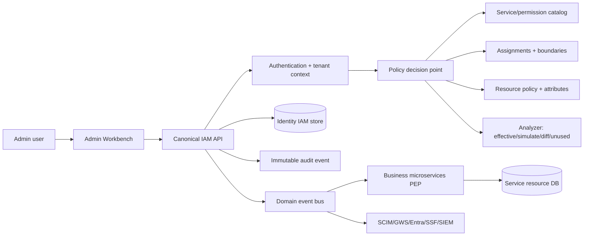

# Kế hoạch hợp nhất Identity Service và Admin UI thành Identity Workbench

## 1. Mục tiêu và nguyên tắc

Identity Workbench là control-plane duy nhất cho toàn bộ vòng đời identity và IAM.
Một khái niệm chỉ có một tên chuẩn, một resource contract, một menu owner và một
đường audit. Các service nghiệp vụ (patient, clinical, billing, pharmacy,
appointment, lab...) chỉ cung cấp resource catalog và enforcement; không tự tạo
role/permission riêng trong UI.

Nguyên tắc bắt buộc:

1. Server là nơi quyết định quyền (deny-by-default, tenant/resource boundary,
   maker-checker và audit); Angular chỉ hiển thị affordance.
2. API resource dùng danh từ số nhiều, kebab-case; action chỉ dùng cho lifecycle
   hoặc phân tích không biểu diễn được bằng HTTP verb.
3. Database table dùng catalog `IdentityWorkbenchTableNames`; không đổi tên vật lý
   trong cùng release với thay đổi API.
4. Mỗi menu có route, query key, permission key, API client, loading/error/empty
   state và i18n key riêng; không dùng một component tổng hợp để giả lập nhiều menu.
5. Route cũ `/api/v1/admin/iam` và các compatibility route vẫn phục vụ client cũ,
   nhưng code mới chỉ được gọi qua canonical catalog.

## 2. Mô hình ownership

| Domain | Owner | Nguồn dữ liệu chính | Kết quả cung cấp |
|---|---|---|---|
| Organizations & tenants | Identity Service | `iam_scopes` | tenant/account/environment context |
| Identities | Identity Service | users, groups, external identities, service principals | subject và lifecycle |
| Applications | Identity Service | clients, API audiences, trusted issuers | OAuth/OIDC federation metadata |
| Authorization | Identity Service + service catalog | services, permission sets, policies, boundaries, resource policies, assignments | effective decision inputs |
| Access governance | Identity Service | requests, reviews, JIT, break-glass | approval/elevation evidence |
| Sessions & credentials | Identity Service | sessions, workload sessions, credentials, revocations | session control và revoke |
| Analyzer | Identity Service/PDP | policy graph + decision logs | simulate, effective access, diff, unused permissions |
| Audit & integrations | Identity Service + integration workers | audit events, SSF, SCIM, GWS, Entra, SIEM | immutable evidence và outbound sync |
| Business resources | Từng microservice | resource DB của service | resource attributes/catalog; không sở hữu global IAM role |

## 3. Cây menu chuẩn và route canonical

```text
IAM Workbench
├── Overview                                      /iam/overview
├── Organizations & tenants                       /iam/scopes
├── Accounts & environments                       /iam/scopes?scope=account
├── Identities
│   ├── Workforce users                            /iam/users
│   ├── Groups                                     /iam/groups
│   ├── External identities                        /iam/external-identities
│   └── Service principals                         /iam/service-principals
├── Applications
│   ├── OAuth clients                               /iam/clients
│   ├── API audiences                               /iam/api-audiences
│   └── Trusted issuers                             /iam/trusted-issuers
├── Authorization
│   ├── Service catalog                             /iam/services
│   ├── Permission sets                             /iam/permission-sets
│   ├── Policies                                    /iam/policies
│   ├── Boundaries                                  /iam/boundaries
│   ├── Resource policies                           /iam/resource-policies
│   └── Assignments                                 /iam/assignments
├── Access governance
│   ├── Requests                                    /iam/access-requests
│   ├── Reviews                                     /iam/access-reviews
│   ├── JIT access                                  /iam/jit-access
│   └── Break glass                                 /iam/break-glass
├── Sessions & credentials
│   ├── Active sessions                             /iam/sessions
│   ├── Workload sessions                           /iam/workload-sessions
│   └── Revocation                                  /iam/revocations
├── Analyzer
│   ├── Effective access                            /iam/analyzer/effective-access
│   ├── Policy simulator                            /iam/analyzer/policy-simulator
│   ├── New-access diff                             /iam/analyzer/access-diff
│   └── Unused permissions                          /iam/analyzer/unused-permissions
└── Audit & integrations                            /iam/audit-integrations
```

Các menu “Workload roles & audiences”, “Device trust & certificates”, “Requests &
reviews” và “Authentication providers” hiện có phải được đặt dưới domain tương
ứng hoặc đổi thành integration card trong Audit & integrations. Không tạo menu
thứ hai cho cùng một resource.

## 4. Contract mapping bắt buộc

### 4.1 API

Base route giữ nguyên `/api/v1/admin/iam`. Resource canonical:

`scopes`, `users`, `groups`, `external-identities`, `service-principals`,
`clients`, `api-audiences`, `trusted-issuers`, `services`, `permission-sets`,
`policies`, `boundaries`, `resource-policies`, `assignments`, `access-requests`,
`access-reviews`, `jit-access`, `break-glass`, `sessions`, `workload-sessions`,
`revocations`, `analyzer`, `audit-integrations`.

CRUD dùng GET/POST/PUT/DELETE. Lifecycle/action dùng `activate`, `deactivate`,
`publish`, `revoke`, `rotate-credential`, `simulate`, `compile`, `reconcile`,
`export`. Mỗi endpoint phải có:

- request/response DTO versioned trong `His.Hope.Contracts`;
- permission key `iam.<resource>.<action>`;
- tenant/account scope check;
- audit event với correlation id và actor;
- problem-details lỗi ổn định (401/403/404/409/422/429/5xx).

### 4.2 Database

Mọi mapping EF phải đi qua `IdentityWorkbenchTableNames`. Tên đích dùng
`iam_<plural_snake_case>`. Bảng compatibility không được tham chiếu trực tiếp từ
handler mới. Đổi tên vật lý chỉ thực hiện ở release riêng theo quy trình:

`backup → dual-read → backfill → verify counts/checksum → dual-write → cutover →
rollback window → remove legacy`.

### 4.3 Admin-app

`identity-workbench.naming.ts` là nguồn duy nhất cho resource/action/path.
`AdminApiService` phải expose method `getIam*`, `createIam*`, `updateIam*`,
`deleteIam*`, `runIam*`; không thêm alias `getThings` hoặc URL literal mới.
Menu id, permission key, route query và i18n key phải cùng canonical resource.

Mỗi trang chuẩn hóa theo shared foundation:

- shell/header/sidebar từ foundation;
- token theme, không hard-code màu/kích thước;
- `hhTranslate` với fallback rõ ràng;
- loading, empty, forbidden, conflict, retry state;
- Create/Update/Delete/Action affordance theo permission nhưng server vẫn enforce;
- deep-link refresh không mất context và không dùng state global của menu khác.

## 5. Quan hệ dữ liệu và luồng quyết định



Quyết định truy cập luôn theo thứ tự: authenticate → xác định tenant/account →
kiểm tra permission set/assignment → boundary/resource policy → context/device
posture → SoD/approval/JIT → allow/deny → audit. Microservice nhận decision
context đã ký hoặc gọi PDP; không tin vào flag từ UI.

## 6. Kế hoạch triển khai theo phase

### Phase 0 — Baseline và freeze (P0)

- Đóng băng danh sách resource/action trong catalog JSON/C# và Angular.
- Lập inventory endpoint, handler, table, menu, i18n, permission và event.
- Đánh dấu duplicate route/menu; thêm compatibility mapping, chưa xóa route cũ.
- Bật validator naming + 12-part trong CI.
- Acceptance: không còn URL/table/label mới ngoài catalog; mọi endpoint IAM có
  permission và audit mapping.

### Phase 1 — Hợp nhất contract (P0/P1)

- Chuẩn hóa DTO, problem-details, pagination/filter/sort và correlation id.
- Di chuyển handler/API client sang canonical helpers.
- Tách các trang đang dùng component tổng hợp thành route component theo menu.
- Bổ sung CRUD/action cho governance, sessions, analyzer và integrations.
- Acceptance: contract build, authorization coverage `missing=0`, static naming
  validator pass, compatibility smoke pass.

### Phase 2 — Hợp nhất dữ liệu và event (P1)

- Áp dụng `IdentityWorkbenchTableNames` cho toàn bộ EF mapping.
- Tạo event envelope chuẩn: `event_id`, `type`, `version`, `actor`, `tenant`,
  `resource`, `action`, `correlation_id`, `occurred_at`, `sensitivity`.
- Đồng bộ domain event đến microservice PEP và integration workers.
- Thực hiện dual-read/backfill cho bảng legacy nếu cần; chưa drop legacy.
- Acceptance: checksum/count reconciliation, replay idempotent, audit query được
  theo actor/tenant/resource/action.

### Phase 3 — UX và governance (P1)

- Thiết kế form theo resource contract; owner/scope lấy từ server catalog thay vì
  nhập tự do.
- Tách quyền xem/quản trị/approve/elevate/revoke/export.
- Thêm effective-access preview và policy simulator trước khi lưu assignment.
- Bắt buộc maker-checker, SoD, JIT expiry và break-glass reason/expiry.
- Acceptance: không thể tự approve assignment của chính mình; revoke phản ánh
  trong session; forbidden/empty/error states đạt shared-foundation checklist.

### Phase 4 — Production hardening (P2)

- Canary PDP/OpenFGA shadow cho quan hệ/hierarchy; fail-closed khi PDP unavailable.
- Live evidence cho SIEM/WORM, HA/DR RPO/RTO, FAPI, mTLS/PKI, GWS/Entra/SSF,
  Chrome Device Trust và Windows lab.
- Security/performance gates: BOLA matrix, token replay/DPoP, rate limit, audit
  immutability, restore drill, load test decision latency.
- Acceptance: chỉ nâng P2 từ pilot khi có signed evidence và rollback plan.

## 7. Definition of Done

Một resource chỉ được gọi là “đã hợp nhất” khi đủ tất cả:

1. Có một canonical name trong C#/Angular/DB catalog.
2. Có API contract + server-side authorization + audit event.
3. Có một menu/route riêng, deep-link được, dùng shared foundation/i18n/theme.
4. Có CRUD/action state và problem-details nhất quán.
5. Có seed relationship tối thiểu (scope → identity → assignment → service).
6. Có unit/contract/targeted E2E evidence; full E2E chỉ pass khi chạy đến
   completion.
7. Có rollback/compatibility note nếu thay đổi persistence hoặc route.

## 8. Gate và bằng chứng hiện tại

Các gate nội bộ đã có validator/build/runtime evidence trong
`identity-control-plane-implementation-status.vi.md`, `identity-workbench-naming-
standard.vi.md` và manifest `config/identity-workbench-12-parts.v1.json`.
Docker Identity integration hiện có bằng chứng 266/266 test pass; admin menu
targeted đã pass 3/3 ở lần chạy trước. Dashboard unit pass 34/34 sau khi chuẩn hóa
aria-label. Full E2E chưa được gọi pass vì lần chạy gần nhất bị dừng sau một lỗi
không thuộc Workbench (dashboard metrics route/state). Mười live gates bên ngoài
(GWS, Entra, SSF, PKI/mTLS, RADIUS, Chrome, Windows, SIEM/WORM, HA/DR, FAPI) vẫn
ở trạng thái `LIVE_GATE_SKIPPED` nếu thiếu tenant/PKI/lab/evidence tương ứng.

## 9. Thứ tự ưu tiên thực thi tiếp theo

1. Hoàn thành inventory và loại duplicate menu/component.
2. Bổ sung contract còn thiếu cho governance, sessions, analyzer, integrations.
3. Seed quan hệ IAM (không dùng dữ liệu bệnh nhân) và kiểm tra mọi menu bằng dữ
   liệu thật.
4. Chạy lại targeted admin + contract + Docker; xử lý riêng dashboard metrics.
5. Chỉ sau khi các gate nội bộ xanh mới mở từng live gate P1/P2 với evidence.

