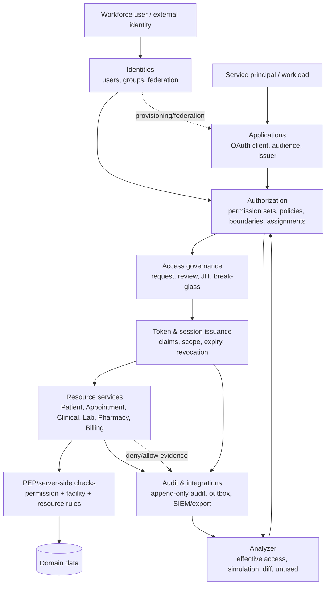
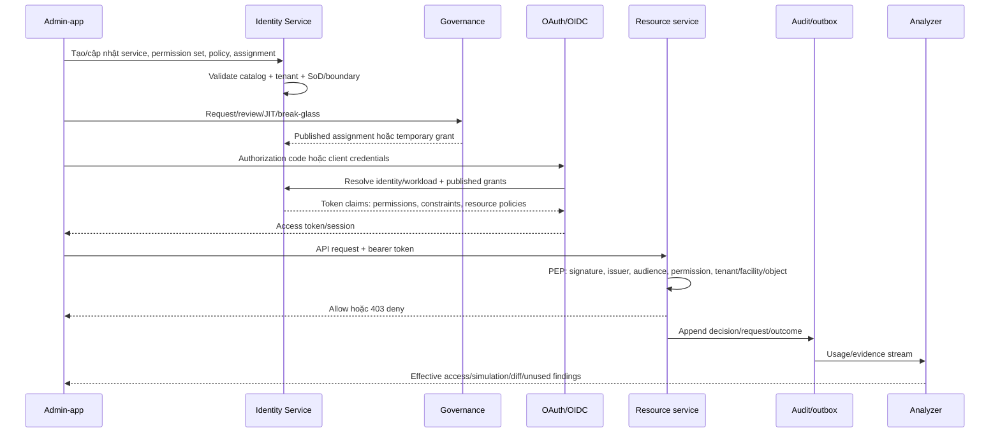
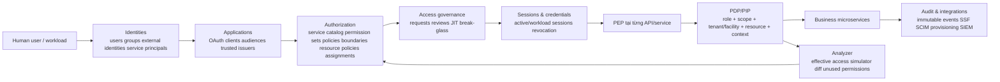

# Chuẩn hóa quyền và dữ liệu liên kết giữa các microservice

## Phạm vi

Identity Service là control plane: phát hành token, catalog permission, permission set và quyết định policy. Các service nghiệp vụ vẫn là resource server và phải kiểm tra quyền ở server-side; admin-app chỉ hiển thị/khởi tạo thao tác, không được tự quyết định quyền.

| Service | Dữ liệu chính | Permission namespace | Trạng thái route |
| --- | --- | --- | --- |
| Patient | patients, allergies, medical conditions | `patients.*` | route group + permission |
| Appointment | appointments | `appointments.*` | route group + permission |
| Clinical | encounters, diagnoses, procedures | `clinical.*` | route group + permission |
| Laboratory | orders, tests, results, critical alerts | `lab.*` | route group + permission |
| Pharmacy | medications, prescriptions | `pharmacy.*` | route group + permission |
| Billing | invoices, line items, payments | `billing.*` | route group + permission |
| Database continuity | backup/restore operations | `admin.*` | route group + permission |
| FHIR gateway | PHI interoperability | `patients.view`/`clinical.view` + FHIR scope + human principal | controller policy |
| External integration | event forwarding | internal event bus; `/health` and `/ready` anonymous | no business HTTP API |

`scripts/validate-authorization-endpoint-coverage.ps1` hiện kiểm kê 95 HTTP endpoints: 86 protected, 6 anonymous health/operational endpoints, 0 missing. FHIR controllers có policy riêng; gRPC handlers cần tiếp tục kiểm tra trong service-specific tests.

## IAM catalog

Identity startup seed đăng ký 12 resource definitions: identity, patients, appointments, clinical, lab, billing, pharmacy, fhir, external-integration, database-continuity, remediation và mobile. Các permission code vẫn chỉ khai báo tại `HisHopePermissions`; không tạo code tự do trong UI hoặc service.

## Flow tổng thể và ranh giới trách nhiệm



Luồng chuẩn là: **identity/application → authorization → governance → token/session → resource-service PEP → audit/analyzer**. Admin-app chỉ là control-plane client: đọc catalog, gửi lệnh create/update/publish/revoke và hiển thị kết quả; không được tự quyết định allow/deny. Mỗi resource service vẫn phải xác thực token và kiểm tra permission/facility/resource ở server-side.

### Sequence tương tác khi cấp và sử dụng quyền



Admin-app chỉ là PEP-aware management client: giao diện có thể ẩn/hiện thao tác theo snapshot quyền nhưng server mới là nơi quyết định cuối cùng. Một assignment mới chỉ có hiệu lực sau khi được publish và vượt qua boundary; revoke session/break-glass phải cập nhật revocation state để các service từ chối request tiếp theo.

## Ma trận mức độ áp dụng hiện tại

| Nhóm | Đã có trong repository/runtime | Chưa nên gọi là hoàn tất |
| --- | --- | --- |
| Identities | User/group, external-provider runtime, role template, group membership; token và gRPC permission resolver đã lấy assignment published | Federation/provisioning với tenant Google/Entra/SCIM thật cần live tenant và rollback drill |
| Applications | OAuth clients, service-principal/workload-role catalog, audience/trust-policy fields, admin CRUD endpoints/UI; client-credentials handler hiện resolve role theo `Audience`/client id, kiểm tra trust policy và giao cắt permission boundary trước khi ký token | Production vẫn cần secret Vault/KMS bền vững, audience validation tại từng resource service và revocation propagation |
| Authorization | 12 service definitions, canonical permission catalog, permission sets, assignments, boundaries, published resource-policy claims, shared resource-constraint/resource-policy PEP và route inventory 95/95 | Tenant/object selectors chưa được triển khai đồng nhất trong mọi handler; services chưa dùng resource tenant metadata vẫn dựa permission + facility + issued-boundary constraints |
| Access governance | Request/review/break-glass entities, API và admin views; break-glass approve/revoke có endpoint | Maker-checker/SoD, JIT activation và expiry phải có integration evidence; chưa có production approval workflow proof |
| Sessions & credentials | Browser session tracker, session exchange/logout, mobile/session operations, workload-session Redis inventory theo client/TTL, revoke từng session/revoke-all và shared revocation timestamp | Cross-region Redis replication, token introspection với JWE đầy đủ claims và production propagation drill cần evidence |
| Analyzer | Effective-access, policy simulation, analyzer findings, new-access diff và unused-permissions API/UI | Chưa phải formal policy decision point; kết quả chưa là bằng chứng thay thế PEP runtime và chưa có full historical usage model |
| Audit & integrations | Durable append-only DB audit + Serilog/observability sink, audit API, outbox/provisioning records | WORM/SIEM delivery, tamper-evidence, retention/alert drill và external SSF/SCIM/Chrome/PKI gates còn phụ thuộc môi trường ngoài |

### Kết luận trạng thái

Vì vậy câu trả lời chính xác là **chưa áp dụng hoàn tất 100%**. Phần control-plane, seed graph, menu/UI, canonical permission catalog, human/workload assignment resolution, shared resource-boundary/resource-policy PEP, workload session inventory và endpoint coverage đã được tích hợp. Các điểm còn thiếu là tenant/object selectors ở các entity chưa có metadata tương ứng và live external/enterprise evidence. Không nên đánh dấu enterprise production-ready cho tới khi các dòng “chưa nên gọi là hoàn tất” có gate tương ứng.

## Dữ liệu demo liên kết

Identity Service startup seed là nguồn chính cho workflow IAM: 7 role-template snapshot cho human roles, 5 workload/service roles, permission-set assignments, group membership, JIT request, access review, break-glass request, policy, boundary, device posture, provisioning và audit record.

Khi human đăng nhập, token generation hợp nhất role permissions truyền thống với các permission set đã publish được gán trực tiếp hoặc qua group membership; assignment hết hạn/inactive và set chưa publish không được đưa vào token.

Identity gRPC `CheckPermission`/`CheckAnyPermission` cũng dùng cùng tập permission động này. Vì vậy các gRPC resource service và authorization handler không phụ thuộc riêng vào role claim cũ khi control-plane assignment thay đổi.

`scripts/seed-demo-services.ps1` mặc định **không** tạo bệnh nhân; graph nghiệp vụ dưới đây chỉ là fixture tùy chọn, idempotent bằng UUID ổn định:

```text
patient
  └─ appointment ── encounter ── lab order ── lab test ── lab result
       └─ prescription ── medication
       └─ invoice ── invoice line item
```

Chạy sau khi PostgreSQL và các migration đã healthy:

```powershell
.\scripts\seed-demo-services.ps1
```

Muốn tạo fixture lâm sàng riêng cho contract/E2E mới dùng:

```powershell
.\scripts\seed-demo-services.ps1 -IncludeClinicalData
```

Script chỉ dành cho local/demo, không chứa PHI và không được chạy trên production. Chạy lại an toàn (`ON CONFLICT DO NOTHING`). Mọi record dùng facility `demo-hospital`, user/provider demo và email `.local`.

## Gating vận hành

1. `docker compose ... up -d` và kiểm tra container/database healthy.
2. Chạy seed script; kiểm tra các UUID liên kết ở sáu database.
3. Chạy `scripts/validate-authorization-endpoint-coverage.ps1` và giữ kết quả `missing=0`.
4. Với production, tắt seed demo, dùng migration/fixture riêng có phê duyệt, và chứng minh deny-by-default/BOLA ở integration tests.

Seed dữ liệu không phải bằng chứng production readiness. Cần thêm live token, facility scope, gRPC authorization, audit/SIEM và backup/restore evidence trước khi gọi là hoàn tất enterprise gate.

### Evidence mới nhất (2026-08-15)

- `dotnet build .../IdentityService.Api.csproj --no-restore`: pass, 0 errors (warnings hiện hữu trong generated gRPC/nullable code).
- `dotnet test .../IdentityService.Application.Tests.csproj --no-restore`: 123 passed, 0 failed.
- `scripts/validate-authorization-endpoint-coverage.ps1`: `total=95 protected=86 anonymous=6 missing=0`.
- Shared foundation catalog và i18n boundary: pass.
- Identity container sau rebuild/recreate: healthy; `/Account/Login` trực tiếp qua port 5001 trả HTTP 200.
- `/health/ready` trực tiếp qua port 5001 trả HTTP 200; toàn bộ 32 container local hiện ở trạng thái Up, core services healthy.
- Negative token gate: client-credentials với secret sai trả HTTP 401 `invalid_client`.
- Positive local M2M gate: `clinical-service` với secret dev deterministic được seeder đồng bộ trả HTTP 200 và access token; role được resolve theo audience, trust policy và boundary trước khi phát hành.
- Local introspection gate: access token M2M trả `active=true`, `sub=clinical-service`, `aud=clinical-service`, scope `hishop:clinical`.
- Local workload-session gate: sau khi phát hành token, Redis có client set và session record `HisHope:workload_sessions:clinical-service:*` với `IssuedAt`/`ExpiresAt` đúng TTL 900 giây theo role seed.
- Shared authorization tests hiện 33 passed, gồm resource-policy allow/deny và resource-pattern matching.
- Identity application tests: 123 passed sau khi token claims hợp nhất assignment trực tiếp, group và break-glass; bao gồm workload-session và resource-policy paths.
- IAM control-plane hardening: assignment kiểm tra principal tồn tại và scope descendant hợp lệ; resource policy chỉ chấp nhận service đang active trong catalog; human resource-policy claims bao gồm group assignment active còn hạn.
- Docker integration runner: gate đã được harden để dùng NuGet config Linux cô lập, tránh Windows `project.assets.json` fallback path; run hiện tại pass **191/191 integration tests**, 0 failed/0 skipped trên PostgreSQL + Redis network cô lập.
- Verification update 2026-08-16: IAM overview hardening is deployed and runtime smoke is green (`/Account/Login=200`, `/health/ready=200`, admin-app `200`, both containers healthy). Application authorization tests are `135/135` and shared authorization `33/33`. A new disposable Docker integration attempt was environment-blocked by Testcontainers container lifecycle races, so it is not promoted to pass; retain the prior 191/191 result as the last successful Docker integration evidence.
- Final Docker gate after wrapper cleanup hardening: **192/192 integration tests passed**, 0 failed/0 skipped. The earlier “network not found” result occurred only during disposable-resource cleanup and no longer changes the test exit status.
- Admin E2E: targeted `09-admin.spec.js` không đạt vì fixture dùng `admin@hishop.com` nhưng runtime không có `E2E_PASSWORD`/bootstrap password khớp; screenshot ghi nhận `Invalid email or password`. Không reset password runtime tự động và không dùng credential mặc định để biến gate thành pass.

Các bằng chứng trên xác nhận build, unit/application behavior, route coverage và local Docker smoke; positive gate chỉ chứng minh đường dẫn local Development. Nó **không** thay thế secret Vault/KMS production, resource-policy decision tại từng service hoặc external provider/SIEM drills.

### Verification update — 2026-08-16 authenticated admin control-plane

- Shared foundation đã serialize BFF session exchange để tránh concurrent refresh xoay `hishop_sid` gây phiên stale.
- Gateway giữ protected session token và chuyển qua `X-HisHope-Session-Token`; continuity service xác thực browser session từ Redis/DataProtection, không tin cookie độc lập.
- Với `config/compose.runtime.env` và Vault dev token rõ ràng, continuity status trả **200**; `vault_unavailable` vẫn được giữ fail-closed khi Vault transit dev chưa reachable.
- Admin IAM menu E2E authenticated: **3/3 viewport (chromium, mobile, tablet) pass**, không có HTTP 4xx/5xx hoặc page error.
- Bằng chứng này xác nhận luồng local Identity → BFF → Gateway → IAM/continuity → Admin UI. Các live gate vendor/PKI/device/SIEM/HA-DR vẫn cần external evidence riêng.
- Compose hardening: các biến critical `REDIS_URL` và `SERVICE_IDENTITY_URL` có default DNS nội bộ (`redis://redis:6379`, `http://identityservice:5003`), nên chạy `docker compose` không kèm env-file không còn làm continuity/service JWT khởi động với chuỗi rỗng. Các biến optional như provider credentials và telemetry vẫn cố ý để trống nếu chưa cấu hình.
- Revalidation sau hardening: Database Continuity build **0 errors**, Identity Application **141/141**, Shared Authorization **33/33**, frontend-foundation **56/56**, admin-app production build pass; authorization inventory vẫn `95/86/6/0`.
- Full Docker Identity integration rerun trên network cô lập ngày 2026-08-16: **204/204 pass**, 0 failed/0 skipped; đây là evidence mới nhất thay cho các snapshot 192/192 trước đó.

### Frontend SSO header-buffer correction — 2026-08-16

- Nginx frontend đã tái hiện lỗi `502 Bad Gateway` tại `POST /Account/Login` với log `upstream sent too big header while reading response header from upstream`; nguyên nhân là các cookie xác thực chunked vượt buffer mặc định 4 KiB.
- Route `/Account/` nay dành buffer response header `32k` (`8 x 32k`, busy `64k`) trong khi vẫn giữ body buffering tắt. Không đổi port public và không nới lỏng xác thực.
- Frontend image đã rebuild/recreate thành công, `his-hope-frontend` healthy.
- SSO smoke sau sửa: **12/12 pass** (chromium, mobile, tablet), gồm đăng nhập một lần mở cả ba ứng dụng, responsive shell, dashboard lazy routes và admin tables; không còn 502 ở login.
- Continuity status hardening: `VaultContinuityClient` chuyển lỗi kết nối Vault thành trạng thái degraded (`reachable=false`, `error` redacted theo response contract) thay vì ném exception làm UI nhận HTTP 500; các mutation backup/restore vẫn fail-closed qua `IsReady`.
- Admin IAM menu traversal sau continuity rebuild: **3/3 pass** (chromium, mobile, tablet), không còn HTTP 500 ở `database-continuity/status`.
- Applications projection upgrade: Identity Service now exposes protected `/api/v1/admin/iam/api-audiences` (workload-role backed) and `/api/v1/admin/iam/trusted-issuers` (safe configuration-backed issuer metadata); admin-app has canonical contracts, separate Applications menu entries and shared-foundation data tables. Contract test `Applications_projections_expose_api_audiences_and_trusted_issuers_from_server_catalog` passed **1/1** with anonymous `401` and authenticated `200` assertions.
- Permission-set mutation upgrade: added audited server-side `PUT /api/v1/admin/iam/permission-sets/{id}`. It validates every permission against the canonical catalog, increments the version, returns the set to draft before republish, and admin-app now exposes an Edit action that can add/remove permissions. Focused lifecycle test (create → update permissions → publish → assign → effective access → revoke) passed **1/1**.
- Local E2E credential gate: the persisted development admin password was not known because `compose.runtime.env` intentionally leaves bootstrap password empty and reset disabled. For this validation only, Identity was recreated with process-scoped `IDENTITY_BOOTSTRAP_ADMIN_PASSWORD=DevAdmin1!` and reset enabled; no secret was written to the repository. Admin menu traversal then passed **3/3** again. Production must use secret storage and `ResetPassword=false`.
- Final static authorization revalidation after these routes: `96 total / 87 protected / 6 anonymous / 0 missing`; authorization contract and API security contract both pass.
- Final runtime image validation after rebuilding Identity with permission-set `PUT`: Identity/admin containers healthy, `/health/ready=200`, and SSO smoke passed **12/12** across chromium/mobile/tablet. The focused permission-set lifecycle test remains **1/1** and the new projection contract remains **1/1**.
- A fresh full Docker runner attempt was environment-blocked by runner exit `137` (host memory pressure during compile); it is not counted as a failed product test. The direct Testcontainers host run subsequently passed **205/205**, including the new IAM invariants, with 0 failed/0 skipped.
- Authorization workflow hardening update: server now rejects assignment to a non-published permission set (`409 permission_set_must_be_published`) and emits audit events for permission-set publish, assignment create and assignment revoke. Focused Testcontainers lifecycle test (including the draft-assignment rejection) passed **1/1** directly on the host; the Docker runner remains environment-blocked independently of product assertions.
- Boundary hardening update: boundary creation now resolves the principal against an active human user or active workload role; fabricated principal IDs are rejected with `404 principal_not_found`. Group/boundary/resource-policy/analyzer focused contract passed **1/1**; Identity image was rebuilt and restarted with readiness `200`.
- Post-restart browser validation: SSO/responsive smoke passed **12/12** across Chromium, mobile and tablet after the final Identity image restart; admin `8083` and Identity readiness `5001` both returned `200`.
- CRUD/lifecycle update: server and admin-app now support audited Update for services, workload roles, groups and resource policies; resource-policy updates increment version and return to draft before republish. Admin menu coverage passed **3/3** after rebuilding both images. Full Identity suite after these routes passed **207/207**, 0 failed/0 skipped.
- Final static authorization revalidation after CRUD routes: `99 total / 90 protected / 6 anonymous / 0 missing`; API security contract passed.

### IAM control-plane flow và mức hoàn thiện — 2026-08-16



| Nhóm | Backend/API hiện có | Admin UI hiện có | Đánh giá |
|---|---|---|---|
| Identities | workforce users, groups, external providers, service principals/workload roles, lifecycle và scope checks | menu directory/workforce, groups, external identities, service principal | **Có nền tảng**, membership/lifecycle chuyên sâu còn cần mở rộng |
| Applications | OAuth clients, service catalog, audiences/trust projections, provisioning adapters | OAuth client, workload identity, authentication provider, provisioning | **Có**, API audience/trusted-issuer CRUD chưa tách 1:1 đầy đủ |
| Authorization | permission catalog/sets, assignments, policies, boundaries, resource policies, effective access, publish/rollback | fine-grained access, permission set, policy, boundary, resource policy, assignments | **Có P0/P1**, policy editor/compiler chuyên dụng và delegated administration còn thiếu |
| Access governance | access request/review, SoD, JIT/break-glass pilot endpoints, expiry/revoke | requests & reviews, JIT, break-glass | **Pilot/partial**, queue/campaign/approval UI và event history chưa đầy đủ |
| Sessions & credentials | browser/workload session stores, revoke/revoke-all, credential reset, MFA/passkey paths | identity operations/security provider views | **Có P0**, credential inventory/rotation và workload session UX cần hoàn thiện |
| Analyzer | effective access, new-access diff, unused permissions control-plane endpoints | analyzer menu/actions | **Có control-plane**, chưa phải distributed production Access Analyzer |
| Audit & integrations | audit events, SSF outbox/retry, SCIM/GWS/Entra adapters, export/read APIs | audit/integration projections trong capabilities | **Có nền tảng**, SIEM/WORM, vendor conformance và delivery dashboards cần live evidence |

Kết luận: các nhóm đã được nối thành một vertical slice chạy được trong local Docker và được bảo vệ server-side; **chưa thể tuyên bố hoàn tất 1:1 hoặc enterprise production**. Các phần còn lại là capability hardening (policy compiler/distributed analyzer, delegated governance, approval/event UX, external SIEM/WORM, HA/DR và vendor/PKI/device live gates), không được suy diễn là đã đạt chỉ từ việc menu hiển thị hoặc unit/integration tests.
