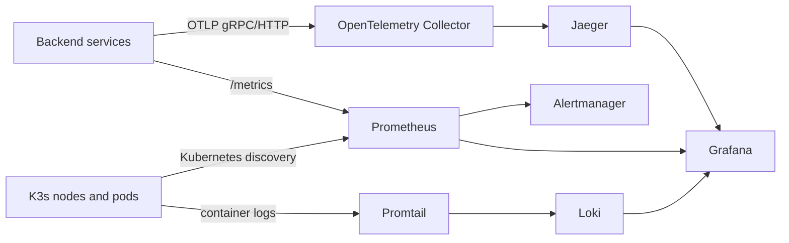

# His.Hope K3s observability

## Phạm vi

Stack observability local K3s thu thập ba tín hiệu chính:



Các workload backend được đánh dấu `prometheus.io/scrape: "true"` bằng
`k8s/overlays/dev/observability-local-patch.yaml`. UI và BFF không có endpoint
metrics sẽ không bị scrape nhầm.

## Thành phần và truy cập

| Thành phần | Service nội bộ | URL local qua Traefik |
|---|---|---|
| Grafana | `grafana.monitoring.svc.cluster.local:3000` | `http://grafana.his-hope.local:9080` |
| Prometheus | `prometheus.monitoring.svc.cluster.local:9090` | `http://prometheus.his-hope.local:9080` |
| Jaeger | `jaeger.monitoring.svc.cluster.local:16686` | `http://jaeger.his-hope.local:9080` |
| Loki | `loki.monitoring.svc.cluster.local:3100` | dùng qua Grafana |
| Alertmanager | `alertmanager.monitoring.svc.cluster.local:9093` | dùng nội bộ |
| OTLP gRPC | `otel-collector.monitoring.svc.cluster.local:4317` | dùng nội bộ |
| OTLP HTTP | `otel-collector.monitoring.svc.cluster.local:4318` | dùng nội bộ |

Thêm vào hosts file Windows:

```text
127.0.0.1 grafana.his-hope.local prometheus.his-hope.local jaeger.his-hope.local
```

Grafana local dùng Secret `monitoring/grafana-admin`; giá trị `admin/admin` chỉ
phù hợp cho môi trường dev. Production phải thay Secret bằng Vault/SecretProvider
và bật SSO, không commit mật khẩu.

## Deploy hoặc cập nhật

Ứng dụng và observability được apply riêng để Kustomize không phụ thuộc đường
dẫn ngoài tree:

```powershell
kubectl apply -k k8s/overlays/dev
kubectl apply -k k8s/observability
kubectl -n monitoring rollout status deploy/prometheus --timeout=180s
```

Prometheus dùng PVC local-path 10Gi và chiến lược `Recreate` vì PVC RWO. Đây là
lựa chọn an toàn cho một replica local, không phải HA production.

## Kiểm tra runtime

```powershell
kubectl -n monitoring get pods,pvc,ingress
kubectl -n monitoring exec deploy/prometheus -- wget -qO- http://127.0.0.1:9090/-/ready
kubectl -n monitoring exec deploy/grafana -- wget -qO- http://127.0.0.1:3000/api/health
kubectl -n monitoring exec deploy/alertmanager -- wget -qO- http://127.0.0.1:9093/-/ready
kubectl -n monitoring exec deploy/loki -- wget -qO- http://127.0.0.1:3100/loki/api/v1/status/buildinfo
kubectl -n monitoring exec deploy/loki -- wget -qO- http://127.0.0.1:3100/loki/api/v1/labels
```

Kiểm tra backend targets:

```powershell
$targets = kubectl -n monitoring exec deploy/prometheus -- wget -qO- `
  http://127.0.0.1:9090/api/v1/targets | ConvertFrom-Json
$targets.data.activeTargets |
  Where-Object { $_.labels.namespace -eq 'his-hope-dev' } |
  ForEach-Object { "{0} {1} {2}" -f $_.labels.service, $_.health, $_.lastError }
```

Các rule hiện có: workload down, HTTP 5xx rate, p99 latency và trạng thái
Linkerd proxy. Alertmanager đã nhận alert từ Prometheus; receiver mặc định
không gửi ra ngoài. Muốn có cảnh báo thật phải cấu hình receiver (email,
Webhook, PagerDuty hoặc hệ thống notification nội bộ) qua Secret/Vault.

## Giới hạn dev và yêu cầu production

- Prometheus, Grafana, Jaeger, Loki, Alertmanager hiện mỗi loại một replica.
- PVC `local-path` không chịu được mất node; production cần storage phân tán.
- Metrics production nên remote-write vào Thanos/Mimir hoặc Prometheus HA có
  deduplication; logs Loki cần object storage và compactor HA; traces Jaeger
  cần Elasticsearch/OpenSearch hoặc backend tương đương.
- Alertmanager cần tối thiểu hai replica, gossip configuration và receiver
  có kiểm thử delivery.
- Grafana cần SSO/RBAC, SecretProviderClass/Vault CSI và audit log.
- Cần bổ sung synthetic probes cho OIDC discovery, login callback, logout,
  API 401/403 và các route Angular/mobile; không dùng health của pod thay cho
  kiểm thử nghiệp vụ.
- Job Linkerd được giữ riêng khỏi job application metrics. Một số proxy có thể
  không expose admin port 4191 qua pod IP; phải xác nhận policy/port của Linkerd
  trước khi coi mesh scrape là production gate.

## Rollback

```powershell
kubectl -n monitoring rollout history deploy/prometheus
kubectl -n monitoring rollout undo deploy/prometheus
kubectl delete -k k8s/observability
```

Không xóa PVC nếu cần giữ dữ liệu metrics/logs/traces.
