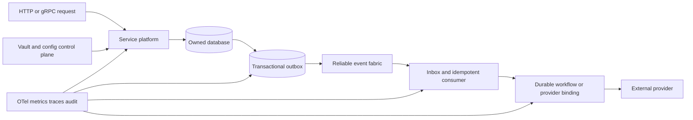

# Đánh giá Dapr building blocks và lộ trình reliability cho His.Hope

> Ngày đánh giá: 2026-08-03. Phạm vi: microservices backend, event bus,
> integrations và platform shared foundation. Đây là đánh giá kiến trúc, không
> phải đề xuất cài Dapr mặc định.

## Kết luận

His.Hope đã có nền tảng tốt cho reliability: transactional Outbox, RabbitMQ,
Inbox, Redis, Vault Transit, Polly pipelines, OTel và health checks. Điểm chưa
đạt là tính **bắt buộc và đồng nhất**: các capability chưa được áp dụng/kiểm
chứng cho mọi service và chưa có durable orchestration chung cho nghiệp vụ dài
hạn.

Không nên đưa Dapr vào chỉ để "có Dapr". Dapr là một tập hợp abstraction và
runtime tốt; với codebase .NET hiện tại, đích phù hợp hơn là xây **His.Hope
Reliable Application Platform** có hợp đồng tương đương. Chỉ pilot Dapr khi
cần portability đa runtime/language hoặc muốn giảm chi phí tự vận hành adapter.

## Chuẩn tham chiếu

Dapr tách khả năng hệ phân tán thành workflow, service invocation, state
management, bindings, secrets, configuration, distributed lock và jobs. Tài
liệu Dapr cũng tách resiliency policy cho retry, timeout, circuit breaker và
health checks.

Nguồn chính thức:

- [Building blocks](https://docs.dapr.io/developing-applications/building-blocks/)
- [Service invocation](https://docs.dapr.io/developing-applications/building-blocks/service-invocation/)
- [Pub/sub](https://docs.dapr.io/developing-applications/building-blocks/pubsub/)
- [State management](https://docs.dapr.io/developing-applications/building-blocks/state-management/)
- [Workflow](https://docs.dapr.io/developing-applications/building-blocks/workflow/)
- [Secrets](https://docs.dapr.io/developing-applications/building-blocks/secrets/)
- [Configuration](https://docs.dapr.io/developing-applications/building-blocks/configuration/)
- [Distributed lock](https://docs.dapr.io/developing-applications/building-blocks/distributed-lock/)
- [Jobs](https://docs.dapr.io/developing-applications/building-blocks/jobs/)
- [Resiliency policies](https://docs.dapr.io/operations/resiliency/)

## So sánh hiện trạng

| Dapr capability | His.Hope hiện có | Đánh giá reliability | Nâng cấp cần thiết |
|---|---|---|---|
| Service invocation | API Gateway, HTTP/gRPC, Polly pipeline, correlation | Trung bình | Chuẩn hóa named outbound clients, deadline, retry classification, bulkhead và service identity. Không retry mutation không idempotent. |
| Pub/sub | RabbitMQ event bus, publisher confirms, channel pool, Outbox; external relay | Khá tốt ở core services | Ép Outbox + Inbox ở mọi producer/consumer; versioned envelope; retry/DLQ/redrive/audit chuẩn; quorum queues/cluster ở production. |
| State management | Cockroach/PostgreSQL theo bounded context, Redis cache/session, EF saga state | Khá tốt nhưng phân tán | Không dùng state store thay DB nghiệp vụ. Chuẩn hóa state contract cho workflow, idempotency, leases và ephemeral state. |
| Workflow | `EfSagaStateStore`, job stores riêng | Yếu | Durable workflow runtime: deterministic transition, activity retry, timer, compensation, idempotent resume, status/audit. |
| Bindings | Adapter riêng FCM/APNs, S3-compatible backup, external integration | Trung bình | Chuẩn hóa input/output binding contract: timeout, idempotency key, health, metrics, secret reference và per-provider DLQ. |
| Secrets | Vault Transit, key rotation paths, secret options | Trung bình | Vault workload auth, dynamic database credentials, lease renewal/revocation, rotation drill và secret provenance audit. |
| Configuration | appsettings/Compose, admin settings, một số runtime reload | Trung bình | Versioned config registry; signed change/audit/approval; watcher, staged rollout, rollback and effective version. |
| Distributed lock | Lock attribute và Redis infrastructure seam | Chưa đủ bằng chứng runtime | Fencing token, bounded lease, owner renewal, metrics; chỉ dùng khi optimistic concurrency/idempotency không đủ. |
| Jobs | Hosted workers, continuity scheduler, outbox processors | Trung bình | Durable scheduled-job contract: schedule store, single execution lease, misfire policy, retry/DLQ, run history/replay. |
| Observability | OTel, metrics, health, structured logs, audit | Khá tốt | Trace propagation bắt buộc qua event envelope; SLO theo dependency; chaos/restore test. |

## Bằng chứng trong codebase

- `AddHisHopeServicePlatform` đã gom localization, observability, resilience,
  Vault, health, cache/messaging infrastructure.
- `OutboxProcessor<TDbContext>` claim lease theo replica, retry exponential,
  dead-letter và metrics; các core service đã dùng Outbox.
- `InboxDeduplicator` có unique event/consumer guard, nhưng phải được đăng ký
  và handler dùng thực tế tại mọi consumer để tạo at-least-once an toàn.
- `RabbitMQEventBus` có publisher confirms/channel pool; tài liệu nội bộ đã
  đặt at-least-once là delivery contract, không tuyên bố exactly-once.
- `EfSagaStateStore` chỉ lưu trạng thái; chưa phải workflow engine có durable
  timer, activity retry hoặc deterministic replay.
- `VaultTransitClient` xử lý encrypt/decrypt và status, nhưng production secret
  lifecycle còn phải được chuẩn hóa ở authentication/lease/rotation.

## Kiến trúc đích

Request path chỉ hoàn tất transaction local; side effect xuyên service/ra ngoài
luôn qua Outbox, Inbox và workflow hoặc binding. Không có exactly-once end to
end; cam kết đúng là at-least-once + deduplication + idempotent effect.

## Lộ trình đề xuất

### P0 — Bắt buộc trước khi scale replica

1. **Reliable messaging contract.** Event có `eventId`, `eventType`,
   `schemaVersion`, `occurredAt`, `correlationId`, `causationId`, facility/tenant
   scope và classification; cấm publish trực tiếp trong request transaction.
2. **Outbox/Inbox enforcement.** Architecture test fail khi producer không có
   Outbox hoặc consumer mutates state mà không có Inbox/idempotency. DLQ/replay
   phải có RBAC, audit và bounded retry.
3. **Outbound invocation policy.** Shared typed client bắt buộc: deadline,
   retry chỉ với operation an toàn, circuit breaker, bulkhead, cancellation và
   correlation. Add service identity and mTLS at production boundary.
4. **Production broker baseline.** RabbitMQ quorum queues, replicated nodes,
   durable exchange/queues, publisher confirms, prefetch limit, DLQ per
   domain/provider. Dashboard SLO: oldest outbox, queue lag, DLQ, handler
   latency and duplicate rate.
5. **Fault verification.** Broker unavailable, consumer crash after
   effect-before-ack, duplicate delivery, DB failover, timeout storm, replay
   and restore with pending messages.

### P1 — Durable orchestration và control plane

1. Tạo `His.Hope.DurableWorkflows`: persistent execution/history, optimistic
   concurrency, activity retry policy, timer, compensation, cancellation,
   idempotent resume and audit.
2. Chuyển backup/restore drill, notification delivery, external provider
   delivery và multi-service administrative operation sang workflow/job contract.
3. Versioned runtime configuration: typed schema, validation, approval, audit,
   staged rollout, subscription/reload, rollback and effective-config endpoint.
4. Binding SDK chuẩn cho FCM/APNs, S3, LDAP/SAML dependent integration và HIS/LIS
   partner; binding có health, secret reference, rate limit, circuit breaker và DLQ.
5. Secrets lifecycle: workload identity to Vault, dynamic DB creds, rotation
   with dual-key overlap, revoke/drill and zero secret values in telemetry.

### P2 — Multi-region và ecosystem scale

1. Event schema registry/compatibility gate, consumer contract tests and replay
   sandbox; partition by facility/tenant and retention/archive.
2. Geo/region-aware deployment: data residency, region-scoped topics, failover
   runbook and measurable RPO/RTO.
3. Distributed lock service only for irreducible cross-replica sections, with
   fencing token and contention SLO; prefer optimistic concurrency first.
4. Developer golden-path template generates service, component config,
   telemetry dashboard, runbook, contract/chaos tests and deployment policy.

## Dapr adoption decision

### Giữ platform native .NET (khuyến nghị hiện tại)

Phù hợp nếu phần lớn service là .NET, RabbitMQ/Redis/Vault đã được vận hành,
và đội ngũ muốn kiểm soát direct dependency/latency. Hoàn thành P0/P1 trước;
không tạo layer abstraction mơ hồ chỉ để giống Dapr.

### Pilot Dapr có kiểm soát

Chỉ dùng cho bounded context không chứa PHI trực tiếp, ví dụ external
integration relay hoặc notification delivery. Pilot cần chứng minh latency/error
budget không xấu hơn native platform; component rollout, mTLS, secret access và
audit vận hành được; không có dual publish/dual retry gây duplicate effect; và
có kế hoạch exit. Không đặt Identity/OIDC, patient clinical write path hoặc
database continuity vào pilot đầu tiên.

## Definition of reliable

Service chỉ được gắn nhãn **reliable-ready** khi:

- owned database, migration deploy job và backup/restore evidence;
- mutation idempotent; outbound operation có deadline/cancellation;
- producer dùng transactional Outbox, consumer có Inbox/idempotent effect;
- retry/DLQ/replay bounded và audited;
- health/readiness không che giấu dependency failure;
- SLO, alert, trace/correlation và runbook tồn tại;
- đã chạy fault-injection và replica/restore validation.
