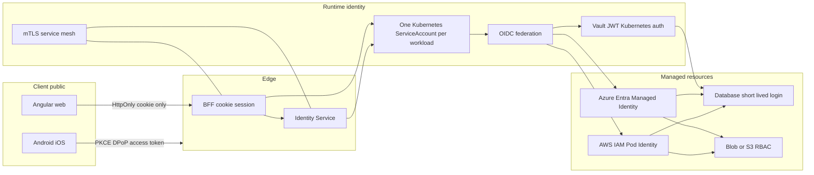

# Workload identity: loại bỏ credential tĩnh khỏi His.Hope

Ngày nghiên cứu: 2026-08-03  
Phạm vi: microservices .NET, BFF/Angular, mobile Android/iOS, PostgreSQL, object storage, Vault, CI/CD và môi trường Azure/AWS/on-prem.

## Kết luận

Mục tiêu đúng không phải là **không có danh tính** hay **không có bất kỳ secret nào**. Mục tiêu là: mã ứng dụng, image, manifest, Angular và mobile **không sở hữu password, access key, client secret hay Vault root token dài hạn**. Mỗi workload nhận một bằng chứng danh tính ngắn hạn từ runtime, đổi nó lấy token/credential ngắn hạn, và được cấp quyền tối thiểu tới từng tài nguyên.

Đây là cơ chế mà Azure gọi là Managed Identity/Workload Identity và AWS triển khai bằng EKS Pod Identity/IAM role. Azure cho phép workload lấy Entra token mà không quản lý credential; AWS gắn IAM role vào Kubernetes service account thay vì phân phối AWS credential vào container. [Azure Managed Identity](https://learn.microsoft.com/en-us/entra/identity/managed-identities-azure-resources/overview), [AKS Workload Identity](https://learn.microsoft.com/en-us/azure/aks/workload-identity-overview), [EKS Pod Identity](https://docs.aws.amazon.com/eks/latest/userguide/pod-identities.html).

## Hiện trạng His.Hope

Đã có các nền tảng cần giữ:

- Web đang đi theo BFF session cookie `HttpOnly` + CSRF; Angular không cần giữ token truy cập.
- Mobile có Authorization Code + PKCE, secure storage và DPoP sender-constrained token.
- Vault Transit, JWE/key rotation, OIDC, passkey/MFA, permission/audit và event reliability đã có seam dùng chung.

Khoảng cách production:

- `docker/docker-compose.yml` còn inject `VAULT_DEV_ROOT_TOKEN_ID`, `VAULT_TOKEN` và connection string PostgreSQL có password vào nhiều workload. Đây chỉ phù hợp local/test.
- Vault file storage hiện tại là single-node persistent local; chưa là Vault HA, auto-unseal, TLS hay authentication bằng workload identity.
- Database credentials chưa lease/rotate theo workload; mỗi domain service chưa có identity và role độc lập ở infrastructure layer.
- Chưa thấy deployment contract cho Kubernetes service account, cloud role/RBAC, NetworkPolicy hoặc mTLS workload-to-workload.

## Kiến trúc đích



### Quy tắc bắt buộc

1. Một workload/service account/role cho mỗi service và môi trường; không dùng `default` service account, không dùng role dùng chung cho Patient, Billing, Identity và backup worker.
2. Token phải audience-bound, thời hạn ngắn, tự refresh; mọi quyền cấp bằng RBAC/IAM policy theo resource và action.
3. Mỗi resource có identity plane riêng: database, object storage, queue, Vault và CI/CD không chia access key/password.
4. Endpoint, database name, vault path và tenant ID có thể nằm trong config; password, token, private key dài hạn không được nằm trong config/image/log.
5. Network path phải bị giới hạn bằng private endpoint/security group/NetworkPolicy và TLS/mTLS. Identity không thay thế network isolation.

## Chọn adapter theo môi trường

| Nhu cầu | Azure | AWS | On-prem/hybrid |
|---|---|---|---|
| Pod/service identity | AKS Workload Identity + Entra federated credential | EKS Pod Identity, IAM role gắn service account | Kubernetes projected service-account JWT -> Vault JWT/Kubernetes auth |
| Blob/object | Azure Storage RBAC với managed identity | IAM role + SDK default credential chain cho S3 | MinIO role/STS hoặc Vault-generated credential |
| PostgreSQL | Microsoft Entra workload/managed identity nếu engine hỗ trợ; nếu không Vault dynamic DB credential | RDS IAM DB auth token; token sống 15 phút | Vault database secrets engine, user/password lease ngắn hạn |
| Secret/transit | Key Vault/Managed HSM hoặc Vault với workload auth | KMS/Secrets Manager hoặc Vault với workload auth | Vault HA + HSM/KMS unseal |
| CI/CD | OIDC federation vào Entra | OIDC federation vào IAM role | OIDC/JWT auth vào Vault, không static token |

## Hồ sơ triển khai self-host hoàn toàn

Nếu His.Hope không phụ thuộc Azure/AWS, chọn **Kubernetes + SPIFFE/SPIRE + Vault HA + PostgreSQL + MinIO + RabbitMQ + Redis** làm identity và resource plane nội bộ. Không có dịch vụ cloud nào là điều kiện bắt buộc.

```text
Kubernetes ServiceAccount / node attestation
  -> SPIRE Server và SPIRE Agent
  -> X.509 SVID, JWT SVID ngắn hạn
  -> service mesh mTLS và policy service-to-service
  -> Vault Kubernetes/JWT authentication
  -> Vault PKI, Transit, database dynamic credentials
  -> PostgreSQL, MinIO, RabbitMQ, Redis
```

- **SPIRE** phát SPIFFE identity ngắn hạn cho workload bằng attestation và tự xoay SVID; service dùng X.509 SVID để mTLS hoặc JWT SVID cho API-to-API. SPIFFE là tiêu chuẩn mã nguồn mở cho workload identity trong môi trường động/khác loại. [SPIFFE overview](https://spiffe.io/docs/latest/spiffe-about/overview/).
- **Vault HA** là secret/crypto authority nội bộ, không phải nơi phát root token cho app. Workload đăng nhập bằng Kubernetes JWT hoặc JWT SVID; policy bind theo service account, namespace, audience và SPIFFE ID nếu dùng bridge phù hợp.
- **PostgreSQL** giữ TLS bắt buộc; Vault Database Secrets Engine cấp một username/password duy nhất theo instance và lease 15–60 phút cho từng service. Vault có dynamic role, revoke theo lease, và audit được theo SQL username. [Vault Database Secrets Engine](https://developer.hashicorp.com/vault/docs/secrets/databases). Password tồn tại rất ngắn trong memory/pool của workload, không nằm trong file/config/image.
- **MinIO** thay Blob/S3 cloud: backend lấy STS credential/presigned URL TTL ngắn từ service capability nội bộ; Angular/mobile không biết account MinIO dài hạn.
- **RabbitMQ/Redis** dùng TLS/mTLS, user/ACL riêng theo service hoặc certificate-based auth khi component hỗ trợ; không dùng account chung.
- **PKI/auto-unseal**: Vault vẫn cần trust root và unseal key. Self-host phải dùng HSM on-prem hoặc quorum Shamir unseal với người giữ key khác nhau; không thể “xóa” hoàn toàn root of trust. Backup encrypted của Vault/PostgreSQL/MinIO phải nằm ở storage self-host độc lập, có kiểm tra restore.

Self-host không có nghĩa một máy Docker Compose. Production tối thiểu cần Kubernetes HA/control-plane, Vault Raft 3 hoặc 5 node, PostgreSQL HA/replica+PITR, MinIO distributed erasure coding, private network, backup site khác vị trí và monitoring/SIEM nội bộ.

AWS RDS IAM database authentication không cần database password ở application; token được sinh theo yêu cầu, sống 15 phút, và TLS vẫn bắt buộc. Phải thiết kế pool để lấy token mới trước khi mở kết nối mới. [AWS RDS IAM DB authentication](https://docs.aws.amazon.com/AmazonRDS/latest/UserGuide/UsingWithRDS.IAMDBAuth.html). Với AKS, service-account token được project vào pod và đổi qua OIDC federation lấy Entra token; token phải có audience đúng. [AKS Workload Identity](https://learn.microsoft.com/en-us/azure/aks/workload-identity-overview).

## Shared foundation cần chuẩn hóa

Tạo một contract nhỏ, cloud-neutral trong `src/Shared`, không để domain service phụ thuộc Azure/AWS SDK trực tiếp:

```text
IWorkloadIdentityTokenSource
  GetTokenAsync(audience, scopes)

IResourceCredentialProvider
  GetDatabaseCredentialAsync(resource, database, role)
  GetObjectStorageCredentialAsync(resource, permissions)

ISecretLeaseProvider
  GetLeaseAsync(path)
  RenewAsync(lease)

IWorkloadAuthorizationContext
  ServiceName, Environment, ServiceAccount, Tenant, CorrelationId
```

- `AzureWorkloadIdentityTokenSource`: `DefaultAzureCredential`/`WorkloadIdentityCredential`.
- `AwsWorkloadIdentityTokenSource`: AWS SDK default credential chain/EKS Pod Identity.
- `VaultWorkloadCredentialProvider`: Vault JWT/Kubernetes auth, database dynamic leases, Transit encryption.
- `LocalDevelopmentCredentialProvider`: only `Development`; compose secrets are explicit local fixtures and CI rejects them for production manifests.

Adapter chọn bằng deployment config, còn API/application layer chỉ nhận credential lease hoặc SDK client. Không share EF entity hay connection string giữa service.

## Nâng cấp theo P0–P2

### P0 — chặn secret tĩnh ở đường production

1. Lập inventory tự động: connection-string password, `VAULT_TOKEN`, cloud access key, private key, Kubernetes Secret mount và CI secret. CI fail nếu xuất hiện ở production Helm/Kustomize/Terraform hay image.
2. Xóa mọi `VAULT_DEV_ROOT_TOKEN_ID`/root token khỏi production compose/chart. Chỉ giữ fixture local tách namespace/profile `dev-local` và cấm deploy production.
3. Dựng Vault production: TLS, integrated storage Raft HA (ít nhất ba node), auto-unseal qua KMS/HSM, audit device immutable, backup và break-glass có dual control.
4. Bật Kubernetes OIDC issuer; tạo service account riêng cho mỗi service; Vault JWT/Kubernetes auth role bind chặt `issuer`, `audience`, namespace, service-account và claims. Vault yêu cầu `bound_audiences` khớp claim `aud` khi JWT có audience. [Vault JWT/OIDC auth](https://developer.hashicorp.com/vault/docs/auth/jwt).
5. Bắt buộc TLS nội bộ ngay, deny-all NetworkPolicy, egress allow-list; production không expose PostgreSQL, RabbitMQ, Vault hay Redis public.

**Exit criteria P0:** quét image/manifests không thấy static credential; một Patient pod chỉ login Vault được bằng projected token; Billing pod không đọc được path Patient; restart pod có token/lease mới; revoke role làm request fail closed và có audit trace.

### P1 — thay access theo từng tài nguyên

1. Azure: map từng service account sang managed identity/federated credential; cấp Azure RBAC tối thiểu cho Blob/Key Vault/SQL; code dùng `DefaultAzureCredential`, không `clientSecret`.
2. AWS: map từng service account sang EKS Pod Identity role; chặn pod truy IMDS node role; policy S3/SQS/RDS theo resource ARN. AWS cảnh báo IMDS không bị hạn chế có thể làm pod thấy node role. [EKS Pod Identity](https://docs.aws.amazon.com/eks/latest/userguide/pod-identities.html).
3. PostgreSQL: ưu tiên managed identity/IAM token ở managed cloud; on-prem dùng Vault dynamic DB users TTL 15–60 phút. Thay DataSource/pool factory để chỉ dùng lease/token khi mở connection mới, giữ session đang chạy, cache token trong memory dưới TTL, không ghi vào log.
4. Object storage: backend mới được cấp Blob/S3 role; Angular/mobile upload/download thông qua API cấp URL/token chỉ-đủ-quyền, TTL ngắn, ràng buộc object prefix, content type, size, user/facility và one-time upload nếu cần.
5. RabbitMQ/Redis: triển khai mTLS, per-service user/ACL hoặc managed IAM/OIDC integration; không còn account chung `guest`/password chung.
6. CI/CD: OIDC federation trực tiếp tới Azure/AWS/Vault; runner không giữ cloud key lâu dài; sign artifact/SBOM, verify provenance khi deploy.

**Exit criteria P1:** migrate ít nhất Identity, Patient và Database Continuity end-to-end; rotate/revoke identity không restart toàn cluster; service không thể đọc database/bucket/queue ngoài policy; 401/403/audit và alert chứng minh least privilege.

### P2 — enterprise/hybrid hardening

1. Service mesh mTLS với workload identity, certificate rotation và authorization policy L7 cho service-to-service; không thay OIDC user auth hoặc domain authorization.
2. Nếu multi-cloud/on-prem lớn: SPIFFE/SPIRE làm workload identity plane thống nhất; Azure/AWS vẫn là resource authorization plane. Chỉ đưa vào sau khi P0/P1 ổn định.
3. Policy-as-code (Terraform/OpenTofu + admission policy): cấm default service account, privileged pod, static credential env, public DB, thiếu NetworkPolicy/identity binding.
4. Continuous access evaluation: identity/role inventory, unused role removal, JIT elevation cho vận hành, periodic credential/permission review, attack simulation và secret-exposure drill.
5. Mobile attestation: Play Integrity/App Attest để tăng assurance khi đăng ký device, push token, step-up/MFA hoặc hành động nhạy cảm; không dùng attestation thay người dùng OIDC/MFA.

## Web và mobile

### Angular/web

- Giữ BFF-only: browser giữ session `HttpOnly`, `Secure`, `SameSite` và CSRF proof; không có cloud credential, Vault token, database string, service secret hoặc privileged API token trong bundle/localStorage.
- BFF chính là workload có service identity. Nó gọi resource service/object storage bằng identity ngắn hạn; Angular chỉ gọi origin BFF.
- Frontend foundation thêm `AuthSecurityState` chuẩn cho `unauthenticated`, `session-expired`, `step-up-required`, `forbidden`, `offline`; không expose raw service credential qua error/UI state.

### Android/iOS

- Native app là public client: Authorization Code + PKCE, claimed HTTPS/universal link, token trong Keychain/Keystore; DPoP key non-exportable nếu nền tảng hỗ trợ.
- Không phát cloud service credential cho app. Với upload, app nhận capability ngắn hạn từ API, scope theo user/facility/object; API xác minh device/user/session trước khi cấp.
- Device attestation và push token chỉ là signal/risk input; authorization thật vẫn ở backend.

## Thứ tự triển khai an toàn

1. Chọn môi trường đích đầu tiên (AKS hoặc EKS); không triển khai cả hai cùng sprint.
2. Build `His.Hope.WorkloadIdentity` foundation + contract test với local fake provider.
3. Triển khai P0 platform một lần, sau đó migrate pilot `PatientService` và `IdentityService`.
4. Migrate resource theo blast radius thấp: object storage -> read-only worker -> database read/write -> continuity/backup -> Identity keys.
5. Chỉ sau khi metrics/audit/rollback đạt chuẩn mới disable static secret path. Giữ break-glass tách biệt, time-bound và audit bắt buộc.

## Không nên làm

- Không đưa Azure/AWS access key vào Angular, Capacitor config, mobile binary hay `appsettings`.
- Không cấp một managed identity/IAM role chung cho toàn bộ microservices.
- Không dùng Vault root token/AppRole secret ID như một “managed identity” giả.
- Không biến mobile token thành credential để truy DB, Blob/S3, Vault hoặc queue trực tiếp.
- Không coi Docker Compose local Vault file storage là bằng chứng Vault HA production.

## Đo lường và kiểm chứng

| Chỉ số/gate | Mục tiêu |
|---|---|
| Static-secret scan production | 0 hard-coded/injected long-lived secret ngoài bootstrap break-glass |
| Workload identity coverage | 100% deployable service có service account/role riêng |
| Least privilege test | Cross-service DB, bucket, queue, Vault path đều bị deny |
| Rotation | Pod restart/lease renewal không gây outage; revoke có hiệu lực trong SLA |
| Audit | Mọi access có workload, resource, action, policy version, correlation ID |
| Web/mobile | Bundle/binary scan không có cloud credential; web no token storage; native PKCE + secure storage + DPoP regression pass |
| Resilience | Identity issuer/Vault/STS transient failure có retry budget, circuit breaker, alert và rollback runbook |

## Quyết định kiến trúc đề xuất

His.Hope nên chuẩn hóa **Workload Identity Foundation** làm boundary chung, giữ Vault Transit cho JWE/crypto và dynamic credentials, dùng Azure/AWS native identity cho resource cùng cloud, và dùng Vault JWT/Kubernetes auth cho on-prem/hybrid. Đây là đường đạt security posture tương đương về nguyên tắc với Azure/AWS: no static app credentials, least privilege, short-lived access, auditability và automatic rotation. Mức “enterprise” thực tế chỉ đạt khi các control vận hành (HA, private networking, SIEM, incident response, access review, restore drill) cũng được vận hành và kiểm chứng liên tục.
