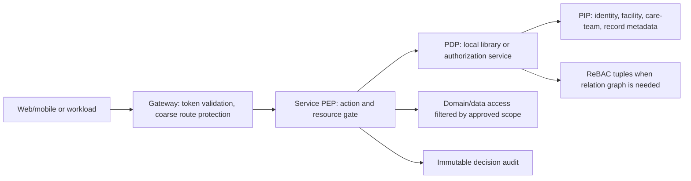

# Fine-grained RBAC cho microservices: chuẩn tham chiếu và blueprint nâng cấp

**Ngày:** 2026-08-13  
**Phạm vi:** Ghi chú chuẩn tham chiếu độc lập cho việc đánh giá/nâng cấp ủy quyền chi tiết. Đây không phải bằng chứng rằng một hệ thống cụ thể đã triển khai các control bên dưới.

## 1. Kết luận kiến trúc

Một hệ thống microservices không nên chọn giữa RBAC *hoặc* ABAC/ReBAC. Mô hình thực dụng và có thể vận hành là:

1. **RBAC làm entitlement nền:** vai trò nghiệp vụ tương đối ổn định được ánh xạ sang permission nguyên tử (`patient.read`, `encounter.sign`, `billing.refund`). RBAC giảm chi phí quản trị vì người dùng nhận quyền qua role và role có thể có hierarchy/constraint. NIST định nghĩa Core RBAC cùng các phần tùy chọn hierarchy, static separation of duty (SoD), và dynamic SoD. [NIST RBAC FAQ](https://csrc.nist.gov/Projects/role-based-access-control/faqs)
2. **ABAC làm điều kiện ngữ cảnh:** quyết định dùng thuộc tính subject, object, operation và environment, ví dụ khoa/phòng ban, cơ sở, quan hệ điều trị, thời hạn trực, mức nhạy cảm, thiết bị tin cậy hoặc trạng thái break-glass. NIST mô tả Policy Enforcement Point (PEP), Policy Decision Point (PDP), Policy Information Point (PIP) và Policy Administration Point (PAP); chúng có thể phân tán hoặc tập trung. [NIST SP 800-162](https://doi.org/10.6028/NIST.SP.800-162)
3. **ReBAC cho chia sẻ/theo quan hệ:** dùng khi quyền phụ thuộc quan hệ resource-to-resource hoặc user-to-resource: thành viên cơ sở, care-team, người phụ trách hồ sơ, người ký duyệt, nhóm trực, thư mục/tài liệu kế thừa. OpenFGA biểu diễn điều này bằng tuple `user, relation, object`, authorization model có kiểu, và `Check`/`ListObjects`. [OpenFGA concepts](https://openfga.dev/docs/concepts), [relationship queries](https://openfga.dev/docs/interacting/relationship-queries)

Điểm quan trọng: role chỉ trả lời *ai có thể thực hiện loại công việc nào*. Nó không tự trả lời *người đó có thể tác động đến bản ghi cụ thể này, tại thời điểm này và trong cơ sở nào*. Việc chỉ bảo vệ route bằng role/claim tạo khoảng trống BOLA/IDOR và BFLA.

## 2. Chuẩn và ràng buộc cần được giữ

| Chủ đề | Chuẩn/nguồn | Yêu cầu thiết kế áp dụng |
|---|---|---|
| Least privilege và deny by default | [OWASP Authorization Cheat Sheet](https://cheatsheetseries.owasp.org/cheatsheets/Authorization_Cheat_Sheet.html) | Mọi action/resource mới mặc định deny; allow phải có policy/permission được khai báo và review. Không dựa vào UI hide/disable.
| Kiểm tra mỗi request | [OWASP Authorization Cheat Sheet](https://cheatsheetseries.owasp.org/cheatsheets/Authorization_Cheat_Sheet.html) | PEP ở từng service phải xác thực permission + resource/context ở mọi request, kể cả API gọi nội bộ và background trigger có principal.
| Object-level authorization | [OWASP API1:2023 BOLA](https://owasp.org/API-Security/editions/2023/en/0xa1-broken-object-level-authorization/) | Bất cứ endpoint/hàm nào dùng ID do client cung cấp phải kiểm tra principal được phép action trên object đó. So sánh `userId` với request không đủ cho các quan hệ nghiệp vụ phức tạp.
| Function và property level | [OWASP API Top 10 2023](https://owasp.org/API-Security/editions/2023/en/0x11-t10/) | Tách quyền action quản trị/nghiệp vụ; DTO read/write phải field-aware để tránh BFLA, mass assignment và lộ thuộc tính nhạy cảm.
| RBAC constraints | [NIST RBAC FAQ](https://csrc.nist.gov/Projects/role-based-access-control/faqs) | Hỗ trợ role hierarchy có chủ đích, static SoD lúc cấp role và dynamic SoD tại session/transaction cho tác vụ mâu thuẫn lợi ích.
| PDP/PEP/PIP/PAP | [NIST SP 800-162](https://doi.org/10.6028/NIST.SP.800-162) | Chuẩn hóa ownership: policy catalog/PAP trung tâm, PIP đọc dữ kiện đáng tin cậy, PDP quyết định, PEP trong service thực thi và ghi audit.
| Quan hệ tài nguyên | [OpenFGA authorization concepts](https://openfga.dev/docs/authorization-concepts) | Nếu pilot ReBAC, policy model phải version-control/review/deploy như code; tuple write phải audit và có contract về nhất quán.
| Kiểm thử quyết định | [OpenFGA store-file tests](https://openfga.dev/docs/modeling/store-file-format) | Mỗi policy có test allow/deny, `Check`, danh sách object và (khi cần) danh sách người dùng; chạy trong CI cùng API integration tests.

## 3. Blueprint quyết định quyền

### 3.1 Contract chuẩn giữa services

Mỗi kiểm tra phải nhận một `AuthorizationRequest` bất biến về ngữ nghĩa:

```text
subject:   user | workload, subjectId, authenticated tenant, claimsVersion
action:    namespace.resource.verb
resource:  type, canonicalId, tenantId, facilityId, sensitivity, lifecycle state
context:   purposeOfUse, request channel, time, device posture, emergency reason
decision:  allow | deny, policyVersion, decisionId, reasonCode (không lộ policy nội bộ cho client)
```

`tenantId`, `facilityId`, owner/care-team, trạng thái hồ sơ và nhãn nhạy cảm phải được service lấy từ nguồn tin cậy hoặc truy vấn object; không tin giá trị cùng tên do client gửi. OWASP nhấn mạnh kiểm tra owner trên mọi request tác động resource và không nhận user/tenant/role từ request body nếu chưa được kiểm soát đặc quyền. [OWASP Business Logic Security Cheat Sheet](https://cheatsheetseries.owasp.org/cheatsheets/Business_Logic_Security_Cheat_Sheet.html)

### 3.2 Bốn lớp policy

1. **Route/function gate:** `RequirePermission("clinical.patient.read")` bảo đảm caller được dùng capability. Đây là lớp chống BFLA, không phải quyết định cuối.
2. **Resource gate:** `Can(subject, action, resource)` kiểm tra tenant/cơ sở, owner, care-team, assignment, lifecycle và record sensitivity. Đây là lớp bắt buộc cho endpoint có ID.
3. **Property/command gate:** projection DTO chỉ xuất/nhận thuộc tính caller được phép; các field như chẩn đoán nhạy cảm, địa chỉ, giá, trạng thái ký phải có policy riêng.
4. **Transaction gate:** SoD, approval, four-eyes, hạn mức, step-up MFA/device compliance và break-glass. Quyết định phải gắn `decisionId` với audit/event.

### 3.3 Chọn vị trí thực thi



Gateway là defense-in-depth và nơi xác thực token/rate limit hợp lý, nhưng không thể là PEP duy nhất: nó thường không có object metadata hay ràng buộc nghiệp vụ. Service sở hữu resource phải tự enforcement trước read/write và trước publish side effect.

## 4. Mô hình dữ liệu và governance đề xuất

### 4.1 Permission catalog

Tạo catalog versioned, mã ổn định và ownership rõ ràng:

```text
clinical.patient.read
clinical.patient.update_demographics
clinical.encounter.sign
clinical.record.break_glass_read
billing.invoice.refund
identity.role.assign
platform.authorization.policy.publish
```

Mỗi permission cần: service owner, action/resource, risk tier, required context, default-deny, API/command mappings, role mappings, audit class, data-retention classification và test scenarios. Tránh dùng tên HTTP verb hoặc role UI như permission nghiệp vụ.

### 4.2 Role engineering

- Role là job function được phê duyệt; permission gán cho role theo many-to-many, không cấp trực tiếp user trừ exception có expiry và approval.
- Role hierarchy chỉ dùng khi kế thừa được review; cấm “super-admin” vô tình kế thừa data scope không giới hạn.
- Static SoD chặn đồng thời các role xung đột (ví dụ người tạo nhà cung cấp và người duyệt thanh toán). Dynamic SoD kiểm tra người đã tạo/duyệt trong chính transaction.
- Tách human principal, workload/service principal và support/break-glass principal. Không dùng role người dùng cho service-to-service.

### 4.3 Scope và quan hệ

Triển khai baseline trong database domain cho scope phổ biến (`tenant`, `facility`, `department`, `care_team`, `assigned_provider`). Khi policy cần kế thừa/chia sẻ đa resource, pilot ReBAC tách riêng:

```text
user:clinician-42  member          facility:hn-01
user:clinician-42  clinician       careteam:ct-785
careteam:ct-785    responsible_for patient:pt-123
patient:pt-123     subject_of      record:rec-456
user:auditor-7     viewer          report:monthly-2026-08
```

Model phải giới hạn type/relation để tuple sai bị từ chối; OpenFGA mô tả type restriction cho quan hệ và object/relation/user đều có định danh rõ. [OpenFGA concepts](https://openfga.dev/docs/concepts)

Không đưa toàn bộ entitlement/relationship vào JWT: token sẽ phình, stale sau revoke và khó giải thích. JWT giữ subject, issuer/audience, tenant/session/claims version và coarse permissions cần thiết; PEP/PDP lấy resource facts gần thời điểm quyết định. Với thao tác high-risk, buộc re-check online và không dùng cache allow vượt TTL/revocation SLA.

## 5. Lộ trình nâng cấp theo pha

### P0 — đóng lỗ hổng có thể khai thác (0–4 tuần)

1. Lập inventory endpoint/consumer theo service: anonymous, workload-only, user action, resource ID, fields nhạy cảm, current policy, test evidence.
2. Bật global fallback deny; chỉ explicit health/readiness và flow công khai được anonymous. Thêm route-level permission cho mọi write/admin action.
3. Với mọi `GET/PUT/PATCH/DELETE /resource/{id}`, bắt buộc resource gate server-side và query scope trước khi materialize object. Trả `404` hoặc `403` theo threat model thống nhất, không lộ cross-tenant existence.
4. Whitelist command DTO; response projection theo policy. Fuzz các ID, tenant/facility header/body, hidden field và role tampering.
5. Audit cả allow/deny high-risk với `decisionId`, actor, impersonation/break-glass, action, canonical resource, scope, policy version, correlation ID; redact PHI/secret khỏi log.

**Gate P0:** toàn bộ endpoint có ID trong inventory có negative cross-tenant/cross-facility test; anonymous/admin route inventory không có unmatched allow; SAST/API test không có regression BOLA cơ bản.

### P1 — nhất quán liên service (1–2 quý)

1. Xuất shared authorization SDK gồm `IAuthorizationEvaluator`, action catalog binding, principal normalization, denial reason codes và test harness. SDK không chứa policy nghiệp vụ của service khác.
2. Chuẩn hóa PEP middleware/filter cho coarse gate; service handler vẫn gọi resource gate. Tạo contract cho gateway, async message và service-to-service identity.
3. Xây catalog/PAP quản trị được: approval, maker-checker cho thay đổi role/policy, effective/expiry, version, rollback, access review và export audit.
4. PIP hợp nhất dữ kiện identity, workforce/organization, facility membership, care-team và record metadata; xác định owner, freshness và fail behavior của từng attribute.
5. Implement SoD, step-up và break-glass có lý do, thời hạn ngắn, notification/review bắt buộc. Thu hồi role/permission phát invalidation event; token/session dùng `authz_version` hoặc revalidation cho high-risk.

**Gate P1:** policy contract tests chạy trên mỗi service; trace một request cho thấy authenticated principal → decision → data filter → audit; revoke/role change có test SLA và không để cached allow kéo dài quá SLA.

### P2 — fine-grained graph/policy pilot (2–3 quý)

1. Chọn một bounded domain có sharing/hierarchy rõ, không phải toàn bộ platform (ví dụ report chia sẻ hoặc care-team access). Viết model ReBAC, tuples và test matrix trước khi tích hợp runtime.
2. Chạy shadow mode: PEP so sánh quyết định hiện tại với PDP/ReBAC, chỉ telemetry; phân loại mismatch và không tự grant khi PDP unavailable.
3. Triển khai write-through/outbox cho thay đổi quan hệ; đo replication lag, check latency, cache hit/miss, deny rate và tuple cardinality.
4. Canary một action read ít rủi ro; sau đó write/action nhạy cảm chỉ khi availability, consistency, audit và rollback đạt gate.

**Gate P2:** model tests `Check` + `ListObjects` + negative hierarchy/tenant cases; chaos test PDP/PIP timeout giữ fail-closed cho high-risk; reconciliation không có tuple drift ngoài ngưỡng; rollback chuyển về decision path P1 mà không mở quyền mới.

## 6. Kiểm thử bắt buộc

| Loại | Ví dụ tối thiểu |
|---|---|
| Unit policy | mỗi permission/action: allow hợp lệ, deny không role, deny sai facility, deny sai lifecycle, deny SoD |
| API integration | thay ID resource, tenant/facility, owner/care-team, request field nhạy cảm, bulk/list/export |
| Contract liên service | audience/service identity sai, delegated user context mất, event consumer không có principal, policy version mismatch |
| ReBAC model | direct/inherited/group relation, removal/revoke, cyclic/hierarchy boundary, `ListObjects` không lọt object trái scope |
| Adversarial | role claim giả, token cũ sau revoke, cache stale, PDP timeout, bypass gateway gọi service trực tiếp, mass assignment |
| Operational | access review, expired exception, break-glass review, audit completeness, restore/rollback policy version |

OWASP yêu cầu kiểm tra object-level ở mọi function nhận ID và viết test để đánh giá cơ chế authorization; thay đổi làm fail test không được deploy. [OWASP API1:2023 BOLA](https://owasp.org/API-Security/editions/2023/en/0xa1-broken-object-level-authorization/)

## 7. Quyết định công nghệ

Không triển khai authorization engine mới chỉ vì muốn “fine-grained”. Bắt đầu bằng catalog, PEP/resource checks và evidence P0/P1. Chỉ dùng graph engine như OpenFGA khi quan hệ/hierarchy/list accessible objects thực sự là nguồn phức tạp; đây là inference thiết kế từ mô hình tuple và query `Check`/`ListObjects` của OpenFGA, không phải yêu cầu bắt buộc của chuẩn. [OpenFGA relationship queries](https://openfga.dev/docs/interacting/relationship-queries)

Với ABAC thuần (device, time, sensitivity, purpose of use), PDP có thể là policy engine/library khác miễn giữ contract, PIP provenance, versioning, fail behavior và test gates nêu trên. Không trộn policy runtime tùy ý trong frontend; frontend chỉ dùng decision/entitlement để UX, server PEP mới là authority.

## 8. Evidence triển khai trong repo (2026-08-13)

- Shared authorization package đã có `AuthorizationContext`, `AuthorizationResource`, `AuthorizationDecision`, `IResourceAuthorizationEvaluator` và redacting decision sink. Evaluator fail-closed khi thiếu principal, permission hoặc resource bắt buộc; facility scope được đối chiếu từ claims đã xác thực.
- Patient Service đã gọi resource evaluator trước read-by-id, update, deactivate và reactivate; resource facility được đọc từ `PatientDbContext`, không lấy từ request body. Cross-scope trả non-enumerating `404`.
- Frontend foundation giữ `authzVersion` trong permission snapshot và ghi nhận 401/403. 401 xóa snapshot; 403 giữ entitlement nhưng phát tín hiệu denial cho UI/i18n. Đây chỉ là UX/session synchronization, không thay thế backend PEP.
- Validation hiện tại: `Authorization.Tests` **23/23** (scope claim parsing/policy composition cho Continuity và FHIR, explicit human/workload principal type, gồm scope substitution denial, cùng EF-backed deny cross-facility/resource-not-found và audit resource lookup failure), foundation Karma **54/54**, foundation package build **pass**, Patient/Appointment/Clinical/Lab/Billing/Pharmacy builds và Docker artifacts **pass**; domain application suites **267/267**. Các negative HTTP integration test riêng từng service và field/transaction policy vẫn phải tiếp tục rollout theo P0/P1; không suy ra toàn bộ fine-grained coverage từ build/smoke.
- Frontend/runtime validation bổ sung: admin Karma **13/13**, main frontend Jest **73 suites/480 tests**, dashboard Karma **34/34**, Docker internal smoke pass. Full-root Playwright bị environment/tooling-blocked do test discovery ngoài phạm vi và duplicate/missing Playwright dependencies, không được tính là pass.
- IdentityService integration suite đã đạt **128/128 pass, 0 skipped, 1m17s** với PostgreSQL native local cluster tạm thời qua `IDENTITY_TEST_POSTGRES_CONNECTION`. Testcontainers/Docker Desktop host-forwarding trên Windows vẫn tái hiện connectivity stall; CI nên dùng native/service PostgreSQL hoặc Linux container network. Fixture seam không đổi production wiring.
- Shared Infrastructure suite hiện đạt **22/22** sau khi dùng shared Redis Testcontainers fixture, retry kết nối và tắt parallelization cho collection.
- IdentityService focused integration: PasswordHistory 1/1, ExportContract 1/1, DevicePosture 4/4, Auth 13/13, MFA 9/9, Verification 9/9, Security/Federation/Auth 24/24 và SCIM boundary 9/9 pass; full-suite đã xác nhận thêm **128/128** trên native PostgreSQL.
- HTTP integration progress: cả sáu service Patient, Appointment, Clinical, Lab, Billing và Pharmacy đã có read-by-id allow + cross-facility deny, tổng **12/12** pass trong SDK containers nối trực tiếp `docker_default`; host Testcontainers PostgreSQL port-forward vẫn environment-blocked. Mutation-specific action tests và database-backed gRPC tests vẫn là gate riêng.
- Transaction/field gate implemented: admin table export requires the base admin read permission plus `reports.export`; disabling sensitive-field masking additionally requires `reports.manage`; resource-specific read checks remain server-side. Identity API image rebuilt and internal login/provider smoke returned 200.
- Identity Application suite now passes **68/68** after aligning stale `LoginRequestValidatorAdditionalTests` fixtures to the current named `Email`/`Password` constructor contract; validator behavior was not weakened.
- Frontend foundation integration: admin users/roles/clients data tables now hide export affordances unless the shared permission snapshot contains `reports.export`; the shared snapshot also normalizes OAuth `scope`/`scp` values and exposes `hasScope/hasAnyScope/hasAllScopes` as UX hints; server authorization remains authoritative.
- gRPC hardening progress: Patient, Billing, Appointment, Clinical, Lab and Pharmacy read/existence methods now invoke the shared resource evaluator before repository/mediator access, preserving non-enumerating `NotFound`; 102 contract tests pass, including deny/no-repository-access checks and scoped list/search propagation. Patient database-backed gRPC allow/deny passes **2/2** through TestServer; equivalent database-backed tests for the other five services remain a separate gate.
- Platform/integration scope hardening: shared `ScopeRequirement`/`ScopeHandler` supports `scope`/`scp` claims; FHIR Patient/Encounter require resource-specific scopes plus `principal_type=human`, while Database Continuity backup/restore-drill requires `platform.continuity.write` plus `admin.settings.write` and an explicit human/workload type. Identity registers and seeds these scopes; authorization and policy-composition tests **23/23**, FHIR and Continuity builds pass.
- Service-boundary bypass hardening: `FhirGateway.Contract.Tests` passes **7/7**, combining controller reflection with direct HTTP calls (`401` unauthenticated, `403` missing resource scope/workload principal, `200` with permission + human scope). This closes the FHIR direct-service contract gap; equivalent coverage for every service and live client-credentials issuance are still required before a platform-wide production claim.
- List/search hardening: Patient HTTP and gRPC search now carry `FacilityAccessScope` into the repository, partition cache keys by facility set, and return no rows when a non-cross-facility principal has no membership. Patient contract tests pass **15/15** and the rebuilt container is healthy. Appointment HTTP/gRPC list/search now apply the same facility predicate; Appointment contract tests pass **15/15**, application tests **46/46**, API build and rebuilt container pass. Clinical encounter list/search, patient aggregation routes and gRPC search now apply the predicate as well; Clinical contract tests pass **24/24**, application tests **42/42**, API build/container pass. Lab order list/search, patient aggregation routes and gRPC methods now apply it; Lab contract tests pass **15/15**, application tests **63/63**, API/container pass. Billing invoice list/search, patient aggregation and gRPC methods now apply it; Billing contract tests pass **15/15**, application tests **32/32**, API/container pass. Pharmacy medication/prescription list/search and patient prescription aggregation now apply it; Pharmacy contract tests pass **18/18**, application tests **60/60**, API/container pass.
- Database-backed HTTP evidence: sáu service read-by-id pass **12/12** (allow + denial) trong SDK containers attached to `docker_default` using Compose PostgreSQL directly; host-run Testcontainers forwarding remains an environment limitation. Mutation-specific HTTP actions remain open.
- Database-backed gRPC evidence: sáu service read-by-id pass **12/12** (allow + denial) qua in-process TestServer channels với Compose PostgreSQL; Lab và Pharmacy cũng đã được kiểm chứng, với UTC normalization trong các projection có thể đọc `DateTimeKind.Unspecified`.
- Mutation HTTP evidence: cross-facility deny pass **6/6** cho Patient deactivate, Appointment check-in, Clinical complete, Lab cancel, Billing void và Pharmacy fill; mọi route trả `404` trước khi command chạy.
- Principal separation hardening: Identity issues explicit `principal_type=human` for interactive user tokens and `principal_type=workload` for client-credentials tokens; FHIR policies accept only human principals, while Continuity requires an explicit human/workload type plus its write scope. Shared authorization tests pass **23/23**; rollout still needs live client-credentials issuance and direct HTTP coverage for the remaining services.
- SCIM M2M now additionally requires `principal_type=workload` alongside client identity and `scim.read`/`scim.write`; development/testing admin-cookie compatibility remains explicitly non-production.
- JWT boundary hardening: shared OIDC JWT validation now enforces audience and allows only configured service audience plus `his-hope-services`; AspNetCore security tests **7/7** and Identity/Continuity runtime smoke pass after image rebuild.
- SCIM boundary validation: Identity SCIM endpoint/authorization integration tests pass **9/9**; cookie/admin sessions without `scim.read`/`scim.write` are rejected (403), anonymous write is 401, and only metadata/resource discovery remains public.
- Runtime evidence: rebuilt/recreated IdentityService and Database Continuity images; Identity remains exposed on port `5001`, both containers healthy, and Docker internal smoke remains pass after rollout.
