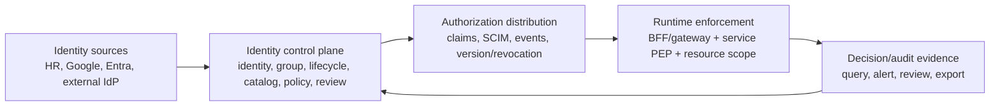
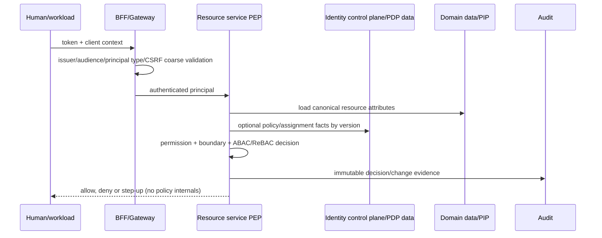

# Chuẩn hóa Identity Service và admin-app theo các mô hình IAM enterprise

**Ngày:** 2026-08-14  
**Phạm vi:** Nghiên cứu tài liệu chính thức của Google Cloud/Cloud Identity, Microsoft Entra ID, Okta/Auth0, AWS IAM Identity Center và GitHub Enterprise Cloud; đối chiếu với mã nguồn hiện có của His.Hope. Đây là thiết kế và lộ trình triển khai, không phải bằng chứng rằng các control đề xuất đã được đưa vào production.

## 1. Kết luận điều hành

Các nền tảng IAM lớn không coi “Identity” là một màn hình người dùng/role. Chúng tách thành ba mặt phẳng:



His.Hope đã có một phần nền quan trọng của mặt phẳng runtime: catalog `HisHopePermissions`, policy `Permission:{permission}`, `principal_type` tách human/workload, `IResourceAuthorizationEvaluator` fail-closed theo permission/resource/facility, và snapshot entitlement trong frontend foundation. Nó cũng có UI quản trị users/roles/clients, access-management, identity-capabilities và identity-operations. Khoảng trống chính là **control plane có vòng đời và governance nhất quán**: catalog chưa có ownership/risk/version/mapping đầy đủ; role mapping tĩnh còn song song với DB; resource policy mới chủ yếu facility; approval/review/SoD/JIT chưa thành workflow chung; và admin-app chưa là một “authorization workbench” quản lý change request, policy version, effective access và evidence xuyên suốt.

Khuyến nghị kiến trúc là giữ IdentityService làm **PAP/control plane** và các service là **PEP + owner của resource attributes**. Không chuyển quyết định object-level về frontend hay chỉ gateway. RBAC tiếp tục là entitlement nền; ABAC dùng cho facility, sensitivity, lifecycle, device, purpose/time; ReBAC chỉ pilot ở domain có quan hệ chia sẻ/care-team thực sự cần đồ thị.

## 2. Những mẫu thiết kế có thể rút ra từ big tech

| Nền tảng | Cơ chế cốt lõi | Ý nghĩa thiết kế cho His.Hope |
|---|---|---|
| Google Cloud IAM/Cloud Identity | Role là tập permission; IAM Conditions là ABAC; principal access boundary (PAB) giới hạn tập resource mà principal có thể chạm tới dù đã được cấp role; Workforce/Workload identity tách identity người và workload. | Tách `grant` khỏi `boundary`; facility/tenant/sensitivity là boundary độc lập với role. Chuẩn hóa human, workload, external và break-glass principals. |
| Microsoft Entra | Administrative Units để phân quyền quản trị theo scope; Lifecycle Workflows, entitlement packages, access reviews và PIM/JIT kiểm soát vòng đời/quyền đặc quyền. | Admin không đồng nghĩa Global Admin: mọi thao tác admin cần scope, approver, expiry và access review; dùng workflow quản lý role/policy change. |
| Okta | Custom authorization server có audience, scopes, claims, policy/rules; API product tách audience; event hook là event-driven nhưng at-least-once/best-effort. | Chuẩn hóa API audience/scope registry; dùng outbox, idempotency và reconciliation cho mọi provisioning/security signal. |
| Auth0/FGA | RBAC cho entitlement phổ biến, FGA/ReBAC cho quan hệ user-object/folder/organization. | Không nhét relationship graph vào JWT; chỉ pilot ReBAC cho care-team/report sharing sau khi P0/P1 hoàn chỉnh. |
| AWS IAM Identity Center | Permission set là bundle policy, gán user/group vào account; ABAC qua attributes; CloudTrail theo dõi API/SCIM. | Role template cần version, assignment scope và session duration; audit phải bao phủ control-plane API lẫn provisioning. |
| GitHub Enterprise | Custom organization role phân quyền subset settings; repository role theo resource; UI chỉ hiển thị page người dùng được phép; REST API quản lý roles. | Tách `platform/identity admin` khỏi `application/developer admin`; UI navigation dựa entitlement nhưng server vẫn là authority; permission catalog phải map action/API/page rõ ràng. |

### 2.1 Google Cloud: grants không được thay thế boundaries

Google IAM dùng role chứa permission, nhưng **IAM Conditions** cho phép conditional/attribute-based access. Principal Access Boundary Policies (PAB) lại định nghĩa các resource mà principal *eligible* để truy cập; một PAB có thể chặn quyền ngay cả khi role đã cấp quyền. PAB được bind tới principal set, có `etag`, metadata/annotations và điều kiện; policy bindings có thể được quản trị qua REST/gcloud. Đây là mẫu tách bạch rất hữu ích giữa “được làm action nào” và “được làm ở resource/scope nào”. [IAM Conditions](https://cloud.google.com/iam/docs/conditions-overview), [PAB policies](https://cloud.google.com/iam/docs/principal-access-boundary-policies), [PAB API/viewing](https://cloud.google.com/iam/docs/principal-access-boundary-policies-view).

Google cũng phân định rõ workforce identity (con người/federation) và workload identity; Workforce Identity Federation ghi audit token exchange với `principalSubject` và mapped principal khi bật Data Access logging. [Workforce Identity Federation](https://cloud.google.com/iam/docs/workforce-identity-federation), [audit log examples](https://cloud.google.com/iam/docs/audit-logging/examples-workforce-identity).

Về lifecycle, Google mô tả automatic provisioning user/group từ nguồn định danh authoritative vào Cloud Identity/Google Workspace và với Active Directory, Google Cloud Directory Sync truy vấn LDAP rồi dùng Directory API để add/modify/delete account. Đây là mô hình **source-authoritative + reconciliation** thay vì application tự quyết lifecycle độc lập. [Google identity architecture](https://cloud.google.com/architecture/identity/overview-google-authentication), [AD synchronization](https://cloud.google.com/architecture/identity/federating-gcp-with-active-directory-synchronizing-user-accounts).

**Áp dụng:** `facility.cross` không nên là cách duy nhất diễn đạt scope. Bổ sung authorization boundary theo tenant/facility/department/sensitivity vào runtime decision. Mọi boundary assignment cần source, effective/expiry, version và audit; service lấy resource facts từ database của chính service, không từ header/body của caller.

### 2.2 Microsoft Entra: delegated administration và lifecycle governance

Microsoft Entra Identity Governance kết hợp provisioning (SCIM/LDAP/SQL connector), entitlement management, access package, separation-of-duties, access reviews, lifecycle workflows và PIM/JIT. Access cho agent identity cũng có thể time-bound, approval và audit. [Identity Governance overview](https://learn.microsoft.com/en-us/entra/id-governance/identity-governance-overview). Provisioning bao gồm HR-driven joiner/mover/leaver, app provisioning và directory sync; Entra provision/deprovision user/group tới SaaS qua SCIM 2.0, đồng thời hỗ trợ cả vai trò SCIM client và SCIM service provider. [What is provisioning?](https://learn.microsoft.com/en-us/entra/id-governance/what-is-provisioning), [SCIM synchronization](https://learn.microsoft.com/en-us/entra/architecture/sync-scim), [SCIM support in Entra ID](https://learn.microsoft.com/en-us/entra/identity/app-provisioning/scim-support-in-entra-id).

Entra delegated Lifecycle Workflow management sử dụng **Administrative Units**: Global/Lifecycle Workflow admin có năng lực khác scoped workflow admin; scope giới hạn admin chỉ quản lý workflow được gán. [Delegated workflow management](https://learn.microsoft.com/en-us/entra/id-governance/manage-delegate-workflow).

**Áp dụng:** phân chia ít nhất bốn persona quản trị:

| Persona | Có thể làm | Không được làm mặc định |
|---|---|---|
| Identity operator | user lifecycle, session revoke, provider health, provisioning retry trong scope | publish permission/policy, tự cấp privileged role |
| Access administrator | role assignment, access request, access review trong scope | quản lý OAuth client, audit retention, bypass SoD |
| Security administrator | security signals, mTLS, device policy preview, incident action | sửa entitlement business không approval |
| Platform authorization owner | publish catalog/policy template, role template, approval rule | vận hành user hằng ngày trong mọi facility |

Vai trò `Admin` hiện đang map toàn bộ `HisHopePermissions.All` trong `RolePermissionMapping`; đó là bootstrap tiện lợi nhưng không phải model vận hành dài hạn. Thay bằng role template versioned, scoped assignment và quyền control-plane tách nhỏ. Một Global/Break-glass role chỉ dùng qua JIT, MFA, reason, TTL, approver khác người yêu cầu, token/session revocation khi hết hạn.

### 2.3 Okta: API contract và event delivery phải được xem là sản phẩm

Okta khuyến nghị custom authorization server có audience cụ thể theo API product, scope namespaced/granular, policy gán theo client, và resource server kiểm tra `aud`/`cid`. Nó khuyến cáo Authorization Code + PKCE cho SPA/mobile, không dùng token org server để authorize application. [Okta API Access Management](https://developer.okta.com/docs/concepts/api-access-management/).

Okta event hooks là HTTPS webhook bất đồng bộ; delivery at-least-once, có thể out-of-order/duplicate, timeout mặc định ba giây và chỉ tối đa một retry. Consumer cần respond nhanh, deduplicate theo `eventId` và dựa System Log để quan sát failure. [Okta Event Hooks](https://developer.okta.com/docs/concepts/event-hooks/). Policy của Okta là JSON/rules, được evaluate theo request dựa vào user/group/device/location/time; thứ tự rule ảnh hưởng kết quả. [Okta policies](https://developer.okta.com/docs/concepts/policies/).

**Áp dụng:** các adapter Google/Entra/SCIM, SSF và audit outbox hiện có nên được chuẩn hóa chung thành `IntegrationDelivery`: immutable event ID, aggregate/version, delivery attempt, idempotency key, target, status/reason, retry schedule, correlation ID và reconciliation cursor. Không coi webhook callback synchronous là transaction của IdentityService. Toàn bộ API cần audience registry và OAuth scope registry tách với internal permission code: scope thể hiện delegated client contract; permission là quyền nghiệp vụ/server decision.

### 2.4 Auth0/FGA: khi nào RBAC không còn đủ

Auth0 nêu RBAC phù hợp việc cấp permission dựa role trong organization; Fine-Grained Authorization thêm quyết định theo role, attribute hoặc relationship giữa user/object, bao gồm inherited folder access. [Auth0 B2B authorization](https://auth0.com/docs/get-started/architecture-scenarios/business-to-business/authorization).

**Áp dụng:** không đưa ReBAC vào toàn platform ngay. P0/P1 phải hoàn thiện catalog, scoped RBAC, resource evaluator, audit và revocation. P2 chọn một bounded domain như report sharing hoặc care-team access. Model phải versioned, policy tests gồm `Check`, `ListObjects`, revoke/tenant boundary/loop; chạy shadow mode và fail-closed cho hành động rủi ro. JWT chỉ giữ subject, client/audience, session/claims version và coarse entitlement.

### 2.5 AWS IAM Identity Center: permission set và audit API

AWS IAM Identity Center dùng permission set để định nghĩa level of access của user/group với AWS account; một user có thể có nhiều permission set, session duration được cấu hình trên permission set. [AWS permission sets](https://docs.aws.amazon.com/singlesignon/latest/userguide/permissionsets.html). AWS CloudTrail ghi IAM Identity Center API calls, bao gồm management của permission sets, applications, trusted token issuers, assignments, instances/tags; SCIM calls có service endpoint riêng. [CloudTrail logging](https://docs.aws.amazon.com/singlesignon/latest/userguide/logging-using-cloudtrail.html).

**Áp dụng:** thay “role = danh sách mutable không provenance” bằng:

```text
RoleTemplate(version, owner, riskTier, permissions, constraints, reviewCadence)
RoleAssignment(subject, templateVersion, scope, source, effectiveAt, expiresAt,
               approver, requestId, status)
```

Permission và role mutations phải tạo audit event trước/sau state, chứa diff redacted, actor, delegated actor, target/scope, reason/ticket, policy/catalog version và correlation ID. Export CSV chỉ là projection có quyền/retention, không phải source audit.

### 2.6 GitHub Enterprise: custom roles, resource roles và UX entitlement

GitHub Enterprise Cloud cho custom organization role để phân quyền subset các setting thay vì full organization admin; quyền quản lý custom role tách khỏi quyền gán role. Custom organization role có thể kết hợp permission organization/repository, còn custom repository role cấp cho repository cụ thể. Page/API chỉ cho người có role truy cập. [Custom organization role permissions](https://docs.github.com/en/enterprise-cloud@latest/organizations/managing-peoples-access-to-your-organization-with-roles/permissions-of-custom-organization-roles), [custom repository roles](https://docs.github.com/en/enterprise-cloud@latest/organizations/managing-user-access-to-your-organizations-repositories/managing-repository-roles/about-custom-repository-roles).

**Áp dụng:** admin-app nên điều hướng theo permission snapshot và hiển thị explicit forbidden/empty/error state, nhưng không preload dữ liệu nhạy cảm trước gate. Tách quyền `catalog.manage`, `role.template.manage`, `role.assign`, `policy.simulate`, `policy.publish`, `access.review.manage`, `audit.read`, `integration.manage`, `client.manage` thay vì một module `admin.*.write`. UI cần thể hiện “effective access”, source, scope, expiry, approver và decision/audit trail thay vì chỉ checkbox permissions.

## 3. Bằng chứng repository đã xác minh (không phải khuyến nghị)

Các mục dưới đây được đối chiếu trực tiếp với source hiện có vào ngày lập tài liệu. Chúng không suy diễn trạng thái production hoặc các external live gate.

| Khả năng | Evidence hiện có | Đánh giá |
|---|---|---|
| Permission catalog | `HisHopePermissions.All`/`AllDescriptors` là registry tập trung, được dùng seeding/validation/enumeration. | Nền tốt; descriptor hiện chưa có owner, risk, API mappings, deprecated/replacedBy, version. |
| Route enforcement | `PermissionHandler` chỉ tin permission claims đã mint, deny token thiếu claim; `RequireAuthorization("Permission:...")` dùng rộng. | Đúng hướng fail-closed. Cần endpoint inventory/coverage gate để bảo đảm mọi mutation/export có policy. |
| Resource authorization | `AuthorizationContext` có action/resource/purpose/device/emergency; evaluator kiểm tra authenticated, valid action, required resource, permission, facility. | Có PEP shared. Cần ABAC attributes + source/freshness và domain coverage đồng đều hơn. |
| Principal separation | `principal_type` có Human/Workload handler; recent BFF JWT mint human claim; OpenIddict workload path mint workload claim. | Nền đúng. Bổ sung external/support/break-glass/delegated actor contract và client/audience constraints. |
| Role mapping | DB RolePermissions được truy vấn ở access governance; `RolePermissionMapping` tĩnh mint/legacy maps `Admin` sang toàn bộ permission. | Rủi ro drift/over-grant. Xác định một source-of-truth versioned và migration strategy. |
| Lifecycle/integration | SCIM, provisioning outbox, external federation, SSF, audit, mTLS/device posture pilot tồn tại. | Đã có building blocks. Chuẩn hóa common delivery/audit/reconciliation contracts. |
| Governance endpoints | Effective access, break-glass request/approve/revoke, policy simulation đã server-side/audited. | Cần workflow generalization: request/approval/SoD/expiry/review và policy version/rollback. |
| Admin UX | Foundation `HisHopePermissionService`, shared error handling/i18n/theme; pages access-management, identity-capabilities, identity-operations. | Cần unified authorization workbench và clear persona/scope model; UI hiện có một số thao tác chọn đối tượng đầu tiên thay vì intent-driven form/search. |

## 4. Khuyến nghị kiến trúc đích (target operating model)

### 4.1 Operating model: ownership, approval và vận hành

| Capability | Accountable owner | Operator/developer có thể làm | Independent control |
|---|---|---|---|
| Permission/action catalog | Platform authorization owner | Đề xuất action/mapping/test | Owner approval, semantic/version review |
| Role templates & assignments | Access administrator | Draft/request assignment trong scope | SoD validation, maker-checker, expiry/review |
| Resource policy | Domain service owner | Đưa resource facts/PIP và policy tests | Policy owner approval; service remains PEP |
| OAuth client/API contract | Application/platform owner | Register client, request audience/scopes | Security administrator approves redirect/grant/high-risk scope |
| Identity lifecycle/provisioning | Identity operator | Queue/retry/reconcile in assigned scope | Authoritative-source rules, deprovision SLA, audit |
| Privileged/break-glass | Security administrator | Request only | MFA, independent approval, TTL, mandatory post-review |
| Audit/export | Compliance/audit owner | Query permitted evidence | Retention, redaction, immutable evidence |

Mô hình này phản ánh Entra scoped/delegated administration và GitHub custom organization roles: người quản lý role template không mặc nhiên được gán quyền; người vận hành integration không mặc nhiên được publish policy. Microsoft còn tách Application Developer khỏi Application/Cloud Application Administrator và cho role assignment tại tenant, application registration hoặc administrative-unit scope. [Entra delegated application roles](https://learn.microsoft.com/en-us/entra/identity/role-based-access-control/delegate-app-roles), [manage Entra roles and scopes](https://learn.microsoft.com/en-us/entra/identity/role-based-access-control/manage-roles-portal).

### 4.2 Target architecture

#### Bốn bounded modules trong Identity Service

1. **Identity & lifecycle:** person, account, external identity link, group, service account/workload, lifecycle state; event/outbox cho joiner-mover-leaver.
2. **Authorization catalog & assignments (PAP):** permission/action registry, role template, policy template, scope/boundary, assignment, request/approval, access review, decision simulation. Đây là source of truth control-plane.
3. **Token/session & distribution:** OAuth/OIDC clients/audiences/scopes, claims projection, `authz_version`, token/session revocation, SCIM/provisioning and SSF delivery. Claims là cache có version, không phải cơ sở dữ liệu authorization.
4. **Assurance & evidence:** MFA/passkey/mTLS/device posture/security signals, audit evidence, retention/export, alerting. Các control cao rủi ro tạo step-up requirement hoặc deny decision tại PEP, không tự bypass policy.

#### Contract nhất quán

```text
AuthorizationSubject
  type: human | workload | external | support | break_glass
  id, tenantId, authzVersion, sessionId, clientId, authenticationContext

AuthorizationAction
  code, serviceOwner, riskTier, requiredAssurance, auditClass

AuthorizationResource
  type, canonicalId, tenantId, facilityId, departmentId,
  sensitivity, lifecycleState, owner/careTeam facts

AuthorizationDecision
  allow | deny | step_up
  decisionId, reasonCode, policyVersion, evaluatedAt, cacheUntil

AuthorizationChange
  requestId, changeType, proposer, approver(s), scope, diff,
  effectiveAt, expiresAt, status, rollbackOf, correlationId
```

`AuthorizationContext` và `AuthorizationResource` hiện có là seed cho contract này. Nâng cấp theo backward-compatible optional fields; không chấp nhận tenant/facility/owner từ request body như facts. Resource-owning service enrich context từ database/PIP local, sau đó enforce trước read/write/export/async side effect.

#### Decision path



## 5. Chuẩn hóa admin-app thành authorization workbench

Giữ shared foundation là bắt buộc: `hh-page-layout`, `hh-page-header`, i18n EN/vi-VN, theme tokens, common loading/empty/error/forbidden states và `HisHopePermissionService`. Không đưa secret, raw assertion, token, certificate private key hay policy evaluator client-side vào UI.

### 5.1 Information architecture đề xuất

| Workspace | Read | Controlled mutation | Permission family |
|---|---|---|---|
| Identity directory | user, external link, group, lifecycle, sessions | disable, session revoke, credential reset, scoped provisioning | `identity.directory.*` |
| Access catalog | permissions/actions, role templates, scope templates, API mappings | draft/publish/deprecate template | `authorization.catalog.*` |
| Access assignments | effective access, role assignment, exceptions, JIT | request/approve/revoke assignment | `authorization.assignment.*` |
| Policies & simulation | policy versions, test cases, shadow mismatch, decisions | draft/publish/rollback (maker-checker) | `authorization.policy.*` |
| Reviews & evidence | review campaigns, SoD conflicts, break-glass, audit | certify/revoke/close incident | `authorization.review.*`, `audit.*` |
| Integrations & assurance | federation, SCIM, SSF, mTLS, device posture status | enable/rotate/retry only with confirmation | `identity.integration.*`, `identity.assurance.*` |

Migration phải preserve existing `admin.*` permission aliases trong một release train, rồi map endpoint/UI sang catalog mới. Không đổi chỉ để đổi tên: trước hết publication mapping, metrics deny/403 và test route coverage phải green.

### 5.2 UX workflow bắt buộc

* **Assign access:** search subject → chọn template/version → chọn scope → thấy effective permission diff, conflicts, expiry → request/approve nếu risk yêu cầu → issue `authz_version` invalidation → audit link.
* **Publish policy/catalog:** edit draft → validation lint + test matrix allow/deny → simulate/shadow results → dual approval với policy owner khác author → immutable version publish → canary/rollback button.
* **Access review:** campaign theo template/scope/critical permission → reviewer certify/revoke/delegate → overdue escalation → evidence export.
* **Incident/break-glass:** reason + subject/resource/scope + short TTL + MFA/approval → realtime audit → auto-expiry/revoke → post-incident review.

Mọi mutation hiển thị server response `code`, correlation ID và actionable next step; 403 chỉ nói caller không có action, không tiết lộ resource ngoài scope. UI gate nâng UX nhưng endpoint bắt buộc server authorization.

## 6. Lộ trình thực hiện có gate

### P0 — thống nhất source of truth và đóng lỗ hổng (0–6 tuần)

1. Inventory machine-readable tất cả action/API/consumer, principal type, data class, resource ID, current policy, service owner, test status; CI fail với endpoint mutation/export không có action mapping.
2. Mở rộng `PermissionDescriptor` thành catalog versioned: owner, risk tier, required assurance, audit class, API/command mapping, deprecated/replacedBy. Seed/migration idempotent.
3. Định nghĩa role template/assignment/scope schema và deprecate dần static `RolePermissionMapping` làm runtime source; token mint chỉ từ resolved DB assignment + break-glass hiệu lực.
4. Mọi role/policy/permission/user lifecycle mutation có `AuthorizationChange` và audit diff; permission thay đổi bump `authz_version` và revoke/refresh theo SLA.
5. Chuẩn hóa principal/audience contract: human vs workload, issuer/audience/client ID, delegated actor, support/break-glass. Test negative cross-principal.

**Gate:** catalog coverage 100% cho protected endpoints; DB-source entitlement/token test; revoke propagation test; mutation audit test; không có direct role fallback ở runtime authorization.

### P1 — governance lifecycle xuyên service (1–2 quý)

1. Access request/approval engine chung có maker-checker, SoD, expiry, scope, delegation, escalation và review campaign.
2. Nâng `AuthorizationContext`/evaluator cho required assurance, sensitivity/lifecycle/department/purpose; resource services thêm object-level and field-level test matrix.
3. Common integration delivery/reconciliation cho SCIM/Google/Entra/SSF với outbox/idempotency/delivery evidence, DORA/SLO dashboards.
4. Policy-as-code repository/model: schema, linter, allow/deny fixtures, approval, signed/versioned publish, rollback; runtime read-only published policy.
5. Admin workbench integration đầy đủ với foundation/i18n/theme, forbidden states và permission contracts.

**Gate:** trace được `principal → assignment/policy version → decision → resource filter → audit`; access review/revocation evidence; contract tests pass trên mọi service đã inventory; no raw secret/PHI leak từ admin APIs.

### P2 — ABAC/ReBAC pilot có kiểm soát (2–3 quý)

1. Pilot care-team hoặc report sharing, không phải toàn clinical platform; define resource relations/type constraints and test corpus.
2. Chạy shadow mode, đo mismatch/latency/PIP freshness; no auto-grant on PDP degradation.
3. Canary read low-risk; later step-up/write only after correctness, availability, audit and rollback gates.
4. Device posture chỉ chuyển từ observe sang enforcement per action after external Device Trust evidence and clinical safety sign-off.

**Gate:** positive/negative relation tests, tenant/facility isolation, revoke consistency, PDP/PIP chaos fail-closed, reconciliation drift threshold, audited rollback.

## 7. Thước đo vận hành và governance

| Metric | Mục tiêu/ý nghĩa |
|---|---|
| Catalog coverage | 100% protected API/action có owner, risk, mapping, tests |
| Orphan grant rate | 0 assignment tham chiếu template/version đã deprecated/không tồn tại |
| Revocation latency | đo từ approved revoke đến deny tại PEP; SLA theo risk tier |
| Policy decision telemetry | allow/deny/step-up by action/scope/reason/version; không log PHI/secret |
| SoD conflict aging | số conflict, người sở hữu, overdue review |
| Provisioning reconciliation | delivery success, retry, duplicate suppression, external/internal drift |
| Privileged access | JIT duration, break-glass reason/review completion, standing privileged grants |
| Admin API security | 401/403 rate theo permission/client/version; alert regression như lỗi claim/session trước đó |

## 8. Quyết định kiến trúc đề xuất

1. **IdentityService là control plane; service domain là policy enforcement owner.** Không centralize tất cả resource facts trong IdentityService.
2. **Catalog/assignment DB versioned là source of truth; JWT/session entitlement chỉ projection có `authz_version`.** Giữ handler fail-closed khi thiếu claim.
3. **RBAC + scoped boundary trước; ABAC tăng dần; ReBAC pilot sau.** Không mua/triển khai FGA engine chỉ vì muốn “fine-grained”.
4. **Admin privileges tách control-plane responsibilities.** Không sử dụng `Admin = all permissions` như role vận hành; break-glass là workflow, không phải permanent role.
5. **Policy/configuration as code với maker-checker.** Admin-app là UX để request/review/simulate/evidence, không phải nơi thực thi policy độc lập.
6. **Integration asynchronous, idempotent, auditable.** Vendor callback/outbound provisioning/SSF theo outbox + reconciliation; external live gate vẫn tách khỏi repository pass.

## 9. Nguồn chính thức

- Google Cloud: [IAM Conditions](https://cloud.google.com/iam/docs/conditions-overview), [Principal Access Boundary Policies](https://cloud.google.com/iam/docs/principal-access-boundary-policies), [Workforce Identity Federation](https://cloud.google.com/iam/docs/workforce-identity-federation), [Workforce audit logs](https://cloud.google.com/iam/docs/audit-logging/examples-workforce-identity).
- Microsoft Entra: [Identity Governance overview](https://learn.microsoft.com/en-us/entra/id-governance/identity-governance-overview), [provisioning overview](https://learn.microsoft.com/en-us/entra/id-governance/what-is-provisioning), [SCIM support](https://learn.microsoft.com/en-us/entra/identity/app-provisioning/scim-support-in-entra-id), [Delegated workflow management](https://learn.microsoft.com/en-us/entra/id-governance/manage-delegate-workflow).
- Okta: [API Access Management](https://developer.okta.com/docs/concepts/api-access-management/), [Policies](https://developer.okta.com/docs/concepts/policies/), [Event Hooks](https://developer.okta.com/docs/concepts/event-hooks/).
- Auth0: [B2B authorization and FGA](https://auth0.com/docs/get-started/architecture-scenarios/business-to-business/authorization).
- AWS: [IAM Identity Center permission sets](https://docs.aws.amazon.com/singlesignon/latest/userguide/permissionsets.html), [CloudTrail logging](https://docs.aws.amazon.com/singlesignon/latest/userguide/logging-using-cloudtrail.html).
- GitHub Enterprise Cloud: [custom organization role permissions](https://docs.github.com/en/enterprise-cloud@latest/organizations/managing-peoples-access-to-your-organization-with-roles/permissions-of-custom-organization-roles), [custom repository roles](https://docs.github.com/en/enterprise-cloud@latest/organizations/managing-user-access-to-your-organizations-repositories/managing-repository-roles/about-custom-repository-roles).
