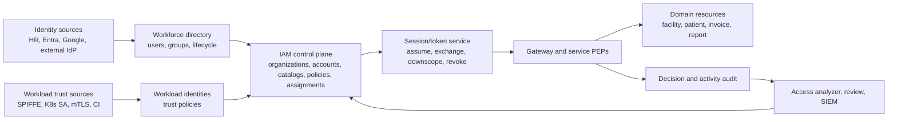
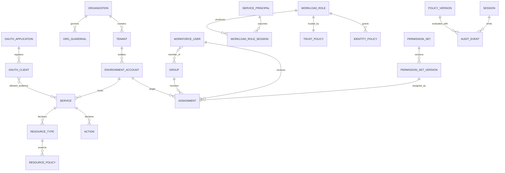
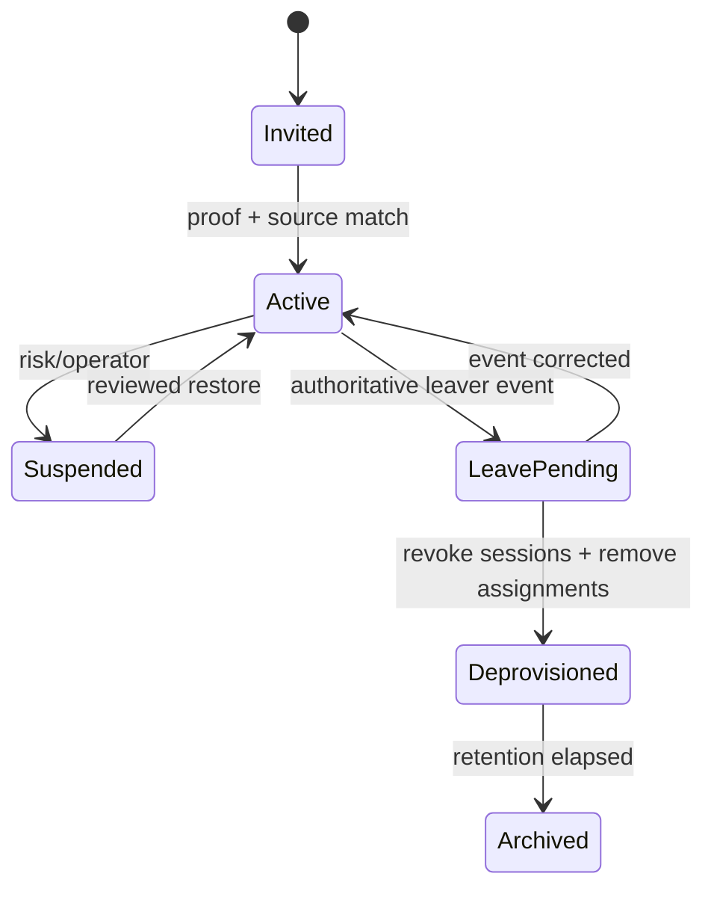

# Phát triển Identity Service thành IAM Control Plane kiểu AWS cho His.Hope

**Ngày:** 2026-08-15  
**Phạm vi:** Đánh giá source hiện tại và đề xuất kiến trúc mở rộng identity, IAM,
service, OAuth client và user theo các nguyên tắc của AWS IAM, AWS Organizations,
IAM Identity Center và AWS STS. Tài liệu dùng nguồn chính thức AWS, NIST và IETF;
không coi build/test local là bằng chứng production.

## 1. Kết luận điều hành

Identity Service hiện tại đã vượt qua mức “máy chủ đăng nhập”: hệ thống có
OIDC/OAuth, catalog permission, role-permission trong database, human/workload
separation, resource/facility enforcement, role template version, access
request/review, break-glass, ABAC policy pilot, SCIM/provisioning và admin UI.

Tuy nhiên, nó chưa có mô hình IAM mở rộng tương đương AWS. Các khoảng trống lớn
nhất là:

1. chưa có hierarchy `Organization -> Tenant/Account -> Service -> Resource` làm
   trust và governance boundary;
2. role hiện thiên về job role toàn hệ thống, chưa tách `permission set template`,
   target assignment và role instance theo account/service;
3. OAuth client và workload principal chưa trở thành hai aggregate được quản trị
   bằng trust policy, audience, scopes và temporary session riêng;
4. chưa có policy evaluation model đầy đủ gồm organization guardrail, principal
   boundary, identity policy, resource policy, session policy và explicit deny;
5. chưa có STS-like exchange/assume-role để cấp token ngắn hạn, downscope và giữ
   actor/delegation chain;
6. policy analyzer, effective-access graph và immutable audit lake mới ở mức
   building block, chưa thành sản phẩm xuyên suốt.

Hướng đúng là xây Identity Service thành **IAM control plane/PAP**, không biến nó
thành nơi giữ toàn bộ dữ liệu authorization của mọi domain. Mỗi microservice vẫn
là **resource owner + PEP**: công bố action/resource/condition contract, load
trusted resource attributes từ database của mình và enforce quyết định ở server.
Admin-app trở thành IAM workbench; frontend khác chỉ dùng entitlement snapshot để
tối ưu UX, không được là security boundary.



## 2. Điều phải học từ AWS — và điều không nên sao chép máy móc

### 2.1 Workforce identity khác workload identity

AWS khuyến nghị human/workforce users dùng federation và temporary credentials,
quản trị tập trung qua IAM Identity Center. Workload dùng IAM role và temporary
credentials; workload ngoài AWS có thể dùng Roles Anywhere/X.509,
`AssumeRoleWithSAML` hoặc `AssumeRoleWithWebIdentity`, thay vì phân phối access key
dài hạn. [AWS IAM security best practices](https://docs.aws.amazon.com/IAM/latest/UserGuide/best-practices.html),
[IAM roles](https://docs.aws.amazon.com/IAM/latest/UserGuide/id_roles.html),
[IAM Roles Anywhere](https://docs.aws.amazon.com/rolesanywhere/latest/userguide/introduction.html).

Áp dụng cho His.Hope:

| Loại principal | Nguồn xác thực | Cách nhận quyền | Credential/session |
|---|---|---|---|
| Workforce human | local/external IdP, passkey/MFA | group + permission-set assignment | interactive session/token ngắn hạn |
| External collaborator | external IdP + sponsor | time-bound assignment, scope hẹp | token ngắn hạn, expiry bắt buộc |
| Workload/service | SPIFFE/K8s SA/mTLS/OIDC federation | workload role + trust policy | token exchange/assumed session ngắn hạn |
| OAuth application | client registration | allowed grant, audience và scopes | client-bound token; không phải human role |
| Device | certificate/posture attestation | condition input, hiếm khi là entitlement owner | device-bound proof/claim |
| Break-glass human | identity riêng, custody độc lập | request + maker-checker + TTL | session riêng, MFA cao, audit bắt buộc |

`principal_type=human|workload` hiện tại là nền tốt, nhưng target model cần thêm
`external`, `device`, `break_glass` và actor/delegation context. Không cho workload
nhận `HumanAdmin`; không gán role nghiệp vụ của user cho OAuth client.

### 2.2 Account là security boundary; organization là governance boundary

AWS xem account là boundary tự nhiên cho permission, security, cost và workload;
AWS Organizations gom accounts theo hierarchy và áp policies tập trung. AWS cũng
khuyến nghị thiết kế OU theo function hoặc common controls, không sao chép nguyên
sơ đồ phòng ban. [AWS Organizations introduction](https://docs.aws.amazon.com/organizations/latest/userguide/orgs_introduction.html),
[AWS account overview](https://docs.aws.amazon.com/accounts/latest/reference/accounts-welcome.html),
[OU best practices](https://docs.aws.amazon.com/organizations/latest/userguide/orgs_manage_ous_best_practices.html).

His.Hope không cần tạo “AWS account giả”, nhưng cần boundary tương đương:

```text
Organization          = tập đoàn/nhóm y tế và trust root
Tenant                = pháp nhân hoặc data-isolation boundary
EnvironmentAccount    = prod/staging/dev hoặc security-isolated workload boundary
Service               = API product/bounded context có owner
Resource              = patient, encounter, invoice, report, client, policy...
Facility/Department   = resource/principal attribute; không mặc định là account
```

Facility chỉ nên trở thành account/tenant riêng khi có yêu cầu pháp lý, encryption
domain, residency hoặc vận hành độc lập. Nếu không, facility là authorization
attribute/boundary trong tenant. Tách hai khái niệm này tránh việc `facility.cross`
biến thành “quyền siêu cấp” xuyên mọi trust boundary.

### 2.3 Permission set là template; assignment mới tạo effective access

IAM Identity Center lưu permission set như template policy, gán user/group vào
một hoặc nhiều AWS accounts, rồi tạo IAM role tương ứng trong target account.
Permission set có session duration; một user có thể có nhiều permission set.
[Permission sets](https://docs.aws.amazon.com/singlesignon/latest/userguide/permissionsets.html),
[permission-set concepts](https://docs.aws.amazon.com/singlesignon/latest/userguide/permissionsetsconcept.html),
[IAM roles created by Identity Center](https://docs.aws.amazon.com/singlesignon/latest/userguide/identity-center-and-iam-roles.html).

Mẫu tương ứng cho His.Hope:

```text
PermissionSetTemplate(version, permissions, constraints, owner, risk, sessionTtl)
PermissionSetAssignment(subject/group, templateVersion, targetAccount,
                        serviceScope, resourceBoundary, effectiveAt, expiresAt,
                        source, requestId, approver, status)
RoleInstance(targetAccount, templateVersion, compiledPolicyVersion)
```

Role `Provider`, `Nurse`, `BillingClerk` có thể được migrate thành permission-set
templates. User không “sở hữu permission” trực tiếp; effective access được tính từ
group/assignment + target + boundary + session. Permission set cho workforce không
được dùng cho application/workload: AWS cũng nói permission sets không dùng để cấp
quyền cho applications.

### 2.4 Policy không chỉ có role-permission

AWS phân biệt identity policies, resource policies, permissions boundaries,
organization SCP/RCP và session policies. Identity và resource policy có thể cùng
tham gia cấp quyền; boundary/SCP/session policy đặt trần và không tự grant. Explicit
deny thắng allow. [IAM policy types](https://docs.aws.amazon.com/IAM/latest/UserGuide/access_policies.html),
[identity vs resource policies](https://docs.aws.amazon.com/IAM/latest/UserGuide/access_policies_identity-vs-resource.html),
[policy evaluation logic](https://docs.aws.amazon.com/IAM/latest/UserGuide/reference_policies_evaluation-logic.html).

His.Hope nên chuẩn hóa evaluator bằng biểu thức:

```text
EffectiveAllow = Authenticated
  AND no ExplicitDeny
  AND OrganizationGuardrailAllows
  AND PrincipalBoundaryAllows
  AND SessionBoundaryAllows
  AND (IdentityPolicyAllows OR ResourcePolicyAllows)
  AND TrustPolicyAllowsAssumption
  AND RuntimeConditionsMatch
```

Trong đó:

- **Identity policy:** principal/role được làm action gì;
- **Resource policy:** resource/service cho principal nào truy cập, dùng cho
  cross-service, external sharing hoặc delegated access;
- **Organization guardrail:** trần quyền tại organization/tenant/account, không
  tự cấp quyền — tương đương SCP;
- **Principal boundary:** trần quyền mà delegated admin/developer có thể cấp;
- **Session policy:** downscope tạm thời cho một session/token;
- **Trust policy:** ai/identity source nào được assume workload role;
- **Runtime conditions:** tenant, facility, sensitivity, purpose-of-use, device,
  assurance, time, network zone và resource lifecycle.

AWS SCP là maximum permission và không grant quyền; permissions boundary cũng chỉ
đặt trần. Đây là semantics quan trọng để tránh lỗi “gán boundary đồng nghĩa được
allow”. [AWS SCPs](https://docs.aws.amazon.com/organizations/latest/userguide/orgs_manage_policies_scps.html),
[permissions boundaries](https://docs.aws.amazon.com/IAM/latest/UserGuide/access_policies_boundaries.html).

### 2.5 Mỗi service phải công bố authorization contract

AWS Service Authorization Reference liệt kê theo service: operation/action,
resource types và condition keys. [AWS Service Authorization Reference](https://docs.aws.amazon.com/service-authorization/latest/reference/reference_policies_actions-resources-contextkeys.html).

His.Hope cần một contract tương tự được build từ source của từng microservice:

```yaml
service: patient-service
audience: urn:his-hope:patient-api
owner: patient-platform-team
actions:
  - code: patients.read
    accessLevel: read
    resourceTypes: [patient]
    conditionKeys: [tenant.id, facility.id, purpose.of.use, subject.relationship]
  - code: patients.export
    accessLevel: export
    resourceTypes: [patient-collection]
    conditionKeys: [tenant.id, facility.id, assurance.level]
    riskTier: high
```

Identity Service quản catalog/version và policy references; service owner chịu
trách nhiệm PEP, resource lookup, condition-value provenance và negative tests.
Gateway không được là enforcement duy nhất.

### 2.6 STS-like temporary session là chìa khóa để mở rộng workload/client

AWS STS cấp temporary security credentials; assume-role tạo role session và có
thể bị giới hạn bởi session policy. [Temporary credentials](https://docs.aws.amazon.com/IAM/latest/UserGuide/id_credentials_temp.html),
[IAM roles](https://docs.aws.amazon.com/IAM/latest/UserGuide/id_roles.html).

His.Hope nên bổ sung `TokenExchange/AssumeRole` trên OpenIddict thay vì tạo một
credential format riêng:

1. workload chứng minh identity bằng SPIFFE JWT-SVID, K8s projected token, mTLS
   certificate hoặc external OIDC token;
2. Identity Service kiểm tra workload-role trust policy;
3. evaluator intersect role policy, organization guardrail, boundary và requested
   session policy;
4. cấp access token audience-restricted, TTL ngắn, có `session_id`, `source_identity`,
   `principal_type=workload`, `role_id`, `policy_version` và actor chain;
5. resource server kiểm issuer, audience, token binding khi áp dụng và local PEP;
6. session có thể revoke độc lập với client registration hoặc identity gốc.

RFC 8693 phân biệt delegation và impersonation, định nghĩa actor token/`act` claim
cho chuỗi “on behalf of”. RFC 8707 định nghĩa resource indicator để authorization
server audience-restrict token cho resource server cụ thể. [RFC 8693](https://www.rfc-editor.org/rfc/rfc8693.html),
[RFC 8707](https://www.rfc-editor.org/rfc/rfc8707.html).

Mặc định nên dùng **delegation**, giữ cả user subject và workload actor. Chỉ cho
impersonation trong workflow đặc biệt có policy, reason, TTL và audit; không để BFF
hoặc service tự copy user permissions vào workload token.

## 3. Ubiquitous language phải chuẩn hóa

Từ `client` đang dễ bị hiểu thành khách hàng, ứng dụng OAuth hoặc thiết bị. Target
model phải dùng tên chính xác:

| Thuật ngữ | Nghĩa duy nhất |
|---|---|
| `Organization` | trust/governance root |
| `Tenant` | pháp nhân và data boundary |
| `EnvironmentAccount` | isolated runtime/security boundary |
| `WorkforceUser` | con người trong directory |
| `ExternalUser` | người ngoài tổ chức có sponsor/source |
| `Group` | tập principal dùng cho assignment; không chứa permissions trực tiếp |
| `ServicePrincipal` | identity bền vững của workload/service |
| `WorkloadRole` | trust + permission policy có thể assume |
| `OAuthClient` | registration OAuth/OIDC, không phải user |
| `Application` | sản phẩm/UI/API composition, có một hoặc nhiều OAuth clients |
| `Service` | resource server/API product có audience và action catalog |
| `PermissionSet` | template quyền versioned cho workforce assignment |
| `Assignment` | subject/group + permission set + target + thời gian |
| `Policy` | document versioned được evaluator xử lý |
| `Boundary` | maximum permission; không tự grant |
| `Session` | effective authorization ngắn hạn sau evaluation |

Các contract server, DTO và UI không nên tiếp tục dùng một trường `type` hoặc
`owner` tự do cho nhiều semantics. Các code như principal type, policy type,
lifecycle status, risk tier và target type phải dùng shared canonical constants ở
server; label hiển thị nằm trong shared frontend i18n, không lưu text UI làm domain
value.

## 4. Đối chiếu với repository hiện tại

### Cập nhật triển khai 2026-08-15

Đã bổ sung vertical slice server-side cho các gap P0–P3 trong repository:

- `IamScope`, `IamServiceDefinition`, `IamPermissionSet` và
  `IamPermissionSetAssignment` tạo boundary hierarchy và effective-access source
  of truth.
- `IamWorkloadRole` tách workload trust khỏi workforce permission set; role có
  audience, trust policy JSON, permission bundle và TTL session tối đa.
- OpenIddict client-credentials đọc workload role theo `client_id` từ database,
  phát claim `principal_type=workload`, `workload_role_id`, audience và
  permissions server-side; request không thể tự gửi permissions để nâng quyền.
- `/api/v1/admin/iam/analyzer` cung cấp analyzer contract v1 cho wildcard
  permission, audience thiếu và workload session quá dài.
- Policy bundle ký và policy simulator/lint hiện hữu tiếp tục là nền P3 pilot.
- STS-like token exchange pilot đã được nối vào OpenIddict custom grant RFC 8693: token nguồn được validate cryptographically, workload role/audience/trust được kiểm tra, permission downscope bằng intersection và actor/session claims được phát server-side. Đây chưa phải external federation conformance hoặc production multi-region STS.
- Migrations `AddIamControlPlane` và `AddIamWorkloadRoles` đã apply thành công
  trong Docker PostgreSQL; internal unauthenticated route gates trả `401`.
- Integration fixture và `RedisRefreshTokenStoreTests` hỗ trợ dependency được
  provision sẵn qua `IDENTITY_TEST_POSTGRES_CONNECTION` và
  `IDENTITY_TEST_REDIS_CONNECTION`; chạy trong `docker_default` với database
  cô lập `hishopetest` và Redis logical DB 15 đạt **157/157 integration tests**,
  bao gồm contract CRUD/publish/revoke cho IAM control plane.
- Tầng unit/application/infrastructure đạt **206/206 tests** qua
  [`scripts/run-identity-tests.ps1`](../../scripts/run-identity-tests.ps1).
- Shared `IntegrationTestBase` cũng nhận
  `INTEGRATION_TEST_POSTGRES_CONNECTION`; cross-service data-flow suite đạt
  **5/5** khi chạy cùng Docker network, không qua host-port forwarding.

Đây là bằng chứng repository/container-local. Chưa coi là production-complete
cho multi-region, HA/DR, WORM/SIEM, OpenFGA canary, FAPI conformance hay external
STS federation nếu chưa có live evidence tương ứng.

Đây là source evidence tại thời điểm đánh giá, không phải runtime/production proof.

| Năng lực | Evidence hiện tại | Maturity | Khoảng trống tới target |
|---|---|---:|---|
| Permission catalog | `HisHopePermissions.All/AllDescriptors`; permission claim được `PermissionHandler` evaluate fail-closed | 3.5/5 | cần service/action/resource/condition registry và policy compatibility version |
| Human/workload split | `principal_type`, `HumanAdmin`, workload integration policies | 3.5/5 | cần external/device/break-glass actor model và trust source |
| Role/permission source | DB `RolePermissions`; role governance/version metadata; static map chỉ dùng mint/bootstrap | 3/5 | cần permission-set assignment theo target, bỏ global role semantics |
| Resource enforcement | shared `AuthorizationEvaluator`, facility/resource context, domain PEPs | 3/5 | coverage theo mọi resource/action; resource policy và explicit deny |
| Access governance | access request/review, maker-checker pilot, SoD, break-glass | 3/5 | generalized workflow, target scope, expiry/reconciliation và campaign automation |
| ABAC/policy | `AuthorizationPolicyDefinition`, allow-listed evaluator, publish/rollback pilot | 2.5/5 | unified policy grammar/compiler, policy-type semantics, signed bundle distribution |
| OAuth clients | client admin endpoints, grant/redirect/scope management | 2.5/5 | application/service/audience registry, client boundary và owner approval lifecycle |
| Workload IAM | client credentials, mTLS/SPIFFE/Vault seams | 2/5 | service principal + workload role + trust policy + STS/exchange/session policy |
| Organization/account | facility membership và tenant/facility claims | 1.5/5 | organization/tenant/account hierarchy, delegated admin scope và guardrail inheritance |
| Lifecycle | users/groups, SCIM, provisioning outbox, external providers | 3/5 | authoritative-source state machine, quarantine, deprovision SLA và full reconciliation |
| Audit | authorization change/audit logs, decision sink, export/outbox | 3/5 | immutable event schema, actor chain, policy versions, centralized WORM/SIEM evidence |
| Admin UI | directory, roles, clients, access management, capabilities/operations | 3/5 | organization/account, assignments, workload trust, analyzer và effective-access graph |

Các evidence chính nằm ở:

- `src/Shared/SharedKernel/Src/His.Hope.SharedKernel/Authorization/HisHopePermissions.cs`;
- `src/Shared/Authorization/His.Hope.Authorization/Handlers/PermissionHandler.cs`;
- `src/Shared/Authorization/His.Hope.Authorization/AuthorizationEvaluator.cs`;
- `src/Services/IdentityService/IdentityService.Domain/Entities/User.cs`;
- `src/Services/IdentityService/IdentityService.Domain/Entities/RoleTemplateVersion.cs`;
- `src/Services/IdentityService/IdentityService.Domain/Entities/AccessRequest.cs`;
- `src/Services/IdentityService/IdentityService.Domain/Entities/AccessReview.cs`;
- `src/Services/IdentityService/IdentityService.Domain/Entities/AuthorizationPolicyDefinition.cs`;
- `src/Services/IdentityService/IdentityService.Api/Endpoints/AccessGovernanceEndpoints.cs`;
- `admin-app/src/app/features/access-management/access-management-page.component.ts`.

## 5. Target domain model



### Aggregate tối thiểu

| Aggregate | Field bắt buộc |
|---|---|
| Organization/Tenant/Account | immutable id, parent, type, lifecycle, owner, region/data class, policy version |
| ServiceDefinition | service key, owner, audience, resource types, action catalog version, supported conditions |
| Principal | immutable subject id, principal type, source, tenant, lifecycle, assurance bindings |
| ServicePrincipal | workload id, trust source, owner, environment/account, credential policy, last seen |
| WorkloadRole | trust policy version, identity policies, boundary, max session TTL, owner, risk |
| PermissionSetVersion | immutable permission list, boundary refs, session TTL, owner, risk, status |
| Assignment | subject/group, permission-set version, target, boundary, effective/expiry, provenance, approval |
| OAuthApplication/Client | application owner, client type, grants, redirects, audiences, scopes, token binding, status |
| PolicyVersion | policy type, target, statements, hash/signature, lifecycle, approver, previous version |
| Session | subject, actor, role/assignment, audience, effective scopes, policy versions, issued/expiry/revoked |
| AuditEvent | actor, subject, source identity, session, action, target, decision, reason, policy versions, correlation |

Không lưu effective access như một mutable truth. Nó là projection/cache có
`authorization_version`, có thể rebuild từ assignments và policies.

## 6. API control plane đề xuất

```text
/api/v2/iam/organizations
/api/v2/iam/tenants
/api/v2/iam/accounts
/api/v2/iam/services
/api/v2/iam/services/{service}/actions
/api/v2/iam/principals
/api/v2/iam/groups
/api/v2/iam/permission-sets
/api/v2/iam/assignments
/api/v2/iam/workload-identities
/api/v2/iam/workload-roles
/api/v2/iam/policies
/api/v2/iam/resource-policies
/api/v2/iam/boundaries
/api/v2/iam/guardrails
/api/v2/iam/sessions
/api/v2/iam/access-analyzer/findings
/api/v2/iam/effective-access:explain
/api/v2/iam/policies:simulate
/connect/token                       existing OAuth token endpoint
/connect/token-exchange              RFC 8693 profile or grant extension
```

Mutation contract chung:

- `If-Match`/version để chống lost update;
- reason/change ticket bắt buộc với high-risk change;
- idempotency key cho create/approve/revoke;
- draft -> validate -> approve -> publish -> retire lifecycle;
- maker-checker và SoD theo risk tier;
- outbox event sau commit;
- audit before/after đã redaction;
- revoke/authorization-version increment khi effective access thay đổi;
- không trả secret, raw assertion, private key hoặc full token cho browser.

## 7. Admin-app theo mô hình IAM workbench

Không cần phá information architecture hiện tại. Mở rộng theo capability:

| Nhóm menu | Trang | Chức năng |
|---|---|---|
| Organization | Organizations, Tenants, Accounts | hierarchy, delegated admin, inherited guardrails |
| Directory | Users, Groups, Identity sources | JML lifecycle, memberships, external links, quarantine |
| Workforce access | Permission sets, Assignments, Requests, Reviews | template version, target scope, expiry, approval |
| Workload access | Service principals, Workload roles, Trust policies, Sessions | assume-role trust, audience, TTL, revoke, last used |
| Applications | Applications, OAuth clients, API audiences, Consents | client lifecycle, grant/redirect/scope approval |
| Policies | Identity policies, Resource policies, Boundaries, Guardrails | editor, lint, diff, simulation, publish/rollback |
| Analyzer | Effective access, External access, Unused access, Findings | explain path, new-access diff, remediation workflow |
| Assurance | MFA, Device trust, Certificates, Security signals | authentication/context controls |
| Audit | Activity, Decisions, Exports, Delivery health | actor chain, policy version, evidence export |

UI rule:

- mọi label qua shared i18n; colors/spacing/components qua frontend foundation/theme;
- permission snapshot điều khiển affordance, nhưng API vẫn enforce;
- selector lấy organizations/accounts/services/owners từ server, không free-text;
- form policy có lint/simulation trước publish;
- effective access phải giải thích `grant source -> boundary -> condition -> decision`;
- high-risk mutation hiển thị target, blast radius, new-access diff, approver và expiry;
- workload pages không hiển thị client secret/private key; chỉ fingerprint, status,
  rotation/expiry và one-time secure handoff nếu thực sự cần.

## 8. Lifecycle và provisioning

IAM Identity Center hỗ trợ SCIM v2.0 để provision/synchronize user, group và
membership; với external IdP, identity phải được provision trước khi assignment.
AWS khuyến nghị gỡ assignments trước khi deprovision để không để lại assignment
mồ côi. [Users, groups and provisioning](https://docs.aws.amazon.com/singlesignon/latest/userguide/users-groups-provisioning.html),
[external identity providers](https://docs.aws.amazon.com/singlesignon/latest/userguide/manage-your-identity-source-idp.html),
[automatic provisioning](https://docs.aws.amazon.com/singlesignon/latest/userguide/provision-automatically.html).

State machine đề xuất:



Thứ tự leaver bắt buộc: disable sign-in -> revoke sessions/refresh tokens -> stop
new STS sessions -> remove privileged assignments -> remove remaining assignments
-> propagate SCIM/provisioning -> reconcile -> archive. Mỗi bước có SLA, retry,
idempotency và evidence.

## 9. Audit và access analyzer

CloudTrail ghi IAM, STS, IAM Identity Center API calls và sign-in success/failure;
Identity Center audit giữ immutable `userId`/identity-store context để truy vết.
[IAM/STS CloudTrail integration](https://docs.aws.amazon.com/IAM/latest/UserGuide/cloudtrail-integration.html),
[IAM Identity Center CloudTrail](https://docs.aws.amazon.com/singlesignon/latest/userguide/logging-using-cloudtrail.html),
[sign-in events](https://docs.aws.amazon.com/singlesignon/latest/userguide/understanding-sign-in-events.html),
[CloudTrail audit use cases](https://docs.aws.amazon.com/singlesignon/latest/userguide/sso-cloudtrail-use-cases.html).

His.Hope cần hai event stream:

1. **Control-plane activity:** create/update/publish/assign/approve/revoke/login,
   trước-sau state, actor/subject, target, reason và change ticket;
2. **Data-plane authorization decision:** service/action/resource type, allow/deny,
   reason code, policy versions, session/source identity và correlation — không ghi
   PHI hoặc raw token.

Access Analyzer tương đương cần bốn finding classes:

- external/cross-tenant access ngoài zone of trust;
- public/wildcard hoặc high-risk resource policy;
- new access do policy diff trước publish;
- unused role/permission/client/session dựa activity window.

AWS IAM Access Analyzer validate syntax/best practice, kiểm tra new/public access
và tìm unused access. [Policy validation](https://docs.aws.amazon.com/IAM/latest/UserGuide/access-analyzer-policy-validation.html),
[validation checks](https://docs.aws.amazon.com/IAM/latest/UserGuide/access-analyzer-checks-validating-policies.html),
[unused access findings](https://docs.aws.amazon.com/IAM/latest/UserGuide/access-analyzer-concepts.html).

## 10. Roadmap triển khai

### P0 — Chuẩn hóa vocabulary và isolation model

1. Chốt ADR cho `Organization/Tenant/EnvironmentAccount/Service/Principal/OAuthClient`.
2. Tạo canonical enums/constants và migration khỏi free-text contract.
3. Thêm `ServiceDefinition` + action/resource/condition catalog; CI fail nếu route
   dùng permission chưa đăng ký hoặc catalog owner/version không hợp lệ.
4. Thêm organization/tenant/account hierarchy và delegated-admin scope.
5. Giữ compatibility adapter cho role/facility hiện tại; không big-bang rewrite.

**Gate:** schema migration/rollback; tenant negative tests; catalog coverage 100%;
không thay đổi effective access ngoài golden snapshots.

### P1 — Permission sets, assignments và policy evaluation v2

1. Migrate job roles thành versioned permission sets.
2. Tạo assignment theo subject/group + target account/service + expiry/provenance.
3. Bổ sung identity/resource policies, boundaries và org guardrails với explicit-deny.
4. Xây deterministic evaluator + explanation tree + simulator/new-access diff.
5. Phát `authorization_version` và revoke sessions khi assignment/policy thay đổi.
6. Tích hợp UI Workforce access, Policies và Effective access.

**Gate:** decision-table tests cho mọi policy type; deny precedence; inheritance;
cross-tenant/resource negative tests; concurrency/idempotency; admin UI E2E.

### P1.5 — Workload IAM và STS-like sessions

1. Tạo ServicePrincipal, WorkloadRole, TrustPolicy và credential source registry.
2. Hỗ trợ RFC 8693 token exchange/assume-role profile với single audience mặc định.
3. Intersect session policy để downscope; TTL và max chaining depth.
4. Giữ `sub` + `act`/source identity cho delegated calls.
5. Ưu tiên SPIFFE/K8s OIDC/mTLS; cấm static secret ở production.
6. UI quản lý trust/session/revoke/last-used mà không lộ credential.

**Gate:** wrong issuer/audience/tenant/trust-anchor denied; expired/replayed proof
denied; confused-deputy tests; token exchange chaos; revoke propagation SLO.

### P2 — Lifecycle, analyzer và enterprise evidence

1. Authoritative-source JML state machine + SCIM reconciliation/deprovision SLA.
2. Access Analyzer cho external/new/unused/public access.
3. Automated access-review campaigns và remediation workflow.
4. Immutable audit export tới SIEM/WORM; policy/session correlation.
5. Shadow/canary external PDP/ReBAC chỉ cho bounded domain có quan hệ thực sự.

**Gate:** vendor SCIM tests, leaver drill, orphan assignment scan, SIEM/WORM proof,
access-review SLA, shadow mismatch/latency budget và rollback.

### P3 — Scale và delegated ecosystem

1. Multi-region read model, signed policy bundles và cache invalidation.
2. Delegated administration cho platform owner, service owner, tenant admin và
   application developer bằng permissions boundary riêng.
3. Self-service application/client onboarding với policy-as-code review.
4. API/SDK cho service catalog, policy simulation và integration tests.

**Gate:** HA/DR, RPO/RTO, policy distribution freshness, load/chaos, external
conformance và independent penetration/security review.

## 11. Ownership model

| Actor | Được quản lý | Không mặc định được phép |
|---|---|---|
| Organization security admin | org guardrails, delegated admin, break-glass custody | vận hành clinical data |
| Tenant IAM admin | users/groups/assignments trong tenant boundary | sửa org guardrail hoặc tự nâng boundary |
| Service authorization owner | action/resource catalog, resource-policy templates | gán quyền cho chính mình hoặc tenant khác |
| Application developer | đăng ký app/client, đề xuất audience/scope | publish high-risk scopes, đọc client secrets khác |
| Workload identity operator | service principal/trust source/rotation | nhận human admin permission |
| Access approver | approve request trong assigned scope | request và approve cùng change |
| Auditor | read/export immutable evidence | mutate policy/assignment/session |

`permissions boundary` của delegated admin phải giới hạn **quyền có thể cấp**, không
chỉ quyền họ tự sử dụng. Đây là control quan trọng để admin client/service owner
không tạo role mạnh hơn chính boundary của mình.

## 12. Done criteria cho “IAM kiểu AWS”

Chỉ coi workstream hoàn thành khi có evidence cho toàn bộ:

- organization/tenant/account hierarchy và inherited guardrails;
- service authorization catalog 100% actions/resources/condition keys;
- workforce permission sets + scoped assignments + group lifecycle;
- workload roles + trust policies + temporary token exchange;
- OAuth application/client/audience/scope lifecycle tách khỏi user role;
- identity/resource/session policies, boundaries, explicit deny và explanation;
- server PEP coverage ở mọi service/resource boundary;
- access request/review/JIT/break-glass với SoD, expiry và revoke;
- authoritative-source SCIM JML + reconciliation/deprovision proof;
- admin-app đầy đủ, shared foundation/theme/i18n và E2E cho create/update/delete;
- immutable audit + SIEM/WORM + access analyzer findings/remediation;
- HA/DR, latency/freshness SLO, load/chaos, penetration test và external conformance.

Build xanh hoặc UI hiển thị đủ menu không chứng minh các mục này. Mỗi gate phải
được phân loại `PASS`, `FAIL`, `SKIPPED`, `UNAVAILABLE` hoặc
`ENVIRONMENT-BLOCKED`; chỉ `PASS` với evidence đúng scope mới tính hoàn thành.

## 13. Nền tảng tiêu chuẩn bổ trợ

NIST SP 800-207 tách policy engine/policy administrator khỏi PEP và yêu cầu không
tin implicit chỉ vì network location; NIST SP 800-207A nhấn mạnh application/service
identity trong cloud-native authorization. Mô hình Identity control plane + service
PEP ở tài liệu này phù hợp với separation đó. [NIST SP 800-207](https://csrc.nist.gov/pubs/sp/800/207/final),
[NIST SP 800-207A](https://csrc.nist.gov/pubs/sp/800/207/a/final).

SCIM lifecycle tiếp tục theo RFC 7644; delegated service calls dùng RFC 8693;
audience/resource binding dùng RFC 8707; OAuth hardening theo RFC 9700.
[RFC 7644](https://www.rfc-editor.org/rfc/rfc7644.html),
[RFC 8693](https://www.rfc-editor.org/rfc/rfc8693.html),
[RFC 8707](https://www.rfc-editor.org/rfc/rfc8707.html),
[RFC 9700](https://www.rfc-editor.org/rfc/rfc9700.html).
