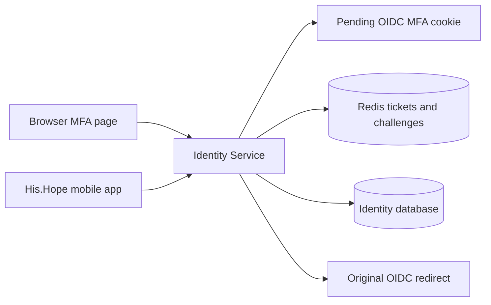
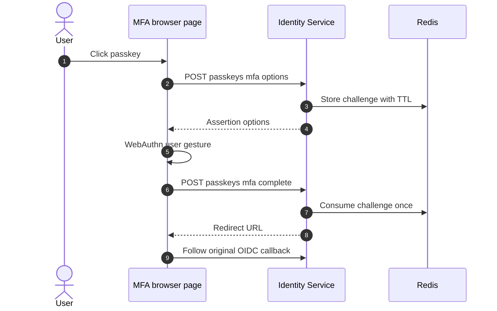
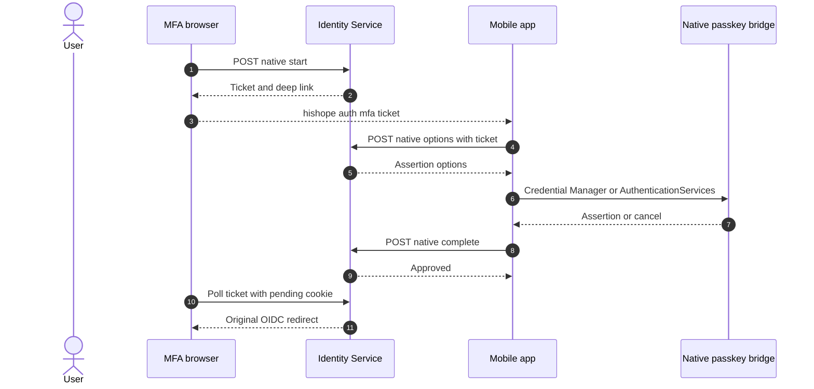

# Adaptive passkey-first MFA

**Status date:** 2026-07-30  
**Scope:** Identity Service browser MFA page, passkey MFA endpoints, native mobile approval bridge, TOTP fallback, and OIDC callback preservation.

This document records the final Task 6 architecture and deployment gate for the adaptive MFA work. It is intentionally conservative: deterministic browser coverage is PASS where verified, while real Android/iOS passkey hardware and live IdP behavior remain UNVERIFIED until a provisioned device and deployment are used.

## Architecture

The Identity Service owns the pending OIDC session, method availability, MFA factor verification, and final OIDC completion. Browser, Angular, and mobile clients only render or compose the method contract.

Key boundaries:

- The browser does not decide the pending user, return URL, device trust, or final redirect.
- Browser WebAuthn starts only from the `#passkey-mfa` click handler.
- The mobile app receives only an opaque native MFA ticket. It does not receive the browser pending cookie, OIDC code, PKCE verifier, or refresh token.
- TOTP posts to `/Account/Mfa` against the same pending server cookie, so fallback does not restart authorization.
- All successful factors return to the Identity completion path that preserves the original redirect URI, state, nonce, and PKCE transaction.

## Browser flow

Alternate methods are behind `#alternate-methods` and `#alternate-method-panel`. The panel exposes mobile approval and `#totp-form`. If passkey is cancelled or native approval expires, the page keeps the pending OIDC session alive and re-enables valid actions.

## Native approval flow

The browser poll consumes the approved ticket. A second poll, an expired ticket, or a ticket that does not match the pending user/session must be rejected and must not redirect.

## Failure and replay handling

| Failure | Expected behavior |
|---|---|
| Browser passkey cancel | Show a non-secret error and re-enable `#passkey-mfa`. |
| Native approval timeout | Show timeout, keep user on MFA page, re-enable `#native-passkey-mfa`. |
| Native ticket replay | Reject the second consume attempt and do not redirect. |
| Native ticket expiry | Reject and require a fresh native start. |
| Pending session mismatch | Reject with no redirect and no credential details in response. |
| TOTP invalid or expired | Render `/Account/Mfa` with the existing invalid-code alert. |
| OIDC callback state mismatch | Clear transaction and require sign-in again. |

Do not log TOTP values, WebAuthn assertions, native tickets, full return URLs, OIDC codes, access tokens, refresh tokens, or PKCE verifier material.

## Operational configuration

| Setting or resource | Required operations note |
|---|---|
| Pending OIDC MFA cookie | HttpOnly, SameSite Lax, short lifetime, server protected. Current code uses a 5 minute pending window. |
| Passkey assertion challenge | Redis-backed, single use, short TTL. Current code uses a 5 minute challenge window. |
| Native MFA ticket | Redis-backed, opaque, single use. Current code uses 5 minutes before approval and 2 minutes after native completion for browser poll consume. |
| Passkey RP ID and origins | Must match the deployment HTTPS identity domain and native origins. Localhost is not native release evidence. |
| Digital Asset Links | Required for Android native passkeys with the release signing certificate. |
| Apple associated domain | Required for production iOS passkey domain association where applicable. |
| Certificate pins | Required for native production HTTP flows before claiming mobile transport verification. |
| Rate limits | Auth, MFA, and passkey endpoints must keep strict per-user or per-session limits. |
| Audit | Record factor type, result, correlation ID, and user/session identifiers without secrets. |

## Deployment checklist

- Identity Service deployed with Redis and database migrations available.
- Passkey RP ID and allowed origins configured for the deployment domain.
- Android `assetlinks.json` returns HTTP 200 JSON for the release package and signing fingerprint.
- iOS associated domain and entitlement are provisioned when using platform passkeys.
- Native mobile app is rebuilt after RP ID, origin, certificate pin, or signing key changes.
- Discovery endpoint returns the expected issuer and endpoints.
- Login page, MFA page, passkey options, native start, native poll, and TOTP fallback are probed.
- Browser E2E covers passkey-first, alternate methods, TOTP fallback, mobile approval, cancel, timeout, replay or mismatch, and callback preservation.
- Native hardware passkey assertion is tested on a clean Android device or emulator with domain association and on iOS where supported.
- Logs are sampled to confirm no TOTP codes, assertions, tickets, tokens, full return URLs, or PKCE material are emitted.

## Verification gate as of 2026-07-30

| Gate | Status | Evidence |
|---|---|---|
| Real Identity Service MFA page and methods source contract | PASS | `VerificationPageTests` passed after integration, and `tests/e2e/specs/adaptive-mfa.spec.js` contains a source contract that checks `/Account/Mfa` renders server-derived `data-mfa-methods-endpoint="/api/v1/auth/mfa/methods"` and that `MfaEndpoints.cs` maps `/mfa/methods`. |
| Deterministic browser adaptive MFA E2E | PASS for mocked browser contract only | `npx playwright test --config=playwright.config.js --project=chromium adaptive-mfa.spec.js --workers=1 --retries=0` previously returned `PASS (6) FAIL (0)`. This mocked WebAuthn/endpoints and must not be used alone as proof of live server wiring. |
| Native Android passkey approval on production RP domain | UNVERIFIED | No provisioned Android device or Digital Asset Links deployment was exercised in Task 6. |
| Native iOS passkey approval | UNVERIFIED | Windows workspace cannot run Xcode archive or physical iOS device checks. |
| Live Docker service rebuild and endpoint probes | UNVERIFIED until run-specific evidence is recorded | Do not infer from browser mocks. Record Docker availability and probe output in the task report for each run. |
| Full backend and Angular build gates | UNVERIFIED until run-specific evidence is recorded | Record command, exit code, and known unrelated failures in the task report. |
