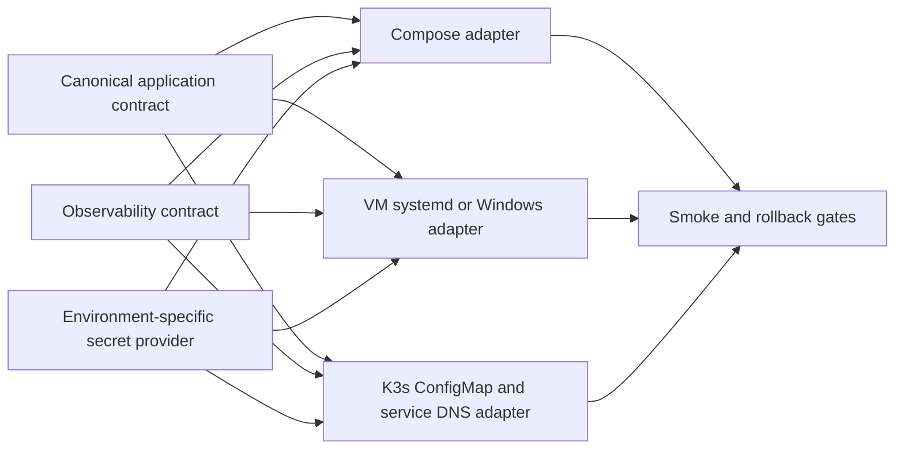

# Unified Runtime, Observability, and Secret Injection Design

**Status:** Approved for implementation

**Goal:** Make Docker Compose, Linux VM/systemd, Windows Service, and Kubernetes/K3s consume one canonical application contract while using environment-specific observability endpoints and secret injection.

## Scope

The canonical application contract owns only application-facing endpoints: API Gateway, Identity, Patient, Appointment, Clinical, Lab, Billing, Pharmacy, Dashboard BFF, and Database Continuity. Infrastructure services remain deployable in each stack but are represented in a separate platform/observability contract so the application endpoint validator does not report infrastructure as application drift.

The observability contract exposes the same logical capabilities in every runtime:

| Capability | Compose | VM/systemd | Kubernetes/K3s |
|---|---|---|---|
| OTLP | `otel-collector:4317` | configured internal FQDN | monitoring service DNS |
| Prometheus | `prometheus:9090` | configured internal FQDN | monitoring service DNS |
| Loki | `loki:3100` | configured internal FQDN | monitoring service DNS |
| Jaeger | `jaeger:16686` | configured internal FQDN | monitoring service DNS |

The application contract and observability contract use the same logical names and environment-variable shape. Adapters render runtime-specific hostnames; application code does not branch on Docker, VM, or Kubernetes.

## Secret boundaries

- Docker Compose uses local Docker secrets or a non-committed environment file generated from the development secret provider.
- Linux VM uses `/etc/his-hope/<service>.env` with restricted ownership and permissions, referenced by systemd `EnvironmentFile`.
- Windows Service uses machine-level variables or ACL-protected secret files and never places secret values in the service command line.
- Kubernetes uses Vault CSI/SPIRE workload identity or an approved external secret provider. Static database, OIDC, broker, and Vault root credentials are not committed to manifests.

The contract contains secret reference names, not secret values. Each runtime validates that required references exist without printing values.

## Runtime flow

## Validation gates

1. Contract shape and runtime references pass without secret leakage.
2. Compose renders and starts the configured stack; OIDC discovery, health, login, API, logs, metrics, and traces are checked.
3. WSL2 Ubuntu runs the systemd unit and validates restart/readiness behavior. This is Linux runtime evidence, not a production VM sign-off.
4. K3s validates rendered manifests, rollout, service DNS, authenticated BFF observability endpoints, and rollback metadata.
5. Any platform-only or unavailable gate is reported as `ENVIRONMENT_BLOCKED`, never as `PASS`.

## Non-goals

- Do not remove Prometheus, Loki, Jaeger, Vault, Temporal, or other infrastructure services from Compose/K3s deployments.
- Do not make application services depend on a single platform hostname.
- Do not share static secrets between Compose, VM, and Kubernetes.
- Do not claim a real remote production VM validation from a Windows workstation.
